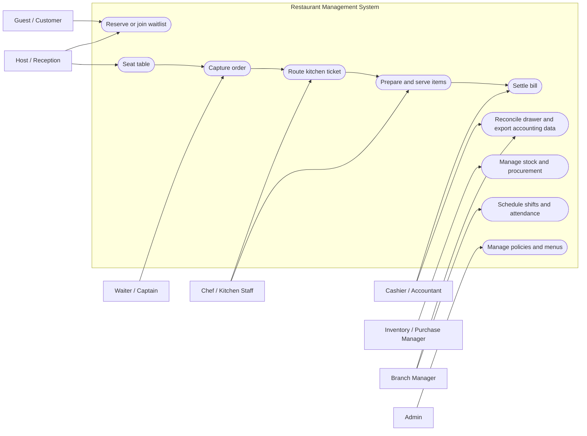

# Use Case Diagram - Restaurant Management System

```mermaid
flowchart LR
    guest[Guest / Customer]
    host[Host / Reception]
    waiter[Waiter / Captain]
    chef[Chef / Kitchen Staff]
    cashier[Cashier / Accountant]
    inventory[Inventory / Purchase Manager]
    manager[Branch Manager]
    admin[Admin]

    subgraph system[Restaurant Management System]
        uc1([Reserve or join waitlist])
        uc2([Seat table])
        uc3([Capture order])
        uc4([Route kitchen ticket])
        uc5([Prepare and serve items])
        uc6([Settle bill])
        uc7([Reconcile drawer and export accounting data])
        uc8([Manage stock and procurement])
        uc9([Schedule shifts and attendance])
        uc10([Manage policies and menus])
    end

    guest --> uc1
    host --> uc1
    host --> uc2
    waiter --> uc3
    chef --> uc4
    chef --> uc5
    cashier --> uc6
    cashier --> uc7
    inventory --> uc8
    manager --> uc7
    manager --> uc9
    admin --> uc10
    uc2 --> uc3
    uc3 --> uc4
    uc4 --> uc5
    uc5 --> uc6
```
