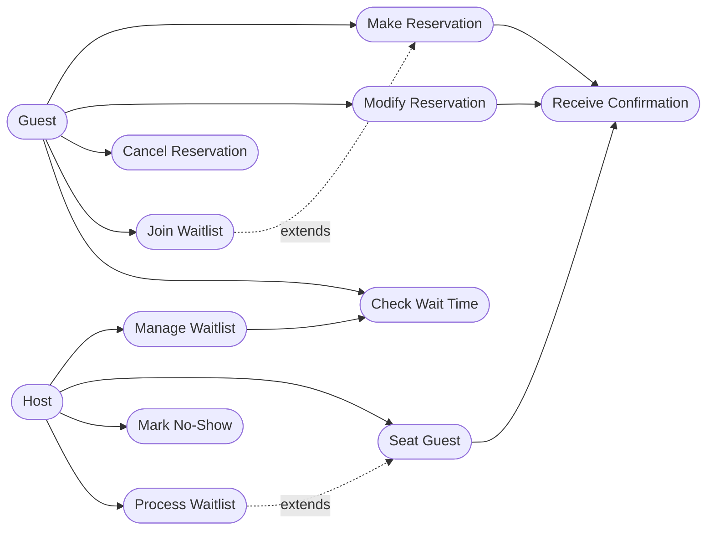
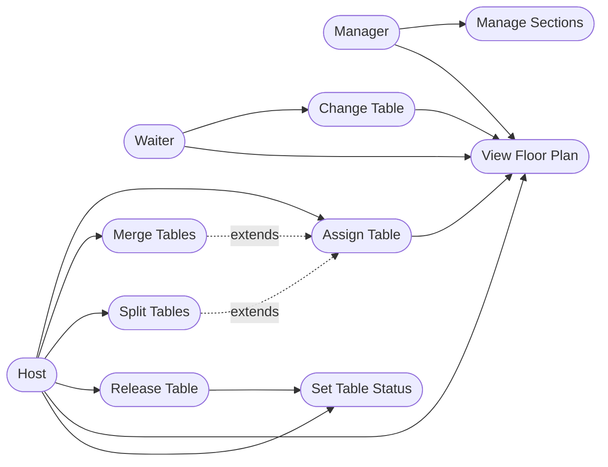
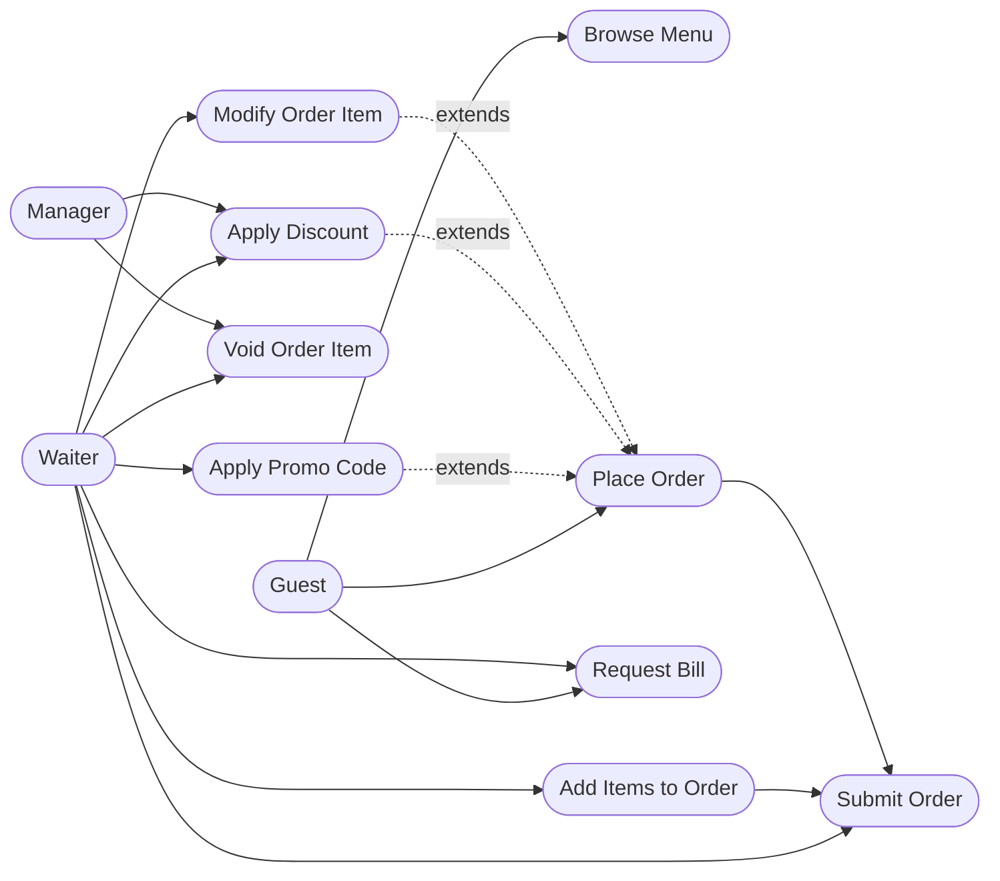
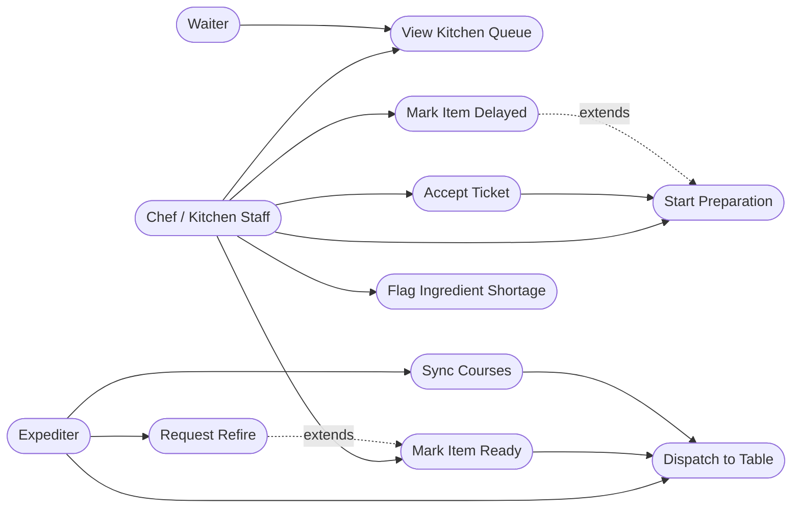
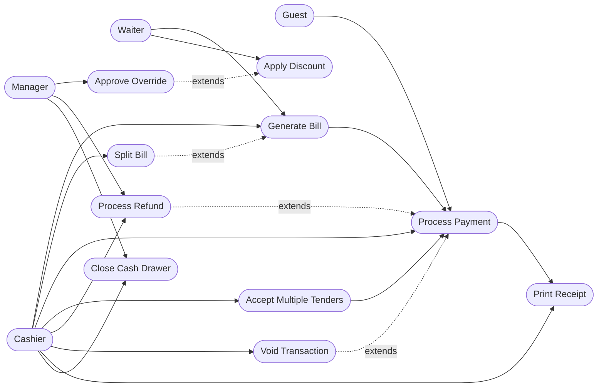
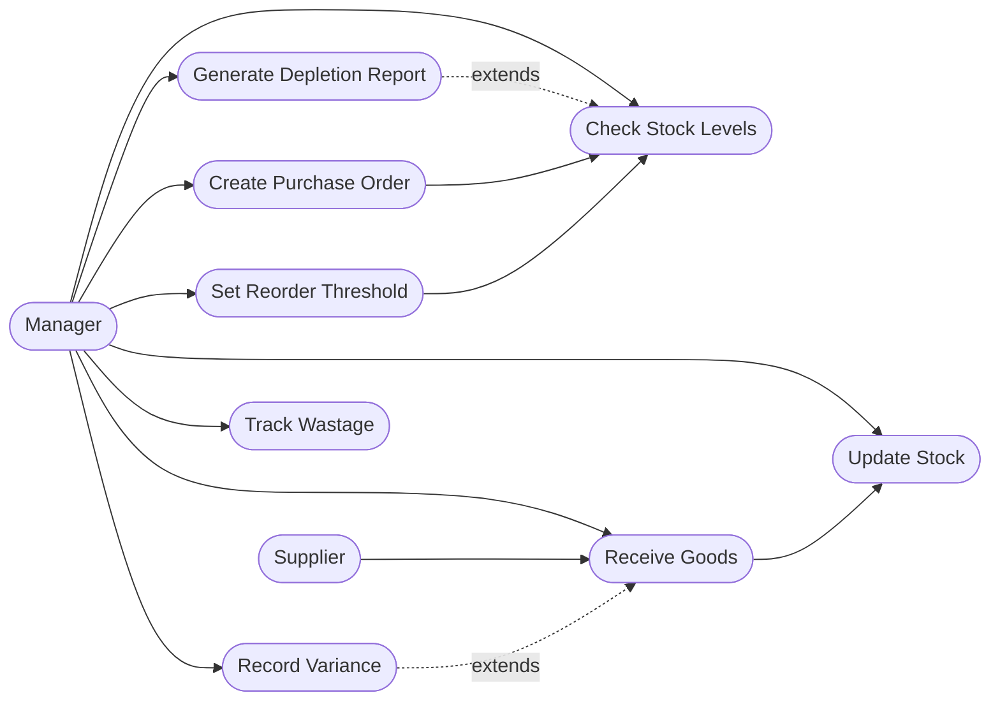
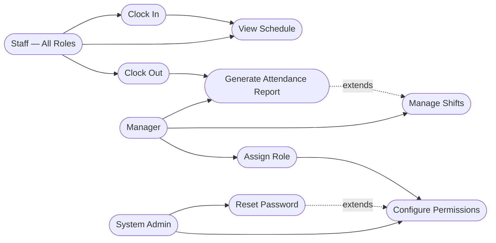
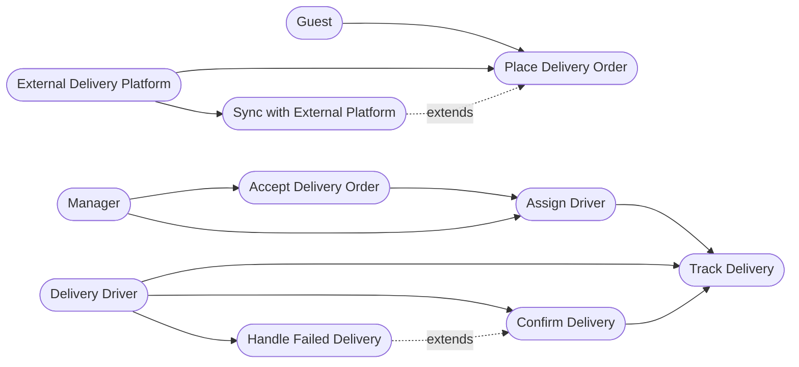
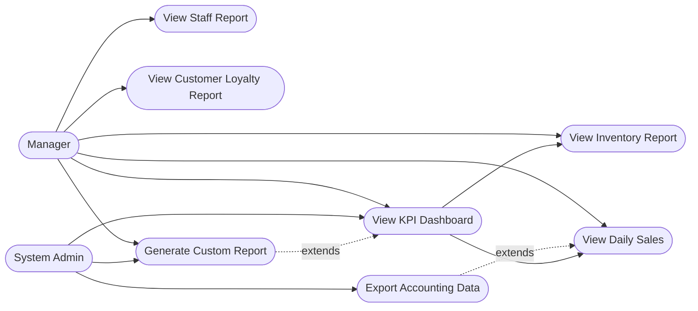

# Use Case Diagram — Restaurant Management System

This document captures the complete use-case model for the Restaurant Management System (RMS). It enumerates every actor that interacts with the platform, organises use cases by functional domain, and presents each domain as a Mermaid `flowchart LR` diagram. Relationships are annotated with `<<include>>` (mandatory sub-flow) and `<<extend>>` (optional / conditional augmentation) where applicable. The document closes with a responsibility matrix and a priority classification table to guide sprint planning.

---

## Actors

| Actor | Type | Description |
|---|---|---|
| **Guest / Customer** | Primary External | A dine-in patron, walk-in visitor, or online/app customer who places orders, makes reservations, and settles payments. |
| **Waiter / Server** | Primary Internal | Front-of-house staff member who takes orders at the table, relays modifications to the kitchen, and presents the bill. |
| **Host / Reception** | Primary Internal | Manages the entrance, greets guests, allocates tables, maintains the waitlist, and controls the floor plan. |
| **Chef / Kitchen Staff** | Primary Internal | Back-of-house staff who receive kitchen tickets, prepare dishes, and communicate item status back to the floor. |
| **Expediter** | Primary Internal | Coordinates the pass between kitchen and floor, ensuring all items in a course are dispatched together and at the correct temperature. |
| **Cashier** | Primary Internal | Operates the POS terminal, processes all tender types, handles refunds, voids, and reconciles the cash drawer at end-of-shift. |
| **Manager** | Primary Internal | Oversees day-to-day operations, approves overrides, manages staff schedules and inventory thresholds, and reviews analytics. |
| **Delivery Driver** | Primary External | Collects prepared orders from the restaurant and delivers them to the customer's address; updates delivery status in real time. |
| **External Delivery Platform** | Secondary External | Third-party aggregators (Uber Eats, DoorDash, Zomato) that push inbound delivery orders and pull status updates via API integration. |
| **Supplier** | Secondary External | Provides raw ingredients and goods; receives purchase orders and confirms deliveries through the supplier portal. |
| **System Admin** | Supporting Internal | Configures system-wide settings, manages user accounts and permissions, monitors platform health, and performs data exports. |

---

## Diagram 1 — Reservation Management

Actors: **Guest**, **Host**

> `<<include>>` — *Receive Confirmation* is always triggered when a reservation is successfully created or modified.  
> `<<extend>>` — *Join Waitlist* extends *Make Reservation* when no suitable slot is available.  
> `<<extend>>` — *Process Waitlist* extends *Seat Guest* when a walk-in slot opens unexpectedly.

---

## Diagram 2 — Table Management

Actors: **Host**, **Waiter**, **Manager**

> `<<include>>` — *View Floor Plan* is included in every table assignment and status-change operation.  
> `<<extend>>` — *Merge Tables* and *Split Tables* extend *Assign Table* when party-size constraints require it.

---

## Diagram 3 — Order Management

Actors: **Guest**, **Waiter**, **Manager**

> `<<include>>` — *Submit Order* always includes *Route to Kitchen Ticket* as a downstream system action.  
> `<<extend>>` — *Apply Promo Code* and *Apply Discount* extend *Place Order* when applicable.  
> `<<extend>>` — *Modify Order Item* extends *Place Order* after initial submission until the kitchen accepts the ticket.

---

## Diagram 4 — Kitchen Operations

Actors: **Chef / Kitchen Staff**, **Expediter**, **Waiter**

> `<<include>>` — *Accept Ticket* is a mandatory precursor to *Start Preparation*.  
> `<<extend>>` — *Mark Item Delayed* extends *Start Preparation* when a prep bottleneck is detected.  
> `<<extend>>` — *Request Refire* extends *Mark Item Ready* when a quality rejection occurs at the pass.

---

## Diagram 5 — Billing and Payments

Actors: **Cashier**, **Waiter**, **Guest**, **Manager**

> `<<include>>` — *Generate Bill* is always included when *Request Bill* is triggered.  
> `<<include>>` — *Print Receipt* is always included upon successful *Process Payment*.  
> `<<extend>>` — *Split Bill* extends *Generate Bill* when a party chooses to pay separately.  
> `<<extend>>` — *Process Refund* and *Void Transaction* extend *Process Payment* for reversal scenarios.  
> `<<extend>>` — *Approve Override* extends *Apply Discount* when the discount exceeds the waiter's authorisation limit.

---

## Diagram 6 — Inventory Management

Actors: **Manager**, **Supplier**

> `<<include>>` — *Create Purchase Order* always includes *Notify Supplier*.  
> `<<extend>>` — *Record Variance* extends *Receive Goods* when delivered quantities differ from the PO.  
> `<<extend>>` — *Generate Depletion Report* extends *Check Stock Levels* when a threshold breach is detected.

---

## Diagram 7 — Staff Management

Actors: **Manager**, **Staff (all roles)**, **System Admin**

> `<<include>>` — *Clock In* and *Clock Out* always include *Log Attendance Record*.  
> `<<extend>>` — *Generate Attendance Report* extends *Manage Shifts* for payroll processing.  
> `<<extend>>` — *Reset Password* extends *Configure Permissions* when a locked account is involved.

---

## Diagram 8 — Delivery Management

Actors: **Guest**, **Delivery Driver**, **External Delivery Platform**, **Manager**

> `<<include>>` — *Assign Driver* is always included when *Accept Delivery Order* is triggered internally.  
> `<<extend>>` — *Handle Failed Delivery* extends *Confirm Delivery* when the driver cannot complete the drop-off.  
> `<<extend>>` — *Sync with External Platform* extends *Place Delivery Order* for orders originating from third-party aggregators.

---

## Diagram 9 — Reporting and Analytics

Actors: **Manager**, **System Admin**

> `<<include>>` — *View KPI Dashboard* always includes *View Daily Sales* and *View Inventory Report* as data sources.  
> `<<extend>>` — *Export Accounting Data* extends *View Daily Sales* for end-of-day finance exports.  
> `<<extend>>` — *Generate Custom Report* extends *View KPI Dashboard* when ad-hoc filtering is applied.

---

## Actor–Use Case Responsibility Matrix

`P` = Primary (initiates or owns), `S` = Secondary (supports or is notified)

| Use Case | Guest | Waiter | Host | Chef | Expediter | Cashier | Manager | Driver | Ext. Platform | Supplier | Admin |
|---|:---:|:---:|:---:|:---:|:---:|:---:|:---:|:---:|:---:|:---:|:---:|
| Make Reservation | P | | S | | | | S | | | | |
| Modify Reservation | P | | S | | | | | | | | |
| Cancel Reservation | P | | S | | | | | | | | |
| Join Waitlist | P | | S | | | | | | | | |
| Manage Waitlist | | | P | | | | S | | | | |
| Seat Guest | | | P | | | | | | | | |
| Mark No-Show | | | P | | | | S | | | | |
| Assign Table | | | P | | | | | | | | |
| Merge / Split Tables | | | P | | | | S | | | | |
| View Floor Plan | | S | P | | | | S | | | | |
| Browse Menu | P | S | | | | | | | | | |
| Place Order | P | S | | | | | | | | | |
| Add / Modify / Void Item | | P | | | | | S | | | | |
| Apply Discount | | P | | | | | S | | | | |
| Submit Order | | P | | | | | | | | | |
| View Kitchen Queue | | S | | P | S | | | | | | |
| Accept Ticket | | | | P | S | | | | | | |
| Start Preparation | | | | P | | | | | | | |
| Mark Item Ready / Delayed | | | | P | S | | | | | | |
| Sync Courses | | | | | P | | | | | | |
| Dispatch to Table | | | | | P | | | | | | |
| Flag Ingredient Shortage | | | | P | | | | | | | S |
| Generate Bill | | S | | | | P | S | | | | |
| Split Bill | | | | | | P | S | | | | |
| Process Payment | P | | | | | P | S | | | | |
| Process Refund | | | | | | P | P | | | | |
| Void Transaction | | | | | | P | P | | | | |
| Close Cash Drawer | | | | | | P | S | | | | |
| Check Stock Levels | | | | | | | P | | | | S |
| Create Purchase Order | | | | | | | P | | | P | S |
| Receive Goods | | | | | | | P | | | P | |
| Track Wastage | | | | P | | | P | | | | |
| Clock In / Clock Out | | P | P | P | P | P | | | | | |
| Manage Shifts | | | | | | | P | | | | S |
| Assign Role | | | | | | | P | | | | S |
| Configure Permissions | | | | | | | S | | | | P |
| Place Delivery Order | P | | | | | | | | P | | |
| Accept Delivery Order | | | | | | | P | | S | | |
| Assign Driver | | | | | | | P | S | | | |
| Track Delivery | P | | | | | | S | P | S | | |
| Confirm Delivery | | | | | | | S | P | | | |
| View Daily Sales | | | | | | | P | | | | S |
| View KPI Dashboard | | | | | | | P | | | | S |
| Export Accounting Data | | | | | | | S | | | | P |
| Generate Custom Report | | | | | | | P | | | | S |

---

## Use Case Priority Classification

| Use Case | Priority | Module | Actor Count |
|---|:---:|---|:---:|
| Make Reservation | P0 | Reservation Management | 2 |
| Seat Guest | P0 | Reservation Management | 1 |
| Assign Table | P0 | Table Management | 1 |
| Set Table Status | P0 | Table Management | 2 |
| Browse Menu | P0 | Order Management | 2 |
| Place Order | P0 | Order Management | 2 |
| Add Items to Order | P0 | Order Management | 1 |
| Submit Order | P0 | Order Management | 1 |
| View Kitchen Queue | P0 | Kitchen Operations | 3 |
| Accept Ticket | P0 | Kitchen Operations | 2 |
| Start Preparation | P0 | Kitchen Operations | 1 |
| Mark Item Ready | P0 | Kitchen Operations | 2 |
| Dispatch to Table | P0 | Kitchen Operations | 1 |
| Generate Bill | P0 | Billing and Payments | 2 |
| Process Payment | P0 | Billing and Payments | 3 |
| Print Receipt | P0 | Billing and Payments | 1 |
| Modify Reservation | P1 | Reservation Management | 2 |
| Cancel Reservation | P1 | Reservation Management | 2 |
| Join Waitlist | P1 | Reservation Management | 2 |
| Manage Waitlist | P1 | Reservation Management | 2 |
| Mark No-Show | P1 | Reservation Management | 2 |
| Merge Tables | P1 | Table Management | 2 |
| Split Tables | P1 | Table Management | 2 |
| View Floor Plan | P1 | Table Management | 3 |
| Modify Order Item | P1 | Order Management | 2 |
| Void Order Item | P1 | Order Management | 2 |
| Apply Discount | P1 | Order Management | 2 |
| Request Bill | P1 | Order Management | 2 |
| Mark Item Delayed | P1 | Kitchen Operations | 2 |
| Request Refire | P1 | Kitchen Operations | 2 |
| Sync Courses | P1 | Kitchen Operations | 1 |
| Flag Ingredient Shortage | P1 | Kitchen Operations | 2 |
| Split Bill | P1 | Billing and Payments | 2 |
| Accept Multiple Tenders | P1 | Billing and Payments | 2 |
| Process Refund | P1 | Billing and Payments | 3 |
| Void Transaction | P1 | Billing and Payments | 2 |
| Approve Override | P1 | Billing and Payments | 2 |
| Check Stock Levels | P1 | Inventory Management | 2 |
| Create Purchase Order | P1 | Inventory Management | 3 |
| Receive Goods | P1 | Inventory Management | 2 |
| Update Stock | P1 | Inventory Management | 1 |
| Clock In | P1 | Staff Management | 6 |
| Clock Out | P1 | Staff Management | 6 |
| View Schedule | P1 | Staff Management | 6 |
| Place Delivery Order | P1 | Delivery Management | 2 |
| Accept Delivery Order | P1 | Delivery Management | 2 |
| Track Delivery | P1 | Delivery Management | 4 |
| Confirm Delivery | P1 | Delivery Management | 2 |
| View Daily Sales | P1 | Reporting and Analytics | 2 |
| View KPI Dashboard | P1 | Reporting and Analytics | 2 |
| Apply Promo Code | P2 | Order Management | 2 |
| Check Wait Time | P2 | Reservation Management | 2 |
| Receive Confirmation | P2 | Reservation Management | 2 |
| Change Table | P2 | Table Management | 2 |
| Manage Sections | P2 | Table Management | 1 |
| Close Cash Drawer | P2 | Billing and Payments | 2 |
| Record Variance | P2 | Inventory Management | 1 |
| Set Reorder Threshold | P2 | Inventory Management | 1 |
| Generate Depletion Report | P2 | Inventory Management | 1 |
| Track Wastage | P2 | Inventory Management | 2 |
| Manage Shifts | P2 | Staff Management | 2 |
| Assign Role | P2 | Staff Management | 2 |
| Reset Password | P2 | Staff Management | 2 |
| Generate Attendance Report | P2 | Staff Management | 2 |
| Configure Permissions | P2 | Staff Management | 2 |
| Assign Driver | P2 | Delivery Management | 2 |
| Handle Failed Delivery | P2 | Delivery Management | 2 |
| Sync with External Platform | P2 | Delivery Management | 2 |
| View Inventory Report | P2 | Reporting and Analytics | 2 |
| View Staff Report | P2 | Reporting and Analytics | 1 |
| Export Accounting Data | P2 | Reporting and Analytics | 2 |
| View Customer Loyalty Report | P2 | Reporting and Analytics | 1 |
| Generate Custom Report | P2 | Reporting and Analytics | 2 |
