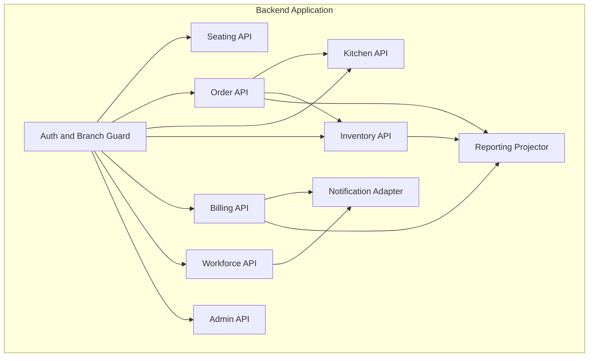

# C4 Component Diagram - Restaurant Management System

```mermaid
flowchart TB
    subgraph backend[Backend Application]
        auth[Auth and Branch Guard]
        seatingApi[Seating API]
        orderApi[Order API]
        kitchenApi[Kitchen API]
        inventoryApi[Inventory API]
        billingApi[Billing API]
        workforceApi[Workforce API]
        adminApi[Admin API]
        projector[Reporting Projector]
        notifier[Notification Adapter]
    end

    auth --> seatingApi
    auth --> orderApi
    auth --> kitchenApi
    auth --> inventoryApi
    auth --> billingApi
    auth --> workforceApi
    auth --> adminApi
    orderApi --> kitchenApi
    orderApi --> inventoryApi
    billingApi --> notifier
    workforceApi --> notifier
    orderApi --> projector
    inventoryApi --> projector
    billingApi --> projector
```
