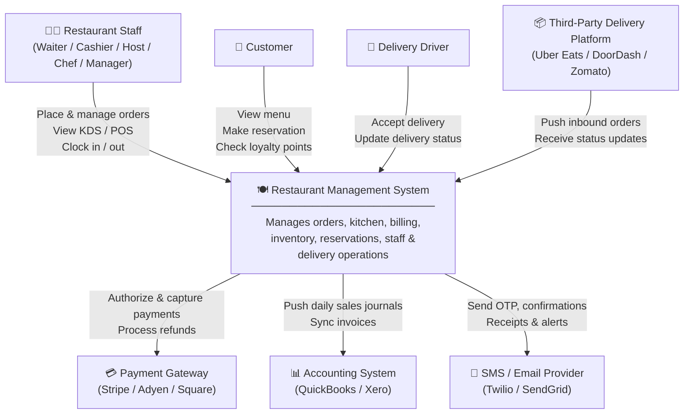
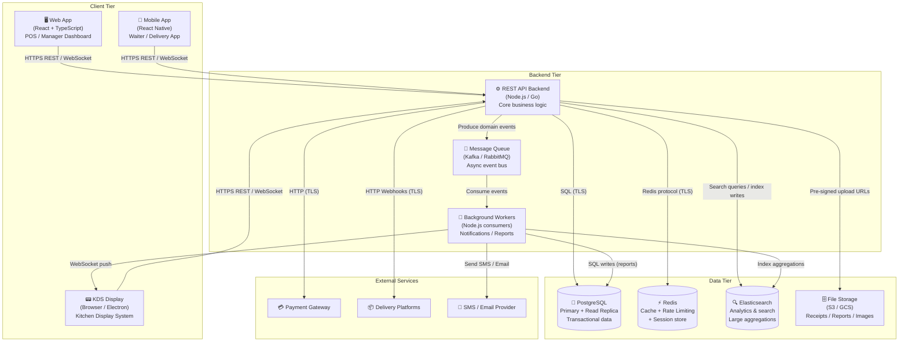
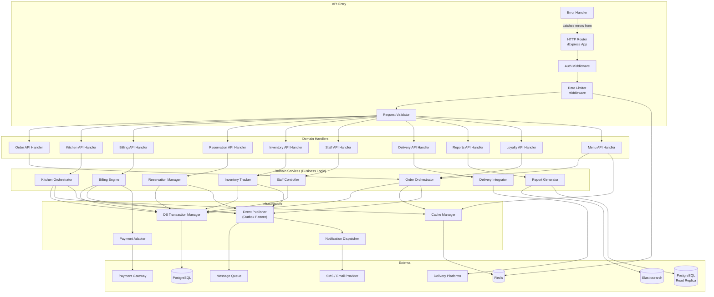

# C4 Component Diagram — Restaurant Management System

## C4 Model Overview

The C4 model is a hierarchical framework for describing software architecture at four progressive levels of
detail. Each level zooms in on a specific area, providing increasing granularity without overwhelming the
reader with every detail at once.

**Level 1 — System Context** answers: *What is this system, and who interacts with it?* It shows the
system as a black box alongside its external users and dependencies.

**Level 2 — Container Diagram** answers: *What are the high-level deployable units?* Containers are
independently deployable or runnable things — web apps, mobile apps, databases, microservices, message
queues, etc. Lines between containers represent inter-process communication.

**Level 3 — Component Diagram** answers: *What are the major logical building blocks inside a container?*
A component is a grouping of related functionality with a well-defined interface. This is the level where
API handlers, service classes, repositories, middleware, and adapters live.

**Level 4 — Code** answers: *How are the components implemented?* This is UML class diagrams, ERDs, or
annotated source-code snippets. It is the most volatile level and is often generated from code.

**This document covers Level 3** — the internal components of the **Restaurant Management API** backend
container. It describes every major class/module boundary, the responsibility of each component, and the
communication paths between components. It also includes the Level 1 and Level 2 diagrams for context,
and Level 4 hints to guide implementation.

The Restaurant Management System (RMS) coordinates table ordering, kitchen display routing, billing,
inventory management, staff scheduling, table reservations, delivery integrations, and management
reporting. Understanding component boundaries is critical for assigning team ownership, enforcing
separation of concerns, and identifying cross-cutting infrastructure needs such as caching and eventing.

---

## Level 1 — System Context Diagram

The diagram below shows the RMS system as a single black box, surrounded by the people and systems that
interact with it.

---

## Level 2 — Container Diagram

The diagram below shows the major containers (deployable units) that make up the RMS and their
communication paths.

---

## Level 3 — Component Diagram (Core API)

The following diagram details the internal components of the **REST API Backend** container.

---

## Level 3 Component Descriptions

---

### API Entry Components

#### HTTP Router

The HTTP Router is the entry point for every inbound API request. It maps URL patterns and HTTP methods to
the appropriate domain handler functions using a high-performance router such as Express.js, Chi (Go), or
Gin. Versioned routing (`/api/v1/`, `/api/v2/`) allows backward-compatible API evolution without breaking
existing clients. The router also handles global cross-cutting concerns such as CORS header injection,
gzip/Brotli response compression, and structured access logging with correlation IDs. In production it
sits behind an API gateway or load balancer that handles TLS termination.

#### Auth Middleware

The Auth Middleware validates RS256-signed JWT bearer tokens on every authenticated route. It decodes the
token payload to extract `userId`, `role`, `branchId`, and `permissions` claims without making a database
call on the hot path. Branch-scoped access is enforced by comparing the `branchId` claim against the
resource being accessed, preventing cross-branch data leakage. For machine-to-machine webhook endpoints,
the middleware supports static API key authentication validated against an environment variable or Vault
secret. Revoked tokens are detected by checking a Redis token-blacklist set keyed by `jti` (JWT ID).

#### Rate Limiter Middleware

The Rate Limiter applies a sliding-window rate-limiting algorithm implemented with Redis sorted sets.
Limits are configured per endpoint category: authentication endpoints allow 50 requests/minute to defend
against brute force, standard API endpoints allow 1,000 requests/minute per API key, and report endpoints
allow 100 requests/minute due to their higher computational cost. When a limit is exceeded the middleware
immediately returns HTTP 429 with a `Retry-After` header indicating when the window resets. IP-based
fallback limiting protects unauthenticated endpoints. All limit counters expire automatically via Redis TTL.

#### Request Validator

The Request Validator checks the request body, path parameters, and query parameters against pre-compiled
JSON Schema definitions before the request reaches domain code. Validation failures return a structured
HTTP 400 response with an array of field-level error objects (`field`, `message`, `code`), enabling
clients to surface precise form validation feedback. Input sanitization strips null bytes, trims whitespace,
and escapes potentially dangerous characters to prevent injection vectors. Schema files are co-located with
their handlers, making validation rules easy to audit and maintain alongside the API contract.

#### Error Handler

The global Error Handler is a catch-all Express/Gin error middleware registered last in the middleware
chain. It intercepts both synchronous thrown errors and rejected promises (via `asyncWrapper` helpers).
Domain-specific error classes (e.g., `OrderNotFoundError`, `InsufficientStockError`) are mapped to
appropriate HTTP status codes and stable machine-readable `error_code` strings. All errors are enriched
with the request's `correlationId` before being logged at ERROR level via the structured logger. A
sanitized subset of the error (code, message, correlationId) is returned to the client; internal stack
traces are never leaked to responses.

---

### Domain Handler Components

#### Order API Handler

The Order API Handler manages all HTTP endpoints under `/api/v1/orders`. It translates incoming HTTP
requests into Command objects that are dispatched to the Order Orchestrator, keeping HTTP concerns
entirely separate from business logic. Idempotency keys supplied in the `Idempotency-Key` header are
extracted and passed to the orchestrator to prevent duplicate order creation on client retries. List
endpoints return cursor-based paginated responses to efficiently handle high-volume order histories.
Optimistic concurrency control is supported via `ETag` response headers and `If-Match` request headers,
with the handler returning HTTP 412 when a version conflict is detected.

#### Kitchen API Handler

The Kitchen API Handler serves the Kitchen Display System (KDS) and manages endpoints under
`/api/v1/kitchen`. It exposes ticket queue data sorted by station, priority, and submission time.
Ticket state transitions (New → In Progress → Ready → Bumped) are performed via `PATCH` requests with
the new status in the body. The handler supports WebSocket upgrades on `/api/v1/kitchen/stream` to push
real-time ticket state changes to connected KDS displays without polling. It also exposes a recall
endpoint allowing chefs to un-bump a ticket if it was bumped accidentally.

#### Billing API Handler

The Billing API Handler manages bill creation and payment capture under `/api/v1/billing`. It
orchestrates split-bill creation by delegating to the Billing Engine with split configuration (equal
split or by-item assignment). Payment capture requests are validated for amount consistency against the
outstanding bill balance before forwarding to the Billing Engine. Idempotency keys on payment endpoints
prevent double charges on network retries. After a successful payment capture, the handler triggers
receipt generation and returns a receipt URL pointing to the file storage service.

#### Reservation API Handler

The Reservation API Handler manages table reservations under `/api/v1/reservations`. Before creating a
reservation it validates that the requested party size is within the combined capacity of available
tables for the requested slot. Availability is checked via the Reservation Manager before persisting any
record, ensuring no double-booking. Confirmed reservations generate an alphanumeric confirmation code
returned in the response and sent to the guest via the Notification Dispatcher. Cancellation and
no-show endpoints are also exposed, with state transitions enforced by the Reservation Manager.

#### Inventory API Handler

The Inventory API Handler manages ingredient and stock records under `/api/v1/inventory`. Stock
adjustment requests (manual top-ups or wastage write-offs) validate that quantities are non-negative and
reference valid ingredient IDs before delegating to the Inventory Tracker. The handler exposes a
low-stock alert endpoint that returns items below their reorder threshold along with a suggested reorder
quantity based on recent consumption rate. Stock movement history is returned in descending time order
with cursor-based pagination for auditability.

#### Staff API Handler

The Staff API Handler manages staff records and attendance under `/api/v1/staff`. In addition to
standard CRUD operations, it exposes a PIN-based authentication endpoint used by the POS terminal to
identify staff without requiring a full JWT login flow. Clock-in requests validate that the staff member
has an active shift assignment and no existing open clock-in record. Clock-out requests close the active
session and return the hours worked. Staff creation accepts a plain-text PIN which the Staff Controller
hashes before persisting.

#### Delivery API Handler

The Delivery API Handler manages inbound delivery platform webhooks under `/api/v1/delivery`. On
webhook ingestion it verifies the `X-Signature` HMAC header against the platform's shared secret before
processing the payload, rejecting any requests that fail signature validation with HTTP 401. Each
platform (Uber Eats, DoorDash, Zomato) has a platform-specific schema adapter that normalises the
external order payload into the internal `DeliveryOrder` format. Delivery status update webhooks are
similarly normalised and forwarded to the Order Orchestrator. An outbound status sync endpoint allows
the Delivery Integrator to push internal status changes back to platforms.

#### Reports API Handler

The Reports API Handler manages report generation under `/api/v1/reports`. For small date ranges,
reports are generated synchronously and returned directly. For large date ranges (> 31 days), generation
is asynchronous: the handler creates a report job record, returns HTTP 202 with a `job_id`, and the
client polls `/api/v1/reports/jobs/{job_id}` for completion status and a download URL. Supported export
formats are JSON (default) and CSV via an `Accept` header or `?format=csv` query parameter. All report
requests enforce a maximum date range of 365 days per request.

#### Loyalty API Handler

The Loyalty API Handler manages the loyalty programme under `/api/v1/loyalty`. Member lookup supports
search by phone number or email address and returns the member profile including current points balance
and tier status. Points earning is triggered automatically via Order Orchestrator events but can also be
manually credited via this handler (manager role required). Points redemption validates that the member
has a sufficient balance before issuing a redemption transaction and deducting from the balance. Tier
recalculation is performed inline after every earn or redeem event.

#### Menu API Handler

The Menu API Handler manages menus and menu items under `/api/v1/menu`. Menu activation and
deactivation control whether a menu is visible to ordering channels. Item availability toggles allow
front-of-house staff to 86 (mark unavailable) items in real time — availability changes are published
as events so that connected POS and KDS clients are notified immediately via WebSocket push. Modifier
group management endpoints handle the creation and association of option sets (e.g., cooking temperature,
add-ons) to menu items.

---

### Domain Service Components

#### Order Orchestrator

The Order Orchestrator is the central business logic component for the entire order lifecycle, from draft
creation through completion. On order creation it validates item availability by consulting the menu cache
and checks that all requested modifiers are valid. It generates human-readable order numbers using a
branch-prefixed sequence (`BRN001-20241205-0042`). Taxes, service charges, and promotional discounts are
applied deterministically in a fixed pipeline order to ensure total reproducibility. On order submission
the orchestrator publishes an `OrderSubmitted` domain event via the Event Publisher. Optimistic locking
is enforced using a `version` integer column: the service reads the current version, applies changes, and
updates only if the version has not changed, throwing `OptimisticLockError` on conflict.

#### Kitchen Orchestrator

The Kitchen Orchestrator routes order items to the correct kitchen stations based on each item's
`station_id` configuration (e.g., Grill, Pastry, Bar). Course dependency chains are enforced: starter
tickets are held until explicitly fired by the waiter, and main course tickets are only sent to the
station after the starter ticket has been acknowledged. Each ticket has a configurable SLA window (e.g.,
Grill: 15 min); the orchestrator monitors elapsed time and publishes `TicketSlaBreached` events for
operational dashboards. When all items in a course are marked Ready by the kitchen, the orchestrator
publishes a `CourseReady` event that triggers a waiter notification. Bump and recall operations update
ticket state with an audit timestamp.

#### Billing Engine

The Billing Engine generates immutable bill records from completed or in-progress orders. It applies
discount lines (percentage-based or flat-rate) in the order they were added, recording each line
separately for auditability. Tax calculation uses configurable tax categories per item (e.g., Food 5%,
Alcohol 20%), summing line-level taxes to a bill total. Service charge (a configurable percentage) is
applied after tax. The split-bill feature supports both equal division and by-item assignment; each
resulting sub-bill tracks its own payment status independently. Before capturing a payment the engine
validates that the tendered amount does not exceed the outstanding balance. Integration with the Loyalty
Service allows points to be redeemed as a discount line on the bill.

#### Inventory Tracker

The Inventory Tracker maintains real-time ingredient stock levels. When an order is completed, the
tracker deducts ingredients from stock according to each menu item's recipe definition, recording each
deduction as a `StockMovement` row linked to the source order. Manual adjustments (top-ups, wastage)
are recorded with a reason code and operator reference. After every deduction the tracker compares the
new level against the item's `reorder_point` threshold and publishes a `StockLow` event if the threshold
is breached. Estimated days of stock remaining are calculated from a rolling 7-day average consumption
rate and included in the low-stock event payload to aid procurement decisions.

#### Reservation Manager

The Reservation Manager controls table booking availability. For a given date/time slot it queries
combined table capacity and subtracts party sizes of all confirmed and seated reservations in that slot
window (configurable slot duration, default 90 min). It enforces a maximum advance booking window
(default 60 days) and a minimum lead time (default 2 hours). Confirmation codes are generated as
6-character alphanumeric strings with collision detection. A scheduled job runs every 15 minutes to
transition overdue `Confirmed` reservations to `No-Show` status after the configurable grace period
(default 15 min past booking time).

#### Staff Controller

The Staff Controller manages staff records, authentication, and attendance. PIN codes supplied during
staff creation or update are hashed using bcrypt with a cost factor of 12 before storage; plain-text
PINs are never persisted. PIN verification for POS authentication uses bcrypt's constant-time compare to
resist timing attacks. Clock-in validates that the staff member has a scheduled shift for the current
day and that no open clock-in session already exists. On clock-out, hours worked are calculated and
appended to the shift record. Role-based permission inheritance is resolved at login time and embedded
in the JWT claims.

#### Delivery Integrator

The Delivery Integrator handles bidirectional integration with external delivery platforms. Inbound
webhook payloads are routed to a platform-specific adapter class (e.g., `UberEatsAdapter`,
`DoorDashAdapter`) that implements a common `IDeliveryAdapter` interface. HMAC-SHA256 signature
verification is performed using the platform's shared secret before any payload processing. Order
creation is idempotent: the `external_order_id` is stored with a unique constraint so retried webhooks
result in a 200 without side effects. Outbound status synchronisation calls each platform's API using
their SDK or REST client to push status changes (Accepted, Preparing, Ready for Pickup, Delivered).
SLA tracking publishes `DeliverySlaBreached` events for late fulfilment.

#### Report Generator

The Report Generator aggregates business intelligence data for operations and management. Standard
transactional reports (shift summaries, daily reconciliation) query the PostgreSQL read replica directly
to avoid impacting write-path performance. Large date-range reports and trend analytics use
Elasticsearch aggregation queries (`date_histogram`, `terms`, `sum`) for sub-second response times on
millions of rows. A nightly scheduled job (cron `00 02 * * *`) pre-generates `daily_sales_report`
documents and persists them to the reports table and S3 for fast retrieval. On-demand reports for large
ranges are generated asynchronously by a background worker that writes the output to S3 and updates the
job record with a pre-signed download URL.

---

### Infrastructure Components

#### Event Publisher

The Event Publisher provides a reliable, once-delivered mechanism for publishing domain events to the
message queue. It implements the **transactional outbox pattern**: domain events are first written to an
`outbox` table within the same database transaction as the originating state change, guaranteeing that
events are never lost even if the process crashes before publishing. A background relay process polls
the outbox table and publishes pending events to Kafka topics (or RabbitMQ exchanges), marking them as
published on success. Events follow a versioned schema (`OrderSubmitted/v1`, `BillPaid/v1`, etc.) to
enable consumers to handle schema evolution gracefully.

#### Notification Dispatcher

The Notification Dispatcher subscribes to domain events from the message queue and routes each event to
the appropriate notification channel. `ReservationConfirmed` and `OrderReceipt` events are dispatched as
emails via SendGrid. `StockLow` and `TicketSlaBreached` events trigger SMS alerts via Twilio to the
duty manager's registered mobile. `CourseReady` and `TicketReady` events are pushed to connected KDS and
POS clients via the WebSocket gateway. `BillPaid` events trigger receipt rendering and a print job sent
to the thermal printer service. Dispatch failures are retried with exponential back-off up to five times
before being moved to a dead-letter queue.

#### Payment Adapter

The Payment Adapter abstracts all payment provider API differences behind a single `IPaymentAdapter`
interface exposing `authorize`, `capture`, `void`, and `refund` operations. Concrete adapters exist for
Stripe, Adyen, and Square; the active adapter is selected at runtime via configuration, enabling
per-branch provider selection. Provider-specific error codes are mapped to internal `PaymentError`
subtypes so the Billing Engine does not need to handle provider-specific logic. A circuit breaker
(half-open state after 30 s) prevents cascading failures when a provider is degraded. All payment
operations are logged with amount, currency, provider reference, and outcome for audit compliance.

#### Cache Manager

The Cache Manager wraps all Redis interactions behind a typed interface to enforce consistent key naming
conventions and TTL policies. Key cache entries include: menu availability (TTL 5 min, invalidated on
item update), table status map (TTL 30 s), active JWT sessions (TTL 15 min, aligned with token
expiry), and rate limiter sliding-window counters (TTL 60 s). The cache-aside pattern is used: on a
cache miss the manager fetches from the database, populates the cache, and returns the result. Write
operations that mutate cached entities trigger explicit key invalidation to prevent stale reads. Redis
Lua scripts are used for atomic compare-and-set operations on version-sensitive entries.

#### DB Transaction Manager

The DB Transaction Manager manages PostgreSQL connectivity and transaction semantics for all domain
services. Connection pooling is handled by PgBouncer in transaction-pooling mode, limiting the number of
live server connections under high concurrency. The Unit of Work pattern groups multiple repository
operations into a single atomic transaction: the manager begins the transaction, passes a shared
connection handle to all participating repositories, and either commits or rolls back the entire unit.
Read/write splitting routes all mutation queries to the primary instance and read-only queries (reports,
availability checks) to the replica. Optimistic locking is implemented by appending `WHERE version = $n`
to all `UPDATE` statements and checking the affected-row count.

---

## Level 4 — Code-Level Hints

The following notes guide the implementation of key abstractions within the component model.

**Order Aggregate Root Pattern**
The `Order` class is the aggregate root for the order domain. It owns a collection of `OrderItem`
entities as children. No external code mutates `OrderItem` directly — all mutations go through `Order`
methods (`addItem`, `removeItem`, `submitOrder`). This enforces invariants (e.g., you cannot remove an
item from a submitted order) at the domain boundary without relying on application-layer checks.

**Repository Pattern**
Each aggregate root has a corresponding repository interface, e.g., `IOrderRepository`. The interface
exposes only the methods needed by the domain (`findById`, `findByBranch`, `save`). The concrete
implementation (`PostgresOrderRepository`) translates between the domain model and database rows. This
allows the domain service tests to inject an in-memory repository without a real database.

**Command / Handler Pattern**
Operations are modelled as immutable Command objects (e.g., `SubmitOrderCommand { orderId, branchId,
operatorId }`). Each command has a dedicated handler class (e.g., `SubmitOrderHandler`) that holds the
dependencies needed to execute that command. Handlers are registered in a command bus and dispatched by
API handlers. This enforces single-responsibility and simplifies unit testing of business logic.

**Event Sourcing Hints for Kitchen Tickets**
Kitchen tickets benefit from an event-sourced model: instead of storing only the current state, every
state transition is stored as an immutable `TicketEvent` row (`TicketCreated`, `TicketStarted`,
`TicketBumped`, `TicketRecalled`). The current state is derived by replaying events. This provides a
complete audit trail for SLA analysis and enables replay-based debugging of kitchen throughput issues.

**Domain Event Schema Conventions**
All domain events share a common envelope: `{ eventId, eventType, version, occurredAt, aggregateId,
aggregateType, branchId, payload }`. The `version` field in the envelope refers to the schema version
of the event type (not the aggregate version). Events are serialized as JSON. Breaking schema changes
require a new version suffix (`OrderSubmitted/v2`) with a consumer migration path.

**Key Interfaces**
- `IOrderRepository`: `findById(id) → Order`, `findByBranch(branchId, filter) → Page<Order>`, `save(order) → void`
- `IBillingEngine`: `generateBill(orderId) → Bill`, `capturePay(billId, amount) → Payment`
- `IPaymentAdapter`: `authorize(req) → AuthResult`, `capture(authId) → CaptureResult`, `refund(chargeId, amount) → RefundResult`
- `IInventoryRepository`: `findByIngredient(id) → StockLevel`, `applyMovements(movements[]) → void`
- `IEventPublisher`: `publish(event: DomainEvent) → void`, `publishAll(events: DomainEvent[]) → void`
- `ICacheManager`: `get<T>(key) → T | null`, `set<T>(key, value, ttlSeconds) → void`, `invalidate(key) → void`

**Testing Conventions**
Unit tests for domain services inject in-memory doubles for all interfaces. Integration tests spin up a
real PostgreSQL and Redis instance via Docker Compose (`docker compose -f compose.test.yml up -d`).
End-to-end API tests use a Supertest (Node) or httptest (Go) harness against the running application.

---

## Security Architecture Notes

**Asymmetric JWT Signing (RS256)**
All JWTs are signed with RS256 (RSA-SHA256) using a 2048-bit key pair. The private key is held
exclusively by the Auth Service and never exposed to other services. The public key is published at
`/.well-known/jwks.json` and cached by the Auth Middleware for signature verification without a network
round-trip. Asymmetric signing means a compromised downstream service cannot forge tokens.

**Branch-Scoped JWT Claims**
The `branchId` claim embedded in the JWT is set at login time based on the staff member's branch
assignment. The Auth Middleware rejects any request where the `branchId` claim does not match the branch
inferred from the requested resource path or body. This prevents a waiter at Branch A from inadvertently
(or maliciously) accessing orders, stock, or staff records belonging to Branch B.

**PIN Code Security**
Staff PIN codes are hashed with bcrypt at cost factor 12 before storage. Plain-text PINs are zeroed from
memory immediately after hashing. The `staff.pin_hash` column is excluded from all SELECT * projections
and must be explicitly requested, reducing the risk of accidental exposure in logs or API responses.
bcrypt's constant-time verification resists timing oracle attacks during POS login.

**Webhook HMAC Validation**
All inbound webhooks from delivery platforms are validated using HMAC-SHA256. The shared secret is
stored in Vault (or AWS Secrets Manager) and injected as an environment variable at startup. The
signature in the `X-Signature` or `X-Hub-Signature-256` header is compared using a constant-time
comparison function to prevent length-extension attacks. Requests that fail validation are logged with
the source IP and rejected with HTTP 401 before any payload parsing.

**Transport Security**
All inter-service and client-to-server communication uses TLS 1.3 with strong cipher suites. Internal
service-to-database connections use certificate-based mutual TLS (mTLS). The API gateway enforces HSTS
with a 1-year `max-age` and `includeSubDomains`. TLS certificates are rotated automatically via
cert-manager (Kubernetes) or ACM (AWS).

**SQL Injection Prevention**
All database queries use parameterized statements (`$1`, `$2` placeholders). The DB Transaction Manager
prohibits string interpolation into query text via a lint rule. Dynamic `ORDER BY` clauses are
constructed from an allowlist of column names rather than raw user input. ORM-generated queries are
reviewed at migration time to confirm no dynamic SQL is introduced.

**Secrets Management**
Database credentials, payment provider API keys, SMTP passwords, and JWT private keys are stored in
HashiCorp Vault (or AWS Secrets Manager). The application authenticates to Vault using Kubernetes
ServiceAccount token (IRSA on AWS). Secrets are loaded at startup and refreshed via a background lease
renewal goroutine. Environment variables used in development are stored in `.env.local` files that are
Git-ignored. Production `.env` files are never committed.

**Audit Logging**
Every write operation that mutates order, billing, staff, or inventory data emits a structured audit log
entry containing `{ timestamp, actorId, actorRole, branchId, action, resourceType, resourceId, diff }`.
Audit logs are shipped to an append-only log sink (CloudWatch Logs / Elastic) with a 7-year retention
policy to satisfy PCI-DSS and local tax compliance requirements.
