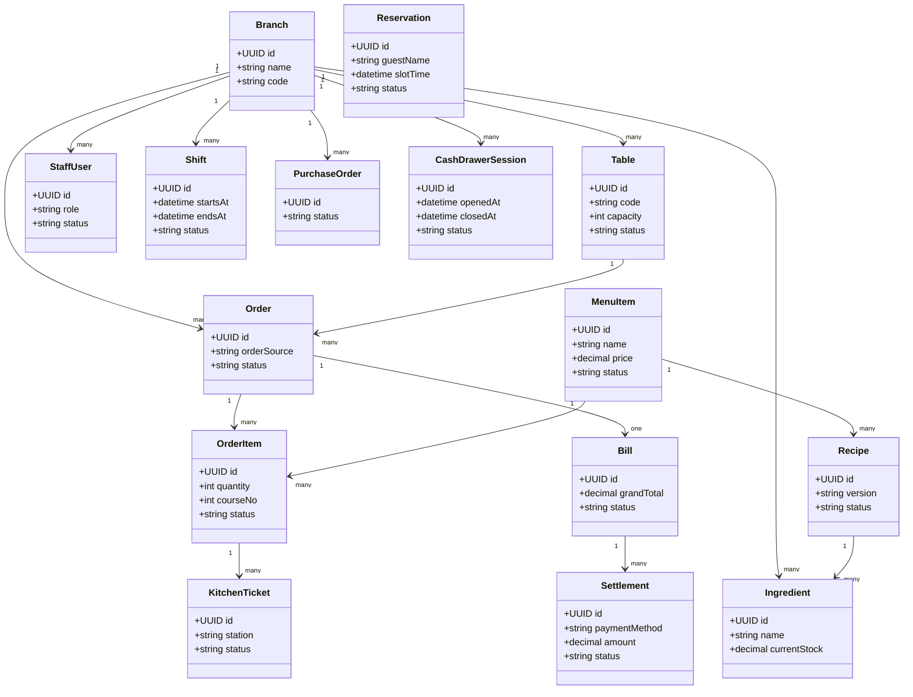

# Class Diagram - Restaurant Management System

```mermaid
classDiagram
    class Branch {
      +UUID id
      +string name
      +string code
    }
    class Table {
      +UUID id
      +string code
      +int capacity
      +string status
    }
    class Reservation {
      +UUID id
      +string guestName
      +datetime slotTime
      +string status
    }
    class StaffUser {
      +UUID id
      +string role
      +string status
    }
    class Shift {
      +UUID id
      +datetime startsAt
      +datetime endsAt
      +string status
    }
    class MenuItem {
      +UUID id
      +string name
      +decimal price
      +string status
    }
    class Recipe {
      +UUID id
      +string version
      +string status
    }
    class Ingredient {
      +UUID id
      +string name
      +decimal currentStock
    }
    class Order {
      +UUID id
      +string orderSource
      +string status
    }
    class OrderItem {
      +UUID id
      +int quantity
      +int courseNo
      +string status
    }
    class KitchenTicket {
      +UUID id
      +string station
      +string status
    }
    class Bill {
      +UUID id
      +decimal grandTotal
      +string status
    }
    class Settlement {
      +UUID id
      +string paymentMethod
      +decimal amount
      +string status
    }
    class PurchaseOrder {
      +UUID id
      +string status
    }
    class CashDrawerSession {
      +UUID id
      +datetime openedAt
      +datetime closedAt
      +string status
    }

    Branch "1" --> "many" Table
    Branch "1" --> "many" StaffUser
    Branch "1" --> "many" Shift
    Branch "1" --> "many" Ingredient
    Branch "1" --> "many" Order
    Table "1" --> "many" Order
    Order "1" --> "many" OrderItem
    OrderItem "1" --> "many" KitchenTicket
    MenuItem "1" --> "many" OrderItem
    MenuItem "1" --> "many" Recipe
    Recipe "1" --> "many" Ingredient
    Order "1" --> "one" Bill
    Bill "1" --> "many" Settlement
    Branch "1" --> "many" CashDrawerSession
    Branch "1" --> "many" PurchaseOrder
```
