# Class Diagram — Restaurant Management System

## Introduction

This document describes the full domain model for the Restaurant Management System, capturing all core entities, their typed properties, methods, and inter-entity relationships. The model is organized into two layers: the **domain layer**, which represents persistent business objects such as menus, orders, staff, and inventory, and the **service layer**, which encapsulates the application logic that orchestrates these domain objects. Aggregate roots such as `Order`, `Bill`, and `Branch` act as consistency boundaries. Supporting entities like `OrderItem`, `KitchenTicket`, and `PaymentRecord` live within those aggregates and are never accessed independently. The separation of domain and service concerns ensures that business rules remain in the domain model while cross-cutting workflows—reporting, notifications, delivery integrations—are delegated to dedicated service classes.

---

## Domain Model Class Diagram

```mermaid
classDiagram

    class Restaurant {
        +UUID id
        +String name
        +String cuisineType
        +String currency
        +String timezone
        +String status
        +activate() void
        +deactivate() void
        +addBranch(b: Branch) Branch
        +getBranches() List~Branch~
    }

    class Branch {
        +UUID id
        +UUID restaurantId
        +String name
        +String branchCode
        +Decimal taxRate
        +Decimal serviceChargeRate
        +String status
        +Time openingTime
        +Time closingTime
        +Integer seatingCapacity
        +Boolean isDeliveryEnabled
        +open() void
        +close() void
        +getActiveTables() List~Table~
        +getCurrentOrders() List~Order~
        +getDailySalesReport(date: Date) DailySalesReport
    }

    class Table {
        +UUID id
        +UUID branchId
        +String tableNumber
        +String displayName
        +Integer capacity
        +String shape
        +String status
        +Boolean isCombinable
        +String qrCode
        +seat(covers: Integer) void
        +release() void
        +markCleaning() void
        +block(reason: String) void
        +isAvailableForPartySize(size: Integer) Boolean
        +merge(other: Table) void
    }

    class Section {
        +UUID id
        +UUID branchId
        +String name
        +String description
        +Integer displayOrder
        +getTables() List~Table~
        +getCapacity() Integer
    }

    class Menu {
        +UUID id
        +UUID branchId
        +String name
        +String menuType
        +Boolean isActive
        +Date validFrom
        +Date validUntil
        +activate() void
        +deactivate() void
        +getAvailableItems() List~MenuItem~
        +getCategories() List~MenuCategory~
    }

    class MenuCategory {
        +UUID id
        +UUID menuId
        +String name
        +String description
        +Integer displayOrder
        +getItems() List~MenuItem~
        +reorder(newOrder: Integer) void
    }

    class MenuItem {
        +UUID id
        +UUID menuId
        +UUID categoryId
        +String name
        +Decimal price
        +Boolean isAvailable
        +Boolean isVegetarian
        +Boolean isVegan
        +Boolean isGlutenFree
        +String[] allergens
        +Integer calories
        +Integer preparationTimeMinutes
        +String sku
        +markAvailable() void
        +markUnavailable() void
        +getModifierGroups() List~ModifierGroup~
        +getRecipe() Recipe
        +calculateEffectivePrice(modifiers: List~Modifier~) Decimal
    }

    class ModifierGroup {
        +UUID id
        +UUID menuItemId
        +String name
        +String selectionType
        +Integer minSelections
        +Integer maxSelections
        +Boolean isRequired
        +getModifiers() List~Modifier~
        +validate(selections: List~Modifier~) Boolean
    }

    class Modifier {
        +UUID id
        +UUID modifierGroupId
        +String name
        +Decimal priceAdjustment
        +Boolean isDefault
        +Integer displayOrder
        +applyTo(item: OrderItem) Decimal
    }

    class Recipe {
        +UUID id
        +UUID menuItemId
        +String version
        +Integer servings
        +Boolean isActive
        +getIngredients() List~RecipeIngredient~
        +calculateCost() Decimal
        +checkStockAvailability(qty: Integer) Boolean
        +deductFromStock(qty: Integer) void
    }

    class RecipeIngredient {
        +UUID id
        +UUID recipeId
        +UUID ingredientId
        +Decimal quantity
        +String unitOfMeasure
        +Boolean isOptional
        +getIngredient() Ingredient
    }

    class Ingredient {
        +UUID id
        +UUID branchId
        +String name
        +String unitOfMeasure
        +Decimal costPerUnit
        +Decimal currentStock
        +Decimal minimumStock
        +Decimal reorderPoint
        +String category
        +Boolean isActive
        +deduct(qty: Decimal) void
        +restock(qty: Decimal, cost: Decimal) void
        +isLowStock() Boolean
        +needsReorder() Boolean
        +getStockMovements() List~StockMovement~
    }

    class Order {
        +UUID id
        +UUID branchId
        +UUID tableId
        +UUID staffId
        +String orderNumber
        +String orderType
        +String status
        +String source
        +Integer covers
        +Decimal totalAmount
        +Decimal discountAmount
        +Decimal taxAmount
        +Decimal serviceChargeAmount
        +DateTime submittedAt
        +DateTime completedAt
        +addItem(item: OrderItem) void
        +removeItem(itemId: UUID) void
        +submit() void
        +cancel(reason: String) void
        +calculateTotals() void
        +generateBill() Bill
        +getKitchenTickets() List~KitchenTicket~
    }

    class OrderItem {
        +UUID id
        +UUID orderId
        +UUID menuItemId
        +Integer quantity
        +Decimal unitPrice
        +Decimal discountAmount
        +String notes
        +Integer courseNumber
        +String status
        +String kitchenStation
        +applyDiscount(pct: Decimal) void
        +void(reason: String) void
        +getLineTotal() Decimal
        +getModifiers() List~OrderItemModifier~
    }

    class OrderItemModifier {
        +UUID id
        +UUID orderItemId
        +UUID modifierId
        +String modifierName
        +Decimal priceAdjustment
        +getModifier() Modifier
    }

    class KitchenTicket {
        +UUID id
        +UUID orderId
        +UUID branchId
        +String stationId
        +String ticketNumber
        +String priority
        +String status
        +Integer estimatedMinutes
        +DateTime acceptedAt
        +DateTime startedAt
        +DateTime completedAt
        +DateTime bumpedAt
        +accept() void
        +start() void
        +complete() void
        +bump() void
        +recall() void
        +setPriority(p: String) void
        +getElapsedMinutes() Integer
        +isOverdue() Boolean
    }

    class Bill {
        +UUID id
        +UUID orderId
        +UUID branchId
        +String billNumber
        +Decimal subtotal
        +Decimal discountAmount
        +Decimal taxAmount
        +Decimal serviceCharge
        +Decimal tipAmount
        +Decimal totalAmount
        +String status
        +DateTime issuedAt
        +DateTime paidAt
        +issue() void
        +addPayment(p: PaymentRecord) void
        +addTip(amount: Decimal) void
        +split(splitConfig: SplitConfig) List~SplitPayment~
        +void(reason: String) void
        +refund(amount: Decimal) void
        +getOutstandingBalance() Decimal
        +isPaid() Boolean
    }

    class PaymentRecord {
        +UUID id
        +UUID billId
        +String paymentMethod
        +Decimal amount
        +String currency
        +String referenceNumber
        +String providerTransactionId
        +String status
        +DateTime processedAt
        +capture() void
        +void() void
        +refund() void
    }

    class SplitPayment {
        +UUID id
        +UUID billId
        +Integer splitNumber
        +Decimal amount
        +String status
        +UUID assignedGuestRef
        +pay(payment: PaymentRecord) void
    }

    class Tip {
        +UUID id
        +UUID billId
        +Decimal amount
        +String tipType
        +UUID staffId
        +DateTime recordedAt
        +distribute(staff: List~Staff~) void
    }

    class Reservation {
        +UUID id
        +UUID branchId
        +UUID tableId
        +String customerName
        +String customerPhone
        +String customerEmail
        +Integer partySize
        +Date reservationDate
        +Time reservationTime
        +Integer durationMinutes
        +String status
        +String specialRequests
        +String confirmationCode
        +confirm() void
        +cancel(reason: String) void
        +markArrived() void
        +seat(table: Table) void
        +markNoShow() void
        +sendConfirmation() void
    }

    class WalkIn {
        +UUID id
        +UUID branchId
        +String customerName
        +Integer partySize
        +DateTime arrivedAt
        +UUID assignedTableId
        +String status
        +seat(table: Table) void
        +addToWaitlist() WaitlistEntry
    }

    class WaitlistEntry {
        +UUID id
        +UUID branchId
        +String customerName
        +String customerPhone
        +Integer partySize
        +Integer estimatedWaitMinutes
        +String status
        +Integer position
        +DateTime addedAt
        +notify() void
        +promote(table: Table) void
        +remove() void
        +updateEstimate(minutes: Integer) void
    }

    class Staff {
        +UUID id
        +UUID branchId
        +UUID roleId
        +String firstName
        +String lastName
        +String email
        +String phone
        +Date hireDate
        +String status
        +Decimal hourlyRate
        +clockIn(shift: Shift) void
        +clockOut(shift: Shift) void
        +getActiveShift() Shift
        +hasPermission(permission: String) Boolean
        +authenticate(pin: String) Boolean
    }

    class Role {
        +UUID id
        +UUID restaurantId
        +String name
        +String description
        +getPermissions() List~Permission~
        +addPermission(p: Permission) void
        +removePermission(p: Permission) void
        +hasPermission(permCode: String) Boolean
    }

    class Permission {
        +UUID id
        +String code
        +String resource
        +String action
        +String description
        +matches(resource: String, action: String) Boolean
    }

    class Shift {
        +UUID id
        +UUID branchId
        +String name
        +Date shiftDate
        +Time startTime
        +Time endTime
        +Integer requiredStaff
        +String status
        +assign(staff: Staff) ShiftAssignment
        +getAssignments() List~ShiftAssignment~
        +isFullyStaffed() Boolean
    }

    class ShiftAssignment {
        +UUID id
        +UUID shiftId
        +UUID staffId
        +DateTime clockedInAt
        +DateTime clockedOutAt
        +Decimal hoursWorked
        +clockIn() void
        +clockOut() void
        +calculateWage() Decimal
    }

    class CashDrawer {
        +UUID id
        +UUID branchId
        +String drawerCode
        +String location
        +Boolean isActive
        +openSession(staff: Staff, openingBalance: Decimal) CashDrawerSession
        +getCurrentSession() CashDrawerSession
    }

    class CashDrawerSession {
        +UUID id
        +UUID cashDrawerId
        +UUID staffId
        +Decimal openingBalance
        +Decimal closingBalance
        +Decimal expectedBalance
        +Decimal variance
        +String status
        +DateTime openedAt
        +DateTime closedAt
        +recordSale(amount: Decimal) void
        +recordRefund(amount: Decimal) void
        +close(closingBalance: Decimal) void
        +calculateVariance() Decimal
    }

    class Supplier {
        +UUID id
        +UUID restaurantId
        +String name
        +String contactName
        +String phone
        +String email
        +String paymentTerms
        +Integer leadTimeDays
        +String status
        +createPurchaseOrder(items: List~PurchaseOrderItem~) PurchaseOrder
        +getPurchaseHistory() List~PurchaseOrder~
    }

    class PurchaseOrder {
        +UUID id
        +UUID branchId
        +UUID supplierId
        +String poNumber
        +String status
        +Decimal totalAmount
        +DateTime orderedAt
        +DateTime expectedDeliveryAt
        +DateTime receivedAt
        +addItem(item: PurchaseOrderItem) void
        +submit() void
        +receive(items: List~ReceivedItem~) void
        +cancel(reason: String) void
        +calculateTotal() Decimal
    }

    class PurchaseOrderItem {
        +UUID id
        +UUID purchaseOrderId
        +UUID ingredientId
        +Decimal orderedQuantity
        +Decimal receivedQuantity
        +Decimal unitCost
        +String unitOfMeasure
        +receive(qty: Decimal) void
        +isFullyReceived() Boolean
    }

    class StockMovement {
        +UUID id
        +UUID ingredientId
        +UUID branchId
        +String movementType
        +Decimal quantity
        +Decimal costPerUnit
        +String referenceType
        +UUID referenceId
        +String notes
        +DateTime occurredAt
        +getIngredient() Ingredient
        +calculateValue() Decimal
    }

    class LoyaltyMember {
        +UUID id
        +UUID restaurantId
        +String customerName
        +String phone
        +String email
        +String tier
        +Integer pointsBalance
        +Integer totalPointsEarned
        +Decimal totalSpent
        +DateTime joinedAt
        +String status
        +earnPoints(orderTotal: Decimal) Integer
        +redeemPoints(points: Integer) Decimal
        +upgradeTier() void
        +getTransactions() List~LoyaltyTransaction~
    }

    class LoyaltyTransaction {
        +UUID id
        +UUID loyaltyMemberId
        +UUID orderId
        +String transactionType
        +Integer points
        +Decimal monetaryValue
        +DateTime occurredAt
        +String notes
        +reverse() void
    }

    class DeliveryOrder {
        +UUID id
        +UUID orderId
        +UUID deliveryChannelId
        +String externalOrderId
        +String customerName
        +String customerPhone
        +String deliveryAddress
        +Decimal distanceKm
        +Decimal deliveryFee
        +String driverName
        +String driverPhone
        +String status
        +DateTime acceptedAt
        +DateTime pickedUpAt
        +DateTime deliveredAt
        +accept() void
        +dispatch(driverName: String, driverPhone: String) void
        +markPickedUp() void
        +markDelivered() void
        +fail(reason: String) void
        +cancel(reason: String) void
    }

    class DeliveryChannel {
        +UUID id
        +UUID restaurantId
        +String name
        +String channelType
        +String apiKey
        +Boolean isActive
        +Decimal commissionRate
        +createOrder(payload: Object) DeliveryOrder
        +updateStatus(externalId: String, status: String) void
    }

    class DailySalesReport {
        +UUID id
        +UUID branchId
        +Date reportDate
        +Integer totalOrders
        +Integer totalCovers
        +Decimal grossSales
        +Decimal discounts
        +Decimal netSales
        +Decimal taxCollected
        +Decimal serviceCharges
        +Decimal tips
        +Decimal totalPayments
        +Decimal cashPayments
        +Decimal cardPayments
        +Decimal digitalPayments
        +Integer voidCount
        +Decimal voidAmount
        +generate(branchId: UUID, date: Date) DailySalesReport
        +export(format: String) String
    }

    %% ── Relationships ──────────────────────────────────────────────────────────

    Restaurant "1" --o "many" Branch : has
    Branch "1" --o "many" Table : contains
    Branch "1" --o "many" Section : has
    Section "1" --o "many" Table : groups
    Branch "1" --o "many" Menu : offers
    Menu "1" --o "many" MenuCategory : organizes
    MenuCategory "1" --o "many" MenuItem : includes
    MenuItem "1" --o "many" ModifierGroup : has
    ModifierGroup "1" --o "many" Modifier : contains
    MenuItem "1" --* "1" Recipe : defines
    Recipe "1" --o "many" RecipeIngredient : contains
    RecipeIngredient "many" --> "1" Ingredient : references
    Branch "1" --o "many" Order : processes
    Table "1" --o "many" Order : hosts
    Order "1" --o "many" OrderItem : contains
    OrderItem "1" --o "many" OrderItemModifier : has
    Order "1" --o "many" KitchenTicket : generates
    Order "1" --* "1" Bill : billed_to
    Bill "1" --o "many" PaymentRecord : settled_by
    Bill "1" --o "many" SplitPayment : split_into
    Bill "1" --o "many" Tip : includes
    Branch "1" --o "many" Reservation : books
    Branch "1" --o "many" WalkIn : receives
    Branch "1" --o "many" WaitlistEntry : queues
    Branch "1" --o "many" Staff : employs
    Staff "many" --> "1" Role : assigned
    Role "1" --o "many" Permission : grants
    Branch "1" --o "many" Shift : schedules
    Shift "1" --o "many" ShiftAssignment : assigns
    Staff "1" --o "many" ShiftAssignment : works
    Branch "1" --o "many" CashDrawer : has
    CashDrawer "1" --o "many" CashDrawerSession : tracks
    Branch "1" --o "many" Ingredient : stocks
    Restaurant "1" --o "many" Supplier : partners
    Branch "1" --o "many" PurchaseOrder : creates
    PurchaseOrder "1" --o "many" PurchaseOrderItem : contains
    Ingredient "1" --o "many" StockMovement : tracked_in
    Restaurant "1" --o "many" LoyaltyMember : enrolls
    LoyaltyMember "1" --o "many" LoyaltyTransaction : earns
    Order "1" --o "1" DeliveryOrder : fulfilled_by
    DeliveryChannel "1" --o "many" DeliveryOrder : processes
```

---

## Service Layer Class Diagram

```mermaid
classDiagram

    class OrderService {
        +createOrder(req: CreateOrderRequest) Order
        +submitOrder(orderId: UUID, staffId: UUID) Order
        +addItems(orderId: UUID, items: List) Order
        +removeItem(orderId: UUID, itemId: UUID) Order
        +cancelOrder(orderId: UUID, reason: String) Order
        +getOrder(orderId: UUID) Order
        +listOrders(branchId: UUID, filters: OrderFilters) Page~Order~
    }

    class KitchenService {
        +createTickets(order: Order) List~KitchenTicket~
        +acceptTicket(ticketId: UUID) KitchenTicket
        +startTicket(ticketId: UUID) KitchenTicket
        +completeTicket(ticketId: UUID) KitchenTicket
        +bumpTicket(ticketId: UUID) KitchenTicket
        +recallTicket(ticketId: UUID) KitchenTicket
        +getStationQueue(stationId: String) List~KitchenTicket~
        +setPriority(ticketId: UUID, priority: String) void
    }

    class BillingService {
        +generateBill(orderId: UUID) Bill
        +addPayment(billId: UUID, payment: PaymentRequest) PaymentRecord
        +splitBill(billId: UUID, config: SplitConfig) List~SplitPayment~
        +addTip(billId: UUID, amount: Decimal) Tip
        +voidBill(billId: UUID, reason: String) Bill
        +refund(billId: UUID, amount: Decimal) PaymentRecord
        +getBill(billId: UUID) Bill
        +getReceipt(billId: UUID) String
    }

    class InventoryService {
        +getIngredients(branchId: UUID) List~Ingredient~
        +adjustStock(adjustment: StockAdjustment) StockMovement
        +checkAvailability(recipeId: UUID, qty: Integer) Boolean
        +deductForOrder(order: Order) void
        +getLowStockAlerts(branchId: UUID) List~Ingredient~
        +getMovements(branchId: UUID, filters: Filters) Page~StockMovement~
    }

    class ReservationService {
        +createReservation(req: ReservationRequest) Reservation
        +confirmReservation(id: UUID) Reservation
        +cancelReservation(id: UUID, reason: String) Reservation
        +arriveReservation(id: UUID) Reservation
        +seatReservation(id: UUID, tableId: UUID) Reservation
        +getAvailability(branchId: UUID, date: Date, partySize: Integer) List~TimeSlot~
    }

    class StaffService {
        +createStaff(req: CreateStaffRequest) Staff
        +updateStaff(id: UUID, req: UpdateRequest) Staff
        +clockIn(staffId: UUID, shiftId: UUID, pin: String) ShiftAssignment
        +clockOut(staffId: UUID, shiftId: UUID) ShiftAssignment
        +getActiveStaff(branchId: UUID) List~Staff~
        +authenticatePin(staffId: UUID, pin: String) Boolean
    }

    class DeliveryService {
        +createDeliveryOrder(req: DeliveryRequest) DeliveryOrder
        +updateStatus(deliveryOrderId: UUID, status: String) DeliveryOrder
        +handleWebhook(channelId: UUID, payload: Object) void
        +getDeliveryOrders(branchId: UUID) List~DeliveryOrder~
    }

    class ReportingService {
        +generateDailySales(branchId: UUID, date: Date) DailySalesReport
        +getBranchOperations(branchId: UUID, range: DateRange) OperationsReport
        +getMenuEngineering(branchId: UUID, range: DateRange) MenuReport
        +getInventoryValuation(branchId: UUID) InventoryReport
        +getStaffPerformance(branchId: UUID, range: DateRange) StaffReport
    }

    class LoyaltyService {
        +enrollMember(req: EnrollRequest) LoyaltyMember
        +earnPoints(memberId: UUID, order: Order) LoyaltyTransaction
        +redeemPoints(memberId: UUID, points: Integer, billId: UUID) LoyaltyTransaction
        +getMember(phone: String) LoyaltyMember
        +upgradeTier(memberId: UUID) void
    }

    class NotificationService {
        +sendReservationConfirmation(reservation: Reservation) void
        +sendOrderReady(order: Order) void
        +sendLowStockAlert(ingredient: Ingredient) void
        +sendDeliveryUpdate(delivery: DeliveryOrder) void
        +sendBillReceipt(bill: Bill, email: String) void
    }

    OrderService --> KitchenService : triggers ticket creation
    OrderService --> InventoryService : checks stock
    BillingService --> NotificationService : sends receipt
    ReservationService --> NotificationService : sends confirmation
    InventoryService --> NotificationService : sends low-stock alert
    DeliveryService --> NotificationService : sends delivery update
    OrderService --> LoyaltyService : posts earning event
    BillingService --> LoyaltyService : applies redemption
```



---

## Class Descriptions

### Domain Class Descriptions

#### Restaurant
`Restaurant` is the top-level aggregate root that represents a restaurant brand or business entity. It holds global configuration such as default currency, timezone, and cuisine type that all child branches inherit as defaults. The `activate` and `deactivate` methods control whether the restaurant is open for business across all channels. A single `Restaurant` can manage multiple `Branch` records, each with independent operating hours, tax rates, and seating layouts.

#### Branch
`Branch` represents a physical or virtual operating location of a `Restaurant`. Each branch maintains its own tax and service-charge rates, opening/closing times, seating capacity, and delivery enablement flag. The `getDailySalesReport` method is a convenience delegation that triggers `ReportingService` and returns a pre-aggregated snapshot for the given calendar date. Branch is the key scoping boundary for menus, orders, staff, shifts, inventory, and reservations—most queries are scoped to a branch ID.

#### Table
`Table` models a physical seating surface within a `Branch`. Its `status` property cycles through states such as `available`, `occupied`, `cleaning`, and `blocked`, driven by the state-transition methods (`seat`, `release`, `markCleaning`, `block`). The `isCombinable` flag indicates that the table may be logically merged with an adjacent table for large parties, enabled through the `merge` method. A unique `qrCode` is generated per table to support scan-to-order workflows from customer mobile devices.

#### Menu
`Menu` defines an ordered collection of categories and items offered at a branch during a specific time window. The `menuType` field distinguishes between breakfast, lunch, dinner, happy-hour, and delivery-only menus. `validFrom` and `validUntil` allow scheduled menu publishing without manual intervention. Only one menu of a given type should be active at a time; `activate` and `deactivate` enforce this business rule.

#### MenuItem
`MenuItem` represents a single orderable dish or beverage defined within a `MenuCategory`. Nutritional flags (`isVegetarian`, `isVegan`, `isGlutenFree`) and the `allergens` array enable front-of-house filtering and legal compliance labeling. `calculateEffectivePrice` accepts a resolved list of `Modifier` objects and returns the final unit price after applying all price adjustments. The `sku` field links the menu item to the POS barcode system and procurement catalog.

#### Order
`Order` is the central transactional aggregate of the system, capturing everything from the initiating staff member and table, through to financial totals and lifecycle timestamps. The `orderType` field distinguishes dine-in, takeaway, delivery, and bar tab orders, while `source` records whether the order originated from POS, kiosk, online, or a third-party platform. `calculateTotals` recomputes `taxAmount`, `serviceChargeAmount`, and `totalAmount` from the current line items. `submit` transitions the order from draft to submitted and triggers kitchen ticket generation via `KitchenService`.

#### OrderItem
`OrderItem` represents a single line within an `Order`, capturing the resolved unit price at time of ordering (not the current menu price) to ensure immutability of historical records. The `courseNumber` field supports multi-course service, allowing kitchen to hold and fire items by course. `void` records a reason and marks the item as voided rather than deleting it, preserving an audit trail. `getLineTotal` returns `(unitPrice + sum of modifier adjustments) * quantity - discountAmount`.

#### KitchenTicket
`KitchenTicket` represents a printable or screen-display instruction sent to a specific kitchen station (e.g., grill, cold prep, bar). The `priority` field allows managers to escalate tickets for VIP tables or delayed orders. Lifecycle methods (`accept`, `start`, `complete`, `bump`, `recall`) drive the Kitchen Display System (KDS) state machine, with timestamps recorded at each transition. `isOverdue` compares `getElapsedMinutes()` against `estimatedMinutes` to surface SLA breaches on the KDS.

#### Bill
`Bill` is the financial document issued to the guest at the conclusion of a dine-in, takeaway, or delivery order. It consolidates subtotal, discounts, tax, service charge, and tips into a single `totalAmount` and tracks payment status. The `split` method accepts a `SplitConfig` describing how to divide the bill (by item, by seat, or equally) and returns a list of `SplitPayment` objects. `getOutstandingBalance` returns the difference between `totalAmount` and the sum of all captured `PaymentRecord` amounts.

#### PaymentRecord
`PaymentRecord` captures a single payment attempt or capture against a `Bill`. The `paymentMethod` field identifies cash, credit card, debit card, digital wallet, or voucher. `providerTransactionId` stores the PSP (payment service provider) reference for reconciliation and dispute handling. The `capture`, `void`, and `refund` methods delegate to the underlying payment gateway and update the record's `status` accordingly.

#### Reservation
`Reservation` represents an advance booking made by a guest for a specific date, time, party size, and optionally a preferred table. The `confirmationCode` is a short alphanumeric token sent to the guest via SMS or email for check-in verification. `markNoShow` is invoked when the guest does not arrive within a configurable grace period, freeing the held table. `sendConfirmation` delegates to `NotificationService` to dispatch the appropriate channel-specific message.

#### Ingredient
`Ingredient` tracks a raw material or consumable stocked at a `Branch` used by one or more recipes. `currentStock` is decremented via `deduct` whenever an order is fulfilled and incremented via `restock` when a purchase order is received. `isLowStock` returns true when `currentStock` falls below `minimumStock`, while `needsReorder` checks against `reorderPoint` to trigger an automated purchase suggestion. All quantity changes are recorded as `StockMovement` events for a full audit trail.

#### Staff
`Staff` models an employee assigned to a branch with a designated `Role`. The `authenticate` method validates a 4–6 digit PIN used at the POS terminal for quick login without requiring a full password flow. `hasPermission` delegates to the staff's `Role` and checks whether the given permission code is present in the role's permission list. Clock-in/clock-out state is tracked through `ShiftAssignment` records rather than mutable fields on `Staff` itself, preserving history.

#### Role
`Role` defines a named set of permissions within a restaurant, such as `Server`, `Cashier`, `Kitchen`, `Manager`, or `Owner`. Roles are scoped to the `Restaurant` level so they can be reused across all branches. `addPermission` and `removePermission` manage the many-to-many relationship with `Permission` objects at runtime. `hasPermission` is the single authorisation check used by all service-layer guards.

#### Shift
`Shift` represents a scheduled working window at a branch, such as a morning or evening shift on a given date. `requiredStaff` records how many staff members the schedule demands, and `isFullyStaffed` compares that count against confirmed `ShiftAssignment` records. The `assign` method creates a `ShiftAssignment` linking a `Staff` member to this shift and initialises their attendance state. The `status` field tracks whether a shift is `draft`, `published`, `in_progress`, or `closed`.

#### PurchaseOrder
`PurchaseOrder` records a procurement transaction sent to a `Supplier` for one or more `Ingredient` lines. The `status` lifecycle moves from `draft` → `submitted` → `partially_received` → `received` or `cancelled`. `receive` processes delivery by iterating `ReceivedItem` records, updating each `PurchaseOrderItem.receivedQuantity`, and calling `Ingredient.restock` for each fully or partially received line. `calculateTotal` sums `orderedQuantity * unitCost` across all items.

#### LoyaltyMember
`LoyaltyMember` tracks a guest enrolled in the restaurant's loyalty programme across all branches. The `tier` field (e.g., `Bronze`, `Silver`, `Gold`, `Platinum`) controls earning multipliers and redemption thresholds. `earnPoints` applies the tier-specific multiplier to the order total and returns the points awarded. `upgradeTier` evaluates `totalSpent` and `totalPointsEarned` against tier thresholds and promotes the member if criteria are met.

#### DeliveryOrder
`DeliveryOrder` extends an internal `Order` with delivery-specific metadata such as driver details, delivery address, distance, and delivery fee. It links to a `DeliveryChannel` representing the platform (e.g., in-house, Uber Eats, Grab) that originated the order. The status lifecycle (`accepted` → `dispatched` → `picked_up` → `delivered` or `failed`) is driven by webhook callbacks from the delivery platform via `DeliveryService`. `cancel` records a reason and triggers a refund workflow if payment was pre-collected.

---

### Service Class Descriptions

#### OrderService
`OrderService` is the primary application service responsible for the full lifecycle of a dine-in, takeaway, or delivery order. `createOrder` initialises an `Order` in `draft` state, validates the table and staff context, and persists the record. `submitOrder` locks the order, fires `calculateTotals`, and delegates to `KitchenService.createTickets` to send items to the appropriate kitchen stations. `listOrders` accepts a rich `OrderFilters` value object to support front-of-house views filtered by table, status, order type, or time range, returning a paginated result.

#### KitchenService
`KitchenService` manages the state machine of `KitchenTicket` objects displayed on kitchen display screens. When `createTickets` is called, it partitions `OrderItem` records by `kitchenStation`, creates one `KitchenTicket` per station, and persists them. Each state-transition method (`acceptTicket`, `startTicket`, `completeTicket`) records the corresponding timestamp and broadcasts a real-time event over WebSocket to the KDS. `getStationQueue` returns tickets sorted by priority and creation time, giving the KDS its render-ready list.

#### BillingService
`BillingService` handles all financial operations from bill generation through to final settlement. `generateBill` computes subtotal, taxes, service charges, and any applied discounts from the order's items and persists a `Bill` with status `issued`. `splitBill` accepts a `SplitConfig` value object and emits `SplitPayment` records that can be independently settled by different guests. `refund` creates a reversal `PaymentRecord`, updates the bill's outstanding balance, and triggers `NotificationService` to email or SMS the receipt with refund details.

#### InventoryService
`InventoryService` provides all stock management operations for a branch. `deductForOrder` is invoked by `OrderService` on order submission; it resolves each `OrderItem` to its `Recipe`, checks per-ingredient availability, and calls `Ingredient.deduct` for each recipe line. `adjustStock` supports manual corrections (waste, damage, or count adjustments) and always creates a `StockMovement` record for auditability. `getLowStockAlerts` queries ingredients where `currentStock < minimumStock` and triggers `NotificationService` if any thresholds are breached.

#### ReservationService
`ReservationService` manages the guest booking lifecycle from initial request to table seating or no-show recording. `getAvailability` inspects the branch's table capacities, existing reservations, and operating hours for a given date and party size, returning a list of `TimeSlot` value objects. `createReservation` validates party size against available capacity, generates a unique `confirmationCode`, persists the record, and calls `NotificationService.sendReservationConfirmation`. `seatReservation` transitions the reservation to `seated`, marks the table as `occupied`, and creates a new `Order` pre-populated with the reservation details.

#### StaffService
`StaffService` handles employee administration and access control for branch operations. `createStaff` validates uniqueness of email and phone, hashes the PIN credential, and assigns the specified `Role`. `clockIn` authenticates the PIN, verifies the staff member is assigned to the given shift, creates a `ShiftAssignment` with the current timestamp, and returns the assignment record. `authenticatePin` is the lightweight check used by POS terminals to gate sensitive operations such as discounts, voids, and cash drawer access without a full session login.

#### DeliveryService
`DeliveryService` acts as an integration hub between internal order operations and external delivery platforms. `createDeliveryOrder` maps a `DeliveryRequest` (which may originate from a webhook or manual entry) to an internal `Order` and a linked `DeliveryOrder` record. `handleWebhook` deserialises the platform-specific payload, resolves the `DeliveryChannel` by ID, maps the external status to an internal status, and dispatches the appropriate lifecycle method on the `DeliveryOrder`. Commission calculations using `DeliveryChannel.commissionRate` are applied when the order is marked delivered.

#### ReportingService
`ReportingService` produces analytical and operational reports consumed by managers and the back-office. `generateDailySales` aggregates order, payment, void, and tip data for a branch on a given date into a `DailySalesReport` and persists a snapshot. `getMenuEngineering` calculates item popularity and contribution margin to produce a four-quadrant menu analysis (Stars, Plowhorses, Puzzles, Dogs). Reports are generated on-demand or on a schedule and support export in PDF, CSV, and JSON formats via the `export` method on the report value objects.

#### LoyaltyService
`LoyaltyService` manages the loyalty programme's enrolment, earning, and redemption workflows. `earnPoints` resolves the member's current tier, applies the tier multiplier to the order's net total, creates a `LoyaltyTransaction` of type `earn`, updates `pointsBalance`, and checks whether the new `totalSpent` value triggers a tier upgrade. `redeemPoints` validates that the member has sufficient balance, creates a `LoyaltyTransaction` of type `redeem`, and returns a monetary credit value applied to the specified `Bill`. `getMember` performs a phone-based lookup, which is the standard identifier used at the POS.

#### NotificationService
`NotificationService` is a thin dispatch layer that formats and sends outbound communications via SMS, email, and push channels. Each method accepts a domain object (e.g., `Reservation`, `Order`, `Bill`) and a destination, renders the appropriate template, and enqueues the message through the configured messaging provider. `sendLowStockAlert` is typically called in a batch after the nightly inventory reconciliation job and routes alerts to the branch manager's email and the procurement team's Slack channel. All sends are logged asynchronously to support delivery-status tracking and retry on failure.
