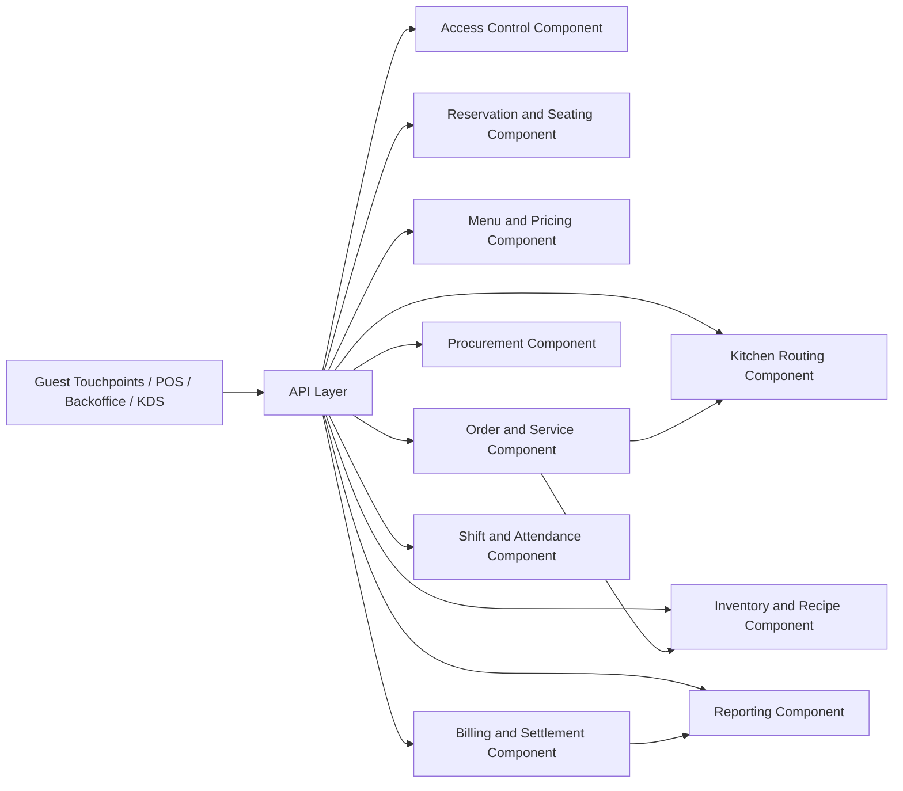
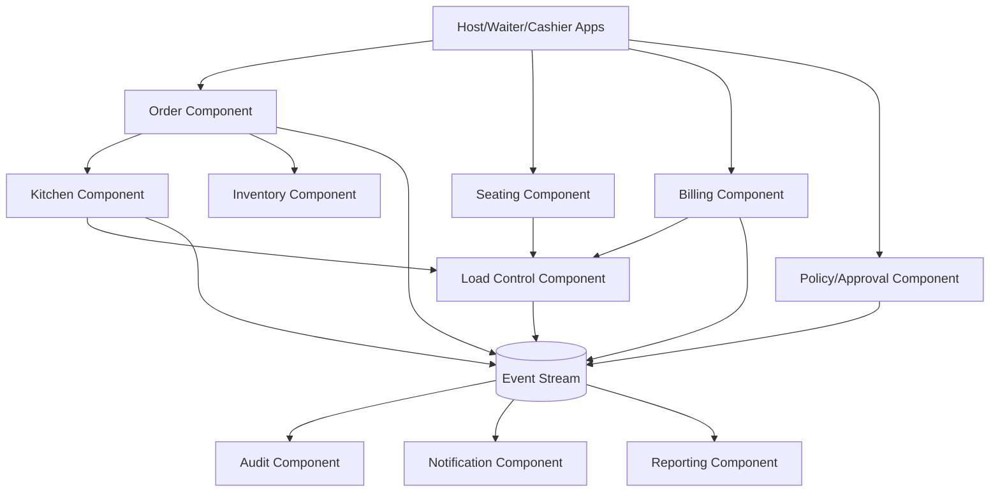

# Component Diagram - Restaurant Management System

## Component Responsibilities

| Component | Responsibility |
|-----------|----------------|
| Access Control | Authentication, branch scoping, approval gates |
| Reservation and Seating | Reservations, walk-ins, waitlist, table assignment |
| Menu and Pricing | Menus, modifiers, taxes, discounts, availability |
| Order and Service | Order capture, table checks, service events |
| Kitchen Routing | Station routing, prep states, readiness signals |
| Inventory and Recipe | Ingredients, recipe usage, stock movements |
| Procurement | Vendors, POs, receipts, discrepancies |
| Billing and Settlement | Bills, payments, refunds, drawer sessions |
| Shift and Attendance | Scheduling, attendance, staffing visibility |
| Reporting | Sales, delays, variance, operational dashboards |

## Component Interaction Diagram for Operational Flows

## Component Contracts (Minimum)

| Producer -> Consumer | Contract Requirement |
|----------------------|----------------------|
| Order -> Kitchen | station-ready ticket bundle with dependency metadata |
| Kitchen -> POS projection | line-level state transition with station and ETA context |
| Billing -> Reconciliation | immutable settlement rows with tender breakdown |
| Policy -> Domain services | decision object with scope, threshold, and approval lineage |
| Load Control -> Seating/Menu/Kitchen | tiered throttle directives with effective window |
