# Component Diagram — Restaurant Management System

## Architecture Overview

The Restaurant Management System is built on a layered microservices architecture designed to
support the full operational lifecycle of a modern restaurant — from guest arrival through order
fulfilment, payment, and post-service analytics. The architecture separates concerns across five
distinct layers, each with well-defined responsibilities and communication contracts.

The **Frontend Layer** comprises specialised client applications tailored to each operational role:
POS terminals for waitstaff, a Kitchen Display System for kitchen staff, a Host Terminal for seating
management, a Manager Dashboard for oversight, a Customer App for self-service reservations and
ordering, and a Delivery Partner Portal for third-party channel management.

The **API Gateway Layer** acts as the single entry point for all client traffic. It enforces
authentication, applies rate limiting per client and per endpoint, handles request routing to the
appropriate backend service, and provides a unified TLS termination point. All inter-client
communication is mediated through the gateway — no frontend component calls a backend service
directly.

The **Backend Microservices Layer** contains eleven domain services, each owning its slice of
business logic and its own database schema. Services communicate synchronously via REST/gRPC for
request-response interactions and asynchronously via an event bus for domain events, ensuring loose
coupling and independent deployability.

The **Data Layer** provides storage primitives optimised for different access patterns: PostgreSQL
(primary + read replica) for transactional and relational data, Redis for low-latency caching and
session management, Elasticsearch for full-text search and large-scale aggregations, and
S3-compatible file storage for binary assets.

The **External Integrations Layer** connects the platform to third-party providers: payment
gateways, SMS and email delivery services, third-party food delivery platforms, accounting software,
and local thermal printer networks.

---

## System Component Diagram

```mermaid
flowchart TB

  subgraph FRONTEND["Frontend Layer"]
    pos["POS Terminal"]
    host["Host Terminal"]
    kds["Kitchen Display System"]
    mgr["Manager Dashboard"]
    custapp["Customer App"]
    dlvportal["Delivery Partner Portal"]
  end

  apigw["API Gateway
(rate limiting · auth · routing)"]

  subgraph BACKEND["Backend Services Layer"]
    ordersvc["Order Service"]
    kitchensvc["Kitchen Service"]
    billingsvc["Billing Service"]
    inventorysvc["Inventory Service"]
    reservationsvc["Reservation Service"]
    staffsvc["Staff Service"]
    deliverysvc["Delivery Service"]
    reportingsvc["Reporting Service"]
    notificationsvc["Notification Service"]
    loyaltysvc["Loyalty Service"]
    authsvc["Auth Service"]
  end

  subgraph DATALAYER["Data Layer"]
    pgprimary["PostgreSQL Primary"]
    pgreplica["PostgreSQL Read Replica"]
    redis["Redis Cache"]
    elastic["Elasticsearch"]
    filestorage["File Storage (S3)"]
  end

  eventbus["Event Bus / Message Queue"]

  subgraph EXTERNAL["External Integrations"]
    paygateway["Payment Gateway"]
    smsprovider["SMS Provider"]
    emailprovider["Email Provider"]
    dlvplatforms["Delivery Platforms"]
    accounting["Accounting System"]
    printers["Thermal Printer Service"]
  end

  %% Frontend → Gateway
  pos --> apigw
  host --> apigw
  kds --> apigw
  mgr --> apigw
  custapp --> apigw
  dlvportal --> apigw

  %% Gateway → Auth
  apigw -->|authentication| authsvc

  %% Gateway → Backend Services
  apigw --> ordersvc
  apigw --> kitchensvc
  apigw --> billingsvc
  apigw --> inventorysvc
  apigw --> reservationsvc
  apigw --> staffsvc
  apigw --> deliverysvc
  apigw --> reportingsvc
  apigw --> notificationsvc
  apigw --> loyaltysvc

  %% Service-to-service (sync)
  ordersvc -->|via event bus| kitchensvc
  ordersvc --> inventorysvc
  ordersvc --> loyaltysvc
  ordersvc --> notificationsvc
  kitchensvc --> notificationsvc
  billingsvc --> paygateway
  billingsvc --> notificationsvc
  billingsvc --> reportingsvc
  billingsvc --> accounting
  reservationsvc --> notificationsvc
  deliverysvc --> dlvplatforms

  %% Notification outbound
  notificationsvc --> smsprovider
  notificationsvc --> emailprovider
  notificationsvc --> printers

  %% Services → Data Layer (writes)
  ordersvc --> pgprimary
  kitchensvc --> pgprimary
  billingsvc --> pgprimary
  inventorysvc --> pgprimary
  reservationsvc --> pgprimary
  staffsvc --> pgprimary
  deliverysvc --> pgprimary
  loyaltysvc --> pgprimary
  authsvc --> pgprimary

  %% Reporting reads
  reportingsvc --> pgreplica
  reportingsvc --> elastic

  %% Auth → Redis
  authsvc --> redis

  %% Event Bus
  ordersvc --> eventbus
  kitchensvc --> eventbus
  billingsvc --> eventbus
  inventorysvc --> eventbus
  reservationsvc --> eventbus
  deliverysvc --> eventbus
  loyaltysvc --> eventbus
  eventbus --> reportingsvc
```

---

## Component Descriptions

### Frontend Components

#### POS Terminal

The POS Terminal is the primary touchscreen interface used by waitstaff and cashiers on the
restaurant floor. It provides table selection, seat-level order entry, modifier and combo
configuration, and real-time order status visibility. Once a meal is complete the terminal drives
bill generation, split-bill workflows, and payment capture. The POS integrates with the Order
Service for order lifecycle management and the Billing Service for payment processing, and supports
an offline queue mode that buffers new orders locally during transient network interruptions,
replaying them automatically on reconnection.

#### Host Terminal

The Host Terminal is the seating and reservation management interface operated by front-of-house
host staff. It renders an interactive floor plan with real-time table status (available, occupied,
reserved, cleaning) and a reservation calendar showing upcoming bookings alongside current walk-in
demand. The terminal allows hosts to assign walk-ins to available tables, manage a waitlist with
estimated wait time tracking, and trigger table-turn notifications. It communicates with the
Reservation Service for booking data and reflects live table state pushed over WebSocket from the
Order Service.

#### Kitchen Display System (KDS)

The Kitchen Display System replaces paper docket printing with a real-time digital ticket queue
displayed on ruggedised station-specific screens. Each screen shows tickets relevant to its station
(grill, cold prep, expeditor, etc.) sorted by order time, with colour-coded SLA timers that shift
from green to amber to red as cook time elapses. Kitchen staff can accept, start, and complete
individual tickets and can bump completed items off the screen or recall them if needed. The KDS
maintains a persistent WebSocket connection to the Kitchen Service to receive instant ticket updates
without polling.

#### Manager Dashboard

The Manager Dashboard is a browser-based management console for branch managers and area managers.
It provides a live operations view — active orders, table occupancy heat map, kitchen throughput,
and current staff clock-ins — alongside historical report access covering sales, inventory
consumption, and staff performance. Managers can update menu availability, approve inventory
purchase requests, manage staff schedules, and configure system settings such as tax rates, service
charges, and delivery channel toggles. The dashboard connects to every backend service and
leverages the Reporting Service for drill-down analytics rendered as charts and exportable CSV/PDF
reports.

#### Customer App

The Customer App is a mobile application (iOS and Android) that allows restaurant guests to make
and manage reservations, browse the menu, and track their order status when dining in via QR code
scan. Customers can create reservations, receive confirmation and reminder notifications, modify
booking party size, or cancel with automatic notification to the host staff. The in-dining
self-ordering flow lets guests scan a table QR code, add items to a shared table order, and submit
directly to the kitchen. The app communicates with the Reservation Service for booking operations
and with the Order Service for self-ordering and status tracking.

#### Delivery Partner Portal

The Delivery Partner Portal is a web interface for restaurant operations teams to manage
third-party delivery channel integrations. It provides configuration management for each connected
delivery platform (Uber Eats, DoorDash, Zomato, Swiggy), including menu mapping, pricing overrides,
and availability toggles. Operations staff can monitor live delivery orders, view driver locations,
and investigate order status discrepancies. The portal connects exclusively to the Delivery Service,
which abstracts all platform-specific API differences behind a unified internal contract.

---

### Backend Services

#### Order Service

The Order Service is the core transactional service responsible for managing the complete order
lifecycle from draft creation through modification, submission, preparation, and completion. It
enforces business rules around order validity — item availability, modifier constraints, table
assignment — and uses optimistic locking with version numbers to handle concurrent modifications
from multiple POS sessions on the same table. On order submission it publishes an `OrderSubmitted`
event to the event bus, triggering downstream reactions in the Kitchen, Inventory, and Loyalty
services. It publishes an `OrderCompleted` event when the bill is fully paid. The service owns the
`orders` and `order_items` tables and exposes REST endpoints consumed by all frontend terminals and
the API Gateway.

#### Kitchen Service

The Kitchen Service translates submitted orders into kitchen tickets and manages their lifecycle
through station-specific preparation queues. It subscribes to `OrderSubmitted` events and
automatically creates tickets, routing individual line items to the appropriate preparation station
based on menu item configuration. Course dependency rules are respected — starters are not released
to the grill station until the correct time. The service monitors ticket SLAs and publishes
`TicketReady` events consumed by the Notification Service to alert expeditors. It owns the
`kitchen_tickets` and `kitchen_stations` tables and pushes real-time ticket state to connected KDS
clients via WebSocket.

#### Billing Service

The Billing Service manages all financial transactions associated with a dining or delivery session.
It generates bills on demand, supports split-by-seat and split-by-item workflows, records tip
amounts, and manages voids and full or partial refunds. Payment recording integrates synchronously
with the configured Payment Gateway for card authorisation and capture. On successful payment, the
service publishes a `BillPaid` event consumed by the Reporting and Loyalty services and triggers a
receipt via the Notification Service. Daily revenue totals and tax summaries are exported to the
Accounting System. The service owns the `bills`, `bill_items`, and `payment_records` tables.

#### Inventory Service

The Inventory Service maintains a real-time view of ingredient stock across all storage locations
(walk-in, dry store, bar). It subscribes to `OrderCompleted` events and automatically deducts
ingredient quantities based on recipe definitions linked to each menu item. A low-stock threshold
monitor runs on a scheduled interval and publishes `LowStockAlert` events that trigger notifications
to the operations manager. The service maintains a complete stock movement audit trail for variance
reporting and supports manual stock adjustments and purchase receipt recording. It owns the
`ingredients`, `recipes`, `stock_levels`, and `stock_movements` tables.

#### Reservation Service

The Reservation Service is the single system of record for table reservation bookings. It exposes
APIs for creating, confirming, modifying, and cancelling reservations, and provides an availability
calculation engine that accounts for table capacity, existing bookings, and configured turn-time
buffers. Confirmation and reminder communications are dispatched asynchronously through the
Notification Service. No-show handling runs on a scheduled job that marks overdue reservations and
releases their held tables. The service owns the `reservations`, `reservation_slots`, and
`table_config` tables and integrates with the Host Terminal's real-time floor plan view.

#### Staff Service

The Staff Service manages the full employee record lifecycle including onboarding, role and
permission assignment, shift scheduling, and attendance tracking. It provides PIN-based
authentication endpoints consumed by the POS Terminal for quick staff identification without
requiring full credential entry. Shift scheduling APIs allow managers to create rotas, assign staff
to roles, and set station assignments. Clock-in and clock-out events are recorded with timestamps
and used for payroll period summaries. The service owns the `staff`, `roles`, `shifts`, and
`attendance_records` tables.

#### Delivery Service

The Delivery Service is the integration hub for all third-party food delivery channels. It receives
inbound order webhooks from delivery platforms (Uber Eats, DoorDash, Zomato, Swiggy), normalises
them into the internal order model, and forwards them to the Order Service. It pushes order status
updates back to each platform as the internal order progresses through preparation and dispatch. A
driver tracking module aggregates location updates from platforms that support it and exposes them
on the Delivery Partner Portal. The service owns the `delivery_orders`, `delivery_channels`, and
`delivery_events` tables.

#### Reporting Service

The Reporting Service generates operational and financial intelligence consumed by the Manager
Dashboard and triggered on a scheduled basis for automated report delivery. Report types include
daily and period sales summaries, menu engineering analysis (contribution margin vs. popularity),
inventory variance reports, staff labour cost reports, and customer frequency analysis. All read
queries are directed to the PostgreSQL read replica to avoid load on the transactional primary. For
large historical aggregations the service queries Elasticsearch, which is populated from PostgreSQL
via a Change Data Capture pipeline. Scheduled jobs produce PDF/CSV artefacts stored in S3-compatible
file storage for download.

#### Notification Service

The Notification Service is the centralised dispatcher for all outbound communications originating
from domain events across the platform. It abstracts three delivery channels — SMS via Twilio, email
via SendGrid, and thermal print via the local printer network — behind a unified internal API so
that domain services never need to know which channel is appropriate. Messages are enqueued
internally and dispatched with retry logic using exponential backoff to handle transient provider
failures. The service subscribes to `BillPaid`, `ReservationConfirmed`, `TicketReady`, and
`LowStockAlert` events and maps each event type to the correct notification template and channel.

#### Loyalty Service

The Loyalty Service manages the customer loyalty and rewards programme. It handles member
enrolment, tracks points accrual on each completed order, manages point redemption during billing,
and maintains a tier system (Bronze, Silver, Gold, Platinum) with tier-specific benefits. The
service subscribes to `BillPaid` events to trigger automatic points award and exposes redemption
endpoints called by the Billing Service during checkout. It owns the `loyalty_members`,
`loyalty_transactions`, and `tier_config` tables and provides a member lookup API used by the POS
Terminal to identify returning customers by phone number or loyalty card.

#### Auth Service

The Auth Service is the centralised identity and access control service for the entire platform. It
issues short-lived JWT access tokens and longer-lived refresh tokens, manages PIN-based
authentication for POS terminals, and enforces role-based access control (RBAC) with
branch-scoped permission boundaries so that staff can only access data for their assigned location.
Tokens are validated at the API Gateway via a fast introspection endpoint backed by Redis, which
also stores the token blacklist for immediate revocation on logout or staff deactivation. The
service integrates with the Staff Service for role and permission data and exposes an OAuth2-
compatible flow for the Customer App.

---

### Data Layer

#### PostgreSQL (Primary + Read Replica)

PostgreSQL is the primary relational store for all transactional data across the platform. Every
domain service that owns persistent state writes exclusively to the primary instance, which is
configured for synchronous streaming replication to a hot-standby read replica. The `orders`,
`order_items`, and `stock_movements` tables are range-partitioned by date to maintain query
performance as data volume grows. Row-level security policies enforce branch-level data isolation,
ensuring that queries without an explicit branch context cannot accidentally return cross-branch
records. The read replica is consumed exclusively by the Reporting Service, relieving analytical
query load from the transactional primary.

#### Redis Cache

Redis provides sub-millisecond read performance for data that requires very low latency or
high-frequency access. The Auth Service uses Redis as the primary token store and blacklist, storing
JWT metadata with a TTL matching token expiry. Table status and menu availability are cached with
short TTLs to serve high-frequency POS polling without hitting PostgreSQL. The Kitchen Service
uses a Redis Sorted Set as the live KDS queue, enabling O(log N) ticket ordering and instant
WebSocket fan-out. Redis is deployed in cluster mode across three nodes for high availability with
automatic failover.

#### Elasticsearch

Elasticsearch provides full-text search and analytics capabilities that are impractical in
PostgreSQL at scale. Menu item search, customer lookup by name or email, and large multi-dimensional
report aggregations (e.g., sales by item category × day-of-week × location) are executed against
Elasticsearch indices. Data is synchronised from PostgreSQL using a Change Data Capture (CDC)
pipeline — Debezium captures WAL events and publishes them to Kafka topics consumed by Elasticsearch
sink connectors. Index aliases and rollover policies manage index lifecycle for time-series data
such as orders and stock movements.

#### File Storage (S3-compatible)

S3-compatible object storage (AWS S3 or MinIO for on-premise deployments) stores all binary assets
produced or consumed by the platform. Menu item images are uploaded through the Manager Dashboard
and served to the Customer App via CDN-backed signed URLs. Reporting Service scheduled jobs write
PDF and CSV report artefacts to dedicated prefixes for manager download. Receipt PDFs generated at
billing are stored and linked in `payment_records` for reprint capability. Accounting export files
(CSV, IIF) are written to a dedicated bucket prefix before transmission to the Accounting System.

---

### External Integrations

#### Payment Gateway

The platform integrates with configurable payment gateway providers (Stripe, Adyen, or Square
depending on regional deployment). The Billing Service calls the gateway synchronously for card
authorisation and capture and handles webhook callbacks for asynchronous payment status updates
(e.g., 3DS authentication results). Void and refund operations are also routed through the gateway.
A circuit breaker wraps all outbound payment gateway calls to degrade gracefully (e.g., fall back to
cash-only mode) during gateway unavailability rather than blocking the entire billing flow.

#### SMS / Email Provider

Twilio is the SMS provider used for reservation confirmation codes, OTP for customer app
authentication, and operational alerts. SendGrid handles transactional email for reservation
confirmations, daily summary reports, and marketing opt-in messages. Both providers are invoked
exclusively by the Notification Service, which abstracts their SDKs and manages retry logic. Provider
credentials are injected as environment variables and never stored in the application database.
Delivery receipts and bounce events from both providers are handled via inbound webhooks registered
on the Notification Service.

#### Delivery Platforms

Integrations with Uber Eats, DoorDash, Zomato, and Swiggy are managed through their respective
webhook and push-order APIs. Each platform sends new orders to the Delivery Service via an
authenticated inbound webhook endpoint. The Delivery Service normalises platform-specific payload
schemas into the internal delivery order model and synchronises status updates back to each platform
as the internal order advances. Menu availability synchronisation pushes item 86/un-86 events from
the Inventory Service to each platform's menu management API to prevent accepting orders for
out-of-stock items.

#### Accounting System

Daily sales data, tax summaries, and payment breakdowns are exported to QuickBooks or Xero
depending on the customer's configuration. The Billing Service triggers an end-of-day export job
that queries the Reporting Service, formats the data as journal entries, and pushes them via the
accounting provider's REST API. The integration supports both cloud-hosted accounting SaaS and
on-premise accounting software via file-drop (IIF/CSV format written to S3 and picked up by a
local agent). VAT/GST tax codes are mapped per menu item category as part of the integration
configuration.

#### Thermal Printer Service

A lightweight local network agent runs on the restaurant LAN and exposes a REST API consumed by the
Notification Service for print job submission. The agent translates internal print job payloads into
ESC/POS command sequences and routes them to the appropriate physical printer — kitchen docket
printers, bar printers, and customer receipt printers — based on station and job type. The agent
maintains a local queue to absorb print bursts during peak service periods and retries failed jobs
automatically when a printer comes back online after a paper-out or connectivity event.

---

## Component Interaction Matrix

| From | To | Protocol | Purpose |
|------|----|----------|---------|
| POS Terminal | API Gateway | HTTPS/REST | All POS requests (orders, billing, auth) |
| Host Terminal | API Gateway | HTTPS/REST | Reservation and seating requests |
| KDS | API Gateway | WSS (WebSocket) | Real-time ticket subscription |
| Manager Dashboard | API Gateway | HTTPS/REST | Management operations and report fetch |
| Customer App | API Gateway | HTTPS/REST | Reservation booking and order tracking |
| Delivery Partner Portal | API Gateway | HTTPS/REST | Delivery channel management |
| API Gateway | Auth Service | gRPC | Token introspection per request |
| API Gateway | Order Service | HTTPS/REST | Order CRUD and status queries |
| API Gateway | Kitchen Service | HTTPS/REST + WSS | Ticket management and live push |
| API Gateway | Billing Service | HTTPS/REST | Bill generation and payment |
| API Gateway | Reservation Service | HTTPS/REST | Reservation CRUD and availability |
| Order Service | Event Bus | Kafka/AMQP | Publish OrderSubmitted, OrderCompleted |
| Order Service | Inventory Service | HTTPS/REST | Availability pre-check before submission |
| Order Service | Loyalty Service | HTTPS/REST | Member lookup at order creation |
| Kitchen Service | Event Bus | Kafka/AMQP | Publish TicketReady, TicketBumped |
| Billing Service | Payment Gateway | HTTPS/REST | Card authorisation, capture, refund |
| Billing Service | Accounting System | HTTPS/REST | End-of-day journal entry export |
| Billing Service | Event Bus | Kafka/AMQP | Publish BillPaid |
| Delivery Service | Delivery Platforms | HTTPS webhooks | Inbound order ingestion, status push |
| Inventory Service | Event Bus | Kafka/AMQP | Publish LowStockAlert |
| Notification Service | SMS Provider (Twilio) | HTTPS/REST | SMS dispatch |
| Notification Service | Email Provider (SendGrid) | HTTPS/REST | Email dispatch |
| Notification Service | Thermal Printer Service | HTTPS/REST (LAN) | Print job submission |
| Reporting Service | PostgreSQL Read Replica | TCP/SQL | Analytical read queries |
| Reporting Service | Elasticsearch | HTTPS/REST | Large aggregation queries |
| Reporting Service | File Storage (S3) | HTTPS/REST | Write report artefacts (PDF/CSV) |
| Auth Service | Redis Cache | Redis protocol | Token storage, blacklist, session lookup |
| All Domain Services | PostgreSQL Primary | TCP/SQL | Transactional writes |
| All Domain Services | Event Bus | Kafka/AMQP | Domain event publish/subscribe |
| Event Bus | Reporting Service | Kafka/AMQP | Event stream consumption for analytics |

---

## Scalability and Deployment Notes

Each service in the Backend Services Layer is packaged as a standalone Docker container with its
own Dockerfile and `docker-compose` service definition, enabling fully independent build pipelines,
versioning, and deployment cadences. Services are deployed to a Kubernetes cluster with individual
`Deployment` manifests, allowing rolling updates with zero downtime.

The **Order Service**, **Kitchen Service**, and **Notification Service** are the highest-throughput
services and are designed for horizontal scaling behind a load balancer. The Order Service uses
database-level optimistic locking (version columns) rather than application-level mutexes to
remain stateless and scale linearly. The Notification Service is stateless by design — all queuing
is delegated to the event bus — allowing additional replicas to be spun up during peak dinner
service without coordination overhead.

The **Reporting Service** routes all read queries to the PostgreSQL read replica, ensuring that
long-running analytical queries do not compete with OLTP traffic on the primary. The read replica
can itself be horizontally scaled by adding additional replicas in a cascading replication topology
if report query volume grows significantly.

**Redis** is deployed in cluster mode across a minimum of three primary shards, each with one
replica, providing both horizontal write capacity and high availability with automatic failover via
Redis Sentinel or Redis Cluster's built-in raft consensus. The Auth Service's token blacklist and
the KDS live queue are the two most latency-sensitive Redis consumers and are co-located on
dedicated keyspace slots to avoid hot-shard contention.

The **Event Bus** is implemented on Apache Kafka (production) or RabbitMQ (smaller deployments).
Kafka topics are partitioned by `restaurant_id` to ensure that all events for a single location
are processed in order by each consumer, while still distributing load across consumer group
members for multi-location deployments. Consumer groups for the Inventory Service, Reporting
Service, and Loyalty Service each maintain independent offsets, allowing replay and independent
catch-up after a service outage.

All services expose a `/health/live` liveness probe and a `/health/ready` readiness probe on a
dedicated non-routed port (8081 by default). Kubernetes uses these probes to manage pod lifecycle:
failing liveness probes trigger a container restart, and failing readiness probes remove the pod
from the load balancer rotation without restarting it, enabling graceful degraded-mode handling
during database connectivity issues.

**Circuit breakers** (implemented via Resilience4j or the equivalent for each service's runtime)
wrap all synchronous calls to the Payment Gateway and to third-party Delivery Platforms. In open
state, the circuit breaker returns a controlled error (e.g., "card payment unavailable — please use
cash") rather than allowing queue buildup and cascading latency. Breaker state is exposed on the
service's `/health/ready` endpoint and surfaced on the Manager Dashboard as an operational alert.

Database connection pooling is managed by PgBouncer, deployed as a sidecar per service, limiting
the total number of PostgreSQL backend connections regardless of the number of application replicas.
This prevents connection exhaustion on the PostgreSQL primary during horizontal scaling events.

Menu item image assets are served through a CDN layer in front of S3-compatible file storage,
ensuring low-latency delivery to Customer App clients globally without egress load on the backend.
Signed URLs with short expiry (15 minutes) are used for all private assets (receipts, reports) to
prevent unauthorised access while still allowing direct browser download without proxying through
the application layer.
