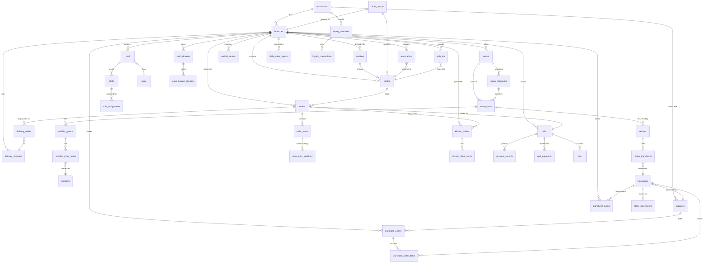

# ERD and Database Schema — Restaurant Management System

## Introduction

This document describes the complete entity-relationship model and database schema for the Restaurant
Management System (RMS). The system is designed around a **multi-restaurant, multi-branch** architecture,
allowing a single deployment to serve multiple restaurant brands, each with any number of physical or
virtual branches. Every branch operates as an isolated unit with its own menus, staff, inventory, and
financial records, while restaurant-level entities such as suppliers and loyalty programmes span all branches.

The primary data store is **PostgreSQL 15+**, chosen for its robust support for JSONB columns, array types,
range partitioning, row-level security (RLS), and generated columns. All primary keys use **UUID v4** values
produced by `gen_random_uuid()`, ensuring globally unique identifiers that are safe to generate outside the
database and compatible with distributed ingestion pipelines.

Every mutable row carries a soft-delete column `deleted_at TIMESTAMPTZ` — `NULL` meaning the record is live
and a non-NULL timestamp meaning it has been logically removed. Partial indexes that filter `WHERE deleted_at
IS NULL` keep live-record queries fast without scanning tombstoned rows.

Optimistic concurrency control is implemented via integer `version` columns on high-contention tables such as
`orders`, `bills`, and `ingredient_stocks`. Application code increments the version on every `UPDATE` and
includes a `WHERE version = $expected` predicate; a zero-row result signals a concurrent modification.

All `TIMESTAMPTZ` values are stored in **UTC** and converted to the branch's configured `timezone` at the
presentation layer. Business dates (e.g. `reservation_date`, `report_date`) are stored as plain `DATE` values
interpreted in the branch timezone.

**JSONB columns** are used for flexible, schema-free metadata — printer configuration, delivery channel
webhook payloads, and loyalty campaign rules — avoiding costly ALTER TABLE operations as requirements evolve.

**Row-level security policies** enforce branch isolation at the database layer: application roles are bound to
a `current_setting('app.current_branch_id')` session variable, and each RLS policy restricts SELECT/INSERT/
UPDATE/DELETE to rows whose `branch_id` matches that variable.

---

## Entity Relationship Diagram



---

## Table Definitions

### 1. restaurants

The `restaurants` table is the top-level tenant entity. Each row represents a distinct restaurant brand
that may operate across one or more physical branches. Restaurant-level configuration such as currency,
timezone default, and legal tax ID is stored here and inherited by branches unless overridden.

| Column Name    | Data Type          | Constraints                                              | Description                                          |
|----------------|--------------------|----------------------------------------------------------|------------------------------------------------------|
| id             | UUID               | PRIMARY KEY DEFAULT gen_random_uuid()                    | Globally unique restaurant identifier                |
| name           | VARCHAR(200)       | NOT NULL                                                 | Legal or trading name of the restaurant              |
| description    | TEXT               |                                                          | Public-facing description                            |
| logo_url       | VARCHAR(500)       |                                                          | URL to the brand logo asset                          |
| cuisine_type   | VARCHAR(100)       |                                                          | Primary cuisine classification                       |
| tax_id         | VARCHAR(50)        |                                                          | Government-issued tax or business registration number|
| address_line1  | VARCHAR(200)       | NOT NULL                                                 | Registered head-office street address                |
| address_line2  | VARCHAR(200)       |                                                          | Suite, floor, or unit                                |
| city           | VARCHAR(100)       | NOT NULL                                                 | City of registered address                           |
| state          | VARCHAR(100)       |                                                          | State or province                                    |
| country        | VARCHAR(100)       | NOT NULL                                                 | ISO country name                                     |
| postal_code    | VARCHAR(20)        |                                                          | Postal or ZIP code                                   |
| phone          | VARCHAR(30)        |                                                          | Primary contact telephone                            |
| email          | VARCHAR(200)       |                                                          | Primary contact email                                |
| website        | VARCHAR(300)       |                                                          | Public website URL                                   |
| currency       | CHAR(3)            | NOT NULL DEFAULT 'USD'                                   | ISO 4217 default currency code                       |
| timezone       | VARCHAR(50)        | NOT NULL DEFAULT 'UTC'                                   | IANA timezone identifier                             |
| status         | VARCHAR(20)        | NOT NULL DEFAULT 'active' CHECK IN ('active','inactive','suspended') | Operational status          |
| created_at     | TIMESTAMPTZ        | NOT NULL DEFAULT NOW()                                   | Row creation timestamp (UTC)                         |
| updated_at     | TIMESTAMPTZ        | NOT NULL DEFAULT NOW()                                   | Last modification timestamp (UTC)                    |
| deleted_at     | TIMESTAMPTZ        |                                                          | Soft-delete timestamp; NULL means active             |

#### Indexes
- `restaurants_pkey` — PRIMARY KEY on `(id)`
- `idx_restaurants_status` — BTREE on `(status)` WHERE `deleted_at IS NULL`
- `idx_restaurants_deleted_at` — BTREE on `(deleted_at)` WHERE `deleted_at IS NOT NULL`

#### Foreign Keys
- None (top-level entity)

---

### 2. branches

A `branch` is a single physical or virtual operating location belonging to a restaurant. Branches inherit
the restaurant's currency and default timezone but may override tax rates, service charges, and operating
hours. Each branch has an isolated staff roster, menu set, and inventory.

| Column Name           | Data Type      | Constraints                                  | Description                                              |
|-----------------------|----------------|----------------------------------------------|----------------------------------------------------------|
| id                    | UUID           | PRIMARY KEY DEFAULT gen_random_uuid()        | Unique branch identifier                                 |
| restaurant_id         | UUID           | NOT NULL REFERENCES restaurants(id)          | Owning restaurant                                        |
| name                  | VARCHAR(200)   | NOT NULL                                     | Branch display name                                      |
| branch_code           | VARCHAR(20)    | NOT NULL UNIQUE                              | Short alphanumeric code used in order numbers            |
| address_line1         | VARCHAR(200)   | NOT NULL                                     | Street address                                           |
| city                  | VARCHAR(100)   | NOT NULL                                     | City                                                     |
| state                 | VARCHAR(100)   |                                              | State or province                                        |
| phone                 | VARCHAR(30)    |                                              | Branch telephone number                                  |
| email                 | VARCHAR(200)   |                                              | Branch contact email                                     |
| manager_id            | UUID           | REFERENCES staff(id)                         | Current branch manager (nullable until first staff added)|
| tax_rate              | NUMERIC(5,4)   | NOT NULL DEFAULT 0                           | Decimal tax rate, e.g. 0.0825 for 8.25%                  |
| service_charge_rate   | NUMERIC(5,4)   | NOT NULL DEFAULT 0                           | Decimal service charge rate                              |
| status                | VARCHAR(20)    | NOT NULL DEFAULT 'active'                    | Operational status                                       |
| opening_time          | TIME           |                                              | Default daily opening time (branch timezone)             |
| closing_time          | TIME           |                                              | Default daily closing time (branch timezone)             |
| seating_capacity      | INTEGER        | NOT NULL DEFAULT 0                           | Maximum simultaneous covers                              |
| is_delivery_enabled   | BOOLEAN        | NOT NULL DEFAULT FALSE                       | Whether delivery orders are accepted                     |
| delivery_radius_km    | NUMERIC(6,2)   |                                              | Maximum delivery radius in kilometres                    |
| created_at            | TIMESTAMPTZ    | NOT NULL DEFAULT NOW()                       | Row creation timestamp                                   |
| updated_at            | TIMESTAMPTZ    | NOT NULL DEFAULT NOW()                       | Last modification timestamp                              |

#### Indexes
- `branches_pkey` — PRIMARY KEY on `(id)`
- `idx_branches_restaurant_id` — BTREE on `(restaurant_id)`
- `idx_branches_branch_code` — UNIQUE BTREE on `(branch_code)`
- `idx_branches_status` — BTREE on `(status)`

#### Foreign Keys
- `fk_branches_restaurant` — `restaurant_id` → `restaurants(id)` ON DELETE RESTRICT
- `fk_branches_manager` — `manager_id` → `staff(id)` ON DELETE SET NULL

---

### 3. tables

Each row represents a physical dining table within a branch. Tables carry floor-plan coordinates
(`pos_x`, `pos_y`) used by the front-of-house layout editor, and a `status` that the POS updates
in real time. QR codes link guests to digital menus or self-ordering flows.

| Column Name    | Data Type      | Constraints                                                                              | Description                                           |
|----------------|----------------|------------------------------------------------------------------------------------------|-------------------------------------------------------|
| id             | UUID           | PRIMARY KEY DEFAULT gen_random_uuid()                                                    | Unique table identifier                               |
| branch_id      | UUID           | NOT NULL REFERENCES branches(id)                                                         | Owning branch                                         |
| section_id     | UUID           | REFERENCES sections(id)                                                                  | Optional seating section/zone                         |
| table_number   | VARCHAR(20)    | NOT NULL                                                                                 | Printed table number or label                         |
| display_name   | VARCHAR(50)    |                                                                                          | Friendly name shown in UI                             |
| capacity       | INTEGER        | NOT NULL                                                                                 | Maximum number of seated guests                       |
| min_capacity   | INTEGER        | NOT NULL DEFAULT 1                                                                       | Minimum recommended covers                            |
| shape          | VARCHAR(20)    | DEFAULT 'rectangle' CHECK IN ('rectangle','circle','square','oval')                      | Table shape for layout rendering                      |
| width_cm       | INTEGER        |                                                                                          | Physical width in centimetres                         |
| height_cm      | INTEGER        |                                                                                          | Physical depth/height in centimetres                  |
| pos_x          | NUMERIC(8,2)   |                                                                                          | X coordinate on floor plan canvas                     |
| pos_y          | NUMERIC(8,2)   |                                                                                          | Y coordinate on floor plan canvas                     |
| qr_code        | VARCHAR(500)   |                                                                                          | QR code URL or encoded payload                        |
| status         | VARCHAR(20)    | NOT NULL DEFAULT 'available' CHECK IN ('available','reserved','occupied','cleaning','blocked','merged') | Real-time table state |
| is_combinable  | BOOLEAN        | NOT NULL DEFAULT TRUE                                                                    | Whether the table may be merged with adjacent tables  |
| created_at     | TIMESTAMPTZ    | NOT NULL DEFAULT NOW()                                                                   | Row creation timestamp                                |
| updated_at     | TIMESTAMPTZ    | NOT NULL DEFAULT NOW()                                                                   | Last modification timestamp                           |

#### Indexes
- `tables_pkey` — PRIMARY KEY on `(id)`
- `idx_tables_branch_id` — BTREE on `(branch_id)`
- `idx_tables_section_id` — BTREE on `(section_id)`
- `idx_tables_status` — BTREE on `(status)` WHERE `status != 'blocked'`
- `idx_tables_branch_status` — BTREE on `(branch_id, status)`

#### Foreign Keys
- `fk_tables_branch` — `branch_id` → `branches(id)` ON DELETE RESTRICT
- `fk_tables_section` — `section_id` → `sections(id)` ON DELETE SET NULL

---

### 4. menus

A `menu` groups items served during a specific service period or occasion. A branch may have multiple
concurrent menus (e.g. a breakfast menu and an all-day drinks menu). `valid_from` and `valid_until`
allow seasonal menus to be scheduled in advance and automatically deactivated.

| Column Name    | Data Type      | Constraints                                                                                         | Description                                      |
|----------------|----------------|-----------------------------------------------------------------------------------------------------|--------------------------------------------------|
| id             | UUID           | PRIMARY KEY DEFAULT gen_random_uuid()                                                               | Unique menu identifier                           |
| branch_id      | UUID           | NOT NULL REFERENCES branches(id)                                                                    | Branch that serves this menu                     |
| name           | VARCHAR(200)   | NOT NULL                                                                                            | Menu display name                                |
| description    | TEXT           |                                                                                                     | Guest-facing description                         |
| menu_type      | VARCHAR(30)    | NOT NULL CHECK IN ('breakfast','lunch','dinner','all_day','seasonal','special')                     | Service period classification                    |
| is_active      | BOOLEAN        | NOT NULL DEFAULT TRUE                                                                               | Whether the menu is currently served             |
| valid_from     | DATE           |                                                                                                     | First date on which the menu is available        |
| valid_until    | DATE           |                                                                                                     | Last date on which the menu is available         |
| display_order  | INTEGER        | NOT NULL DEFAULT 0                                                                                  | Sort order in menu picker UI                     |
| created_at     | TIMESTAMPTZ    | NOT NULL DEFAULT NOW()                                                                              | Row creation timestamp                           |
| updated_at     | TIMESTAMPTZ    | NOT NULL DEFAULT NOW()                                                                              | Last modification timestamp                      |

#### Indexes
- `menus_pkey` — PRIMARY KEY on `(id)`
- `idx_menus_branch_id` — BTREE on `(branch_id)`
- `idx_menus_branch_active` — BTREE on `(branch_id, is_active)` WHERE `is_active = TRUE`
- `idx_menus_valid_dates` — BTREE on `(valid_from, valid_until)` WHERE `valid_until IS NOT NULL`

#### Foreign Keys
- `fk_menus_branch` — `branch_id` → `branches(id)` ON DELETE RESTRICT

---

### 5. menu_items

`menu_items` are the individually orderable dishes, drinks, and packaged goods on a menu. Each item
may belong to a category for display grouping and carry allergen, dietary, and nutritional metadata.
Pricing is stored as an absolute monetary value in the restaurant's default currency; currency overrides
at item level support multi-currency menus.

| Column Name                 | Data Type      | Constraints                                           | Description                                               |
|-----------------------------|----------------|-------------------------------------------------------|-----------------------------------------------------------|
| id                          | UUID           | PRIMARY KEY DEFAULT gen_random_uuid()                 | Unique item identifier                                    |
| menu_id                     | UUID           | NOT NULL REFERENCES menus(id)                         | Parent menu                                               |
| category_id                 | UUID           | REFERENCES menu_categories(id)                        | Display category                                          |
| name                        | VARCHAR(200)   | NOT NULL                                              | Item name shown to guests                                 |
| description                 | TEXT           |                                                       | Ingredients summary or chef's note                        |
| price                       | NUMERIC(10,2)  | NOT NULL                                              | Base selling price                                        |
| currency                    | CHAR(3)        | NOT NULL DEFAULT 'USD'                                | ISO 4217 price currency                                   |
| is_available                | BOOLEAN        | NOT NULL DEFAULT TRUE                                 | Whether the item can currently be ordered                 |
| is_vegetarian               | BOOLEAN        | NOT NULL DEFAULT FALSE                                | Vegetarian dietary flag                                   |
| is_vegan                    | BOOLEAN        | NOT NULL DEFAULT FALSE                                | Vegan dietary flag                                        |
| is_gluten_free              | BOOLEAN        | NOT NULL DEFAULT FALSE                                | Gluten-free dietary flag                                  |
| allergens                   | TEXT[]         |                                                       | Array of allergen names                                   |
| calories                    | INTEGER        |                                                       | Caloric value (kcal)                                      |
| preparation_time_minutes    | INTEGER        |                                                       | Expected kitchen preparation time                         |
| image_url                   | VARCHAR(500)   |                                                       | Item photo URL                                            |
| display_order               | INTEGER        | NOT NULL DEFAULT 0                                    | Sort order within category                                |
| tax_category                | VARCHAR(50)    |                                                       | Tax classification code for tax engine                    |
| sku                         | VARCHAR(100)   | UNIQUE                                                | Stock-keeping unit for inventory linkage                  |
| created_at                  | TIMESTAMPTZ    | NOT NULL DEFAULT NOW()                                | Row creation timestamp                                    |
| updated_at                  | TIMESTAMPTZ    | NOT NULL DEFAULT NOW()                                | Last modification timestamp                               |

#### Indexes
- `menu_items_pkey` — PRIMARY KEY on `(id)`
- `idx_menu_items_menu_id` — BTREE on `(menu_id)`
- `idx_menu_items_category_id` — BTREE on `(category_id)`
- `idx_menu_items_available` — BTREE on `(menu_id, is_available)` WHERE `is_available = TRUE`
- `idx_menu_items_sku` — UNIQUE BTREE on `(sku)` WHERE `sku IS NOT NULL`
- `idx_menu_items_allergens` — GIN on `(allergens)`

#### Foreign Keys
- `fk_menu_items_menu` — `menu_id` → `menus(id)` ON DELETE CASCADE
- `fk_menu_items_category` — `category_id` → `menu_categories(id)` ON DELETE SET NULL

---

### 6. orders

`orders` is the central transactional table. It captures the lifecycle of every customer order from
initial draft through kitchen preparation to billing. The `status` column drives the order workflow
state machine; the POS, KDS, and billing modules each respond to specific status transitions. The
`source` field distinguishes orders originating from the in-house POS, self-service kiosk, online
ordering portal, or third-party delivery aggregators.

| Column Name              | Data Type      | Constraints                                                                                                              | Description                                           |
|--------------------------|----------------|--------------------------------------------------------------------------------------------------------------------------|-------------------------------------------------------|
| id                       | UUID           | PRIMARY KEY DEFAULT gen_random_uuid()                                                                                    | Unique order identifier                               |
| branch_id                | UUID           | NOT NULL REFERENCES branches(id)                                                                                         | Branch where the order was placed                     |
| table_id                 | UUID           | REFERENCES tables(id)                                                                                                    | Table for dine-in orders; NULL for takeaway/delivery  |
| staff_id                 | UUID           | REFERENCES staff(id)                                                                                                     | Staff member who created the order                    |
| order_number             | VARCHAR(30)    | NOT NULL UNIQUE                                                                                                          | Human-readable order reference (e.g. BR01-0042)       |
| order_type               | VARCHAR(20)    | NOT NULL CHECK IN ('dine_in','takeaway','delivery')                                                                      | Order fulfilment type                                 |
| status                   | VARCHAR(30)    | NOT NULL DEFAULT 'draft' CHECK IN ('draft','submitted','confirmed','in_preparation','ready','served','billed','completed','cancelled','void') | Workflow state |
| source                   | VARCHAR(30)    | NOT NULL DEFAULT 'pos'                                                                                                   | Order channel (pos, kiosk, online, delivery_app)      |
| covers                   | INTEGER        | NOT NULL DEFAULT 1                                                                                                       | Number of guests                                      |
| notes                    | TEXT           |                                                                                                                          | General order-level notes                             |
| total_amount             | NUMERIC(12,2)  | NOT NULL DEFAULT 0                                                                                                       | Calculated order total                                |
| discount_amount          | NUMERIC(12,2)  | NOT NULL DEFAULT 0                                                                                                       | Total discounts applied                               |
| tax_amount               | NUMERIC(12,2)  | NOT NULL DEFAULT 0                                                                                                       | Tax charged on this order                             |
| service_charge_amount    | NUMERIC(12,2)  | NOT NULL DEFAULT 0                                                                                                       | Service charge applied                                |
| submitted_at             | TIMESTAMPTZ    |                                                                                                                          | When the order was sent to the kitchen                |
| confirmed_at             | TIMESTAMPTZ    |                                                                                                                          | When kitchen acknowledged the order                   |
| completed_at             | TIMESTAMPTZ    |                                                                                                                          | When all items were served                            |
| cancelled_at             | TIMESTAMPTZ    |                                                                                                                          | When the order was cancelled                          |
| created_at               | TIMESTAMPTZ    | NOT NULL DEFAULT NOW()                                                                                                   | Row creation timestamp                                |
| updated_at               | TIMESTAMPTZ    | NOT NULL DEFAULT NOW()                                                                                                   | Last modification timestamp                           |

#### Indexes
- `orders_pkey` — PRIMARY KEY on `(id)`
- `idx_orders_branch_id` — BTREE on `(branch_id)`
- `idx_orders_table_id` — BTREE on `(table_id)` WHERE `table_id IS NOT NULL`
- `idx_orders_status` — BTREE on `(status)` WHERE `status NOT IN ('completed','cancelled','void')`
- `idx_orders_created_at` — BRIN on `(created_at)` — efficient for range scans on append-only data
- `idx_orders_order_number` — UNIQUE BTREE on `(order_number)`
- `idx_orders_branch_status` — BTREE on `(branch_id, status, created_at DESC)`

#### Foreign Keys
- `fk_orders_branch` — `branch_id` → `branches(id)` ON DELETE RESTRICT
- `fk_orders_table` — `table_id` → `tables(id)` ON DELETE SET NULL
- `fk_orders_staff` — `staff_id` → `staff(id)` ON DELETE SET NULL

---

### 7. order_items

`order_items` records each distinct line within an order. A single menu item may appear as multiple
rows if ordered at different times or with different customisations. The `course_number` field supports
multi-course service sequencing; the kitchen uses it to pace ticket creation. A `status` column mirrors
the kitchen preparation state so the POS can track individual item progress.

| Column Name        | Data Type      | Constraints                                                                                         | Description                                           |
|--------------------|----------------|-----------------------------------------------------------------------------------------------------|-------------------------------------------------------|
| id                 | UUID           | PRIMARY KEY DEFAULT gen_random_uuid()                                                               | Unique line-item identifier                           |
| order_id           | UUID           | NOT NULL REFERENCES orders(id)                                                                      | Parent order                                          |
| menu_item_id       | UUID           | NOT NULL REFERENCES menu_items(id)                                                                  | Ordered item                                          |
| quantity           | INTEGER        | NOT NULL DEFAULT 1 CHECK (quantity > 0)                                                             | Number of portions                                    |
| unit_price         | NUMERIC(10,2)  | NOT NULL                                                                                            | Price per unit at time of order                       |
| discount_amount    | NUMERIC(10,2)  | NOT NULL DEFAULT 0                                                                                  | Line-level discount                                   |
| notes              | TEXT           |                                                                                                     | Special preparation instructions                      |
| course_number      | INTEGER        | NOT NULL DEFAULT 1                                                                                  | Service course (1=starter, 2=main, 3=dessert, etc.)   |
| status             | VARCHAR(30)    | NOT NULL DEFAULT 'pending' CHECK IN ('pending','sent_to_kitchen','in_preparation','ready','served','voided') | Item preparation state          |
| kitchen_station    | VARCHAR(50)    |                                                                                                     | Target kitchen station (hot, cold, bar, pastry)       |
| created_at         | TIMESTAMPTZ    | NOT NULL DEFAULT NOW()                                                                              | Row creation timestamp                                |
| updated_at         | TIMESTAMPTZ    | NOT NULL DEFAULT NOW()                                                                              | Last modification timestamp                           |

#### Indexes
- `order_items_pkey` — PRIMARY KEY on `(id)`
- `idx_order_items_order_id` — BTREE on `(order_id)`
- `idx_order_items_menu_item_id` — BTREE on `(menu_item_id)`
- `idx_order_items_status` — BTREE on `(status)` WHERE `status NOT IN ('served','voided')`

#### Foreign Keys
- `fk_order_items_order` — `order_id` → `orders(id)` ON DELETE CASCADE
- `fk_order_items_menu_item` — `menu_item_id` → `menu_items(id)` ON DELETE RESTRICT

---

### 8. kitchen_tickets

Kitchen tickets are discrete work units sent to a kitchen display system (KDS) or printed to a kitchen
printer. Each ticket targets a specific station (e.g. `hot`, `cold`, `bar`) and carries a `priority`
that the KDS uses to reorder the queue. Time-stamps on `accepted_at`, `started_at`, and `completed_at`
feed the kitchen performance analytics engine, producing average ticket times by station and day-part.

| Column Name        | Data Type      | Constraints                                                                                                      | Description                                              |
|--------------------|----------------|------------------------------------------------------------------------------------------------------------------|----------------------------------------------------------|
| id                 | UUID           | PRIMARY KEY DEFAULT gen_random_uuid()                                                                            | Unique ticket identifier                                 |
| order_id           | UUID           | NOT NULL REFERENCES orders(id)                                                                                   | Source order                                             |
| branch_id          | UUID           | NOT NULL REFERENCES branches(id)                                                                                 | Branch (denormalised for partition pruning)              |
| station_id         | VARCHAR(50)    | NOT NULL                                                                                                         | Target kitchen station identifier                        |
| ticket_number      | VARCHAR(30)    | NOT NULL                                                                                                         | Display number shown on KDS                              |
| priority           | VARCHAR(20)    | NOT NULL DEFAULT 'normal' CHECK IN ('low','normal','high','urgent')                                              | Queue priority                                           |
| status             | VARCHAR(30)    | NOT NULL DEFAULT 'pending' CHECK IN ('pending','accepted','in_preparation','ready','bumped','completed','cancelled') | Ticket lifecycle state                               |
| estimated_minutes  | INTEGER        |                                                                                                                  | Estimated preparation time                               |
| accepted_at        | TIMESTAMPTZ    |                                                                                                                  | When a cook accepted the ticket                          |
| started_at         | TIMESTAMPTZ    |                                                                                                                  | When cooking began                                       |
| completed_at       | TIMESTAMPTZ    |                                                                                                                  | When all items on the ticket were ready                  |
| bumped_at          | TIMESTAMPTZ    |                                                                                                                  | When the ticket was bumped (dismissed) from the KDS      |
| created_at         | TIMESTAMPTZ    | NOT NULL DEFAULT NOW()                                                                                           | Row creation timestamp                                   |
| updated_at         | TIMESTAMPTZ    | NOT NULL DEFAULT NOW()                                                                                           | Last modification timestamp                              |

#### Indexes
- `kitchen_tickets_pkey` — PRIMARY KEY on `(id)`
- `idx_kitchen_tickets_order_id` — BTREE on `(order_id)`
- `idx_kitchen_tickets_branch_id_status` — BTREE on `(branch_id, status)` WHERE `status NOT IN ('completed','cancelled')`
- `idx_kitchen_tickets_station_id_status` — BTREE on `(station_id, status, created_at)`

#### Foreign Keys
- `fk_kitchen_tickets_order` — `order_id` → `orders(id)` ON DELETE CASCADE
- `fk_kitchen_tickets_branch` — `branch_id` → `branches(id)` ON DELETE RESTRICT

---

### 9. bills

A bill is generated from an order when the guest requests to pay. The `status` column models the
payment lifecycle: a bill moves from `draft` to `issued` when printed, then to `partially_paid`,
`paid`, or `voided`. Bills support splitting (via `split_payments`) and tips (via `tips`). Once a
bill is marked `paid`, all amounts are frozen and the associated order is marked `completed`.

| Column Name         | Data Type      | Constraints                                                                               | Description                                          |
|---------------------|----------------|-------------------------------------------------------------------------------------------|------------------------------------------------------|
| id                  | UUID           | PRIMARY KEY DEFAULT gen_random_uuid()                                                     | Unique bill identifier                               |
| order_id            | UUID           | NOT NULL UNIQUE REFERENCES orders(id)                                                     | One-to-one link to the source order                  |
| branch_id           | UUID           | NOT NULL REFERENCES branches(id)                                                          | Branch (denormalised for RLS and reporting)          |
| bill_number         | VARCHAR(30)    | NOT NULL UNIQUE                                                                           | Human-readable bill reference                        |
| subtotal            | NUMERIC(12,2)  | NOT NULL                                                                                  | Sum of item prices before tax/discounts              |
| discount_amount     | NUMERIC(12,2)  | NOT NULL DEFAULT 0                                                                        | Total promotional discounts                          |
| tax_amount          | NUMERIC(12,2)  | NOT NULL DEFAULT 0                                                                        | Tax charged                                          |
| service_charge      | NUMERIC(12,2)  | NOT NULL DEFAULT 0                                                                        | Mandatory service charge                             |
| tip_amount          | NUMERIC(12,2)  | NOT NULL DEFAULT 0                                                                        | Voluntary gratuity                                   |
| total_amount        | NUMERIC(12,2)  | NOT NULL                                                                                  | Grand total payable                                  |
| status              | VARCHAR(20)    | NOT NULL DEFAULT 'draft' CHECK IN ('draft','issued','partially_paid','paid','voided','refunded') | Payment lifecycle state               |
| issued_at           | TIMESTAMPTZ    |                                                                                           | When the bill was presented to the guest             |
| paid_at             | TIMESTAMPTZ    |                                                                                           | When full payment was received                       |
| voided_at           | TIMESTAMPTZ    |                                                                                           | When the bill was voided                             |
| created_at          | TIMESTAMPTZ    | NOT NULL DEFAULT NOW()                                                                    | Row creation timestamp                               |
| updated_at          | TIMESTAMPTZ    | NOT NULL DEFAULT NOW()                                                                    | Last modification timestamp                          |

#### Indexes
- `bills_pkey` — PRIMARY KEY on `(id)`
- `idx_bills_order_id` — UNIQUE BTREE on `(order_id)`
- `idx_bills_branch_id` — BTREE on `(branch_id)`
- `idx_bills_status` — BTREE on `(status)` WHERE `status NOT IN ('paid','voided','refunded')`
- `idx_bills_bill_number` — UNIQUE BTREE on `(bill_number)`

#### Foreign Keys
- `fk_bills_order` — `order_id` → `orders(id)` ON DELETE RESTRICT
- `fk_bills_branch` — `branch_id` → `branches(id)` ON DELETE RESTRICT

---

### 10. payment_records

`payment_records` stores every individual payment transaction against a bill. A single bill may have
multiple payment records (e.g. split between cash and card, or a partial payment followed by a
top-up). Each record captures the payment method, external provider reference, and processing status.
Failed transactions are retained for audit and retry purposes.

| Column Name              | Data Type      | Constraints                                                                                                           | Description                                              |
|--------------------------|----------------|-----------------------------------------------------------------------------------------------------------------------|----------------------------------------------------------|
| id                       | UUID           | PRIMARY KEY DEFAULT gen_random_uuid()                                                                                 | Unique payment record identifier                         |
| bill_id                  | UUID           | NOT NULL REFERENCES bills(id)                                                                                         | Bill being paid                                          |
| payment_method           | VARCHAR(30)    | NOT NULL CHECK IN ('cash','credit_card','debit_card','digital_wallet','voucher','loyalty_points','house_account')     | Payment instrument                                       |
| amount                   | NUMERIC(12,2)  | NOT NULL                                                                                                              | Amount tendered                                          |
| currency                 | CHAR(3)        | NOT NULL DEFAULT 'USD'                                                                                                | ISO 4217 currency code                                   |
| reference_number         | VARCHAR(100)   |                                                                                                                       | POS or cashier reference                                 |
| provider_transaction_id  | VARCHAR(200)   |                                                                                                                       | Payment gateway transaction identifier                   |
| status                   | VARCHAR(20)    | NOT NULL DEFAULT 'pending' CHECK IN ('pending','authorized','captured','failed','refunded','voided')                  | Gateway processing status                                |
| processed_at             | TIMESTAMPTZ    |                                                                                                                       | When the payment was confirmed by the provider           |
| created_at               | TIMESTAMPTZ    | NOT NULL DEFAULT NOW()                                                                                                | Row creation timestamp                                   |
| updated_at               | TIMESTAMPTZ    | NOT NULL DEFAULT NOW()                                                                                                | Last modification timestamp                              |

#### Indexes
- `payment_records_pkey` — PRIMARY KEY on `(id)`
- `idx_payment_records_bill_id` — BTREE on `(bill_id)`
- `idx_payment_records_status` — BTREE on `(status)` WHERE `status IN ('pending','authorized')`
- `idx_payment_records_provider_txn` — BTREE on `(provider_transaction_id)` WHERE `provider_transaction_id IS NOT NULL`

#### Foreign Keys
- `fk_payment_records_bill` — `bill_id` → `bills(id)` ON DELETE RESTRICT

---

### 11. reservations

Reservations allow guests to pre-book a table for a specific date, time, and party size. The
`confirmation_code` is a short alphanumeric string sent to the guest for self-service management.
Duration defaults to 90 minutes but can be extended for events. Cancellations and no-shows are
tracked for yield management and guest history analysis.

| Column Name         | Data Type      | Constraints                                                                                                        | Description                                              |
|---------------------|----------------|--------------------------------------------------------------------------------------------------------------------|----------------------------------------------------------|
| id                  | UUID           | PRIMARY KEY DEFAULT gen_random_uuid()                                                                              | Unique reservation identifier                            |
| branch_id           | UUID           | NOT NULL REFERENCES branches(id)                                                                                   | Branch where the reservation is made                     |
| table_id            | UUID           | REFERENCES tables(id)                                                                                              | Pre-assigned table; may be NULL until day-of assignment  |
| customer_name       | VARCHAR(200)   | NOT NULL                                                                                                           | Guest name                                               |
| customer_phone      | VARCHAR(30)    |                                                                                                                    | Contact phone number                                     |
| customer_email      | VARCHAR(200)   |                                                                                                                    | Contact email address                                    |
| party_size          | INTEGER        | NOT NULL CHECK (party_size > 0)                                                                                    | Number of guests                                         |
| reservation_date    | DATE           | NOT NULL                                                                                                           | Booked date (branch timezone)                            |
| reservation_time    | TIME           | NOT NULL                                                                                                           | Booked arrival time (branch timezone)                    |
| duration_minutes    | INTEGER        | NOT NULL DEFAULT 90                                                                                                | Expected table occupancy duration                        |
| status              | VARCHAR(20)    | NOT NULL DEFAULT 'pending' CHECK IN ('pending','confirmed','arrived','seated','completed','cancelled','no_show')   | Reservation lifecycle state                              |
| special_requests    | TEXT           |                                                                                                                    | Dietary needs, celebrations, accessibility requirements  |
| confirmation_code   | VARCHAR(20)    | UNIQUE NOT NULL                                                                                                    | Guest-facing booking reference                           |
| created_at          | TIMESTAMPTZ    | NOT NULL DEFAULT NOW()                                                                                             | Row creation timestamp                                   |
| updated_at          | TIMESTAMPTZ    | NOT NULL DEFAULT NOW()                                                                                             | Last modification timestamp                              |

#### Indexes
- `reservations_pkey` — PRIMARY KEY on `(id)`
- `idx_reservations_branch_id_date` — BTREE on `(branch_id, reservation_date)`
- `idx_reservations_confirmation_code` — UNIQUE BTREE on `(confirmation_code)`
- `idx_reservations_table_id` — BTREE on `(table_id)` WHERE `table_id IS NOT NULL`
- `idx_reservations_status` — BTREE on `(status)` WHERE `status IN ('pending','confirmed','arrived')`

#### Foreign Keys
- `fk_reservations_branch` — `branch_id` → `branches(id)` ON DELETE RESTRICT
- `fk_reservations_table` — `table_id` → `tables(id)` ON DELETE SET NULL

---

### 12. ingredients

The `ingredients` table is the master inventory catalogue for a branch. Each ingredient is measured
in a defined unit of measure (e.g. `kg`, `litre`, `unit`) and tracks real-time stock levels alongside
reorder thresholds. The `cost_per_unit` drives food-cost calculations in recipe costing reports. An
ingredient belongs to at most one primary supplier for automated purchase order generation.

| Column Name        | Data Type      | Constraints                                      | Description                                               |
|--------------------|----------------|--------------------------------------------------|-----------------------------------------------------------|
| id                 | UUID           | PRIMARY KEY DEFAULT gen_random_uuid()            | Unique ingredient identifier                              |
| branch_id          | UUID           | NOT NULL REFERENCES branches(id)                 | Branch that holds this stock record                       |
| name               | VARCHAR(200)   | NOT NULL                                         | Ingredient name                                           |
| description        | TEXT           |                                                  | Additional details or specification                       |
| unit_of_measure    | VARCHAR(30)    | NOT NULL                                         | Base unit (kg, litre, unit, portion, etc.)                |
| cost_per_unit      | NUMERIC(10,4)  | NOT NULL DEFAULT 0                               | Weighted average cost per unit                            |
| current_stock      | NUMERIC(12,3)  | NOT NULL DEFAULT 0                               | Live on-hand quantity                                     |
| minimum_stock      | NUMERIC(12,3)  | NOT NULL DEFAULT 0                               | Safety stock floor                                        |
| maximum_stock      | NUMERIC(12,3)  |                                                  | Maximum storage capacity                                  |
| reorder_point      | NUMERIC(12,3)  | NOT NULL DEFAULT 0                               | Stock level that triggers a purchase order alert          |
| category           | VARCHAR(100)   |                                                  | Ingredient category (dairy, produce, dry goods, etc.)     |
| supplier_id        | UUID           | REFERENCES suppliers(id)                         | Preferred primary supplier                                |
| is_active          | BOOLEAN        | NOT NULL DEFAULT TRUE                            | Whether the ingredient is currently used                  |
| created_at         | TIMESTAMPTZ    | NOT NULL DEFAULT NOW()                           | Row creation timestamp                                    |
| updated_at         | TIMESTAMPTZ    | NOT NULL DEFAULT NOW()                           | Last modification timestamp                               |

#### Indexes
- `ingredients_pkey` — PRIMARY KEY on `(id)`
- `idx_ingredients_branch_id` — BTREE on `(branch_id)`
- `idx_ingredients_supplier_id` — BTREE on `(supplier_id)` WHERE `supplier_id IS NOT NULL`
- `idx_ingredients_low_stock` — BTREE on `(branch_id, current_stock, reorder_point)` WHERE `is_active = TRUE`

#### Foreign Keys
- `fk_ingredients_branch` — `branch_id` → `branches(id)` ON DELETE RESTRICT
- `fk_ingredients_supplier` — `supplier_id` → `suppliers(id)` ON DELETE SET NULL

---

### 13. staff

`staff` holds the employee records for each branch. Authentication uses a hashed PIN code for POS
terminal login; full identity management (password, MFA) is handled by the IAM service and linked
via the `id` UUID. The `role_id` controls which POS and back-office permissions the staff member
holds. Terminated employees are soft-retained for audit trail continuity.

| Column Name         | Data Type      | Constraints                                                                         | Description                                           |
|---------------------|----------------|-------------------------------------------------------------------------------------|-------------------------------------------------------|
| id                  | UUID           | PRIMARY KEY DEFAULT gen_random_uuid()                                               | Unique staff identifier                               |
| branch_id           | UUID           | NOT NULL REFERENCES branches(id)                                                    | Primary branch of employment                          |
| role_id             | UUID           | NOT NULL REFERENCES roles(id)                                                       | Assigned role (drives permissions)                    |
| first_name          | VARCHAR(100)   | NOT NULL                                                                            | Given name                                            |
| last_name           | VARCHAR(100)   | NOT NULL                                                                            | Family name                                           |
| email               | VARCHAR(200)   | UNIQUE                                                                              | Work email; used for notifications                    |
| phone               | VARCHAR(30)    |                                                                                     | Contact phone                                         |
| pin_code_hash       | VARCHAR(200)   |                                                                                     | bcrypt hash of POS PIN (never stored in plain text)   |
| hire_date           | DATE           | NOT NULL                                                                            | Employment start date                                 |
| termination_date    | DATE           |                                                                                     | Employment end date; NULL means currently employed    |
| status              | VARCHAR(20)    | NOT NULL DEFAULT 'active' CHECK IN ('active','inactive','on_leave','terminated')    | Employment status                                     |
| hourly_rate         | NUMERIC(8,2)   |                                                                                     | Pay rate for shift cost calculations                  |
| created_at          | TIMESTAMPTZ    | NOT NULL DEFAULT NOW()                                                              | Row creation timestamp                                |
| updated_at          | TIMESTAMPTZ    | NOT NULL DEFAULT NOW()                                                              | Last modification timestamp                           |

#### Indexes
- `staff_pkey` — PRIMARY KEY on `(id)`
- `idx_staff_branch_id` — BTREE on `(branch_id)`
- `idx_staff_email` — UNIQUE BTREE on `(email)` WHERE `email IS NOT NULL`
- `idx_staff_role_id` — BTREE on `(role_id)`
- `idx_staff_active` — BTREE on `(branch_id, status)` WHERE `status = 'active'`

#### Foreign Keys
- `fk_staff_branch` — `branch_id` → `branches(id)` ON DELETE RESTRICT
- `fk_staff_role` — `role_id` → `roles(id)` ON DELETE RESTRICT

---

### 14. suppliers

Suppliers are vendor companies that deliver raw ingredients and consumables to one or more branches.
They are defined at the restaurant level and shared across branches. `payment_terms` stores the
contractual payment window (e.g. `Net30`). `lead_time_days` feeds the automatic reorder calculation
to ensure purchase orders are raised sufficiently in advance of projected stock-out dates.

| Column Name      | Data Type      | Constraints                                                              | Description                                            |
|------------------|----------------|--------------------------------------------------------------------------|--------------------------------------------------------|
| id               | UUID           | PRIMARY KEY DEFAULT gen_random_uuid()                                    | Unique supplier identifier                             |
| restaurant_id    | UUID           | NOT NULL REFERENCES restaurants(id)                                      | Owning restaurant                                      |
| name             | VARCHAR(200)   | NOT NULL                                                                 | Supplier company name                                  |
| contact_name     | VARCHAR(200)   |                                                                          | Primary account manager name                           |
| phone            | VARCHAR(30)    |                                                                          | Contact telephone                                      |
| email            | VARCHAR(200)   |                                                                          | Contact email                                          |
| address          | TEXT           |                                                                          | Registered address                                     |
| payment_terms    | VARCHAR(100)   |                                                                          | Payment terms (e.g. Net30, COD)                        |
| lead_time_days   | INTEGER        | NOT NULL DEFAULT 1                                                       | Typical delivery lead time in calendar days            |
| status           | VARCHAR(20)    | NOT NULL DEFAULT 'active' CHECK IN ('active','inactive','blacklisted')   | Supplier relationship status                           |
| created_at       | TIMESTAMPTZ    | NOT NULL DEFAULT NOW()                                                   | Row creation timestamp                                 |
| updated_at       | TIMESTAMPTZ    | NOT NULL DEFAULT NOW()                                                   | Last modification timestamp                            |

#### Indexes
- `suppliers_pkey` — PRIMARY KEY on `(id)`
- `idx_suppliers_restaurant_id` — BTREE on `(restaurant_id)`
- `idx_suppliers_status` — BTREE on `(status)` WHERE `status = 'active'`

#### Foreign Keys
- `fk_suppliers_restaurant` — `restaurant_id` → `restaurants(id)` ON DELETE RESTRICT

---

### 15. purchase_orders

Purchase orders formalise requests to suppliers for ingredient restocking. The `status` workflow
tracks a PO from internal drafting, through management approval and supplier submission, to partial
and full goods receipt. Each PO is associated with a branch (the receiving location) and a supplier.
Cost totals are calculated by summing `purchase_order_items`.

| Column Name          | Data Type      | Constraints                                                                                             | Description                                              |
|----------------------|----------------|---------------------------------------------------------------------------------------------------------|----------------------------------------------------------|
| id                   | UUID           | PRIMARY KEY DEFAULT gen_random_uuid()                                                                   | Unique purchase order identifier                         |
| branch_id            | UUID           | NOT NULL REFERENCES branches(id)                                                                        | Receiving branch                                         |
| supplier_id          | UUID           | NOT NULL REFERENCES suppliers(id)                                                                       | Fulfilling supplier                                      |
| po_number            | VARCHAR(30)    | NOT NULL UNIQUE                                                                                         | Human-readable PO reference                              |
| status               | VARCHAR(20)    | NOT NULL DEFAULT 'draft' CHECK IN ('draft','submitted','approved','partially_received','received','closed','cancelled') | PO lifecycle state |
| total_amount         | NUMERIC(12,2)  | NOT NULL DEFAULT 0                                                                                      | Calculated total value                                   |
| ordered_at           | TIMESTAMPTZ    |                                                                                                         | When the PO was submitted to the supplier                |
| expected_delivery_at | TIMESTAMPTZ    |                                                                                                         | Expected goods receipt date/time                         |
| received_at          | TIMESTAMPTZ    |                                                                                                         | Actual goods receipt date/time                           |
| created_by           | UUID           | NOT NULL REFERENCES staff(id)                                                                           | Staff member who raised the PO                           |
| created_at           | TIMESTAMPTZ    | NOT NULL DEFAULT NOW()                                                                                  | Row creation timestamp                                   |
| updated_at           | TIMESTAMPTZ    | NOT NULL DEFAULT NOW()                                                                                  | Last modification timestamp                              |

#### Indexes
- `purchase_orders_pkey` — PRIMARY KEY on `(id)`
- `idx_purchase_orders_branch_id` — BTREE on `(branch_id)`
- `idx_purchase_orders_supplier_id` — BTREE on `(supplier_id)`
- `idx_purchase_orders_po_number` — UNIQUE BTREE on `(po_number)`
- `idx_purchase_orders_status` — BTREE on `(status)` WHERE `status NOT IN ('closed','cancelled')`

#### Foreign Keys
- `fk_purchase_orders_branch` — `branch_id` → `branches(id)` ON DELETE RESTRICT
- `fk_purchase_orders_supplier` — `supplier_id` → `suppliers(id)` ON DELETE RESTRICT
- `fk_purchase_orders_created_by` — `created_by` → `staff(id)` ON DELETE RESTRICT

---

### 16. loyalty_members

`loyalty_members` tracks guests enrolled in the restaurant's loyalty programme. Members accumulate
integer points from qualifying purchases; the `tier` is recalculated by a nightly job based on
`total_spent` thresholds. Points redemption is recorded in `loyalty_transactions` and deducted from
`points_balance`. Membership spans all branches of a restaurant, enabling guests to earn and redeem
at any location.

| Column Name           | Data Type      | Constraints                                                                       | Description                                              |
|-----------------------|----------------|-----------------------------------------------------------------------------------|----------------------------------------------------------|
| id                    | UUID           | PRIMARY KEY DEFAULT gen_random_uuid()                                             | Unique member identifier                                 |
| restaurant_id         | UUID           | NOT NULL REFERENCES restaurants(id)                                               | Loyalty programme owner                                  |
| customer_name         | VARCHAR(200)   | NOT NULL                                                                          | Member's full name                                       |
| phone                 | VARCHAR(30)    |                                                                                   | Contact and lookup phone number                          |
| email                 | VARCHAR(200)   |                                                                                   | Contact and lookup email                                 |
| tier                  | VARCHAR(20)    | NOT NULL DEFAULT 'bronze' CHECK IN ('bronze','silver','gold','platinum')          | Current membership tier                                  |
| points_balance        | INTEGER        | NOT NULL DEFAULT 0 CHECK (points_balance >= 0)                                   | Redeemable points balance                                |
| total_points_earned   | INTEGER        | NOT NULL DEFAULT 0                                                                | Lifetime points earned (never decremented)               |
| total_spent           | NUMERIC(14,2)  | NOT NULL DEFAULT 0                                                                | Lifetime net spend used for tier calculation             |
| joined_at             | TIMESTAMPTZ    | NOT NULL DEFAULT NOW()                                                            | Programme enrolment timestamp                            |
| last_activity_at      | TIMESTAMPTZ    |                                                                                   | Most recent earn or redeem activity                      |
| status                | VARCHAR(20)    | NOT NULL DEFAULT 'active' CHECK IN ('active','inactive','suspended')              | Membership status                                        |
| created_at            | TIMESTAMPTZ    | NOT NULL DEFAULT NOW()                                                            | Row creation timestamp                                   |
| updated_at            | TIMESTAMPTZ    | NOT NULL DEFAULT NOW()                                                            | Last modification timestamp                              |

#### Indexes
- `loyalty_members_pkey` — PRIMARY KEY on `(id)`
- `idx_loyalty_members_restaurant_id` — BTREE on `(restaurant_id)`
- `idx_loyalty_members_phone` — BTREE on `(restaurant_id, phone)` WHERE `phone IS NOT NULL`
- `idx_loyalty_members_email` — BTREE on `(restaurant_id, email)` WHERE `email IS NOT NULL`
- `idx_loyalty_members_tier` — BTREE on `(restaurant_id, tier)` WHERE `status = 'active'`

#### Foreign Keys
- `fk_loyalty_members_restaurant` — `restaurant_id` → `restaurants(id)` ON DELETE RESTRICT

---

### 17. delivery_orders

`delivery_orders` extends an order with delivery-specific logistics data when `order_type = 'delivery'`.
It links to a `delivery_channel` (own fleet, Uber Eats, DoorDash, etc.) and captures the external
aggregator's order ID for reconciliation. Driver assignment and real-time status updates arrive via
webhooks from the channel and are stored here for customer communication and SLA tracking.

| Column Name          | Data Type      | Constraints                                                                                                                    | Description                                              |
|----------------------|----------------|--------------------------------------------------------------------------------------------------------------------------------|----------------------------------------------------------|
| id                   | UUID           | PRIMARY KEY DEFAULT gen_random_uuid()                                                                                          | Unique delivery order identifier                         |
| order_id             | UUID           | NOT NULL REFERENCES orders(id)                                                                                                 | Parent order                                             |
| delivery_channel_id  | UUID           | NOT NULL REFERENCES delivery_channels(id)                                                                                      | Channel used for this delivery                           |
| external_order_id    | VARCHAR(200)   |                                                                                                                                | Aggregator's own order reference                         |
| customer_name        | VARCHAR(200)   | NOT NULL                                                                                                                       | Recipient name                                           |
| customer_phone       | VARCHAR(30)    | NOT NULL                                                                                                                       | Recipient phone for driver contact                       |
| delivery_address     | TEXT           | NOT NULL                                                                                                                       | Full delivery address                                    |
| distance_km          | NUMERIC(6,2)   |                                                                                                                                | Straight-line or routed distance                         |
| delivery_fee         | NUMERIC(8,2)   | NOT NULL DEFAULT 0                                                                                                             | Fee charged to the customer                              |
| driver_name          | VARCHAR(200)   |                                                                                                                                | Assigned driver name                                     |
| driver_phone         | VARCHAR(30)    |                                                                                                                                | Driver contact number                                    |
| status               | VARCHAR(30)    | NOT NULL DEFAULT 'received' CHECK IN ('received','accepted','preparing','ready_for_pickup','picked_up','delivered','failed','cancelled') | Delivery lifecycle state        |
| accepted_at          | TIMESTAMPTZ    |                                                                                                                                | When the branch accepted the delivery order              |
| picked_up_at         | TIMESTAMPTZ    |                                                                                                                                | When the driver collected the order                      |
| delivered_at         | TIMESTAMPTZ    |                                                                                                                                | When the order was delivered to the customer             |
| created_at           | TIMESTAMPTZ    | NOT NULL DEFAULT NOW()                                                                                                         | Row creation timestamp                                   |
| updated_at           | TIMESTAMPTZ    | NOT NULL DEFAULT NOW()                                                                                                         | Last modification timestamp                              |

#### Indexes
- `delivery_orders_pkey` — PRIMARY KEY on `(id)`
- `idx_delivery_orders_order_id` — BTREE on `(order_id)`
- `idx_delivery_orders_status` — BTREE on `(status)` WHERE `status NOT IN ('delivered','failed','cancelled')`
- `idx_delivery_orders_channel_id` — BTREE on `(delivery_channel_id)`
- `idx_delivery_orders_external_order_id` — BTREE on `(external_order_id)` WHERE `external_order_id IS NOT NULL`

#### Foreign Keys
- `fk_delivery_orders_order` — `order_id` → `orders(id)` ON DELETE RESTRICT
- `fk_delivery_orders_channel` — `delivery_channel_id` → `delivery_channels(id)` ON DELETE RESTRICT

---

### 18. daily_sales_reports

`daily_sales_reports` is a pre-aggregated summary table populated by a nightly ETL job or materialised
view refresh. It provides fast O(1) access to branch-level sales KPIs without scanning the full `orders`
and `bills` tables. The UNIQUE constraint on `(branch_id, report_date)` ensures idempotent upserts from
the aggregation job. Yearly RANGE partitioning keeps the table manageable as the operation scales.

| Column Name        | Data Type      | Constraints                                         | Description                                              |
|--------------------|----------------|-----------------------------------------------------|----------------------------------------------------------|
| id                 | UUID           | PRIMARY KEY DEFAULT gen_random_uuid()               | Unique report row identifier                             |
| branch_id          | UUID           | NOT NULL REFERENCES branches(id)                    | Reporting branch                                         |
| report_date        | DATE           | NOT NULL                                            | Business date (branch timezone)                          |
| total_orders       | INTEGER        | NOT NULL DEFAULT 0                                  | Count of non-voided orders                               |
| total_covers       | INTEGER        | NOT NULL DEFAULT 0                                  | Sum of covers across all orders                          |
| gross_sales        | NUMERIC(14,2)  | NOT NULL DEFAULT 0                                  | Sum of order totals before discounts                     |
| discounts          | NUMERIC(14,2)  | NOT NULL DEFAULT 0                                  | Total discount value applied                             |
| net_sales          | NUMERIC(14,2)  | NOT NULL DEFAULT 0                                  | gross_sales minus discounts                              |
| tax_collected      | NUMERIC(14,2)  | NOT NULL DEFAULT 0                                  | Total tax collected                                      |
| service_charges    | NUMERIC(14,2)  | NOT NULL DEFAULT 0                                  | Total service charges collected                          |
| tips               | NUMERIC(14,2)  | NOT NULL DEFAULT 0                                  | Total tips received                                      |
| total_payments     | NUMERIC(14,2)  | NOT NULL DEFAULT 0                                  | Sum of all captured payment records                      |
| cash_payments      | NUMERIC(14,2)  | NOT NULL DEFAULT 0                                  | Cash payment subtotal                                    |
| card_payments      | NUMERIC(14,2)  | NOT NULL DEFAULT 0                                  | Credit/debit card payment subtotal                       |
| digital_payments   | NUMERIC(14,2)  | NOT NULL DEFAULT 0                                  | Digital wallet payment subtotal                          |
| void_count         | INTEGER        | NOT NULL DEFAULT 0                                  | Number of voided orders                                  |
| void_amount        | NUMERIC(14,2)  | NOT NULL DEFAULT 0                                  | Total value of voided orders                             |
| created_at         | TIMESTAMPTZ    | NOT NULL DEFAULT NOW()                              | Row creation timestamp                                   |

**Additional Constraint:** `UNIQUE (branch_id, report_date)`

#### Indexes
- `daily_sales_reports_pkey` — PRIMARY KEY on `(id)`
- `idx_daily_sales_reports_branch_date` — UNIQUE BTREE on `(branch_id, report_date)`
- `idx_daily_sales_reports_report_date` — BTREE on `(report_date)` — supports cross-branch date-range queries

#### Foreign Keys
- `fk_daily_sales_reports_branch` — `branch_id` → `branches(id)` ON DELETE RESTRICT

---

## Index Strategy

A well-designed index strategy is critical for the high-throughput read/write patterns of a point-of-sale
system. The following principles and specific indexes are applied across the schema:

**Foreign key indexes** are created on every FK column because PostgreSQL does not create them automatically.
Without these indexes, any `ON DELETE` or `ON UPDATE` cascade operation, and any join on a FK column, will
result in a sequential scan of the child table.

**Partial indexes** dramatically reduce index size and maintenance overhead on tables with a dominant
"terminal" status population. For example, `idx_orders_status` excludes rows with `status IN
('completed','cancelled','void')` — typically 90 %+ of rows in production — so the active-order
dashboard query uses a tiny, cache-friendly index.

**BRIN indexes** on `created_at` columns of high-volume append-only tables (`orders`, `kitchen_tickets`,
`stock_movements`) offer logarithmic storage cost while still enabling efficient date-range scans,
provided rows are inserted in roughly chronological order (which is the normal case).

**GIN indexes** are applied to array columns (`allergens` on `menu_items`) and JSONB metadata columns,
enabling containment (`@>`) and existence (`?`) operators used in menu filtering APIs.

**Composite indexes** are used where the application's most common queries filter by branch first and
then by a secondary attribute, ensuring the most selective leading column is leftmost:

- `idx_branches_restaurant_id` — BTREE on `branches(restaurant_id)`
- `idx_tables_branch_id` — BTREE on `tables(branch_id)`
- `idx_tables_status` — PARTIAL BTREE on `tables(status)` WHERE `status != 'blocked'`
- `idx_tables_section_id` — BTREE on `tables(section_id)`
- `idx_orders_branch_id` — BTREE on `orders(branch_id)`
- `idx_orders_table_id` — PARTIAL BTREE on `orders(table_id)` WHERE `table_id IS NOT NULL`
- `idx_orders_status` — PARTIAL BTREE on `orders(status)` WHERE active only
- `idx_orders_created_at` — BRIN on `orders(created_at)`
- `idx_orders_order_number` — UNIQUE BTREE on `orders(order_number)`
- `idx_order_items_order_id` — BTREE on `order_items(order_id)`
- `idx_order_items_menu_item_id` — BTREE on `order_items(menu_item_id)`
- `idx_kitchen_tickets_branch_id_status` — PARTIAL BTREE on `kitchen_tickets(branch_id, status)`
- `idx_kitchen_tickets_order_id` — BTREE on `kitchen_tickets(order_id)`
- `idx_kitchen_tickets_station_id_status` — BTREE on `kitchen_tickets(station_id, status, created_at)`
- `idx_bills_order_id` — UNIQUE BTREE on `bills(order_id)`
- `idx_bills_status` — PARTIAL BTREE on `bills(status)` WHERE unpaid only
- `idx_payment_records_bill_id` — BTREE on `payment_records(bill_id)`
- `idx_reservations_branch_id_date` — BTREE on `reservations(branch_id, reservation_date)`
- `idx_reservations_confirmation_code` — UNIQUE BTREE on `reservations(confirmation_code)`
- `idx_ingredients_branch_id` — BTREE on `ingredients(branch_id)`
- `idx_ingredients_supplier_id` — BTREE on `ingredients(supplier_id)`
- `idx_staff_branch_id` — BTREE on `staff(branch_id)`
- `idx_staff_email` — UNIQUE PARTIAL BTREE on `staff(email)` WHERE `email IS NOT NULL`
- `idx_loyalty_members_restaurant_id` — BTREE on `loyalty_members(restaurant_id)`
- `idx_loyalty_members_phone` — BTREE on `loyalty_members(restaurant_id, phone)`
- `idx_loyalty_members_email` — BTREE on `loyalty_members(restaurant_id, email)`
- `idx_delivery_orders_order_id` — BTREE on `delivery_orders(order_id)`
- `idx_delivery_orders_status` — PARTIAL BTREE on `delivery_orders(status)` WHERE in-flight only
- `idx_daily_sales_reports_branch_date` — UNIQUE BTREE on `daily_sales_reports(branch_id, report_date)`

Index usage is monitored via `pg_stat_user_indexes`. Indexes with zero or near-zero scans after 30 days
of production traffic are reviewed for removal to reduce write amplification.

---

## Partitioning Strategy

Table partitioning is used on the four highest-volume tables to keep query execution times bounded and
to simplify data lifecycle management as the system scales to millions of rows per month.

**orders and order_items** are RANGE partitioned on `created_at` using monthly partitions, for example
`orders_2024_01`, `orders_2024_02`, etc. PostgreSQL's partition pruning eliminates irrelevant partitions
when queries include a `created_at` range predicate, which is the case for all reporting and kitchen
queries. Child tables for `order_items` use the same monthly boundary, inherited from the parent via
a matching partition key on the `order_id`-resolved `created_at` (achieved with a redundant `created_at`
column on `order_items` populated by trigger).

**kitchen_tickets** are RANGE partitioned on `created_at` using **weekly** partitions. Tickets are the
most write-intensive table in the system during service periods; weekly partitions keep the active
partition small and B-tree leaf pages hot in the shared buffer pool. Completed partitions from prior
weeks are automatically attached to a compressed tablespace using `pg_partman` hooks.

**stock_movements** are RANGE partitioned on `created_at` using monthly partitions. Each ingredient
transaction (order consumption, purchase receipt, waste write-off, manual adjustment) creates a row.
Older partitions are transitioned to a cheaper storage tier after 90 days, keeping the active partition
within SSD-backed storage.

**daily_sales_reports** are RANGE partitioned on `report_date` using **yearly** partitions. The table
grows at a predictable rate (one row per branch per day), so yearly granularity is sufficient. Each
year's partition is approximately `num_branches × 365` rows — manageable even unpartitioned, but yearly
partitions make point-in-time data exports trivial (`pg_dump` a single child table).

**Partition management** is automated with `pg_partman`, which creates future partitions four periods
ahead of the current date and detaches past partitions after a configurable retention window. Detached
partitions are moved to a dedicated `archive` schema rather than dropped, ensuring historical data
remains queryable via `ATTACH PARTITION` without incurring the storage cost of live indexes.

**Partition key inclusion**: for tables where the partition key (`created_at`) is not the natural PK,
a composite PK of `(id, created_at)` is used to satisfy PostgreSQL's requirement that every unique
constraint on a partitioned table must include the partition key.

---

## Database Constraints and Rules

The schema enforces data integrity through four complementary mechanisms: database-native constraints,
triggers, row-level security, and application-layer conventions.

### CHECK Constraints

Every `status` column is protected by an explicit CHECK constraint enumerating the valid state values.
This prevents invalid state transitions even if the application layer is bypassed by a direct SQL
client or migration script. All monetary `NUMERIC` columns have `CHECK (column >= 0)` guards to
prevent accidental negative values from corrupted calculations. Quantity columns on `order_items`
enforce `CHECK (quantity > 0)`.

```sql
-- Example pattern used on orders.status:
CONSTRAINT chk_orders_status
  CHECK (status IN ('draft','submitted','confirmed','in_preparation',
                    'ready','served','billed','completed','cancelled','void'))

-- Monetary guard example:
CONSTRAINT chk_bills_total_positive CHECK (total_amount >= 0)
```

### UNIQUE Constraints

Critical human-readable identifiers are protected by UNIQUE constraints independent of the primary key:
`order_number`, `bill_number`, `po_number`, `branch_code`, `confirmation_code`, and `staff.email`.
These prevent duplicate reference generation bugs from surfacing silently.

### updated_at Trigger

All mutable tables use a shared trigger function to automatically maintain the `updated_at` column:

```sql
CREATE OR REPLACE FUNCTION set_updated_at()
RETURNS TRIGGER LANGUAGE plpgsql AS $$
BEGIN
  NEW.updated_at = NOW();
  RETURN NEW;
END;
$$;

-- Applied to every table, e.g.:
CREATE TRIGGER trg_orders_updated_at
  BEFORE UPDATE ON orders
  FOR EACH ROW EXECUTE FUNCTION set_updated_at();
```

### Row-Level Security

RLS is enabled on all branch-scoped tables. Each application database role (e.g. `rms_pos_role`)
has a policy that restricts visibility to the branch whose UUID is stored in a session-local
configuration variable:

```sql
ALTER TABLE orders ENABLE ROW LEVEL SECURITY;

CREATE POLICY orders_branch_isolation ON orders
  USING (branch_id = current_setting('app.current_branch_id')::UUID);
```

The `app.current_branch_id` variable is set by the application connection pool when a session is
established for a specific branch operator. Restaurant-level superuser roles bypass RLS via
`BYPASSRLS` to support cross-branch reporting queries.

### Soft Delete Pattern

Tables that must retain records for audit purposes (restaurants, staff, menu_items) use a
`deleted_at TIMESTAMPTZ` column. Application queries always append `WHERE deleted_at IS NULL`.
Partial indexes (`WHERE deleted_at IS NULL`) make these filters index-eligible. Hard deletes are
forbidden by application convention; a database-level rule or trigger can enforce this if required.

### Foreign Key Actions

All FK constraints use `ON DELETE RESTRICT` by default to prevent orphan-creating parent deletions.
Exceptions are:
- `ON DELETE CASCADE` for child-detail relationships where the child has no meaning without the parent
  (e.g. `order_items` cascade-deleted when an `order` is purged during a data-retention sweep).
- `ON DELETE SET NULL` for optional references that remain valid after the referenced row is removed
  (e.g. `tables.section_id` when a section is dissolved).

### Optimistic Locking

High-contention tables (`orders`, `bills`, `ingredient_stocks`) include a `version INTEGER NOT NULL
DEFAULT 1` column (omitted from the detailed column tables above for brevity but present in the DDL).
The application always issues:

```sql
UPDATE orders
SET status = $new_status, version = version + 1, updated_at = NOW()
WHERE id = $id AND version = $expected_version;
```

A `GET DIAGNOSTICS rows_affected = ROW_COUNT` check of zero triggers an application-level
`OptimisticLockException`, prompting the caller to reload the record and retry.
