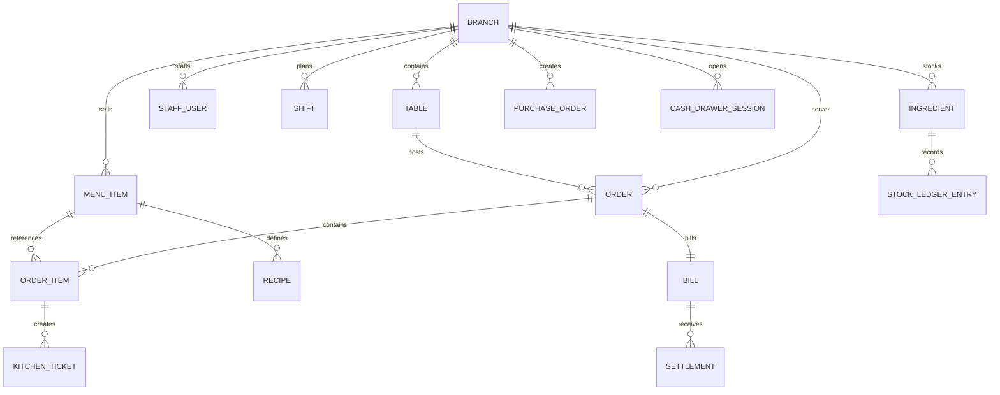
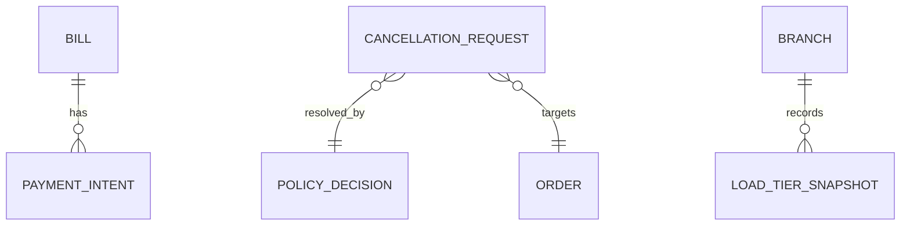

# ERD and Database Schema - Restaurant Management System

## Table Notes

| Table | Notes |
|-------|-------|
| branches | Branch identity, tax context, and operational scope |
| tables | Physical seating resources and state |
| reservations | Reservation and guest arrival records |
| waitlist_entries | Walk-in queue and promotion state |
| orders | Top-level order records for dine-in, takeaway, or delivery |
| order_items | Line items with modifiers, notes, and course timing |
| kitchen_tickets | Station-level preparation work units |
| menu_items | Sellable menu definitions |
| recipes | BOM/ingredient usage mapping |
| ingredients | Stock masters and thresholds |
| stock_ledger_entries | Inventory event history |
| bills | Financial closure records for orders |
| settlements | Payment and split-bill outcomes |
| cash_drawer_sessions | Cashier open/close and balancing sessions |
| accounting_exports | Reconciliation handoff artifacts |

## Extended Tables for Implementation Readiness

| Table | Purpose | Key Columns |
|-------|---------|-------------|
| payment_intents | provider-facing payment lifecycle | id, check_id, provider_ref, status, idempotency_key, amount |
| policy_decisions | approval outcomes for protected operations | id, scope, outcome, approver_id, reason_code, decided_at |
| cancellation_requests | lifecycle-aware cancellation/reversal requests | id, scope, target_id, reason_code, status, decision_id |
| load_tier_snapshots | branch load state and trigger metrics | id, branch_id, tier, queue_lag_score, evaluated_at |

## ERD Extension (Mermaid)

