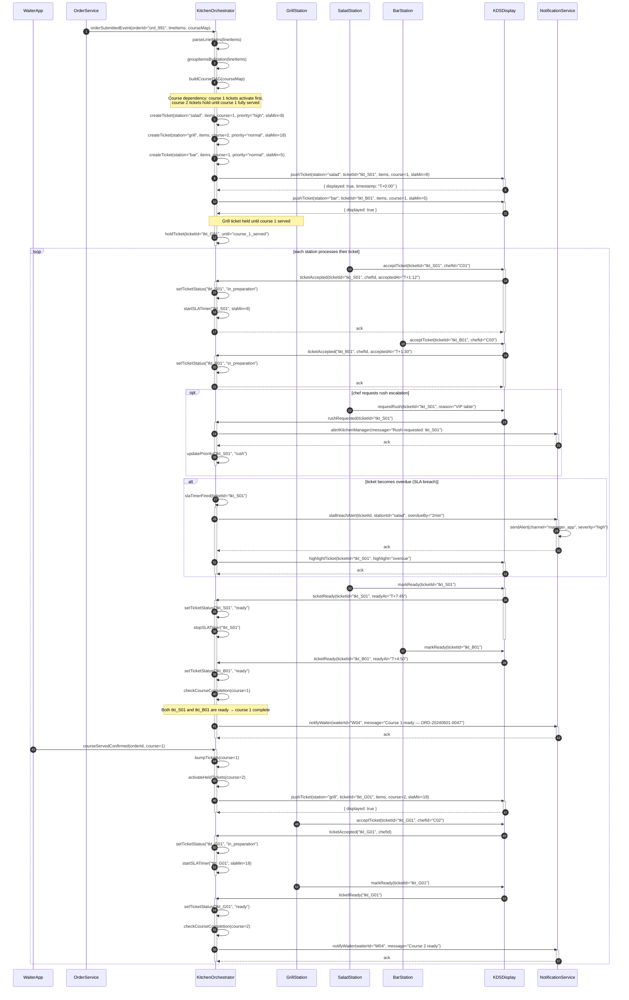
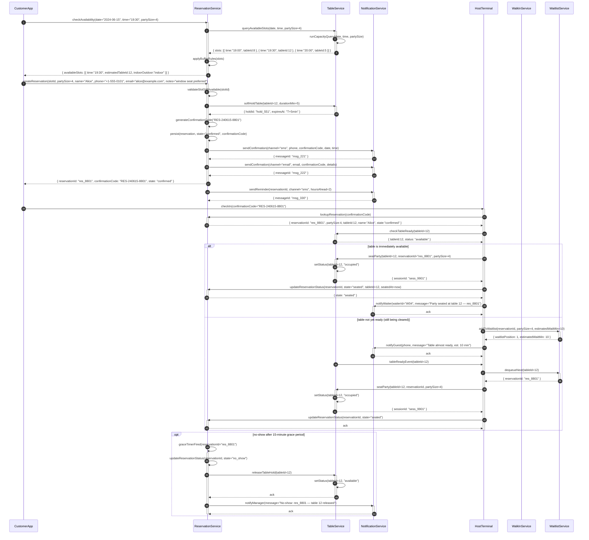
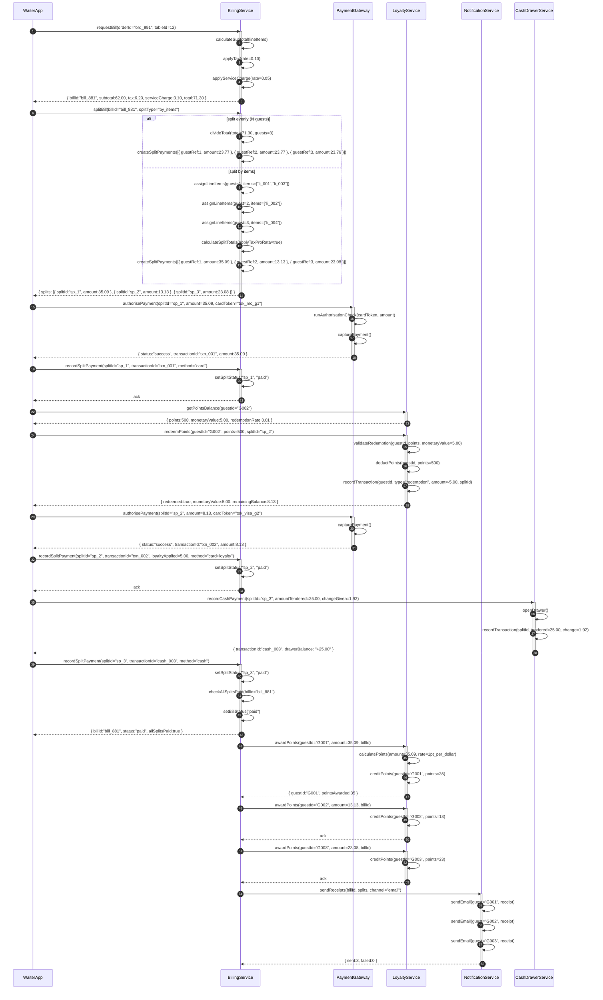
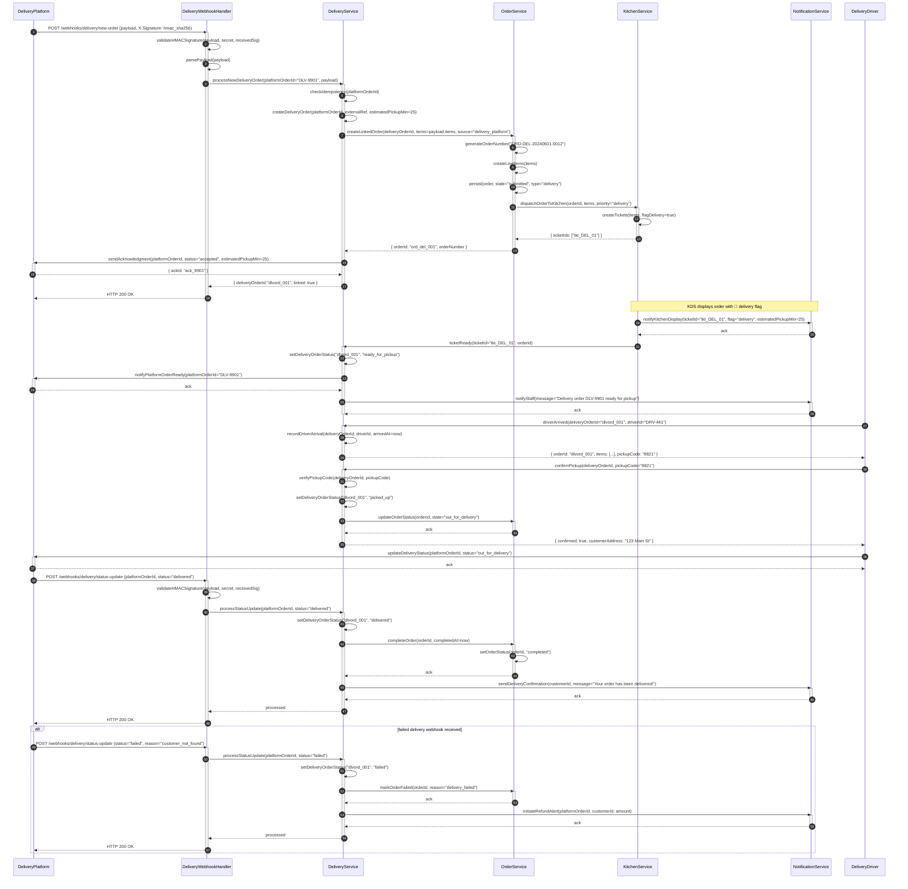
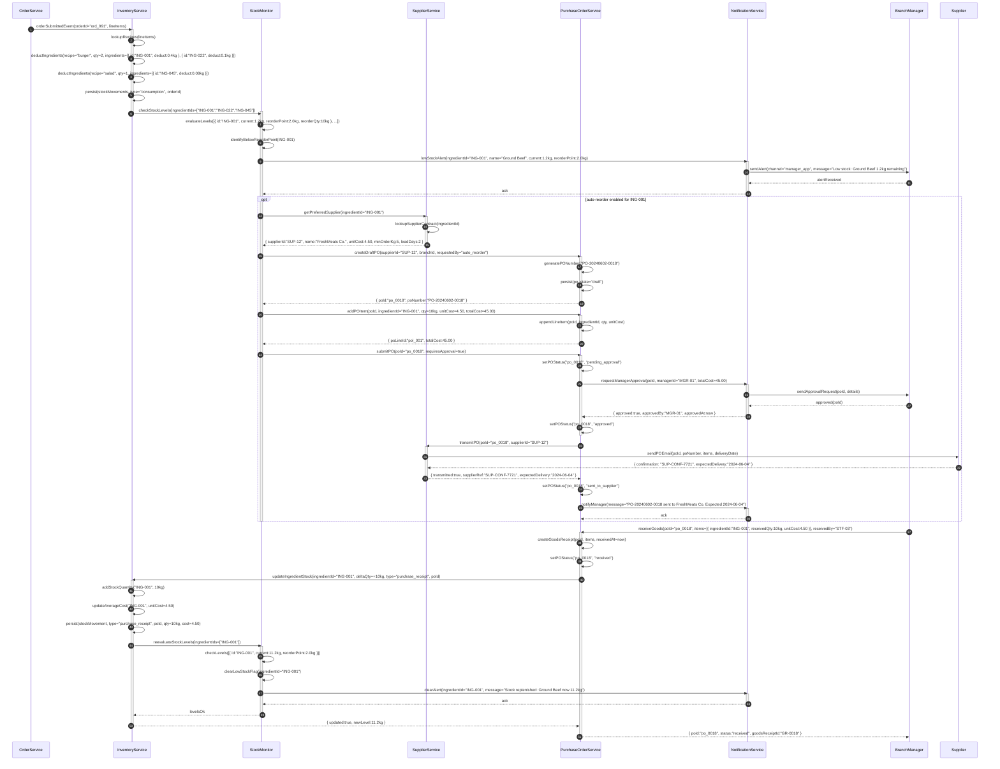

# Sequence Diagrams — Restaurant Management System

## Overview

These sequence diagrams model the end-to-end runtime behaviour of the Restaurant Management System across its core operational flows. They cover the complete order lifecycle from table seating through payment settlement, kitchen ticket orchestration across multiple stations, reservation handling and walk-in management, split-bill payment with loyalty point redemption, third-party delivery platform integration via webhooks, and automated inventory reorder triggers. Each diagram exposes the precise message contracts, state transitions, and branching logic that backend services must implement. Together they form a living specification that guides both API design and integration testing.

---

## 1. Complete Order Lifecycle — Table Seating to Payment

```mermaid
sequenceDiagram
    autonumber
    participant HT as HostTerminal
    participant WA as WaiterApp
    participant POS as POSBackend
    participant OS as OrderService
    participant MS as MenuService
    participant KS as KitchenService
    participant KDS as KDSDisplay
    participant NS as NotificationService
    participant BS as BillingService
    participant PG as PaymentGateway
    participant TS as TableService

    %% ── Host seats the party ──────────────────────────────────────────────
    HT->>TS: checkTableStatus(tableId=12)
    activate TS
    TS-->>HT: { status: "available", capacity: 4 }
    deactivate TS

    HT->>TS: seatParty(tableId=12, partySize=3, reservationId=null)
    activate TS
    TS->>TS: setStatus(tableId=12, "occupied")
    TS-->>HT: { tableId: 12, status: "occupied", sessionId: "sess_8821" }
    deactivate TS

    %% ── Waiter opens new order ───────────────────────────────────────────
    WA->>POS: openOrder(tableId=12, sessionId="sess_8821", waiterId="W04")
    activate POS
    POS->>OS: createDraftOrder(tableId=12, sessionId, waiterId)
    activate OS
    OS->>OS: generateOrderNumber("ORD-20240601-0047")
    OS->>OS: persist(order, state="draft")
    OS-->>POS: { orderId: "ord_991", orderNumber: "ORD-20240601-0047", state: "draft" }
    deactivate OS
    POS-->>WA: { orderId: "ord_991", orderNumber: "ORD-20240601-0047" }
    deactivate POS

    %% ── Waiter adds starter items ────────────────────────────────────────
    WA->>POS: addItem(orderId, itemId="ITEM-042", qty=2, modifiers=["no-onion"])
    activate POS
    POS->>MS: validateItem(itemId="ITEM-042", modifiers)
    activate MS
    MS->>MS: checkAvailability(itemId)
    MS->>MS: resolvePrice(itemId, modifiers)
    MS-->>POS: { available: true, unitPrice: 8.50, modifierDelta: 0.00 }
    deactivate MS
    POS->>OS: appendLineItem(orderId, itemId, qty=2, unitPrice=8.50, course=1)
    activate OS
    OS-->>POS: { lineItemId: "li_001", subtotal: 17.00 }
    deactivate OS
    POS-->>WA: { lineItemId: "li_001", subtotal: 17.00 }
    deactivate POS

    WA->>POS: addItem(orderId, itemId="ITEM-105", qty=1, modifiers=["extra-dressing"])
    activate POS
    POS->>MS: validateItem(itemId="ITEM-105", modifiers)
    activate MS
    MS-->>POS: { available: true, unitPrice: 7.00, modifierDelta: 0.50 }
    deactivate MS
    POS->>OS: appendLineItem(orderId, itemId, qty=1, unitPrice=7.50, course=1)
    activate OS
    OS-->>POS: { lineItemId: "li_002", subtotal: 7.50 }
    deactivate OS
    POS-->>WA: { lineItemId: "li_002", subtotal: 7.50 }
    deactivate POS

    %% ── Waiter adds main-course items ───────────────────────────────────
    WA->>POS: addItem(orderId, itemId="ITEM-210", qty=1, modifiers=["medium-rare"], course=2)
    activate POS
    POS->>MS: validateItem(itemId="ITEM-210", modifiers)
    activate MS
    MS-->>POS: { available: true, unitPrice: 24.00, modifierDelta: 0.00 }
    deactivate MS
    POS->>OS: appendLineItem(orderId, itemId, qty=1, unitPrice=24.00, course=2)
    activate OS
    OS-->>POS: { lineItemId: "li_003", subtotal: 24.00 }
    deactivate OS
    POS-->>WA: { lineItemId: "li_003" }
    deactivate POS

    WA->>POS: addItem(orderId, itemId="ITEM-310", qty=2, modifiers=[], course=3)
    activate POS
    POS->>MS: validateItem(itemId="ITEM-310", modifiers)
    activate MS
    MS-->>POS: { available: true, unitPrice: 6.50, modifierDelta: 0.00 }
    deactivate MS
    POS->>OS: appendLineItem(orderId, itemId, qty=2, unitPrice=6.50, course=3)
    activate OS
    OS-->>POS: { lineItemId: "li_004", subtotal: 13.00 }
    deactivate OS
    POS-->>WA: { lineItemId: "li_004" }
    deactivate POS

    %% ── Waiter submits order ─────────────────────────────────────────────
    WA->>POS: submitOrder(orderId="ord_991")
    activate POS
    POS->>OS: submitOrder(orderId, idempotencyKey="idem_ord991_submit")
    activate OS
    OS->>OS: validateAllLineItems()
    OS->>OS: calculateOrderTotals()
    OS->>OS: persist(order, state="submitted")
    OS->>KS: dispatchOrderToKitchen(orderId, lineItems, courseMap)
    activate KS
    KS->>KS: analyzeAndAssignStations(lineItems)
    KS->>KS: createTicket(station="grill", items=[li_003], course=2, priority=normal)
    KS->>KS: createTicket(station="salad", items=[li_001,li_002], course=1, priority=high)
    KS->>KS: createTicket(station="bar", items=[], course=1)
    KS->>KDS: displayTicket(station="salad", ticket)
    KDS-->>KS: ack
    KS->>KDS: displayTicket(station="grill", ticket)
    KDS-->>KS: ack
    KS-->>OS: { ticketIds: ["tkt_S01","tkt_G01"] }
    deactivate KS
    OS-->>POS: { orderId, state: "submitted", ticketIds }
    deactivate OS
    POS-->>WA: { state: "submitted", message: "Order sent to kitchen" }
    deactivate POS

    %% ── Course 1: Starters ready ─────────────────────────────────────────
    alt Chef accepts ticket on KDS
        KDS->>KS: ticketAccepted(ticketId="tkt_S01", chefId="C02")
        activate KS
        KS->>KS: setTicketStatus("tkt_S01", "in_preparation")
        KS->>KS: startPreparationTimer("tkt_S01")
        KS-->>KDS: ack
        deactivate KS
    end

    KDS->>KS: ticketReady(ticketId="tkt_S01")
    activate KS
    KS->>KS: setTicketStatus("tkt_S01", "ready")
    KS->>OS: courseReady(orderId, course=1)
    activate OS
    OS->>NS: notifyWaiter(waiterId="W04", message="Course 1 ready for ORD-20240601-0047")
    activate NS
    NS-->>OS: { notificationId: "ntf_01", channel: "app_push" }
    deactivate NS
    OS-->>KS: ack
    deactivate OS
    deactivate KS

    WA->>OS: markCourseServed(orderId, course=1)
    activate OS
    OS->>OS: setCourseStatus(orderId, course=1, "served")
    OS-->>WA: { orderId, course: 1, status: "served" }
    deactivate OS

    %% ── Course 2: Mains ready ────────────────────────────────────────────
    loop until all courses served
        KDS->>KS: ticketReady(ticketId="tkt_G01")
        activate KS
        KS->>KS: setTicketStatus("tkt_G01", "ready")
        KS->>OS: courseReady(orderId, course=2)
        activate OS
        OS->>NS: notifyWaiter(waiterId="W04", message="Course 2 ready")
        activate NS
        NS-->>OS: ack
        deactivate NS
        OS-->>KS: ack
        deactivate OS
        deactivate KS

        WA->>OS: markCourseServed(orderId, course=2)
        activate OS
        OS-->>WA: { orderId, course: 2, status: "served" }
        deactivate OS
    end

    %% ── Billing ──────────────────────────────────────────────────────────
    WA->>BS: openBill(orderId="ord_991")
    activate BS
    BS->>OS: getOrderDetails(orderId)
    activate OS
    OS-->>BS: { lineItems, totals }
    deactivate OS
    BS->>BS: calculateSubtotal(lineItems)
    BS->>BS: applyTax(rate=0.10)
    BS->>BS: applyServiceCharge(rate=0.05)
    BS->>BS: generateQRCode(billId)
    BS-->>WA: { billId: "bill_881", subtotal: 62.00, tax: 6.20, serviceCharge: 3.10, total: 71.30, qrCode: "<base64>" }
    deactivate BS

    WA->>PG: initiateCardPayment(billId, amount=71.30, cardToken="tok_visa_xxxx")
    activate PG
    PG->>PG: authorisePayment(amount, cardToken)

    alt Payment successful
        PG->>PG: capturePayment()
        PG-->>WA: { status: "success", transactionId: "txn_5521", amount: 71.30 }
        WA->>BS: markBillPaid(billId, transactionId="txn_5521")
        activate BS
        BS->>BS: setBillStatus("paid")
        BS-->>WA: { billId, status: "paid" }
        deactivate BS
        WA->>TS: releaseTable(tableId=12, reason="checkout")
        activate TS
        TS->>TS: setStatus(tableId=12, "cleaning")
        TS->>NS: notifyCleaningStaff(tableId=12)
        activate NS
        NS-->>TS: ack
        deactivate NS
        TS-->>WA: { tableId: 12, status: "cleaning" }
        deactivate TS
    else Payment failed
        PG-->>WA: { status: "failed", errorCode: "insufficient_funds" }
        WA->>BS: logPaymentFailure(billId, errorCode)
        activate BS
        BS-->>WA: { billId, status: "payment_pending" }
        deactivate BS
    end
    deactivate PG
```

---

## 2. Kitchen Ticket Processing Flow

---

## 3. Reservation to Seating Flow

---

## 4. Split Bill Payment Flow

---

## 5. Delivery Order Integration Flow

---

## 6. Inventory Reorder Flow

---

## Sequence Flow Notes

### Idempotency

All mutating operations exposed via API (order submit, payment capture, goods receipt) accept an `idempotency_key` header. The backend persists the key and result for 24 hours. Duplicate requests within that window receive the cached response without re-executing side effects. This protects against network retries causing duplicate charges or double-deductions.

### Event-Driven Communication

Services communicate via domain events published to an internal message broker (e.g., Kafka topics). `order.submitted`, `ticket.ready`, `bill.paid`, and `stock.low` are canonical events. Consumers subscribe independently, allowing the kitchen orchestrator, notification service, and inventory service to react to order submission without synchronous coupling to the OrderService request path.

### Optimistic Locking

`Order` and `Bill` records carry a `version` integer. Concurrent updates (e.g., two waiters modifying the same order) must include the last-known `version`. The backend rejects updates where `version` does not match the current row, returning `409 Conflict`. Clients retry after re-fetching the latest state.

### SLA Monitoring

Each kitchen ticket records `accepted_at` and `sla_minutes`. A background scheduler evaluates in-progress tickets every 30 seconds. Tickets that exceed 80% of their SLA trigger a **warning** notification; tickets that breach 100% trigger a **critical** alert routed to the kitchen manager's dashboard and mobile app.

### Webhook Retry Policy

Inbound webhooks (delivery platform, payment gateway callbacks) must respond with HTTP 200 within 5 seconds. If the handler cannot process synchronously, it enqueues the payload and returns 200 immediately. Outbound webhook calls to suppliers and delivery platforms use exponential back-off: 5 s → 25 s → 125 s → 625 s, with a maximum of 5 attempts before routing the message to a dead letter queue (DLQ).

### Dead Letter Queue Handling

Messages that exhaust all retry attempts are routed to a DLQ topic (`rms.dlq`). A monitoring alert fires when DLQ depth exceeds 10 messages. On-call engineers inspect failed payloads via an admin UI, correct the root cause, and replay messages individually or in bulk. DLQ messages retain the original headers (idempotency key, correlation ID) to ensure safe replay.

### Table State Machine

Tables transition through `available → occupied → cleaning → available`. The `cleaning` state is only exited by an explicit staff confirmation via the HostTerminal. Attempting to seat a party at a table in `cleaning` state returns `409 Table Not Ready`. This prevents accidental double-seating during turnaround.

### Reservation Grace Period

The no-show grace timer is set per-venue configuration (default 15 minutes). The timer starts when the reservation time passes and no `arrived` event has been received. The timer is cancelled immediately on customer check-in. No-show records are retained for analytics and can trigger automated follow-up communications via the NotificationService.

### Delivery Order Prioritisation

Orders originating from delivery platforms carry `priority: "delivery"` and are flagged on the KDS with a distinct visual indicator. Kitchen SLAs for delivery tickets are tighter (typically 20–25 minutes end-to-end) to account for driver wait time and thermal degradation during transit.

### Loyalty Point Award Timing

Points are awarded after `bill.paid` event is emitted — not at payment authorisation. This prevents awarding points for payments that are later reversed. Redemptions are validated against the live balance at the time of the split payment request to avoid over-redemption from concurrent sessions.
