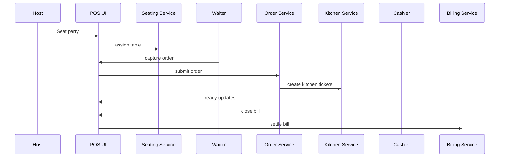
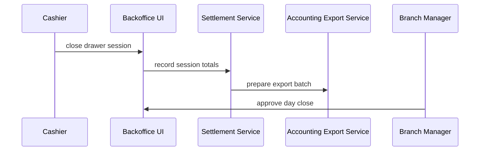

# Sequence Diagram - Restaurant Management System

```mermaid
sequenceDiagram
    participant Host as Host
    participant POS as POS UI
    participant Seating as Seating Service
    participant Waiter as Waiter
    participant Order as Order Service
    participant Kitchen as Kitchen Service
    participant Cashier as Cashier
    participant Billing as Billing Service

    Host->>POS: Seat party
    POS->>Seating: assign table
    Waiter->>POS: capture order
    POS->>Order: submit order
    Order->>Kitchen: create kitchen tickets
    Kitchen-->>POS: ready updates
    Cashier->>POS: close bill
    POS->>Billing: settle bill
```

## Reconciliation Sequence

```mermaid
sequenceDiagram
    participant Cashier as Cashier
    participant Backoffice as Backoffice UI
    participant Settlement as Settlement Service
    participant Export as Accounting Export Service
    participant Manager as Branch Manager

    Cashier->>Backoffice: close drawer session
    Backoffice->>Settlement: record session totals
    Settlement->>Export: prepare export batch
    Manager->>Backoffice: approve day close
```
