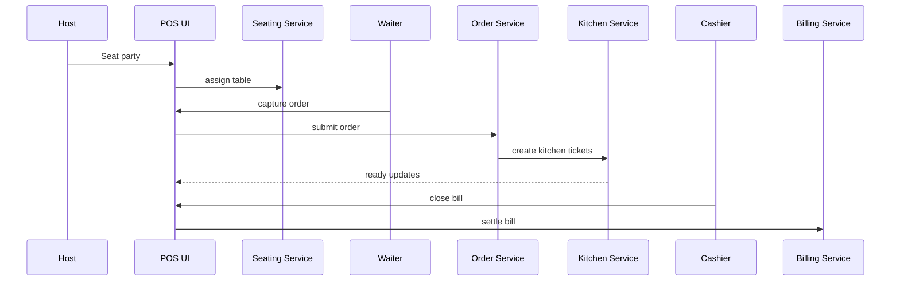
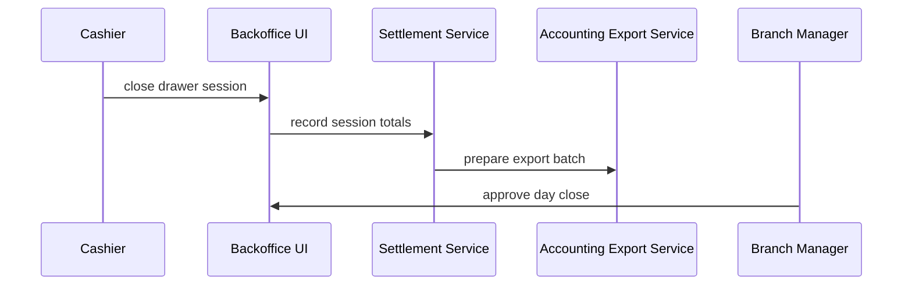
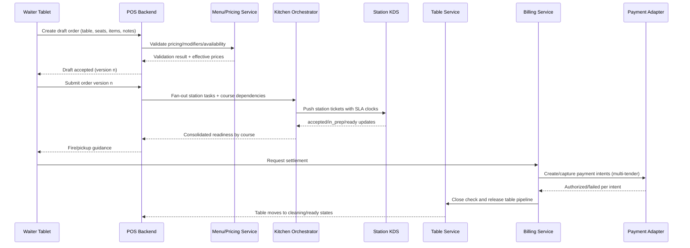
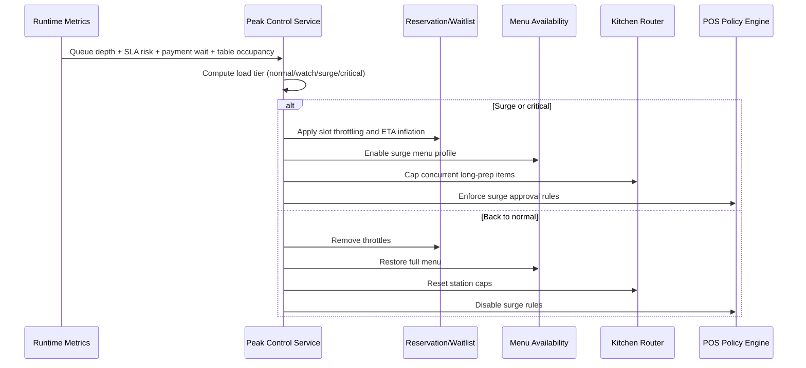
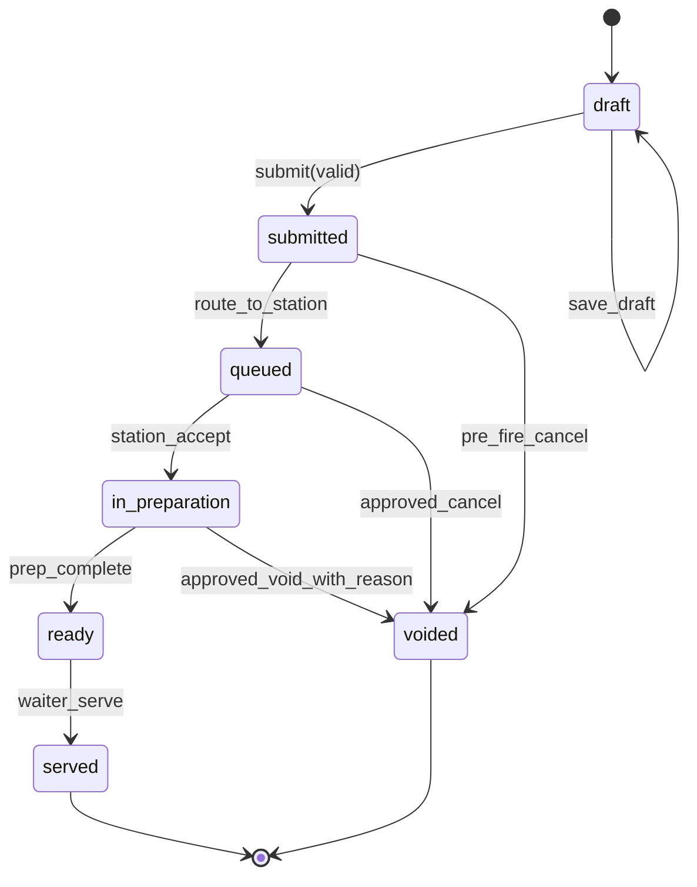
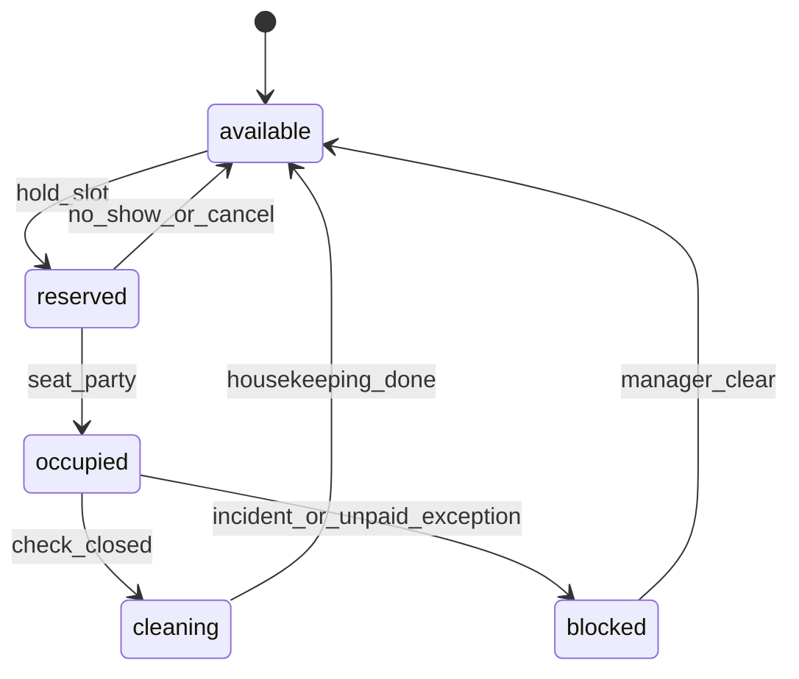
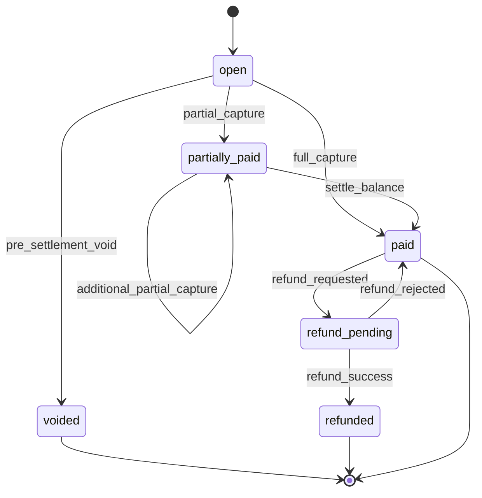

# Sequence Diagram - Restaurant Management System



## Reconciliation Sequence



## Detailed Order Lifecycle with Kitchen Orchestration and Settlement



## Peak-Load Control Loop



## Implementation Contracts for Sequences

### A) Order Submit Command (logical contract)
```json
{
  "branch_id": "br_001",
  "table_id": "tbl_12",
  "order_id": "ord_456",
  "expected_version": 7,
  "items": [
    {
      "line_id": "ln_1",
      "menu_item_id": "mi_pasta",
      "qty": 2,
      "seat_no": 3,
      "modifier_ids": ["mod_no_cheese"],
      "course": "main",
      "notes": "allergy: peanuts"
    }
  ],
  "submitted_by": "usr_waiter_14",
  "submitted_at": "2026-03-28T18:22:54Z"
}
```

### B) Kitchen Ticket Event (logical contract)
```json
{
  "event_type": "kitchen.ticket.created",
  "event_id": "evt_998",
  "ticket_id": "kt_73",
  "order_id": "ord_456",
  "station_id": "grill",
  "priority_band": "standard",
  "promised_ready_at": "2026-03-28T18:35:00Z",
  "course_dependency": ["starter_complete"],
  "correlation_id": "corr_abc"
}
```

### C) Cancellation/Reversal Decision Object
```json
{
  "decision_id": "dec_101",
  "scope": "payment_reversal",
  "target_id": "pay_332",
  "reason_code": "item_quality_issue",
  "approved": true,
  "approved_by": "usr_manager_2",
  "requires_dual_approval": false,
  "compensations": ["refund_intent", "audit_entry"]
}
```

## Persistence and Idempotency Notes
- Sequence commands must use optimistic concurrency (`expected_version`) for order and table aggregates.
- Payment capture/void/refund endpoints must be idempotent on `(branch_id, check_id, idempotency_key)`.
- Ticket updates are append-only events; read models can be rebuilt from event stream.
- Peak-load tier transition writes must be deduplicated by `(branch_id, tier, 5-minute window)`.

## Stateful Lifecycle Diagrams (Mermaid)

### Order Line Lifecycle


### Table Lifecycle


### Check and Payment Lifecycle

