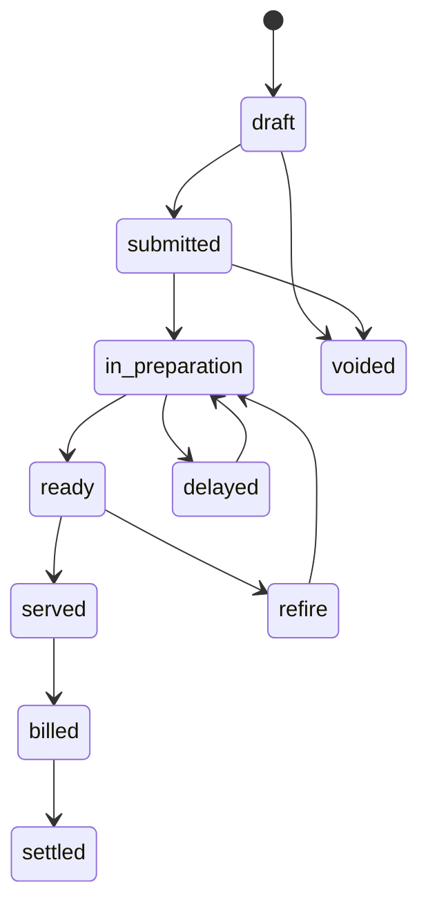
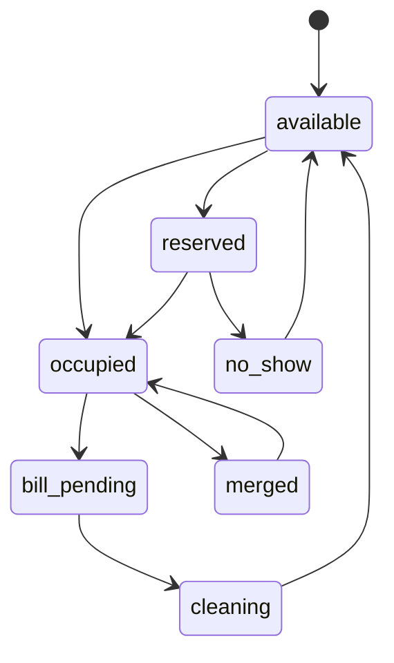
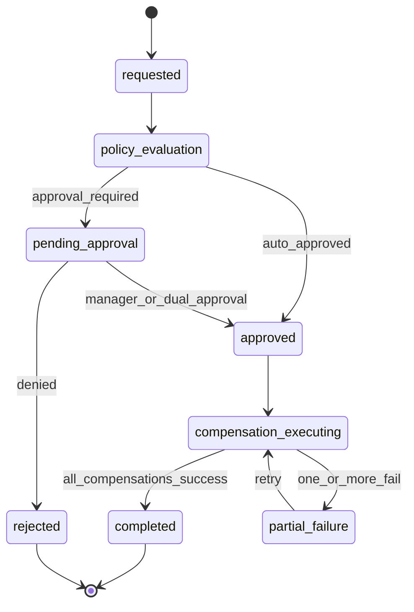
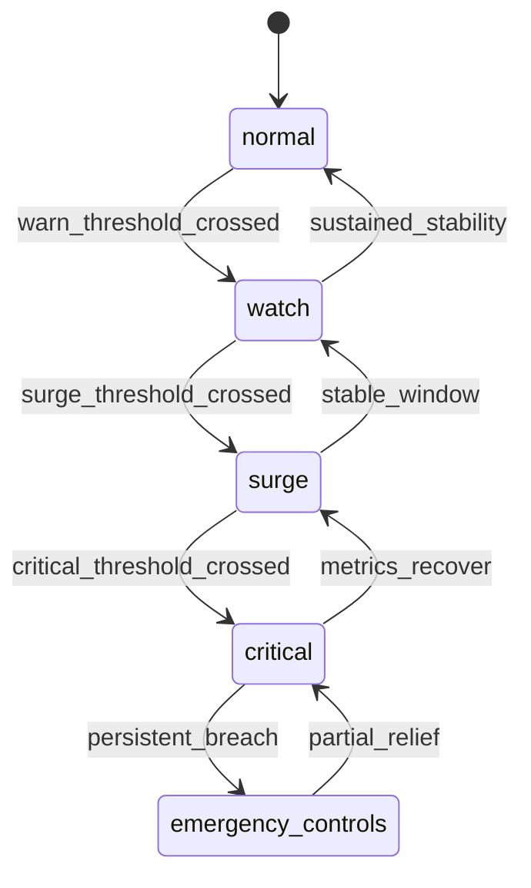

# State Machine Diagram - Restaurant Management System

## Order Lifecycle

## Table Lifecycle

## Cancellation and Reversal State Machine

## Peak-Load Control State Machine

## Transition Rules (Must Enforce)
- `submitted -> voided` allowed only before station acceptance unless manager override.
- `paid -> refunded` requires linked refund intent and approval policy evaluation.
- `occupied -> cleaning` requires terminal check state (`paid`, `voided`, or approved house-account hold).
- `surge/critical -> normal` transitions require sustained recovery window and no unresolved critical alerts.
