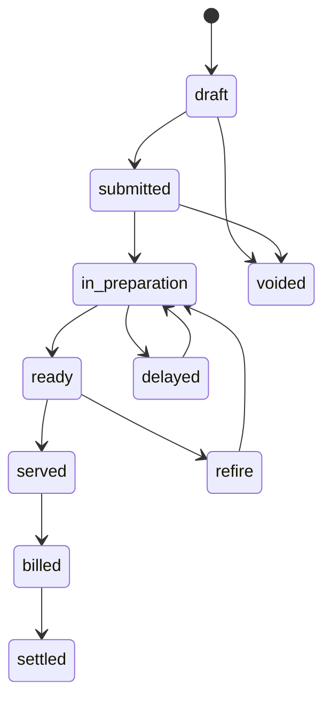
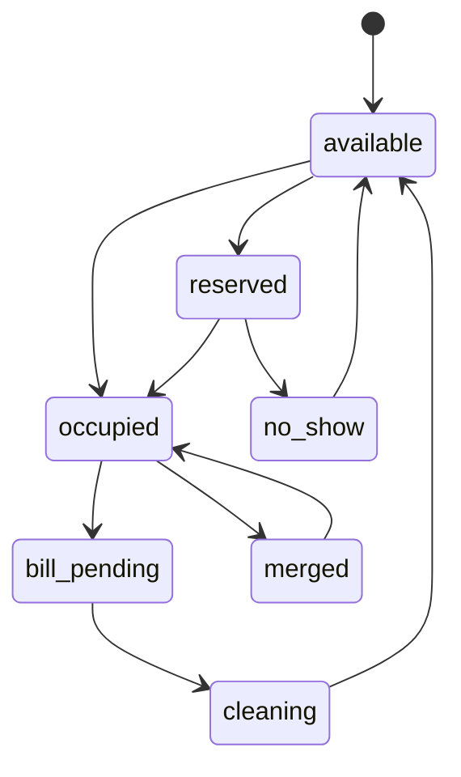

# State Machine Diagram - Restaurant Management System

## Order Lifecycle

```mermaid
stateDiagram-v2
    [*] --> draft
    draft --> submitted
    submitted --> in_preparation
    in_preparation --> ready
    ready --> served
    served --> billed
    billed --> settled
    draft --> voided
    submitted --> voided
    in_preparation --> delayed
    delayed --> in_preparation
    ready --> refire
    refire --> in_preparation
```

## Table Lifecycle

```mermaid
stateDiagram-v2
    [*] --> available
    available --> reserved
    available --> occupied
    reserved --> occupied
    occupied --> bill_pending
    bill_pending --> cleaning
    cleaning --> available
    occupied --> merged
    merged --> occupied
    reserved --> no_show
    no_show --> available
```
