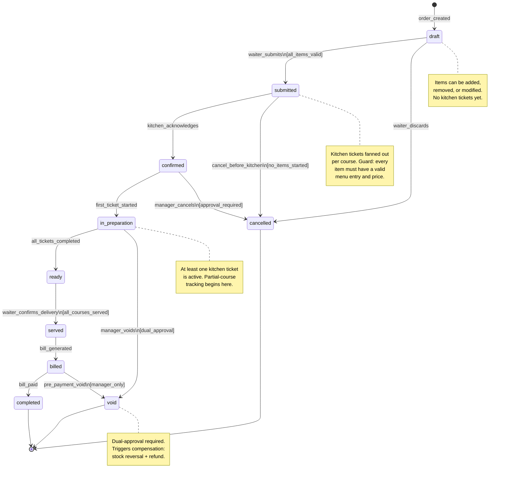
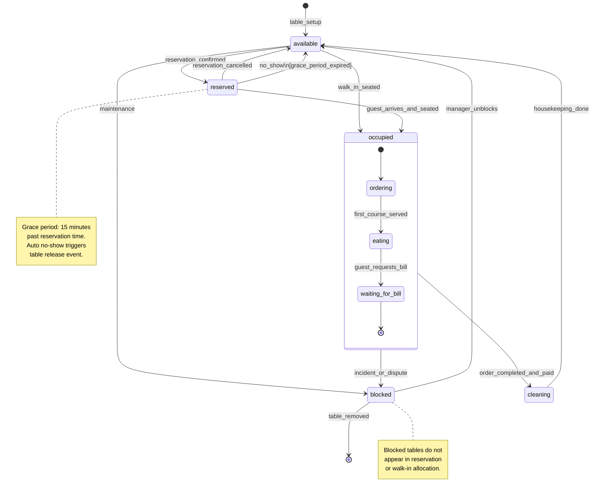
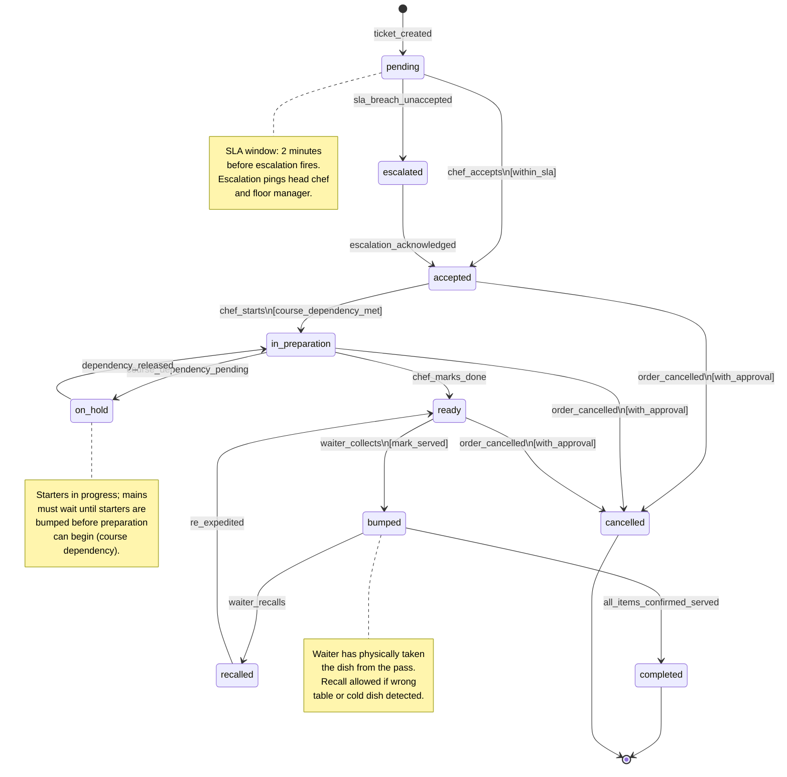
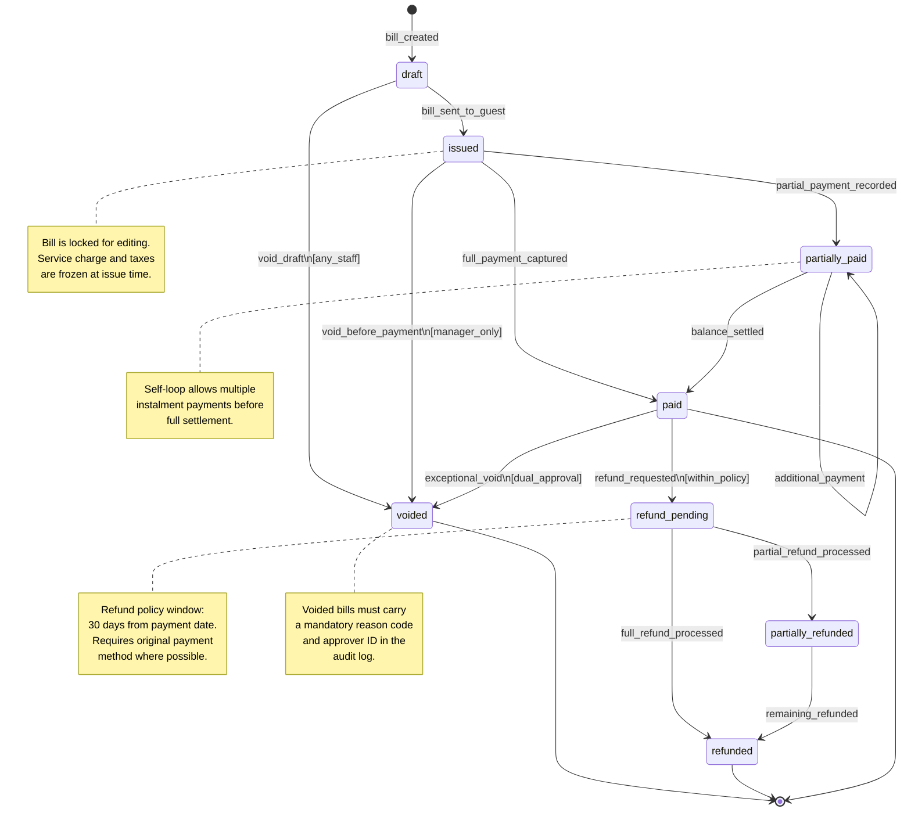
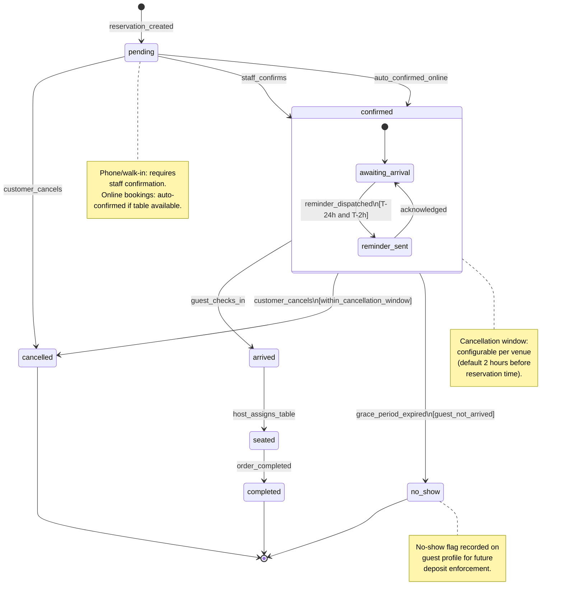
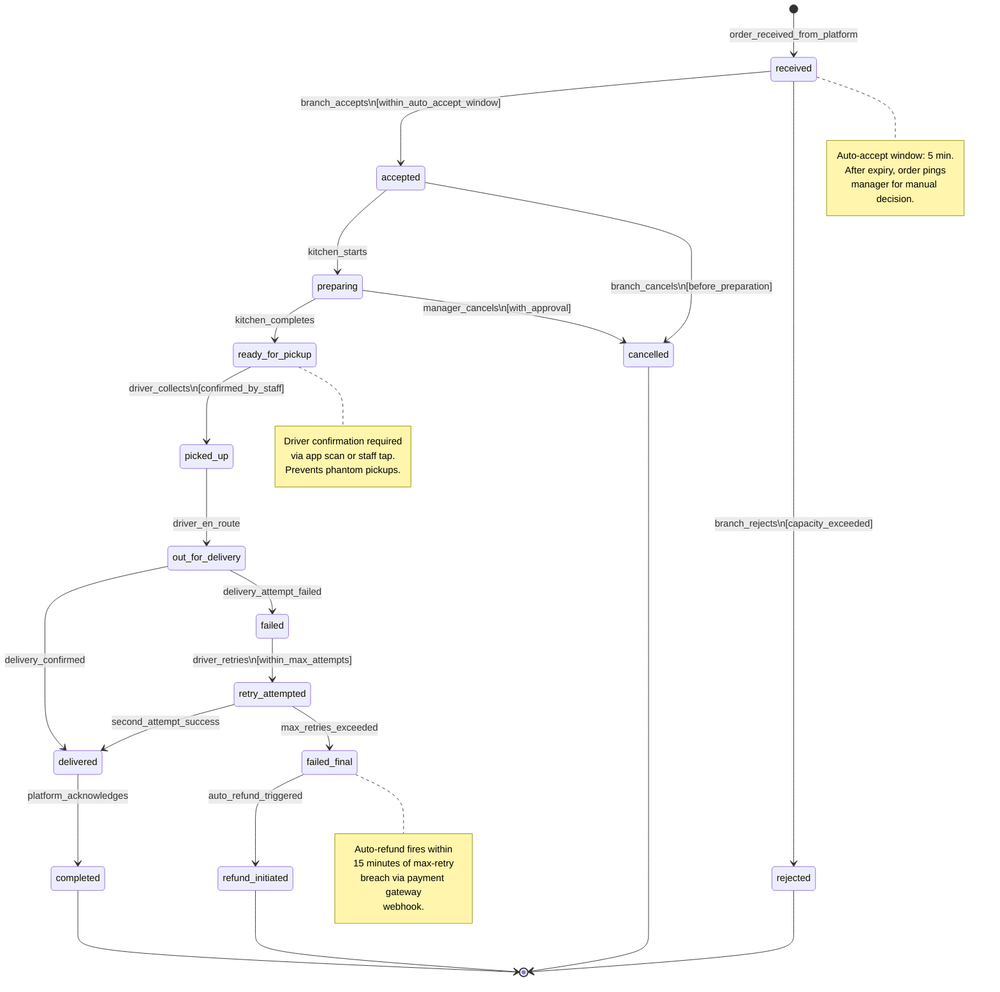
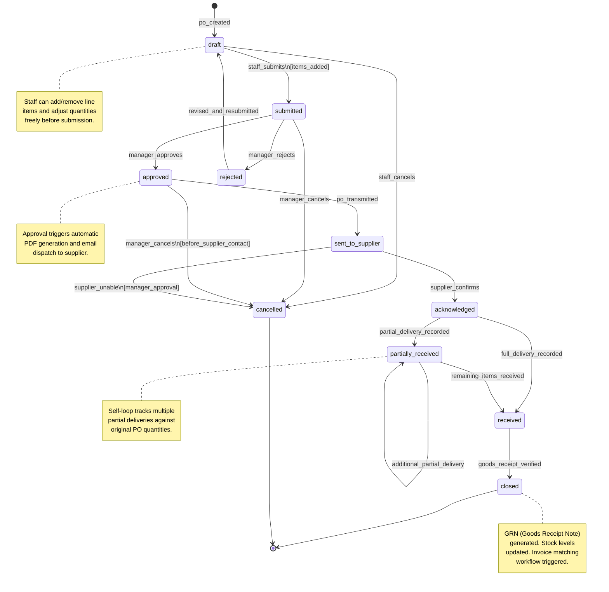

# State Machine Diagrams — Restaurant Management System

## Overview

State machines govern every critical lifecycle within the Restaurant Management System, ensuring that entities
can only transition between valid states and that business rules are enforced at the application boundary.
Each diagram captures guard conditions, side effects, and terminal states for a given domain object.
By modelling these transitions explicitly, the system prevents illegal state changes — such as marking an
unpaid bill as completed or allowing a kitchen ticket to skip preparation — that would otherwise corrupt
operational data and financial records. State transitions also serve as audit anchors: every edge in the
diagram maps to a logged event stored in the `state_transition_log` table with actor, timestamp, and reason.

---

## 1. Order State Machine

### Description

The **Order State Machine** models the full lifecycle of a dine-in or counter order from the moment a waiter
opens a new check to the point the guest settles the bill.

- **draft**: The order exists only in the POS terminal. Items can be freely added, removed, or swapped.
  No kitchen tickets have been emitted yet. A waiter may discard the order at will, moving it directly
  to `cancelled` without any approval workflow.

- **submitted**: The waiter has locked the order and sent it to the kitchen. A fan-out process creates
  one `KitchenTicket` per course (or per kitchen station). The guard `all_items_valid` ensures every
  line item resolves to an active menu entry with a current price before submission is accepted.

- **confirmed**: The kitchen display system (KDS) has acknowledged receipt of all tickets. The guard
  `approval_required` on the `manager_cancels` transition prevents kitchen-stage cancellations without
  a supervisor override, protecting against accidental or fraudulent removals.

- **in_preparation**: At least one ticket has moved to active preparation. Course-level progress is now
  tracked individually. The `void` transition from this state requires dual approval (manager + supervisor)
  and triggers a compensating transaction: stock units are reversed and a refund record is initiated if
  any payment was already captured.

- **ready**: Every ticket associated with the order has reached the `bumped` or `completed` state on the
  KDS. The guard `all_courses_served` ensures that no course has been silently dropped.

- **served**: The waiter has physically delivered all food and confirmed service on the POS. This state
  triggers automatic bill generation in the billing subsystem.

- **billed**: A bill has been generated and presented to the guest. The order is now in financial closure.
  Only a manager may void a billed-but-unpaid order (`pre_payment_void`).

- **completed**: The bill has been fully paid. This is an immutable terminal state — no edits, no
  reversals without creating a separate `Refund` entity.

- **cancelled vs void**: `cancelled` is a clean exit with no financial impact (no payment was taken).
  `void` is a post-kitchen exit that triggers compensation workflows including stock correction and
  potential refund. Voided orders remain in the database with full audit trails.

- **Cancellation windows**: Free cancellation before `submitted`; manager approval required between
  `submitted` and `confirmed`; dual approval required at `in_preparation` or later.

---

## 2. Table State Machine

### Description

The **Table State Machine** tracks the physical availability and usage status of each table asset in the
restaurant floor plan.

- **available**: The table is clean, set, and ready to accept guests. It is visible in the host-stand
  seating chart and eligible for both walk-in assignment and advance reservation allocation.

- **reserved**: A confirmed reservation is linked to this table. The table is held and not assignable
  to walk-ins. If the guest does not arrive within the configured grace period (default 15 minutes past
  the booking time), an automated job fires `no_show` and releases the table back to `available`.

- **occupied (composite)**: The table is in active use. The composite state captures three internal
  sub-states: `ordering` (guests are selecting items), `eating` (at least one course has been delivered),
  and `waiting_for_bill` (the guest has requested the check). These sub-states drive floor-plan colour
  coding on the host display without exposing them as top-level states.

- **cleaning**: The party has left and payment is confirmed. Housekeeping staff must mark the table
  clean before it re-enters `available`. This prevents immediate re-seating of a dirty table.

- **blocked**: The table cannot be used. Reasons include maintenance work, a dispute or incident that
  requires management review, or a temporary hold. Only a manager can unblock a table. Tables that are
  permanently removed from the floor plan transition from `blocked` to the terminal state via `table_removed`.

- **Key rules**: Tables must pass through `cleaning` before returning to `available` after each sitting.
  Walk-in assignment bypasses the `reserved` state entirely. Reservation cancellation returns the table to
  `available` immediately, making it eligible for new reservations or walk-ins.

---

## 3. Kitchen Ticket State Machine

### Description

The **Kitchen Ticket State Machine** manages the lifecycle of a single preparation unit dispatched to a
kitchen station or chef upon order submission.

- **pending**: The ticket has been printed or displayed on the KDS but no chef has acknowledged it yet.
  An SLA timer (configurable, default 2 minutes) starts immediately. Breach of this timer without
  acknowledgement fires `sla_breach_unaccepted` and moves the ticket to `escalated`, alerting the head
  chef and floor manager via the notification subsystem.

- **escalated**: The ticket is overdue for acknowledgement. An escalation alert has been sent. Once a
  chef acknowledges, the ticket transitions back into the normal `accepted` path.

- **accepted**: A chef owns the ticket. The guard `course_dependency_met` on `chef_starts` enforces
  course sequencing — mains cannot begin preparation until all starters for the same order are bumped.

- **in_preparation**: Active cooking is underway. If a course dependency arises mid-preparation (e.g., a
  shared component is delayed), the ticket moves to `on_hold` until the dependency resolves.

- **on_hold**: The ticket is paused waiting for a dependency. When the blocking ticket is bumped, a
  `dependency_released` event re-activates all tickets that were waiting on it.

- **ready**: The dish is plated and waiting at the pass. The KDS timer starts tracking how long the dish
  sits before collection, enabling heat-lamp timeout alerts.

- **bumped**: A waiter has collected the dish. The bump action records the waiter's ID and timestamp.
  Recall is allowed within a short window if an error is discovered (wrong table assignment, quality issue).

- **recalled / re_expedited**: The waiter returns the dish. The kitchen re-expedites it, and it returns
  to `ready` for re-collection.

- **completed**: All items on the ticket have been confirmed served. This state feeds the `all_tickets_completed`
  check on the parent Order State Machine.

- **cancelled**: Any cancellation after `accepted` requires manager approval and generates a waste-log entry
  for cost-of-goods tracking.

---

## 4. Bill State Machine

### Description

The **Bill State Machine** tracks the financial document associated with an order from creation through to
full settlement or void.

- **draft**: The bill has been generated but not yet presented to the guest. Line items, discounts, and
  service charges may still be adjusted. Any staff member may void a draft bill without approval.

- **issued**: The bill has been handed to the guest (physically or digitally). At this point, the bill
  amount is frozen — service charge and taxes are captured at issue time and cannot change. Only a manager
  may void an issued, unpaid bill.

- **partially_paid**: A payment has been recorded that covers only part of the total amount due. The
  self-loop transition allows multiple partial payments (e.g., split-payment scenarios) to accumulate
  until the balance reaches zero.

- **paid**: The full amount has been settled. This is the standard terminal state for successful transactions.
  The parent order transitions to `completed` upon this event.

- **refund_pending**: A refund has been requested within the refund policy window (default 30 days).
  The bill remains queryable for customer service purposes while the refund is processed.

- **partially_refunded**: A portion of the amount has been returned. A follow-up action will complete the
  remaining refund, or the record may be closed at this state if only a partial refund was warranted.

- **refunded**: All requested amounts have been returned. This is the terminal state for refund workflows.

- **voided**: Bills can be voided at draft (any staff), issued-unpaid (manager), or paid (dual approval as
  an exceptional override). Every void carries a mandatory reason code and approver ID in the audit log.
  Voiding a paid bill automatically triggers a refund initiation in the payment gateway.

- **Authorization matrix**: draft void → any staff; issued void → manager; paid void → dual approval
  (manager + finance officer). Refund requests must reference original payment method where available.

---

## 5. Reservation State Machine

### Description

The **Reservation State Machine** governs the lifecycle of a table booking from initial request through to
guest departure or no-show resolution.

- **pending**: A reservation request has been received but not yet confirmed. Phone and walk-in bookings
  require explicit staff confirmation. Online bookings made through integrated platforms (e.g., OpenTable,
  the restaurant's own web booking) are auto-confirmed immediately if a suitable table is available.

- **confirmed (composite)**: The reservation is locked in. Inside this composite state, the system
  manages automated reminders: an SMS or email is dispatched 24 hours and again 2 hours before the
  booking time. The sub-state tracks whether a reminder has been sent and acknowledged.

- **arrived**: The guest has physically arrived and been recognised at the host stand. This check-in
  event releases any table hold that was associated with an alternative no-show candidate.

- **seated**: The host has assigned a specific table and the party has been led to it. The linked table
  transitions from `reserved` to `occupied` at this moment.

- **completed**: The associated order has been settled. The reservation record is closed and archived.
  Aggregated data (party size, spend, duration) feeds the analytics pipeline.

- **cancelled**: The guest cancelled within the allowed window (configurable, default 2 hours before
  booking time). Late cancellations or no-shows may incur a fee depending on venue policy. The linked
  table returns to `available` immediately upon cancellation.

- **no_show**: The grace period (default 15 minutes) has elapsed with no guest check-in. The flag is
  written to the guest profile. Repeat no-shows may require a deposit for future bookings. The table is
  released back to `available` via the Table State Machine.

---

## 6. Delivery Order State Machine

### Description

The **Delivery Order State Machine** manages orders placed through third-party aggregators (e.g., Uber Eats,
DoorDash) or the restaurant's own delivery channel.

- **received**: The platform has pushed an order to the branch. An auto-accept window (default 5 minutes)
  is open. If the branch does not act, a manager alert fires. Orders may be auto-accepted by the system
  if the branch has configured auto-accept and kitchen load is below threshold.

- **accepted / rejected**: The branch either accepts (capacity available) or rejects (capacity exceeded
  or kitchen closed). A rejection triggers an immediate notification to the aggregator platform to inform
  the customer and process a refund.

- **preparing**: Kitchen tickets have been generated for the delivery order. The workflow mirrors the
  dine-in Kitchen Ticket State Machine from this point forward.

- **ready_for_pickup**: All tickets are complete and the order is packaged. Staff must confirm the driver
  pickup by scanning the order QR code or tapping a confirmation on the KDS. This prevents phantom
  pickups where an unauthorised person collects the order.

- **picked_up / out_for_delivery**: The driver has the order and is en route. Real-time location tracking
  (if the driver app supports it) is linked to this state.

- **delivered / completed**: The driver confirms delivery (photo or signature). The aggregator platform
  acknowledges, closing the order on the restaurant's side and triggering revenue recognition.

- **failed / retry_attempted / failed_final**: Delivery failure (e.g., customer not home, address issue)
  starts a retry loop. Maximum retry attempts are configurable (default 2). After `failed_final`, an
  auto-refund is triggered via a payment gateway webhook within 15 minutes.

- **cancelled**: Free cancellation before `preparing`. Cancellation during `preparing` requires manager
  approval and generates a waste-log entry.

---

## 7. Purchase Order State Machine

### Description

The **Purchase Order State Machine** governs procurement from staff-initiated draft through supplier
delivery to goods receipt verification.

- **draft**: A staff member (typically a kitchen manager or purchasing officer) is building the PO.
  Line items, quantities, and preferred supplier can be freely edited. No external communication has
  occurred yet.

- **submitted**: The PO has been sent for internal approval. The submitting staff member can no longer
  edit it. A notification is sent to the approving manager.

- **approved**: The manager has authorised the spend. Approval triggers automatic PDF generation and
  email dispatch to the supplier. If the PO must be cancelled before supplier contact, the cancelling
  manager can do so without a secondary approver.

- **rejected**: The manager has rejected the PO (e.g., budget exceeded, wrong supplier, incorrect items).
  The PO returns to `draft` so the staff member can revise and resubmit. Rejection reason is mandatory.

- **sent_to_supplier**: The PO has been transmitted. If the supplier is unable to fulfil (stock shortage,
  discontinuation), they respond with a rejection, and the PO is cancelled with manager approval.

- **acknowledged**: The supplier has confirmed receipt and intent to deliver. From this point, delivery
  tracking begins.

- **partially_received / received**: Deliveries are recorded against PO line items. The self-loop on
  `partially_received` handles multi-shipment scenarios. Once all items are received at expected quantity
  and quality, the PO reaches `received`.

- **closed**: A Goods Receipt Note (GRN) has been generated, stock levels in the inventory subsystem have
  been updated, and the three-way invoice matching workflow (PO → GRN → invoice) has been triggered.

- **cancelled**: POs can be cancelled at draft, submitted, approved, or sent-to-supplier stages, each with
  progressively stricter authorisation requirements. Cancellation after `sent_to_supplier` requires
  supplier acknowledgement of the cancellation to avoid goods being dispatched.

---

## State Transition Rules Summary

### Terminal States by Domain Object

| State Machine          | Terminal States                              |
|------------------------|----------------------------------------------|
| Order                  | completed, cancelled, void                   |
| Table                  | (removed via blocked → [*])                  |
| Kitchen Ticket         | completed, cancelled                         |
| Bill                   | paid, voided, refunded                       |
| Reservation            | completed, cancelled, no_show                |
| Delivery Order         | completed, cancelled, refund_initiated       |
| Purchase Order         | closed, cancelled                            |

### Database-Level Invariants

The following constraints MUST be enforced at the database layer (check constraints or triggers) in addition
to application-layer guards:

1. An `Order` cannot move to `billed` unless a corresponding `Bill` record exists in `draft` or `issued`.
2. A `Bill` cannot move to `paid` if `amount_paid < total_amount_due`.
3. A `KitchenTicket` cannot enter `in_preparation` if any ticket for a prior course on the same order is
   still in `pending`, `accepted`, or `in_preparation` (course dependency enforcement).
4. A `Table` cannot move from `cleaning` to `available` without a `housekeeping_log` entry with a staff ID.
5. A `PurchaseOrder` cannot enter `closed` without a corresponding `GoodsReceiptNote` record.
6. No state machine may skip states — only adjacency-matrix-allowed transitions are permitted; any other
   direct update to the `status` column is rejected by a database trigger that compares old and new state
   against the allowed transition table.

### Guard Conditions Requiring Manager Approval

| Transition                                 | Approval Level                |
|--------------------------------------------|-------------------------------|
| Order: confirmed → cancelled               | Manager                       |
| Order: in_preparation → void               | Manager + Supervisor (dual)   |
| Order: billed → void                       | Manager                       |
| Bill: issued → voided                      | Manager                       |
| Bill: paid → voided                        | Manager + Finance (dual)      |
| KitchenTicket: any → cancelled (post-start)| Manager                       |
| Delivery: preparing → cancelled            | Manager                       |
| Delivery: sent_to_supplier → cancelled     | Manager + Supplier confirm    |
| PurchaseOrder: sent_to_supplier → cancelled| Manager                       |

### Audit Log Requirements

Every state transition MUST generate an immutable record in `state_transition_log` containing:

- `entity_type` — the domain object name (e.g., `Order`, `Bill`)
- `entity_id` — UUID of the specific record
- `from_state` — the state before the transition
- `to_state` — the state after the transition
- `triggered_by` — staff or system user ID
- `triggered_at` — UTC timestamp with millisecond precision
- `reason_code` — mandatory for cancellations, voids, and rejections
- `approver_id` — populated when a guard condition required secondary approval
- `metadata` — JSON blob for additional context (e.g., partial payment amounts, delivery attempt number)

Audit records must be append-only. No UPDATE or DELETE on `state_transition_log` is permitted; corrections
are achieved by inserting a compensating record.

### Compensation Actions on Cancellation and Void

When an entity is cancelled or voided, the following compensation workflows are triggered automatically
by the event bus:

- **Order cancelled (post-kitchen)**: Emit `StockReversal` event for all ingredients consumed or reserved.
  Generate `WasteLog` entry for any food already prepared.
- **Order voided**: All of the above, plus initiate `RefundRequest` if any payment was captured.
- **Bill voided (post-payment)**: Trigger payment gateway refund API call. Record `RefundRecord` linked
  to original bill. Notify customer via configured channel.
- **Delivery failed_final**: Auto-trigger `RefundRequest` via aggregator API within 15 minutes. Update
  driver performance metrics.
- **PurchaseOrder cancelled (post-supplier)**: Send cancellation notice to supplier. If goods already
  dispatched, initiate `ReturnShipment` workflow.
- **Reservation no_show**: Flag guest profile. If deposit was collected, evaluate no-show fee policy and
  either retain deposit or initiate partial refund based on venue configuration.

All compensation actions are idempotent and safe to retry. They are dispatched as domain events on the
internal event bus, not as synchronous calls, to ensure decoupling and resilience under load.
