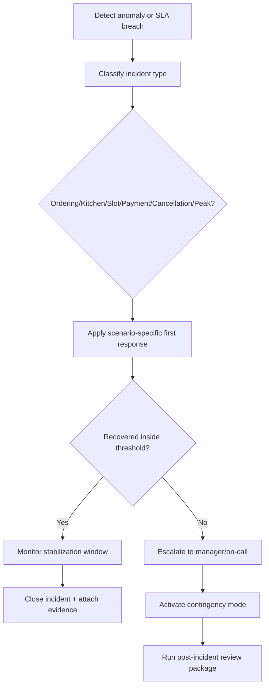

# Edge Cases - Restaurant Management System

This folder captures cross-cutting scenarios that can break service quality, kitchen coordination, stock integrity, billing correctness, security, or daily operations if they are not handled deliberately.

## Contents

- `table-service-and-ordering.md`
- `kitchen-and-preparation.md`
- `inventory-and-procurement.md`
- `billing-and-accounting.md`
- `delivery-and-channel-integration.md`
- `api-and-ui.md`
- `security-and-compliance.md`
- `operations.md`

## Cross-Flow Stress Scenarios (Ordering, Kitchen, Slots, Payments, Cancellations, Peak)

### 1) Ordering During Menu Volatility
1. Waiter creates draft while item availability is changing.
2. System revalidates on submit against latest availability snapshot.
3. If conflict detected, conflicting lines are isolated for quick substitute selection without losing remaining valid lines.

### 2) Kitchen Orchestration During Station Failure
1. Station heartbeat misses threshold; orchestrator marks station degraded.
2. New tickets reroute to fallback station if recipe/staff capability allows.
3. Existing in-prep tickets are either retained, reassigned, or canceled with manager confirmation and waste capture.

### 3) Table/Slot Conflict at Peak
1. Late reservation collides with already-seated walk-in due to delayed host action.
2. System triggers conflict policy: prioritize configured class (VIP/accessibility/prepaid) and auto-suggest alternatives.
3. Waitlist ETAs recompute and guest communication is pushed immediately.

### 4) Payment Split + Partial Reversal
1. Bill is split by seat and partially paid across card + cash.
2. One seat disputes an item after close.
3. System creates seat-scoped reversal, preserving other settled seats and keeping reconciliation lineage intact.

### 5) Cancellation Wave (Weather/Event Disruption)
1. Bulk reservation cancellations arrive in short interval.
2. Cancellation policy applies fee waiver rules by disruption category.
3. Released slots feed auto-promotion of waitlist entries with bounded notification rate limits.

### 6) Peak-Load Operational Guardrails
1. Load tier enters surge/critical based on queue depth and SLA-risk thresholds.
2. System enables simplified menu, slows reservation intake, and caps long-prep concurrency.
3. Controls auto-expire after sustained recovery window to avoid manual rollback errors.

## Implementation Runbook Expectations for These Scenarios

| Scenario Group | Detection Signal | First Response | Escalation Threshold |
|----------------|------------------|----------------|----------------------|
| Ordering anomalies | Validation conflict spike, submit retries | Freeze affected lines, keep valid subset flowing | >5% conflicts for 10 min |
| Kitchen instability | Station heartbeat loss, SLA breach | Reroute eligible tickets and enable surge sequencing | >1 critical station down >5 min |
| Slot/queue drift | ETA error drift, host override frequency | Switch to conservative ETA and reservation throttling | ETA p90 error >10 min |
| Payment degradation | Provider timeout/decline surge | Enable retry-safe fallback and async reconcile mode | Timeout >5% for 10 min |
| Cancellation waves | Bulk cancellation event rate | Apply disruption policy and bulk notification pipeline | >50 cancellations per 15 min |
| Peak-load overload | Queue lag + occupancy + pay wait score | Activate surge mode profile set | Critical tier for >15 min |

### Minimum Post-Incident Review Data
1. Timeline of mode transitions and operator actions.
2. Counts of canceled/refired/refunded entities by reason code.
3. SLA breach windows and affected guest/table cohorts.
4. Corrective action list with owner and due date.

## Incident Handling Flow (Mermaid)

## Scenario Simulation Coverage
- Run monthly game-day simulations for station outage, payment timeout storms, and bulk cancellation bursts.
- Validate that each simulation produces: timeline, action log, financial integrity check, and SLA impact summary.
- Track mean-time-to-detect and mean-time-to-recover as operational KPIs.
