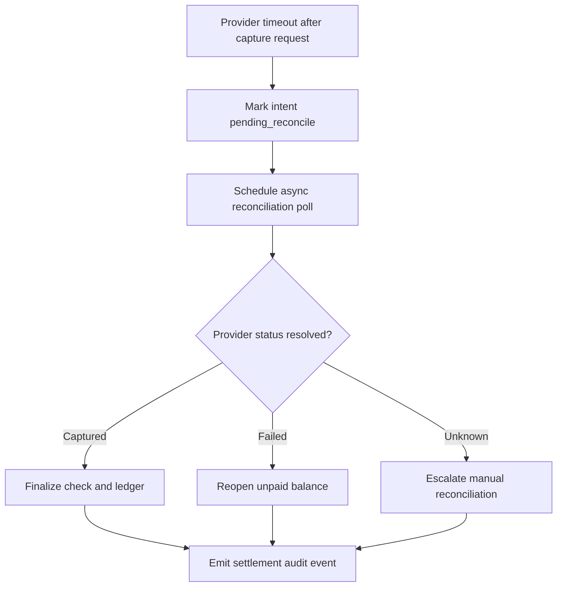

# Edge Cases - Billing and Accounting

| Scenario | Impact | Mitigation |
|----------|--------|------------|
| Payment succeeds externally but settlement confirmation is delayed | Bill closure ambiguity | Use idempotent settlement reconciliation with pending states |
| Refund requested after drawer session already closed | Financial traceability weakens | Route through supervised post-close adjustment workflow |
| Tax rules change mid-day | Billing inconsistency and audit risk | Version tax configuration and apply effective timestamps |
| Split bill totals do not exactly reconcile because of rounding | Settlement mismatch | Apply controlled rounding rules and record allocation decisions |
| Accounting export fails after branch close | Finance handoff blocked | Retain export queue with retry visibility and manual re-export controls |

## Settlement Integrity Controls

- Enforce deterministic rounding allocation order: discounts -> tax base -> tender split residues.
- Require idempotency key replay checks for every capture/void/refund API.
- Block day-close finalization while `pending_reconcile` intents remain unresolved beyond policy threshold.

### Payment Timeout Recovery Flow

