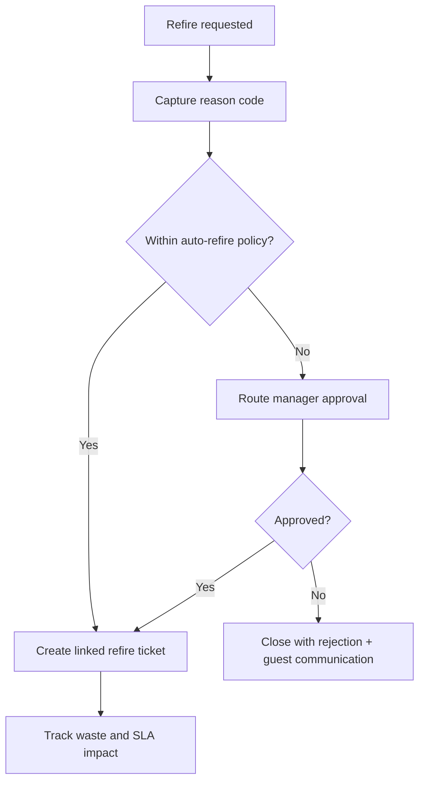

# Edge Cases - Kitchen and Preparation

| Scenario | Impact | Mitigation |
|----------|--------|------------|
| One station is overloaded while others are idle | Ticket delays and poor service timing | Surface station backlog and allow priority or reassignment rules |
| Chef discovers ingredient shortage after ticket acceptance | Order cannot be completed as entered | Emit shortage event back to service staff for substitution or approval |
| Item is marked ready but not picked up promptly | Food quality drops | Track pass timeouts and alert front-of-house staff |
| Refire requested after service complaint | Inventory and accountability drift | Record refire cause and connect it to original ticket history |
| Multi-course table requires staggered fire timing | Dishes arrive out of sequence | Use explicit course-fire states and waiter-controlled release timing |

## Station Degradation Strategy

| Trigger | Immediate Action | Recovery Signal |
|---------|------------------|-----------------|
| Station heartbeat loss | Mark station degraded and stop new assignment | Heartbeat stable for 3 intervals |
| Queue depth critical | Enable short-prep prioritization profile | Queue lag below threshold for 10 minutes |
| Ingredient exhaustion | Suspend dependent lines and surface substitutions | Ingredient restocked and validated |

### Refire Governance Flow

