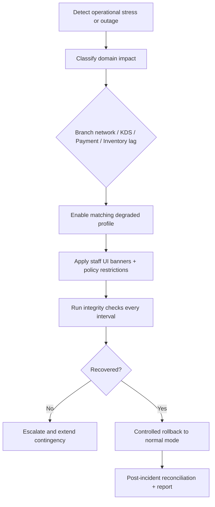

# Edge Cases - Operations

| Scenario | Impact | Mitigation |
|----------|--------|------------|
| Branch network outage occurs during dinner rush | Service continuity is at risk | Provide degraded-mode order capture and reconciliation workflow |
| Kitchen printer or display fails mid-service | Ticket flow breaks | Support fallback print/display paths and health monitoring |
| Inventory projection jobs lag during heavy order volume | Stock visibility becomes stale | Monitor queue freshness and autoscale processing |
| Day close is attempted with open tables or unsettled bills | Financial closure becomes incorrect | Block close until critical exceptions are resolved or explicitly approved |
| Branch clock drift affects shift, kitchen, and settlement events | Audit and reporting order breaks | Standardize time synchronization and server-authoritative event timestamps |

## Peak-Load and Degraded-Mode Run Sequence

## Operational KPIs for Edge Governance

| KPI | Target | Source |
|-----|--------|--------|
| MTTD (critical incidents) | < 3 minutes | monitoring and alerting |
| MTTR (critical incidents) | < 20 minutes | incident timeline |
| Degraded-mode order loss | 0 | reconciliation audit |
| Unreconciled payment intents after close | 0 (or approved exception) | settlement controls |
