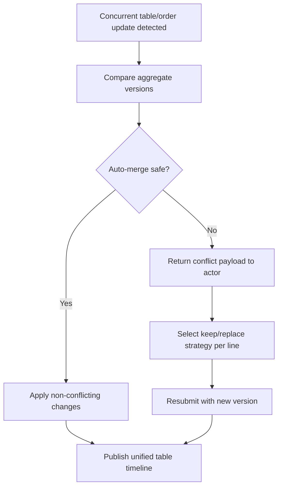

# Edge Cases - Table Service and Ordering

| Scenario | Impact | Mitigation |
|----------|--------|------------|
| Party size exceeds reserved table capacity on arrival | Seating flow breaks | Support table merge suggestions and revised seating status |
| Same table receives concurrent edits from host and waiter | Order or seating confusion | Use optimistic locking and role-aware conflict messaging |
| Guest changes order after items have been fired to kitchen | Cost and service timing drift | Require post-fire change workflow with approvals where needed |
| Bill needs to be split after many seat-level items | Settlement complexity rises | Preserve seat ownership and item-level billing lineage |
| Walk-in waitlist grows faster than reservation throughput | Host desk loses visibility | Provide priority rules, ETA visibility, and escalation indicators |

## Detailed Handling Playbook

### Conflict Resolution Order
1. Preserve guest safety constraints (allergies/accessibility).
2. Preserve financial lineage (seat/item ownership).
3. Preserve service SLA where possible with substitutions.
4. Escalate to manager when policy or fairness conflict remains.

### Seat/Order Conflict Flow

