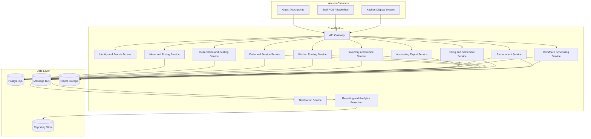
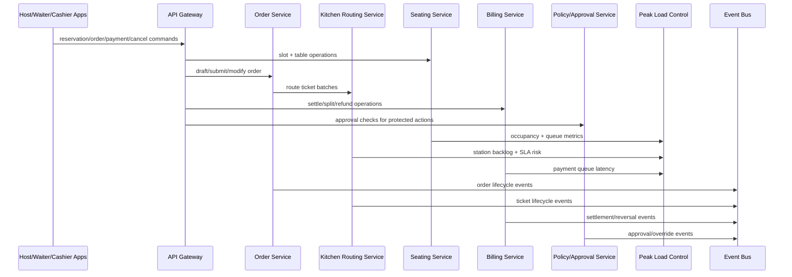

# Architecture Diagram - Restaurant Management System

## Responsibilities

| Component | Responsibility |
|-----------|----------------|
| Reservation and Seating Service | Reservations, walk-ins, waitlist, table assignment |
| Menu and Pricing Service | Menus, modifiers, taxes, discounts, availability |
| Order and Service Service | Guest checks, table orders, course timing, status tracking |
| Kitchen Routing Service | Ticket routing, station queues, prep status, refire handling |
| Inventory and Recipe Service | Ingredient stock, BOM usage, wastage, transfer and count logic |
| Procurement Service | Vendors, purchase orders, receiving, discrepancy handling |
| Billing and Settlement Service | Bills, taxes, split settlement, refunds, drawer sessions |
| Workforce Scheduling Service | Shift planning, attendance, operational staffing visibility |
| Accounting Export Service | Reconciliation outputs and external finance handoff |

## Runtime Interaction View for Requested Flows

## NFR Allocation by Component

| Component | Primary NFR Responsibility | Measurement |
|-----------|----------------------------|-------------|
| API Gateway | low-latency ingress and rate protection | p95 request latency + rejection rate |
| Seating Service | no-overbook and ETA quality | slot conflict rate + ETA error |
| Order Service | consistency under concurrent edits | optimistic lock conflict recovery success |
| Kitchen Routing Service | station fairness and freshness | ticket queue lag + overdue ratio |
| Billing Service | financial correctness + idempotency | settlement mismatch + duplicate-capture count |
| Policy Service | approval integrity | policy decision latency + override audit completeness |
| Peak Load Control | automatic adaptation | tier transition correctness and recovery time |
