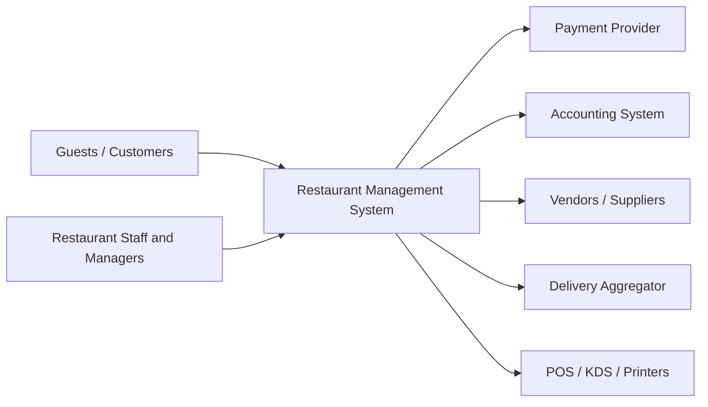
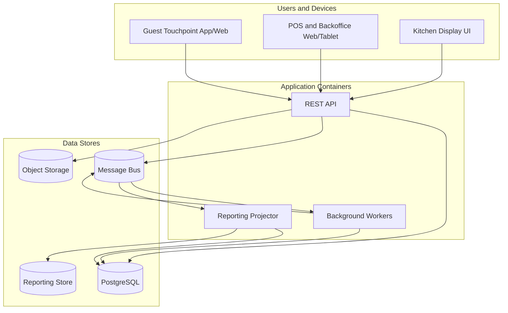

# C4 Context and Container Diagrams - Restaurant Management System

## C4 Context

```mermaid
flowchart LR
    guests[Guests / Customers]
    staff[Restaurant Staff and Managers]
    payment[Payment Provider]
    accounting[Accounting System]
    vendors[Vendors / Suppliers]
    delivery[Delivery Aggregator]
    devices[POS / KDS / Printers]

    system[Restaurant Management System]

    guests --> system
    staff --> system
    system --> payment
    system --> accounting
    system --> vendors
    system --> delivery
    system --> devices
```

## C4 Container

```mermaid
flowchart TB
    subgraph users[Users and Devices]
        guestUI[Guest Touchpoint App/Web]
        staffUI[POS and Backoffice Web/Tablet]
        kitchenUI[Kitchen Display UI]
    end

    subgraph app[Application Containers]
        api[REST API]
        workers[Background Workers]
        projector[Reporting Projector]
    end

    subgraph stores[Data Stores]
        db[(PostgreSQL)]
        queue[(Message Bus)]
        reporting[(Reporting Store)]
        blob[(Object Storage)]
    end

    guestUI --> api
    staffUI --> api
    kitchenUI --> api
    api --> db
    api --> queue
    api --> blob
    workers --> db
    workers --> queue
    projector --> db
    projector --> reporting
    queue --> workers
    queue --> projector
```
