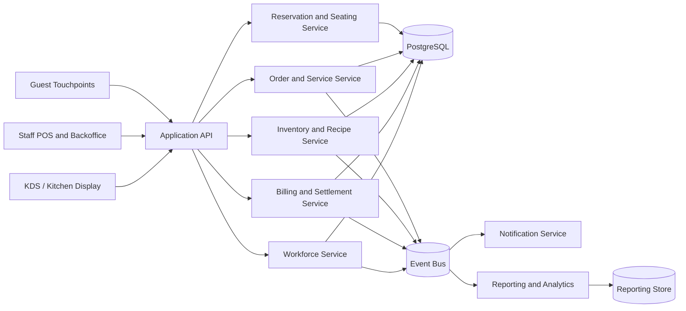

# Data Flow Diagram - Restaurant Management System

## Data Flow Notes

1. Service, kitchen, inventory, settlement, and workforce events are treated as operationally linked streams.
2. Transactional consistency remains in the primary database while reporting and analytics consume projected events.
3. Inventory visibility should be fast enough to influence order capture and kitchen execution before settlement time.
