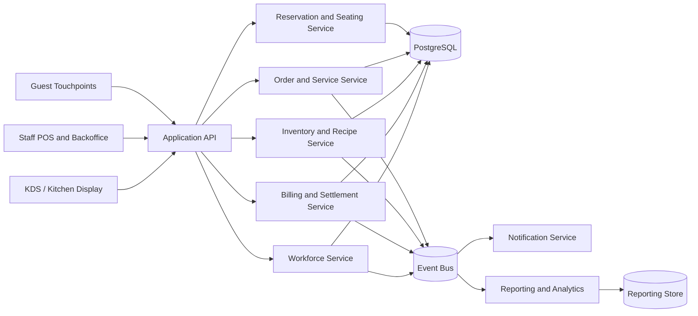

# Data Flow Diagram - Restaurant Management System

## Data Flow Notes

1. Service, kitchen, inventory, settlement, and workforce events are treated as operationally linked streams.
2. Transactional consistency remains in the primary database while reporting and analytics consume projected events.
3. Inventory visibility should be fast enough to influence order capture and kitchen execution before settlement time.

## Cross-Flow Event Taxonomy (Implementation-Oriented)

| Event Group | Producer Services | Consumer Services | Required Keys |
|-------------|-------------------|-------------------|---------------|
| Ordering | Order Service | Kitchen, Inventory, Reporting | `order_id`, `branch_id`, `version`, `correlation_id` |
| Kitchen orchestration | Kitchen Service | Waiter/POS projection, Reporting | `ticket_id`, `station_id`, `state`, `promised_ready_at` |
| Slot/table | Seating Service | Host projection, Notifications | `slot_id`, `table_group`, `eta`, `hold_expires_at` |
| Payments | Billing Service | Reconciliation, Reporting | `check_id`, `payment_intent_id`, `amount`, `tender_type` |
| Cancellations | Policy/Billing/Order | Audit, Notifications, Reporting | `decision_id`, `reason_code`, `financial_delta` |
| Peak-load | Load Control | Seating, Menu, Kitchen, POS policy | `tier`, `trigger_metric`, `effective_from` |

## Data Freshness and Consistency Targets
- Host and waiter projections: target < 2 seconds propagation lag.
- Kitchen station queues: target < 1 second perceived freshness for in-prep transitions.
- Payment and reversal projections: target < 3 seconds end-to-end from provider callback.
- Audit/event store writes are append-only and immutable for compliance reconstruction.
