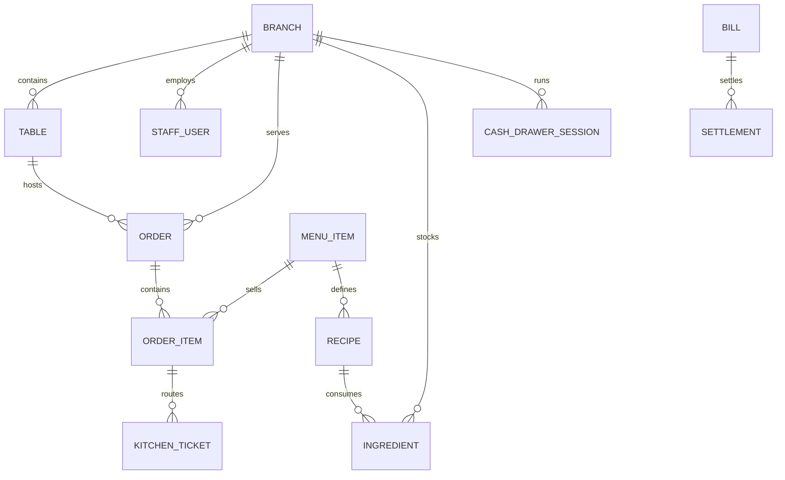
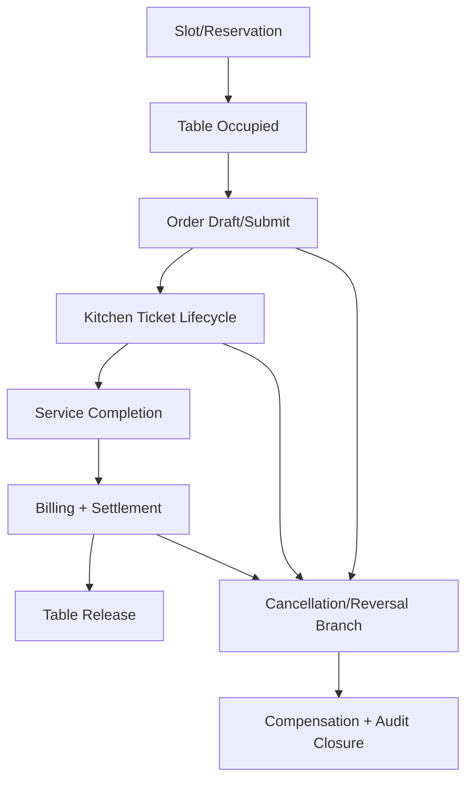

# Domain Model - Restaurant Management System

## Core Domain Areas

| Domain Area | Key Concepts |
|-------------|--------------|
| Branch and Workforce | Branch, ServiceZone, StaffUser, Shift, AttendanceRecord |
| Guest Service | Reservation, WaitlistEntry, Table, Order, OrderItem |
| Kitchen Execution | KitchenTicket, Station, FireRule, PreparationState |
| Menu and Pricing | MenuItem, Category, ModifierGroup, PriceRule, TaxRule |
| Inventory and Procurement | Ingredient, Recipe, StockLedgerEntry, PurchaseOrder, GoodsReceipt |
| Billing and Accounting | Bill, Settlement, CashDrawerSession, AccountingExport |
| Operations | Notification, AuditLog, DashboardMetric |

## Relationship Summary
- A **branch** owns tables, shifts, stock, orders, bills, and drawer sessions.
- An **order** contains many order items and may generate many kitchen tickets and settlements.
- A **menu item** may depend on a recipe composed of many ingredients.
- **Accounting exports** aggregate settlement and reconciliation outcomes without becoming a full general ledger.

## Domain Invariants (Must Hold)

- A table cannot be `available` while an associated check is open unless explicitly transferred.
- A check cannot move to `paid` if any linked payment intent is unresolved.
- A kitchen ticket must reference exactly one order line and one target station.
- A cancellation/reversal must link to a policy decision record.
- A peak-load tier change must reference measured trigger metrics.

## Cross-Flow Domain Lifecycle Map

