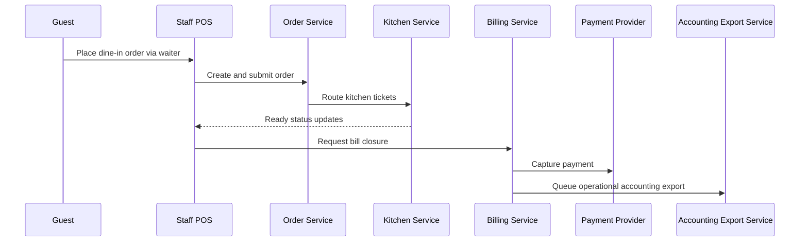
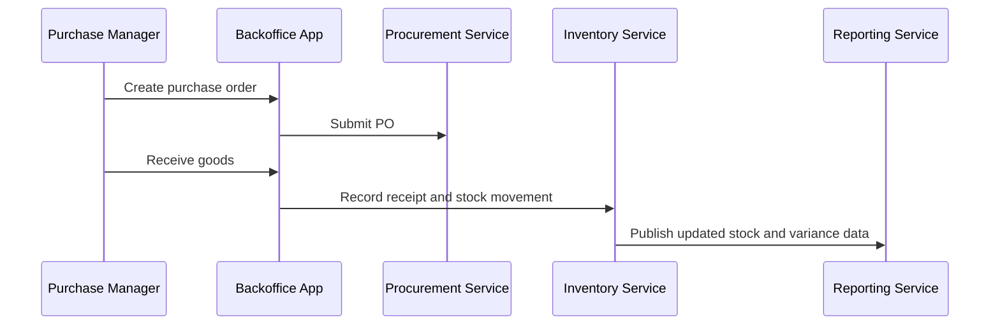
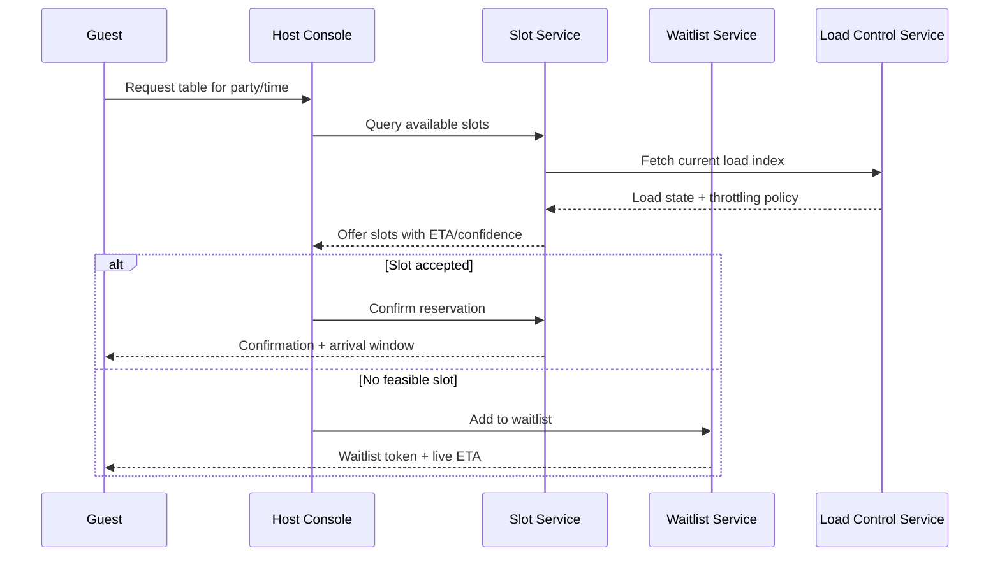
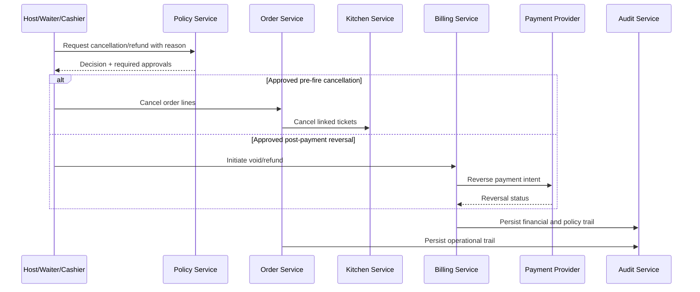
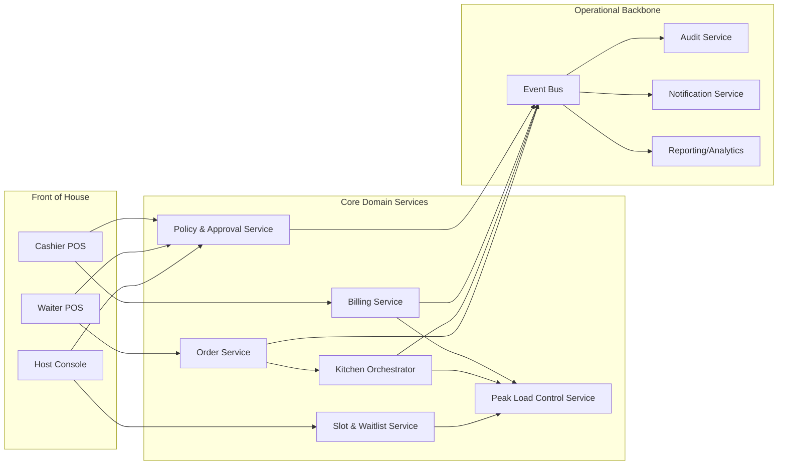
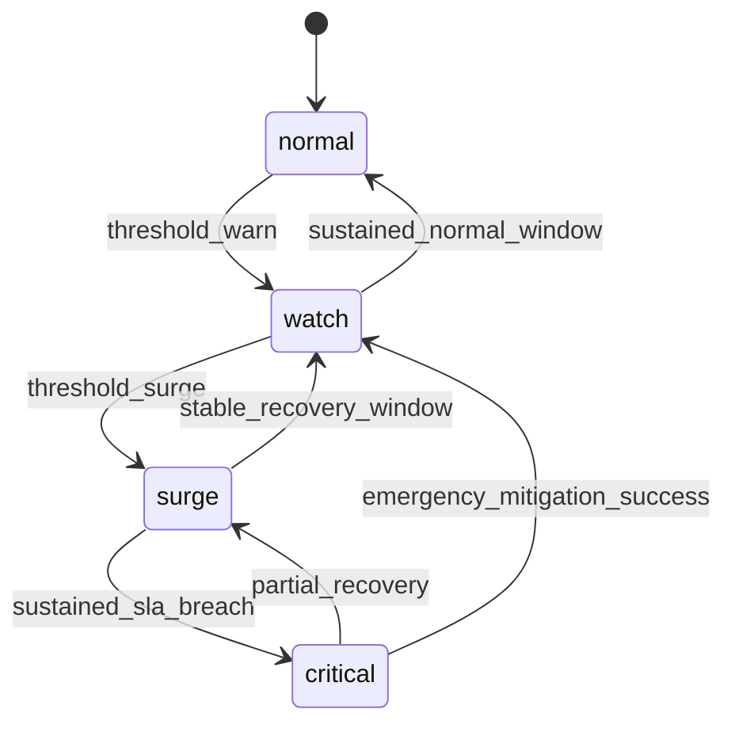

# System Sequence Diagram - Restaurant Management System

## Table Order to Settlement Sequence

## Procurement to Inventory Availability Sequence

## Reservation Slot to Seating Under Peak Load

## Cancellation and Payment Reversal Sequence

## Cross-Flow Responsibility Boundaries

| Capability | System of Record | Decision Owner | Fallback Behavior |
|------------|------------------|----------------|-------------------|
| Slot allocation and ETA | Slot/Waitlist Service | Host + Load Control | Switch to conservative ETA and throttle bookings |
| Ticket sequencing and station routing | Kitchen Orchestrator | Expediter + Policy Engine | Freeze reroute and prioritize shortest prep items |
| Split settlement and reversal | Billing Service | Cashier + Manager policy | Enter pending reconcile queue with manual review |
| Cancellation approval | Policy Service | Role/threshold matrix | Defer to manager queue if policy ambiguity detected |
| Surge-mode toggling | Load Control Service | Automated thresholds + manager override | Auto-recover after stable window |

## Sequence-Level NFR Budgets
- Host UI slot query end-to-end budget: **<= 800 ms p95**.
- Order submit acknowledgment budget: **<= 1200 ms p95**.
- Kitchen status fan-out freshness budget: **<= 2 s** from station change.
- Payment status propagation budget: **<= 3 s** from provider callback.
- Cancellation decision budget (no escalation): **<= 1 s**.

## Cross-Flow Service Collaboration Map

## Peak-Load Tier State Model

