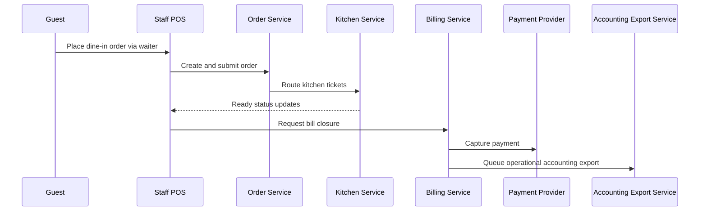
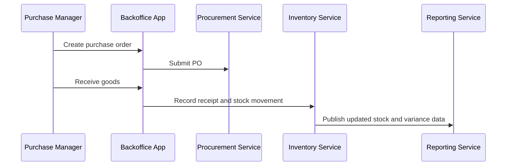

# System Sequence Diagram - Restaurant Management System

## Table Order to Settlement Sequence

```mermaid
sequenceDiagram
    participant Guest as Guest
    participant POS as Staff POS
    participant Order as Order Service
    participant Kitchen as Kitchen Service
    participant Billing as Billing Service
    participant Payment as Payment Provider
    participant Export as Accounting Export Service

    Guest->>POS: Place dine-in order via waiter
    POS->>Order: Create and submit order
    Order->>Kitchen: Route kitchen tickets
    Kitchen-->>POS: Ready status updates
    POS->>Billing: Request bill closure
    Billing->>Payment: Capture payment
    Billing->>Export: Queue operational accounting export
```

## Procurement to Inventory Availability Sequence

```mermaid
sequenceDiagram
    participant PM as Purchase Manager
    participant Backoffice as Backoffice App
    participant Procurement as Procurement Service
    participant Inventory as Inventory Service
    participant Reporting as Reporting Service

    PM->>Backoffice: Create purchase order
    Backoffice->>Procurement: Submit PO
    PM->>Backoffice: Receive goods
    Backoffice->>Inventory: Record receipt and stock movement
    Inventory->>Reporting: Publish updated stock and variance data
```
