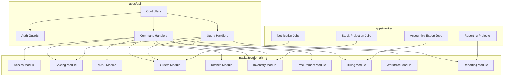
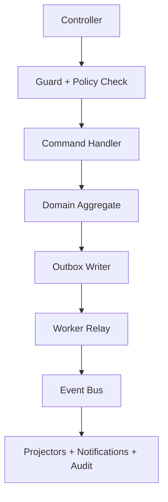

# C4 Code Diagram - Restaurant Management System

## Code-Level Boundaries for Requested Flows

| Module | Interfaces to Implement | Key Tests |
|--------|--------------------------|-----------|
| orders | `submitOrder`, `mergeOrderConflicts`, `emitOrderEvents` | concurrency + idempotency |
| kitchen | `routeTickets`, `updateTicketState`, `handleRefire` | routing and SLA timing |
| billing | `splitCheck`, `captureIntent`, `reversePayment` | settlement integrity |
| seating | `quoteSlot`, `confirmSlot`, `releaseTable` | no-overbook and ETA |
| policy | `evaluateAction`, `requireApproval`, `recordDecision` | approval matrix coverage |
| load-control | `evaluateTier`, `applyTierPolicies`, `recoverTier` | tier transition correctness |

## Internal Command/Event Flow

