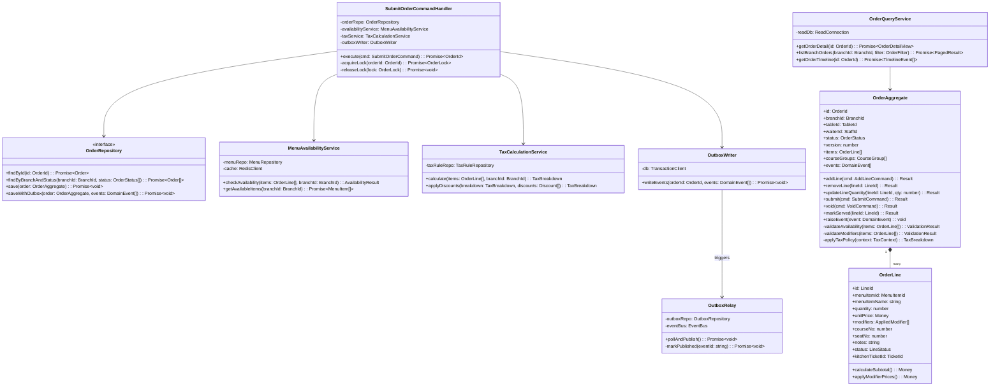
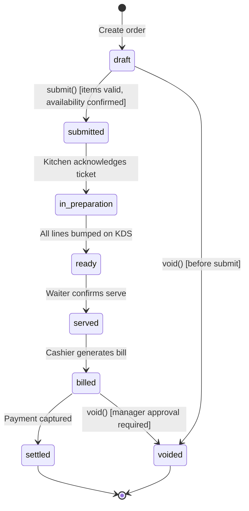
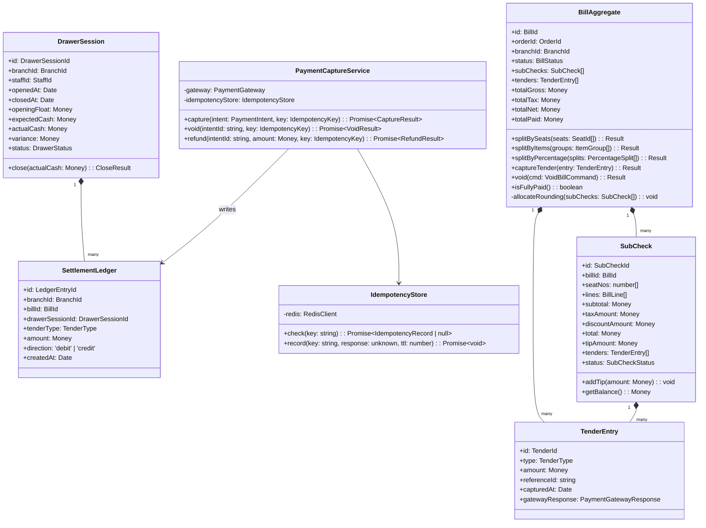
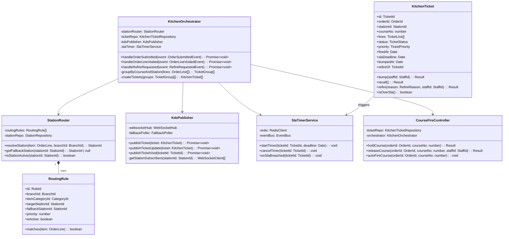
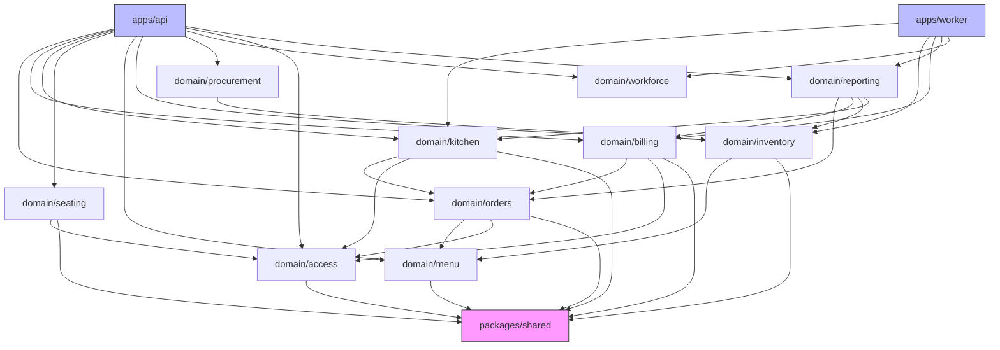
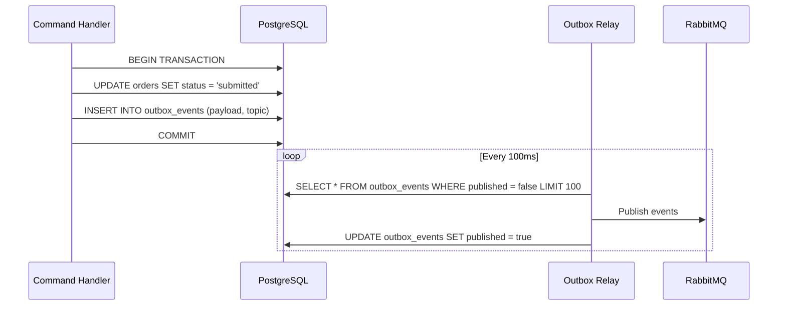
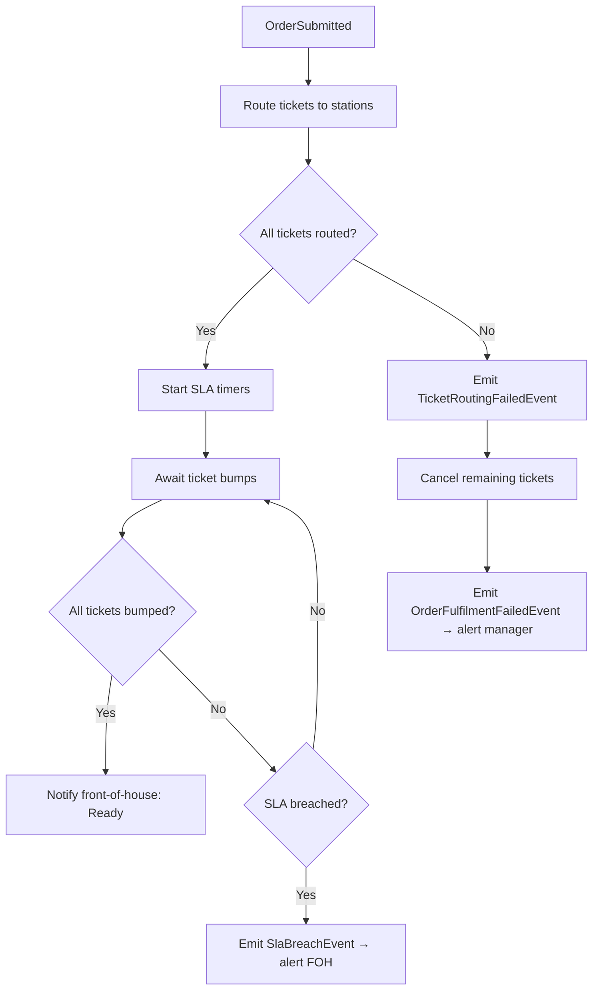

# C4 Code Diagrams - Restaurant Management System

## Overview

This document presents Level 4 C4 diagrams — the code-level view of key services and modules in the Restaurant Management System. Where the C4 component diagrams (Level 3) show which components exist within each service container, these diagrams show the internal class and module structure, key design patterns applied, and how the modules relate to each other at the code level.

The system is built as a modular monolith with clear domain package boundaries. Each domain package (orders, kitchen, billing, inventory, seating, etc.) follows the same internal structure: entities, commands, queries, events, repositories, and policy hooks. The API application and worker application are thin shells that wire these domain packages together via NestJS dependency injection.

---

## Level 4: Code Structure — Order Service

The Order Service is the most critical domain package. It manages the full lifecycle of a restaurant order from draft creation through billing. It uses the Aggregate pattern, the Outbox pattern for reliable event publishing, and optimistic locking for concurrent write safety.



### Order Status State Machine


---

## Level 4: Code Structure — Billing Service

The Billing Service handles check generation, split strategies, multi-tender payment capture, and reconciliation. It enforces deterministic rounding and preserves an immutable financial ledger.



---

## Level 4: Code Structure — Kitchen Orchestrator

The Kitchen Orchestrator is responsible for receiving submitted orders, routing individual lines to the correct kitchen stations, managing ticket lifecycle on the KDS, and propagating delays back to front-of-house.



---

## Module Dependency Graph

This diagram shows the allowed dependency directions between domain packages. Dependencies only flow downward or toward shared utilities. No circular dependencies are permitted.



---

## Key Design Patterns

### Repository Pattern

Each domain aggregate has a typed repository interface defined in the domain package. The implementation lives in the infrastructure layer (TypeORM adapters). This keeps domain logic free of ORM concerns.

```typescript
// Domain interface (packages/domain/orders/src/repositories/order.repository.ts)
export interface IOrderRepository {
  findById(id: OrderId, options?: FindOptions): Promise<Order | null>;
  findByBranchAndStatus(
    branchId: BranchId,
    statuses: OrderStatus[],
    pagination: Pagination,
  ): Promise<PagedResult<Order>>;
  save(order: Order, trx?: TransactionClient): Promise<void>;
}

// Infrastructure implementation (apps/api/src/infrastructure/typeorm/order.repository.ts)
@Injectable()
export class TypeOrmOrderRepository implements IOrderRepository {
  constructor(
    @InjectRepository(OrderEntity)
    private readonly repo: Repository<OrderEntity>,
  ) {}

  async findById(id: OrderId): Promise<Order | null> {
    const entity = await this.repo.findOne({
      where: { id },
      relations: ['lines', 'lines.modifiers'],
    });
    return entity ? OrderMapper.toDomain(entity) : null;
  }
}
```

### CQRS Pattern

Commands mutate state through aggregates; queries read from optimised read models.

```typescript
// Command side — goes through domain aggregate
@CommandHandler(SubmitOrderCommand)
export class SubmitOrderHandler implements ICommandHandler<SubmitOrderCommand> {
  async execute(cmd: SubmitOrderCommand): Promise<void> {
    const order = await this.orderRepo.findById(cmd.orderId);
    const result = order.submit(cmd);
    if (!result.ok) throw result.error;
    await this.orderRepo.saveWithOutbox(order, order.consumeEvents());
  }
}

// Query side — reads from denormalised projection table
@QueryHandler(OrderDetailQuery)
export class OrderDetailHandler implements IQueryHandler<OrderDetailQuery> {
  async execute(query: OrderDetailQuery): Promise<OrderDetailView> {
    return this.readDb.query(
      `SELECT * FROM v_order_detail WHERE id = $1 AND branch_id = $2`,
      [query.orderId, query.branchId],
    );
  }
}
```

### Outbox Pattern

Domain events are written atomically with the aggregate state change into an `outbox_events` table. A background relay polls and publishes them to RabbitMQ, guaranteeing at-least-once delivery without distributed transactions.



### Saga Pattern (Order Fulfilment Saga)

Long-running processes that span multiple services are coordinated with sagas. The order fulfilment saga listens for domain events and issues compensating commands on failure.



---

## Database Access Layer

### Connection Pool Configuration
```typescript
// apps/api/src/config/database.config.ts
export const databaseConfig: TypeOrmModuleOptions = {
  type: 'postgres',
  url: process.env.DATABASE_URL,
  pool: {
    min: parseInt(process.env.DATABASE_POOL_MIN ?? '2'),
    max: parseInt(process.env.DATABASE_POOL_MAX ?? '20'),
  },
  extra: {
    statement_timeout: 30_000,     // 30 seconds max per statement
    idle_in_transaction_session_timeout: 60_000,
  },
  migrations: ['dist/migrations/*.js'],
  migrationsRun: false,            // Always run migrations explicitly, not on startup
  logging: process.env.NODE_ENV === 'development' ? 'all' : ['error', 'warn'],
};
```

### Transaction Management
```typescript
// Use explicit transactions for operations that span multiple writes
async function submitOrderWithOutbox(
  order: Order,
  events: DomainEvent[],
  dataSource: DataSource,
): Promise<void> {
  await dataSource.transaction(async (trx) => {
    await trx.save(OrderEntity, OrderMapper.toEntity(order));
    await trx.insert(OutboxEventEntity, events.map(OutboxMapper.toEntity));
  });
  // Transaction committed — outbox relay will pick up events asynchronously
}
```

### Read Model Projections
```sql
-- Materialised view for fast order dashboard queries
CREATE MATERIALIZED VIEW v_branch_order_summary AS
SELECT
  o.branch_id,
  o.status,
  COUNT(*)                         AS order_count,
  SUM(o.total_amount)              AS total_revenue,
  AVG(EXTRACT(EPOCH FROM (o.submitted_at - o.created_at))) AS avg_draft_seconds
FROM orders o
WHERE o.deleted_at IS NULL
GROUP BY o.branch_id, o.status;

-- Refresh every 5 minutes via cron job
REFRESH MATERIALIZED VIEW CONCURRENTLY v_branch_order_summary;
```
