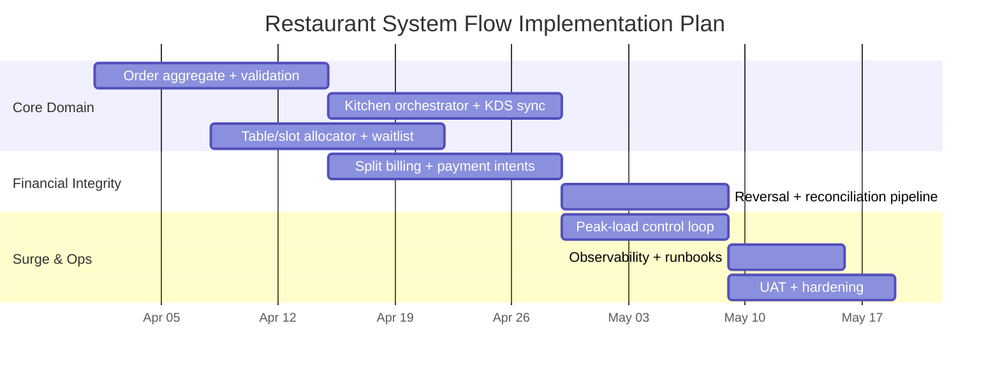

# Implementation Playbook - Restaurant Management System

## 1. Delivery Goal
Build a production-ready restaurant management platform that connects service, kitchen, inventory, cashier settlement, reconciliation, branch operations, and limited guest-facing touchpoints in one operational system.

## 2. Recommended Delivery Workstreams
- Access control, branch configuration, and role policies
- Reservations, table management, and front-of-house order capture
- Menu, pricing, modifiers, and tax configuration
- Kitchen routing, preparation states, and service coordination
- Inventory, recipes, procurement, receiving, and stock counting
- Billing, settlement, cash sessions, and accounting exports
- Shift scheduling, attendance, reporting, notifications, and integrations

## 3. Suggested Execution Order
1. Establish branches, roles, policies, tables, and device/integration foundations.
2. Implement seating, reservations, menus, and front-of-house order capture.
3. Add kitchen routing, KDS workflows, and service-state feedback loops.
4. Implement recipe-based inventory, procurement, receiving, and stock controls.
5. Add billing, payments, refunds, cashier sessions, and accounting exports.
6. Complete shift scheduling, reporting, notifications, and branch day-close operations.

## 4. Release-Blocking Validation
- Unit coverage for tax, discount, routing, recipe depletion, and reconciliation logic
- Integration coverage for seat-to-order, order-to-kitchen, kitchen-to-service, bill-to-settlement, and PO-to-stock traceability
- Security validation for branch scoping, approval controls, refund restrictions, and payment-data handling
- Performance validation for peak-order routing, KDS freshness, bill generation, and reporting lag
- Backup, restore, and audit-retention verification

## 5. Go-Live Checklist
- [ ] Role matrix and branch scopes validated
- [ ] Reservation, seating, ordering, and kitchen workflows tested end to end
- [ ] Inventory depletion, receiving, stock counts, and variance approvals validated
- [ ] Billing, refunds, drawer close, and accounting export flows verified
- [ ] Shift scheduling, attendance, alerts, and day-close checks enabled
- [ ] Device, printer/KDS, and degraded-mode runbooks rehearsed

## 6. Detailed Flow Implementation Slices

### 6.1 Ordering Flow Slice
- Build draft-order aggregate with versioned writes and conflict detection.
- Add validation pipeline (availability, modifier constraints, tax/discount policy checks).
- Implement submit action that atomically persists order + emits ticket-routing events.
- Add telemetry for order-submit latency and validation failure taxonomy.

### 6.2 Kitchen Orchestration Slice
- Implement orchestration service that groups lines by station and course dependencies.
- Add per-station SLA timers and delay propagation to front-of-house channels.
- Implement refire workflow with mandatory root-cause coding.
- Expose expediter controls for prioritized batches during surge.

### 6.3 Table/Slot Management Slice
- Implement slot allocator with party-size fit, buffer rules, and merge/split table graph.
- Add waitlist promotion engine driven by real-time turnover predictions.
- Support table lifecycle states (`reserved`, `occupied`, `cleaning`, `ready`, `blocked`).
- Add safeguards so unpaid checks or incidents can block automatic release.

### 6.4 Payments and Reconciliation Slice
- Model check splitting as deterministic child-check generation with immutable lineage.
- Integrate idempotent payment intent layer for retries and duplicate protection.
- Implement drawer/session totals with reconciliation exception queue.
- Generate export bundles for sales, tax, refunds, and tender totals.

### 6.5 Cancellations and Reversals Slice
- Create cancellation policy matrix keyed by lifecycle stage, role, and threshold.
- Emit compensating events for stock rollback, ticket cancellation, and payment reversal.
- Introduce reason-code catalog for analytics and abuse detection.
- Ensure every reversal links to original transaction IDs and approval artifacts.

### 6.6 Peak-Load Controls Slice
- Build control loop service consuming queue depth, occupancy, and payment latency metrics.
- Implement dynamic throttles: reservation pacing, wait-time inflation, and surge menu profile.
- Add kitchen concurrency caps and non-critical operation guardrails.
- Validate automatic recovery transitions to return branch to normal mode safely.

## 7. Implementation Readiness Milestones

### Milestone A: Core Flow Backbone
- Deliver order aggregate, ticket fan-out, and table lifecycle state machine with contract tests.
- Exit criteria:
  - 100% of order lines traceable from submit to terminal state.
  - No duplicate kitchen tickets under retry storm simulation.

### Milestone B: Financial Integrity
- Deliver split-check engine, multi-tender settlement, and reversal orchestration.
- Exit criteria:
  - Deterministic totals across split strategies and tax regimes.
  - Reconciliation mismatch rate <= 0.1% in synthetic load run.

### Milestone C: Surge and Resilience
- Deliver peak-load control loop, throttling hooks, and auto-recovery behavior.
- Exit criteria:
  - System maintains configured SLA during 2x expected peak traffic.
  - Surge mode auto-enters/exits without operator intervention in soak tests.

## 8. Test Matrix for Requested Flows

| Flow | Test Types | Minimum Coverage |
|------|------------|------------------|
| Ordering | Unit + API contract + concurrency | Draft/submit conflicts, availability races, modifier validation |
| Kitchen orchestration | Integration + simulation | Station reroute, dependency gating, refire causality |
| Table/slot management | Property + integration | No-overbook invariant, waitlist promotion order |
| Payments | Unit + provider stub + reconciliation | Split totals, partial failures, idempotent retries |
| Cancellations | Policy matrix + audit assertions | Window checks, approval tiers, compensation generation |
| Peak-load controls | Load + chaos + recovery | Tier transitions, degraded-mode correctness, rollback safety |

## 9. Definition of Done (Documentation-to-Build)
- API contracts published with versioning and sample payloads.
- Domain state machines finalized with allowed transitions and guard conditions.
- Observability dashboards include per-flow SLO and error-budget views.
- Runbooks include surge activation, provider outage handling, and rollback decision tree.
- UAT scripts cover at least one normal, one exception, and one recovery path per flow.

## 10. Program-Level Delivery Diagram (Mermaid)

## 11. Service Backlog Breakdown

| Service | Must-have backlog items | Completion Signal |
|---------|--------------------------|-------------------|
| Order Service | Draft versioning, availability validation, submit idempotency | No lost/duplicate orders in concurrency tests |
| Kitchen Orchestrator | Station routing, dependency gates, delay/refire signaling | SLA dashboard stable under load test |
| Slot/Waitlist Service | Overbooking guard, ETA prediction, promotion ordering | ETA and fairness KPIs within target band |
| Billing Service | Split checks, multi-tender capture, refund handling | Reconciliation mismatch below threshold |
| Policy Service | Approval matrix, dual-approval, override audit links | 100% policy-bound actions traceable |
| Load Control Service | Tier calculations, throttle toggles, recovery timers | Auto-enter/exit surge validated in soak test |
