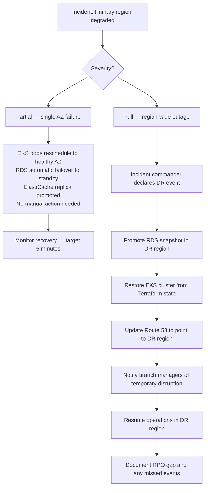

# Cloud Architecture - Restaurant Management System

## Overview

This document describes the cloud architecture for the Restaurant Management System (RMS), using AWS as the reference provider. Equivalent services on GCP and Azure are noted where relevant. The architecture is designed to support multi-branch restaurant groups with high availability, data durability, and the ability to scale elastically during peak service periods.

**Design Goals:**
- **High Availability**: Multi-AZ deployment; no single point of failure for branch-critical operations.
- **Data Durability**: RPO ≤ 5 minutes for orders and financial data; PITR on all transactional databases.
- **Elastic Scale**: Auto-scaling triggered by both infrastructure metrics (CPU, memory) and business metrics (queue depth, open ticket count).
- **Security**: PCI DSS scoping for payment components; defence-in-depth at every layer.
- **Cost Efficiency**: Spot instances for non-critical workers; reserved instances for stable baseline load.

---

## Cloud Architecture Diagram

```mermaid
flowchart TB
    subgraph Users["Users & Devices"]
        GuestMobile["Guest Mobile/Browser"]
        POSTablet["Branch POS Tablets"]
        KDSScreen["Branch KDS Screens"]
        ManagerApp["Manager Mobile App"]
    end

    subgraph Edge["Edge & Protection Layer"]
        Route53["Route 53\n(DNS Routing)"]
        Shield["AWS Shield Advanced\n(DDoS)"]
        CloudFront["CloudFront\n(CDN + Static Assets)"]
        WAF["AWS WAF v2\n(OWASP + Custom Rules)"]
        CertMgr["ACM\n(TLS Certificates)"]
    end

    subgraph Compute["Compute Layer — EKS Cluster (eu-west-1)"]
        ALB["Application Load Balancer\n(multi-AZ)"]
        subgraph AppPods["Application Pods"]
            API["api-service\n(3–10 pods)\nNestJS + TypeScript"]
            Worker["worker-service\n(2–6 pods)\nQueue Consumers"]
            WSHub["ws-service\n(2–4 pods)\nWebSocket Hub"]
            KitchenOrch["kitchen-orchestrator\n(2–4 pods)"]
        end
        HPA["HPA\n(CPU + queue depth)"]
        Karpenter["Karpenter\n(Node Autoscaler)"]
    end

    subgraph DataLayer["Data Layer — Private Subnets"]
        RDSPrimary["RDS PostgreSQL 15\nMulti-AZ Primary\n(db.r6g.xlarge)"]
        RDSReplica["RDS PostgreSQL 15\nRead Replica\n(db.r6g.large)"]
        ElastiCache["ElastiCache Redis 7\nCluster Mode\n(cache.r6g.large × 3)"]
        AmazonMQ["Amazon MQ\n(RabbitMQ 3.11)\n3-node cluster"]
        ES["Amazon OpenSearch\n(Elasticsearch 8)\n3 nodes"]
        S3["S3 Buckets\n(receipts, images,\nexports, backups)"]
        S3Glacier["S3 Glacier\n(Long-term audit logs\n+ compliance archives)"]
    end

    subgraph Messaging["Async & Integration"]
        EventBridge["EventBridge\n(Scheduled jobs,\nCross-service events)"]
        SQS["SQS DLQ\n(Failed message recovery)"]
        SES["SES\n(Transactional email)"]
        SNS["SNS\n(SMS + Push notifications)"]
    end

    subgraph Observability["Observability Stack"]
        CloudWatch["CloudWatch\n(Metrics + Logs + Alarms)"]
        OTel["OpenTelemetry Collector"]
        AMP["Amazon Managed Prometheus"]
        AMG["Amazon Managed Grafana"]
        XRay["AWS X-Ray / Jaeger"]
        PagerDuty["PagerDuty\n(On-call routing)"]
    end

    subgraph Security["Security Services"]
        IAMRoles["IAM Roles\n(IRSA — pod identity)"]
        SecretsManager["AWS Secrets Manager\n(DB creds, API keys)"]
        PrivateCA["AWS Private CA\n(mTLS certs)"]
        GuardDuty["GuardDuty\n(Threat detection)"]
        SecurityHub["Security Hub\n(Compliance dashboard)"]
        KMS["AWS KMS\n(Encryption at rest)"]
    end

    subgraph ExternalServices["External Services"]
        PayGW["Payment Gateway\n(Stripe / Adyen)"]
        DeliveryPlatform["Delivery Platforms\n(Uber Eats, DoorDash)"]
        AccountingExport["Accounting Systems\n(QuickBooks, Xero)"]
    end

    GuestMobile --> Route53
    POSTablet -->|Site-to-Site VPN| Route53
    KDSScreen -->|Site-to-Site VPN| Route53
    ManagerApp --> Route53
    Route53 --> CloudFront
    Route53 --> Shield
    CloudFront --> WAF
    WAF --> ALB
    ALB --> API
    ALB --> WSHub
    API --> RDSPrimary
    API --> RDSReplica
    API --> ElastiCache
    API --> AmazonMQ
    API --> ES
    API --> S3
    API --> SecretsManager
    API --> IAMRoles
    Worker --> AmazonMQ
    Worker --> RDSPrimary
    Worker --> S3
    Worker --> SES
    Worker --> SNS
    KitchenOrch --> AmazonMQ
    KitchenOrch --> WSHub
    WSHub --> ElastiCache
    EventBridge --> Worker
    AmazonMQ --> SQS
    API --> PayGW
    Worker --> AccountingExport
    API --> OTel
    Worker --> OTel
    OTel --> AMP
    OTel --> XRay
    AMP --> AMG
    AMG --> PagerDuty
    API --> CloudWatch
    RDSPrimary --> S3
    S3 --> S3Glacier
```



---

## Compute

### EKS Cluster Configuration
| Parameter | Value |
|-----------|-------|
| Kubernetes version | 1.29 (upgrade to latest annually) |
| Control plane | AWS managed (EKS) |
| Node provisioner | Karpenter (replaces Cluster Autoscaler) |
| Container runtime | containerd |
| CNI | AWS VPC CNI (native pod IP assignment) |
| Service mesh | Istio 1.20 (mTLS, traffic management, telemetry) |
| GitOps | ArgoCD 2.9 (declarative continuous delivery) |

### EC2 Instance Types
| Workload | Instance Family | Rationale |
|---------|----------------|-----------|
| API pods | `m6i` / `m6g` (Graviton) | Balanced CPU/memory; cost-efficient for request-response workloads |
| Kitchen orchestrator | `c6i` (compute-optimised) | Low-latency, CPU-intensive ticket routing |
| Background workers (critical) | `m6i.large` on-demand | Guaranteed capacity for payment reconciliation and kitchen fanout |
| Background workers (non-critical) | `m6i.xlarge` Spot | 60-70% cost saving for reporting and notification jobs |
| Database (RDS) | `db.r6g.xlarge` (Primary), `db.r6g.large` (Replica) | Memory-optimised for PostgreSQL buffer pool |
| Redis (ElastiCache) | `cache.r6g.large` | Memory-optimised; Graviton for cost efficiency |

### Auto-Scaling Configuration
- **HPA**: Scales API pods on CPU (65% target), memory (75% target), and custom metric: RabbitMQ `kitchen.tickets` queue depth (target 50 messages/pod).
- **Karpenter**: Provisions new nodes within 60 seconds of pod pending state; prefers Graviton instances; uses Spot for non-critical node groups with on-demand fallback.
- **Scheduled Scaling**: Pre-scale during forecasted rush hours (e.g., Friday dinner 6–9 PM) by bumping minimum replicas via EventBridge-triggered Lambda.

---

## Database

### Amazon RDS PostgreSQL 15
| Property | Value |
|----------|-------|
| Engine | PostgreSQL 15.4 |
| Instance class | `db.r6g.xlarge` (primary), `db.r6g.large` (replica) |
| Multi-AZ | Enabled — synchronous standby in second AZ |
| Storage | 500 GiB gp3 SSD; auto-scaling to 2 TiB |
| PITR | 35-day retention window |
| Automated backups | Daily snapshot; stored in S3 with cross-region replication |
| Encryption | KMS-encrypted at rest; TLS in transit |
| Maintenance window | Sunday 02:00–04:00 UTC (lowest traffic) |
| Connection pooling | PgBouncer (transaction mode) deployed as a pod sidecar |

### ElastiCache for Redis 7
| Property | Value |
|----------|-------|
| Mode | Cluster mode enabled (3 shards × 1 replica each) |
| Instance | `cache.r6g.large` per node |
| Total memory | ~18 GiB usable across cluster |
| Eviction policy | `allkeys-lru` |
| Encryption | At rest (KMS); in transit (TLS) |
| Multi-AZ | Enabled on each shard replica |
| Backup | Daily automated backup with 7-day retention |

### Key Caching Strategies
| Data | Cache Key Pattern | TTL | Notes |
|------|-----------------|-----|-------|
| Slot availability | `rms:slots:{branchId}:{date}` | 30 seconds | Acceptable stale window for reads |
| Menu items | `rms:menu:{branchId}:{version}` | 300 seconds | Invalidated on menu publish |
| Staff permissions | `rms:perms:{staffId}` | 300 seconds | Invalidated on role change |
| Idempotency keys | `rms:idempotency:{key}` | 86400 seconds | Payment and order dedup |
| Active table status | `rms:tables:{branchId}` | 10 seconds | High-refresh for POS display |

---

## Storage

### S3 Bucket Layout
| Bucket | Contents | Lifecycle | Encryption |
|--------|---------|---------|-----------|
| `rms-receipts-prod` | PDF receipts, VAT invoices | Move to IA after 90 days; Glacier after 1 year | KMS |
| `rms-menu-images-prod` | Menu item photos, category banners | No expiry; versioning enabled | SSE-S3 |
| `rms-exports-prod` | Accounting exports, stock reports, payroll files | Move to IA after 30 days; Glacier after 1 year | KMS |
| `rms-db-backups-prod` | RDS snapshots exported to S3 | Delete after 90 days | KMS |
| `rms-audit-archives-prod` | Audit log exports (compliance) | Glacier immediately; delete after 7 years | KMS |
| `rms-static-assets-prod` | Built frontend bundles (JS, CSS) | Replaced on deploy; old versions 90-day retention | SSE-S3 |

### Signed URL Policy for Receipts
Receipt PDFs are stored in a private S3 bucket. Access is granted via pre-signed URLs with a 1-hour expiry, generated by the API at the time of bill settlement. URLs are never cached at the CDN layer.

---

## Networking

### VPC Summary
- **VPC CIDR**: `10.0.0.0/16`
- **Subnets**: Public (ALB, NAT), Private App (EKS pods), Private Data (RDS, Redis, MQ), Management.
- **NAT Gateways**: One per AZ for high-availability outbound connectivity from private subnets.
- **VPC Endpoints**: S3, DynamoDB, Secrets Manager, ECR, CloudWatch — traffic stays within AWS network, no NAT traversal.
- **Private Hosted Zone**: Internal DNS for data stores; application pods use internal DNS names, never public endpoints.

See `network-infrastructure.md` for detailed security group rules and CIDR assignments.

---

## CDN

### CloudFront Configuration
- **Origin 1**: S3 bucket (`rms-static-assets-prod`) — staff POS, KDS, and back-office frontend bundles.
- **Origin 2**: S3 bucket (`rms-menu-images-prod`) — menu images served at `cdn.rms.example.com/menu/`.
- **Origin 3**: ALB — API pass-through for paths not handled by S3 (no CloudFront caching for API responses).
- **Cache key**: File hash appended to all static asset filenames (e.g., `main.a4b3c2.js`) — enables aggressive 1-year caching.
- **Lambda@Edge**: Used for SPA URL rewriting (serve `index.html` for client-side routes).
- **Price class**: `PriceClass_100` (US, Europe) — expand to `PriceClass_All` for global deployments.

---

## Message Queue

### Amazon MQ (RabbitMQ 3.11)
| Queue | Consumer | Durability | DLQ |
|-------|---------|-----------|-----|
| `kitchen.tickets` | kitchen-orchestrator | Durable | `kitchen.tickets.dlq` |
| `kitchen.ticket-updates` | ws-service | Durable | `kitchen.ticket-updates.dlq` |
| `notifications.dispatch` | worker-service | Durable | `notifications.dispatch.dlq` |
| `accounting.exports` | worker-service | Durable | `accounting.exports.dlq` |
| `inventory.projections` | worker-service | Durable | `inventory.projections.dlq` |
| `outbox.relay` | worker-service | Durable | `outbox.relay.dlq` |

### Dead Letter Queue Policy
- Messages are dead-lettered after **3 delivery attempts** with exponential backoff (1 min, 5 min, 15 min).
- DLQ items are monitored; a CloudWatch alarm fires if any DLQ accumulates > 10 messages.
- Operations team reviews DLQ items daily; manual replay or discard with audit log entry.

---

## Monitoring

### Observability Stack
| Tool | Purpose | Retention |
|------|---------|----------|
| Amazon Managed Prometheus (AMP) | Metrics collection from all pods | 90 days |
| Amazon Managed Grafana (AMG) | Dashboards, alerting rules | — |
| AWS X-Ray / OpenTelemetry | Distributed tracing | 30 days |
| CloudWatch Logs | Structured application logs | 90 days (hot), archive to S3 |
| CloudWatch Alarms | Infrastructure-level alerting | — |
| PagerDuty | On-call incident routing | — |

### SLO Tracking Dashboard
```
┌──────────────────────────────────────────────────────────┐
│  API Service SLO                     Last 7 Days         │
│  Availability:   99.97%  ████████████████████░  Target: 99.9% │
│  p95 Latency:    187ms   ████████████░░░░░░░░░  Target: <300ms │
│  Error Rate:     0.08%   ████░░░░░░░░░░░░░░░░░  Target: <0.5% │
├──────────────────────────────────────────────────────────┤
│  Kitchen Ticket Delivery             Last 7 Days         │
│  p95 Delivery:   312ms   ████████████████░░░░░  Target: <500ms │
│  SLA Breach Rate: 1.2%   █████░░░░░░░░░░░░░░░░  Target: <5%   │
└──────────────────────────────────────────────────────────┘
```

---

## Cost Optimisation

### Strategy Summary
| Lever | Estimated Saving | Applied To |
|-------|----------------|-----------|
| Graviton instances (arm64) | 20–40% vs x86 | API pods, EKS nodes, RDS, ElastiCache |
| Spot instances for workers | 60–70% vs on-demand | Non-critical background worker node group |
| Reserved Instances (1-year) | 30–40% vs on-demand | RDS primary and read replica (stable baseline) |
| S3 Intelligent-Tiering | 40–60% for cold objects | Receipts, exports after 90 days |
| VPC Endpoints | Eliminates NAT costs | S3, Secrets Manager, CloudWatch traffic |
| CloudFront caching | Reduces ALB request volume | All static assets cached at edge |
| Scheduled HPA scaling | Avoids over-provisioning off-peak | API pods scaled down midnight–6am |

### Monthly Cost Estimate (Single Region, Medium Volume)
| Service | Estimated Monthly Cost |
|---------|----------------------|
| EKS cluster + EC2 nodes (on-demand) | $800–1,200 |
| Spot worker nodes | $150–250 |
| RDS PostgreSQL Multi-AZ | $600–900 |
| ElastiCache Redis cluster | $300–450 |
| Amazon MQ (RabbitMQ) | $200–300 |
| OpenSearch cluster | $250–400 |
| S3 (storage + requests) | $50–150 |
| CloudFront (CDN) | $30–100 |
| Data Transfer | $100–300 |
| Monitoring (AMP + AMG + CloudWatch) | $100–200 |
| **Total** | **$2,580–4,250/month** |

---

## Disaster Recovery

### Recovery Targets
| Tier | Scope | RTO | RPO |
|------|-------|-----|-----|
| Tier 1 (Critical) | Order submission, kitchen, payments | 30 minutes | 5 minutes |
| Tier 2 (Important) | Inventory, reservations, reporting | 2 hours | 30 minutes |
| Tier 3 (Non-critical) | Historical exports, analytics | 24 hours | 24 hours |

### Backup Strategy
- **PostgreSQL**: Automated daily snapshots (35-day retention) + continuous WAL archiving to S3 (enables PITR to any second within retention window). Cross-region replication of snapshots to `eu-central-1`.
- **Redis**: Daily ElastiCache snapshots to S3 (7-day retention). Redis is a cache layer; loss is tolerable — databases are the system of record.
- **RabbitMQ**: Queue contents are transient; message durability ensures unacknowledged messages survive broker restarts. No separate backup needed.
- **S3**: Cross-region replication enabled for critical buckets (receipts, audit archives). Versioning enabled to recover from accidental deletes.

### Failover Procedures


### DR Drill Schedule
- **Monthly**: AZ failure simulation — verify RDS failover and EKS pod rescheduling complete within 5 minutes.
- **Quarterly**: Full database restore drill — restore latest PITR snapshot to isolated environment; verify data integrity.
- **Annually**: Full region failover drill — activate DR region; verify all critical workflows function; measure actual RTO against target.

---

## Multi-Region Strategy

### Current State: Single-Region Active with Warm DR
The initial deployment operates in a primary region (`eu-west-1`) with a warm standby configuration in a secondary region (`eu-central-1`):
- RDS snapshots cross-replicated to `eu-central-1`.
- S3 buckets (receipts, audit) cross-replicated.
- EKS cluster in DR region maintained via Terraform but with zero running pods (scales from zero in < 10 minutes).
- Route 53 health-check failover configured with 60-second TTL.

### Future State: Multi-Region Active-Active (When Scale Requires)
When operating 50+ branches across multiple geographic regions:
1. Deploy full stack in 2+ regions.
2. Route branch traffic to nearest region using Route 53 latency-based routing.
3. Use CockroachDB or Aurora Global Database for cross-region data synchronisation.
4. Event bus federation using RabbitMQ Shovel or Kafka MirrorMaker for cross-region event replication.
5. Shared read model in global Elasticsearch cluster for cross-branch reporting.
6. Conflict resolution strategy required for any shared entities (e.g., loyalty points cross-branch redemption).
