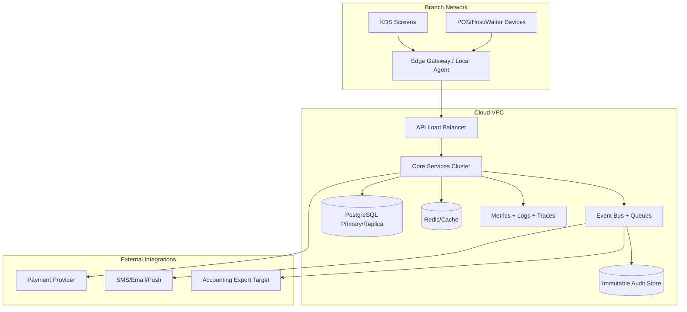

# Cloud Architecture - Restaurant Management System

## Reference Cloud Mapping (AWS Example)

| Capability | Reference Service |
|------------|-------------------|
| Guest touchpoints and web hosting | CloudFront + S3 / Amplify |
| Public protection | AWS WAF |
| API and workers | ECS/Fargate or EKS |
| Database | Amazon RDS for PostgreSQL |
| Messaging | Amazon SQS / EventBridge |
| Reporting store | Redshift / RDS replica / analytics warehouse |
| Object storage | Amazon S3 |
| Notifications | Amazon SES / SNS |
| Monitoring | CloudWatch + OpenTelemetry |
| Identity federation | IAM Identity Center / external IdP |

## Architecture Notes

- Use separate production and non-production environments to isolate financial and operational data.
- Preserve backups for orders, settlements, stock ledgers, and audit logs with clearly documented recovery procedures.
- Device-heavy branches may require local print/KDS gateways or connection-health monitoring even in a cloud-first design.

## Flow-to-Infrastructure Controls

### Ordering and Kitchen Orchestration Path
- Route POS order-submit traffic through low-latency API tier with autoscaling based on requests per second and p95 latency.
- Use durable event bus + queue fan-out so station ticket creation survives transient service or network failures.
- Keep KDS update channels on persistent websocket/gRPC streams with fallback polling during branch connectivity degradation.

### Table/Slot Management Path
- Place reservation/slot services on strongly consistent transactional storage to prevent overbooking under contention.
- Cache slot-availability reads with short TTL while all confirmations remain write-through and serialized.
- Replicate waitlist state across zones with monotonic sequence numbers for deterministic promotion ordering.

### Payments and Cancellations Path
- Isolate payment adapter in hardened network segment with strict egress allow-lists and tokenized payment references.
- Use idempotency key store (fast KV + TTL) for capture/void/refund calls.
- Persist cancellation and reversal events to immutable audit stream and warm analytics store.

### Peak-Load Operational Controls
- Deploy load-control service with direct subscriptions to metrics, queue depth, and occupancy event streams.
- Apply surge policies via centralized configuration service with branch override support and instant propagation.
- Pre-scale critical services for forecasted rush windows; enforce graceful degradation profiles for non-critical APIs.

## Implementation-Ready Infra Guardrails

### Reliability Targets
- Recovery Time Objective (RTO): **<= 30 minutes** for branch-critical workflows.
- Recovery Point Objective (RPO): **<= 5 minutes** for orders, settlements, and audit events.
- Multi-AZ posture is required for API, order, billing, and event backbone services.

### Data and Queue Design Constraints
- Order and billing writes require synchronous commit to primary transactional store before external acknowledgment.
- Event bus topics shall be partitioned by `branch_id` to preserve local ordering while enabling horizontal scale.
- Dead-letter queues must exist for payment callbacks, cancellation compensations, and KDS delivery failures.

### Peak-Load Capacity Planning Inputs
- Baseline per-branch assumptions: active tables, avg items per order, ticket bursts per minute, and payment attempts per minute.
- Capacity model must include 2x seasonal peak and 1.3x transient burst headroom.
- Autoscaling policies should combine CPU/memory with business metrics (queue lag, open-ticket count, payment pending count).

### Security and Compliance Controls for Payment/Cancellation Flows
- PCI-relevant components isolated in dedicated subnets with restrictive service-to-service policies.
- Audit stream storage must support write-once retention rules and legal hold tagging.
- Manager override and dual-approval actions require MFA-backed identity assertion.

## Reference Deployment Topology (Mermaid)

## Failure Domain Isolation Notes
- Branch connectivity failure shall not corrupt committed financial or order data; sync resumes from last acknowledged offset.
- Payment provider failure path must degrade to retry-safe asynchronous reconciliation mode without blocking dine-in closure workflows.
- KDS channel degradation should fall back to polling transport with visual stale-state indicators for staff.
