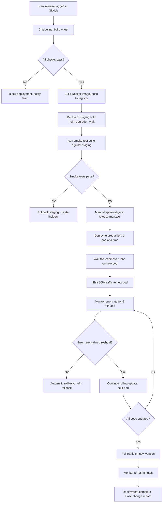
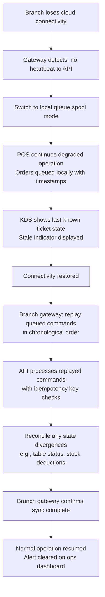

# Deployment Diagram - Restaurant Management System

## Overview

This document describes how the Restaurant Management System (RMS) is deployed across environments, from local development through production. It covers the Kubernetes cluster layout, pod specifications, service mesh configuration, load balancing, and zero-downtime deployment strategy. The production environment targets 99.9% availability for branch-critical workflows (order submission, kitchen display, payment processing).

---

## Environments

| Environment | Purpose | Infrastructure | Data |
|-------------|---------|---------------|------|
| `local` | Developer workstation | Docker Compose | Seeded synthetic data |
| `ci` | Automated test runs | GitHub Actions runners | Ephemeral test database |
| `dev` | Integration testing, feature preview | Kubernetes (small) | Anonymised staging subset |
| `staging` | Pre-release validation, load testing | Kubernetes (prod-like) | Anonymised production copy |
| `production` | Live restaurant operations | Kubernetes (HA) | Live data, PITR backups |

### Environment Promotion Flow
```
developer → local → ci → dev → staging → production
               ↑         ↑         ↑           ↑
             PR build   merge    release     manual
                        to dev   branch      approval
```

---

## Production Deployment Diagram

```mermaid
flowchart TB
    subgraph Internet["Public Internet"]
        GuestBrowser["Guest Browser / Mobile App"]
        DeliveryPlatform["Delivery Platforms\n(Uber Eats, DoorDash)"]
        PaymentProvider["Payment Gateway\n(Stripe / Adyen)"]
    end

    subgraph BranchNetwork["Branch LAN (per location)"]
        POSTerminal["POS Terminals\n(tablets, desktops)"]
        KDSScreen["KDS Screens"]
        ReceiptPrinter["Receipt Printers"]
        KitchenPrinter["Kitchen Printers"]
        BranchGW["Branch Edge Gateway\n(local agent + queue spool)"]
        POSTerminal --> BranchGW
        KDSScreen --> BranchGW
        ReceiptPrinter --> BranchGW
        KitchenPrinter --> BranchGW
    end

    subgraph CloudVPC["Cloud VPC (AWS/GCP)"]
        subgraph PublicSubnet["Public Subnet"]
            CloudFront["CDN / CloudFront"]
            WAF["WAF (OWASP rules)"]
            ALB["Application Load Balancer\n(multi-AZ)"]
        end

        subgraph PrivateSubnet["Private App Subnet"]
            subgraph EKSCluster["EKS / GKE Kubernetes Cluster"]
                APIService["api-service\n(NestJS)\n3-10 pods"]
                WorkerService["worker-service\n(queue consumers)\n2-6 pods"]
                WebSocketService["ws-service\n(WebSocket hub)\n2-4 pods"]
                KitchenOrch["kitchen-orchestrator\n2-4 pods"]
            end
        end

        subgraph DataSubnet["Private Data Subnet"]
            PGPrimary[("PostgreSQL 15\nPrimary (Multi-AZ)")]
            PGReplica[("PostgreSQL 15\nRead Replica")]
            RedisCluster[("Redis 7 Cluster\n(3 shards)")]
            RabbitMQ[("RabbitMQ 3.12\nCluster (3 nodes)")]
            Elasticsearch[("Elasticsearch 8\nCluster (3 nodes)")]
            S3[("Object Storage\n(S3 / GCS)")]
        end

        subgraph MonitoringSubnet["Observability"]
            Prometheus["Prometheus"]
            Grafana["Grafana Dashboards"]
            Jaeger["Jaeger / Tempo\n(Distributed Tracing)"]
            Loki["Loki / CloudWatch\n(Log Aggregation)"]
        end
    end

    GuestBrowser --> CloudFront
    CloudFront --> WAF
    WAF --> ALB
    BranchGW -->|mTLS tunnel| ALB
    DeliveryPlatform --> ALB
    ALB --> APIService
    ALB --> WebSocketService
    APIService --> PGPrimary
    APIService --> PGReplica
    APIService --> RedisCluster
    APIService --> RabbitMQ
    APIService --> Elasticsearch
    APIService --> S3
    APIService --> PaymentProvider
    WebSocketService --> RedisCluster
    WebSocketService --> PGReplica
    WorkerService --> PGPrimary
    WorkerService --> RabbitMQ
    WorkerService --> Elasticsearch
    WorkerService --> S3
    KitchenOrch --> RabbitMQ
    KitchenOrch --> WebSocketService
    KitchenOrch --> PGPrimary

    APIService --> Prometheus
    WorkerService --> Prometheus
    WebSocketService --> Prometheus
    APIService --> Jaeger
    APIService --> Loki
```



---

## Kubernetes Cluster Layout

### Namespaces
| Namespace | Contents | Resource Quota |
|-----------|---------|----------------|
| `rms-prod` | All production application pods | 32 vCPU, 64 GiB RAM |
| `rms-staging` | Staging environment pods | 16 vCPU, 32 GiB RAM |
| `rms-dev` | Development environment pods | 8 vCPU, 16 GiB RAM |
| `monitoring` | Prometheus, Grafana, Jaeger, Loki | 8 vCPU, 16 GiB RAM |
| `ingress` | NGINX Ingress Controller, cert-manager | 4 vCPU, 4 GiB RAM |
| `vault` | HashiCorp Vault (secrets management) | 2 vCPU, 4 GiB RAM |

### Node Groups (Production)
| Node Group | Instance Type | Min Nodes | Max Nodes | Purpose |
|------------|--------------|-----------|-----------|---------|
| `app-general` | m6i.xlarge (4 vCPU, 16 GiB) | 3 | 12 | API, worker, WebSocket pods |
| `app-kitchen` | c6i.large (2 vCPU, 4 GiB) | 2 | 6 | Kitchen orchestrator (low-latency) |
| `monitoring` | m6i.large (2 vCPU, 8 GiB) | 2 | 2 | Fixed — monitoring stack |
| `spot-workers` | m6i.xlarge (Spot) | 0 | 8 | Non-critical background workers |

---

## Pod Specifications

### api-service
```yaml
# kubernetes/production/api-service/deployment.yaml
apiVersion: apps/v1
kind: Deployment
metadata:
  name: api-service
  namespace: rms-prod
spec:
  replicas: 3
  selector:
    matchLabels: { app: api-service }
  strategy:
    type: RollingUpdate
    rollingUpdate: { maxSurge: 2, maxUnavailable: 0 }
  template:
    metadata:
      labels: { app: api-service, version: "1.4.0" }
      annotations:
        prometheus.io/scrape: "true"
        prometheus.io/port: "9090"
    spec:
      affinity:
        podAntiAffinity:
          requiredDuringSchedulingIgnoredDuringExecution:
          - labelSelector:
              matchLabels: { app: api-service }
            topologyKey: kubernetes.io/hostname   # Spread across nodes
      containers:
      - name: api
        image: ghcr.io/org/rms-api:1.4.0
        ports:
        - containerPort: 3000   # HTTP
        - containerPort: 9090   # Metrics
        resources:
          requests: { cpu: "500m", memory: "512Mi" }
          limits:   { cpu: "2000m", memory: "2Gi" }
        readinessProbe:
          httpGet: { path: /health/ready, port: 3000 }
          initialDelaySeconds: 10
          periodSeconds: 5
          failureThreshold: 3
        livenessProbe:
          httpGet: { path: /health/live, port: 3000 }
          initialDelaySeconds: 30
          periodSeconds: 15
        envFrom:
        - secretRef: { name: rms-api-secrets }
        - configMapRef: { name: rms-api-config }
```

### worker-service
```yaml
# Critical workers (kitchen routing, payment reconciliation) run as Deployment
# Non-critical workers (reporting, notifications) eligible for Spot nodes
apiVersion: apps/v1
kind: Deployment
metadata:
  name: worker-service
  namespace: rms-prod
spec:
  replicas: 2
  template:
    spec:
      containers:
      - name: worker
        image: ghcr.io/org/rms-worker:1.4.0
        resources:
          requests: { cpu: "250m", memory: "256Mi" }
          limits:   { cpu: "1000m", memory: "1Gi" }
        env:
        - name: WORKER_QUEUES
          value: "kitchen.tickets,notifications.dispatch,accounting.exports,inventory.projections"
        - name: WORKER_CONCURRENCY
          value: "10"
```

### Horizontal Pod Autoscaler
```yaml
apiVersion: autoscaling/v2
kind: HorizontalPodAutoscaler
metadata:
  name: api-service-hpa
  namespace: rms-prod
spec:
  scaleTargetRef:
    apiVersion: apps/v1
    kind: Deployment
    name: api-service
  minReplicas: 3
  maxReplicas: 10
  metrics:
  - type: Resource
    resource:
      name: cpu
      target: { type: Utilization, averageUtilization: 65 }
  - type: Resource
    resource:
      name: memory
      target: { type: Utilization, averageUtilization: 75 }
  - type: External                          # Scale on RabbitMQ queue depth
    external:
      metric:
        name: rabbitmq_queue_messages
        selector:
          matchLabels: { queue: "kitchen.tickets" }
      target: { type: AverageValue, averageValue: "50" }
  behavior:
    scaleUp:
      stabilizationWindowSeconds: 30       # Fast scale-up during rush
      policies:
      - type: Pods, value: 2, periodSeconds: 30
    scaleDown:
      stabilizationWindowSeconds: 300      # Slow scale-down to avoid thrashing
```

---

## Service Mesh

Istio service mesh is deployed in production to provide:

| Feature | Configuration |
|---------|--------------|
| mTLS between services | `STRICT` mode in `rms-prod` namespace — all pod-to-pod traffic encrypted |
| Traffic management | Circuit breakers on payment gateway and delivery platform calls |
| Observability | Automatic Prometheus metrics, Jaeger traces per service call |
| Rate limiting | Global rate limits enforced at the mesh level as a secondary defence |
| Retries | Configurable per-route retry policy with idempotency-safe conditions |

```yaml
# Istio DestinationRule for api-service: circuit breaker
apiVersion: networking.istio.io/v1alpha3
kind: DestinationRule
metadata:
  name: api-service-circuit-breaker
spec:
  host: api-service
  trafficPolicy:
    outlierDetection:
      consecutive5xxErrors: 5
      interval: 30s
      baseEjectionTime: 1m
      maxEjectionPercent: 50
    connectionPool:
      tcp: { maxConnections: 100 }
      http:
        http2MaxRequests: 1000
        pendingRequests: 100
        retries:
          attempts: 3
          perTryTimeout: 3s
          retryOn: "5xx,reset,connect-failure"
```

---

## Load Balancer Configuration

### AWS Application Load Balancer Rules
| Priority | Condition | Target Group | Notes |
|---------|-----------|-------------|-------|
| 1 | Path `/ws/*` | `ws-service-tg` | WebSocket upgrade |
| 2 | Path `/v1/kitchen/*` | `api-service-tg` | Kitchen endpoints |
| 3 | Path `/v1/payment/*` | `api-service-tg` | Payment endpoints |
| 4 | Header `x-device-type: kds` | `ws-service-tg` | KDS devices → WebSocket |
| 5 | Default | `api-service-tg` | All other traffic |

### Target Group Health Checks
```
Health check path:    /health/ready
Protocol:            HTTP
Port:                3000
Healthy threshold:   2 consecutive successes
Unhealthy threshold: 3 consecutive failures
Timeout:             5 seconds
Interval:            15 seconds
```

---

## Zero-Downtime Deployment Strategy

The RMS must support deployments during operating hours without interrupting active orders, kitchen tickets, or payment flows. The following strategy achieves this.

### Rolling Deployment with Pre-Flight Checks


### Database Migration Safety Rules
1. **Expand-and-contract pattern**: Add new columns as nullable first; backfill data; then add NOT NULL constraint in a later release.
2. **Backward-compatible migrations only**: The new code version must run against the old schema during the rolling update window.
3. **Migration timeout guard**: Migrations that take > 30 seconds in production are flagged for review; long-running DDL should use `CONCURRENTLY` variants.
4. **Rollback plan required**: Every migration PR must document the compensating migration (rollback SQL).

### Graceful Pod Shutdown
```typescript
// api/src/main.ts — handle SIGTERM gracefully
process.on('SIGTERM', async () => {
  logger.info('SIGTERM received — starting graceful shutdown');
  // 1. Stop accepting new connections (ALB deregisters pod first due to preStop hook)
  // 2. Wait for in-flight requests to complete (30s timeout)
  await app.close();
  // 3. Close database pool and queue connections
  await dataSource.destroy();
  await rabbitMQClient.close();
  logger.info('Graceful shutdown complete');
  process.exit(0);
});
```

```yaml
# kubernetes/production/api-service/deployment.yaml — preStop hook
lifecycle:
  preStop:
    exec:
      command: ["/bin/sh", "-c", "sleep 15"]  # Wait for ALB to deregister
terminationGracePeriodSeconds: 60
```

### Canary Deployment for High-Risk Releases
For changes to billing, payment, or RBAC logic, use a canary deployment:

1. Deploy new version to 1 pod only (canary).
2. Route 5% of traffic to canary pod via Istio weighted routing.
3. Monitor canary error rate, latency, and business metrics for 30 minutes.
4. If metrics are healthy, gradually shift traffic: 5% → 25% → 50% → 100%.
5. If canary shows regression, route 0% to canary and investigate.

### Branch Outage Recovery Path

