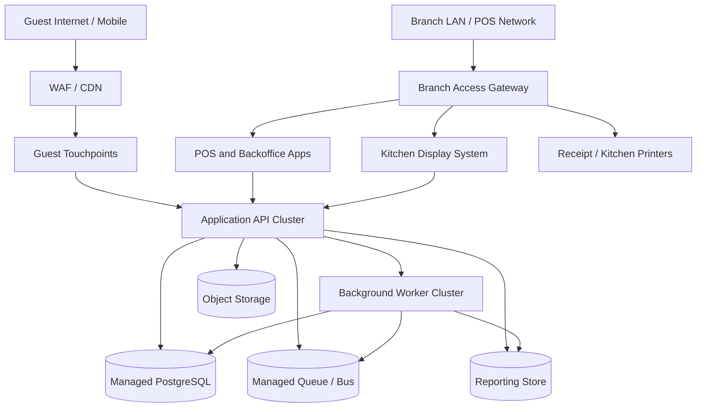

# Deployment Diagram - Restaurant Management System

## Deployment Notes

- Branch devices may include tablets, POS terminals, kitchen displays, and receipt printers with branch-local connectivity constraints.
- Workers handle notifications, accounting exports, reconciliation jobs, inventory projections, and operational reporting updates.
- Degraded-mode branch operation should be considered where connectivity to the central platform is intermittent.
