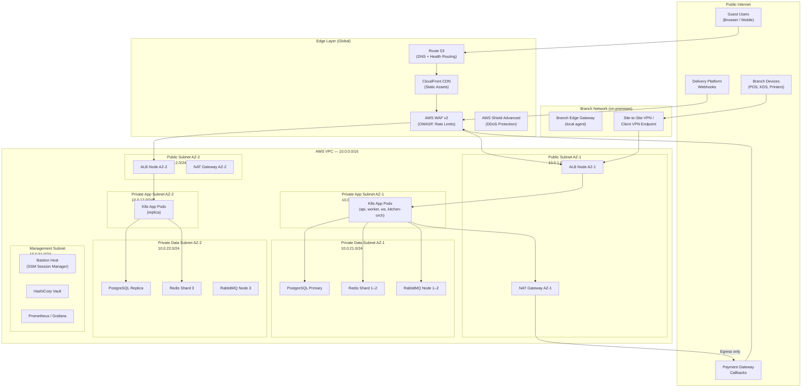
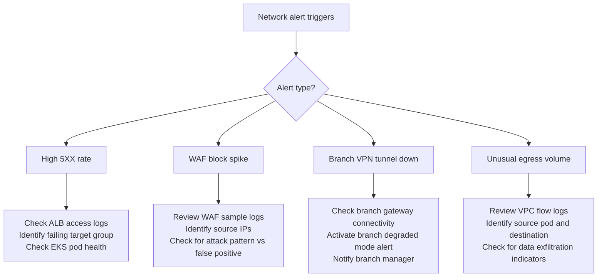

# Network Infrastructure - Restaurant Management System

## Overview

This document defines the network architecture for the Restaurant Management System (RMS) production environment. It covers the VPC design, subnet layout, security groups, DNS, SSL/TLS, CDN configuration, firewall rules, and network monitoring. The design follows a defence-in-depth model: guest-facing endpoints are heavily protected at the edge, branch devices communicate through authenticated tunnels, application services live in private subnets, and data stores are completely isolated from public access.

The reference implementation uses AWS, but the same principles apply to GCP or Azure equivalents.

---

## Network Topology Diagram



---

## VPC Design

### CIDR Allocation
| Block | Range | Usage |
|-------|-------|-------|
| VPC | `10.0.0.0/16` | All subnets |
| Public AZ-1 | `10.0.1.0/24` | ALB, NAT Gateway |
| Public AZ-2 | `10.0.2.0/24` | ALB, NAT Gateway |
| Private App AZ-1 | `10.0.11.0/24` | EKS nodes, application pods |
| Private App AZ-2 | `10.0.12.0/24` | EKS nodes, application pods |
| Private Data AZ-1 | `10.0.21.0/24` | PostgreSQL, Redis, RabbitMQ |
| Private Data AZ-2 | `10.0.22.0/24` | PostgreSQL replica, Redis, RabbitMQ |
| Management | `10.0.31.0/24` | Bastion, Vault, monitoring tools |
| Spare AZ-3 App | `10.0.13.0/24` | Reserved for AZ-3 expansion |
| Spare AZ-3 Data | `10.0.23.0/24` | Reserved for AZ-3 expansion |

### Availability Zones
The system is deployed across **2 Availability Zones** (expandable to 3). Each AZ contains a full set of application and data subnet tiers. Stateful services (PostgreSQL, Redis, RabbitMQ) use cross-AZ replication. The design ensures that the loss of a single AZ does not cause service interruption for restaurant operations.

### VPC Flow Logs
All VPC flow logs are enabled and shipped to S3 (30-day retention) and CloudWatch Logs (7-day retention for live query access). Flow logs are used for:
- Post-incident traffic analysis
- Detecting unexpected cross-subnet traffic
- Identifying overly permissive security group rules

---

## Security Groups

### ALB Security Group (`sg-alb`)
| Direction | Protocol | Port | Source/Destination | Purpose |
|-----------|---------|------|-------------------|---------|
| Inbound | TCP | 443 | `0.0.0.0/0` | HTTPS from internet (WAF in front) |
| Inbound | TCP | 80 | `0.0.0.0/0` | HTTP (redirected to 443 by ALB rule) |
| Outbound | TCP | 3000 | `sg-app` | Forward to API pods |
| Outbound | TCP | 3001 | `sg-app` | Forward to WebSocket pods |

### Application Pod Security Group (`sg-app`)
| Direction | Protocol | Port | Source/Destination | Purpose |
|-----------|---------|------|-------------------|---------|
| Inbound | TCP | 3000 | `sg-alb` | HTTP from ALB |
| Inbound | TCP | 3001 | `sg-alb` | WebSocket from ALB |
| Inbound | TCP | 9090 | `sg-monitoring` | Prometheus scrape |
| Outbound | TCP | 5432 | `sg-data` | PostgreSQL |
| Outbound | TCP | 6379 | `sg-data` | Redis |
| Outbound | TCP | 5672 | `sg-data` | RabbitMQ AMQP |
| Outbound | TCP | 443 | `0.0.0.0/0` (via NAT) | External APIs (payment gateway, delivery platforms, email) |
| Outbound | TCP | 9200 | `sg-data` | Elasticsearch |

### Data Layer Security Group (`sg-data`)
| Direction | Protocol | Port | Source/Destination | Purpose |
|-----------|---------|------|-------------------|---------|
| Inbound | TCP | 5432 | `sg-app` | PostgreSQL from app pods |
| Inbound | TCP | 6379 | `sg-app` | Redis from app pods |
| Inbound | TCP | 5672 | `sg-app` | RabbitMQ AMQP from app pods |
| Inbound | TCP | 9200 | `sg-app` | Elasticsearch from app pods |
| Inbound | TCP | 5432 | `sg-management` | PostgreSQL from bastion (admin) |
| **No outbound rules** | — | — | — | Data layer initiates no outbound connections |

### Management Security Group (`sg-management`)
| Direction | Protocol | Port | Source/Destination | Purpose |
|-----------|---------|------|-------------------|---------|
| Inbound | TCP | 22 | Deny — use SSM | SSH disabled; use AWS SSM Session Manager |
| Inbound | TCP | 8200 | `sg-app` | Vault API from app pods |
| Inbound | TCP | 3000 | `sg-monitoring-ui` | Grafana access |
| Outbound | TCP | 5432 | `sg-data` | Admin DB access via bastion |
| Outbound | TCP | All | `sg-data` | Monitoring scrape |

### Branch VPN Security Group (`sg-branch-vpn`)
| Direction | Protocol | Port | Source/Destination | Purpose |
|-----------|---------|------|-------------------|---------|
| Inbound | UDP | 4500 | Branch IP ranges | IKEv2 VPN tunnel |
| Inbound | TCP | 443 | Branch IP ranges | Client VPN |
| Outbound | TCP | 3000 | `sg-app` | Branch devices → API |
| Outbound | TCP | 3001 | `sg-app` | Branch devices → WebSocket |

---

## DNS Configuration

### Hosted Zone Layout
```
rms.example.com (Public Hosted Zone)
├── app.rms.example.com          → ALB (guest + general API)
├── api.rms.example.com          → ALB (branch API alias)
├── ws.rms.example.com           → ALB (WebSocket connections)
├── cdn.rms.example.com          → CloudFront (static assets)
└── status.rms.example.com       → Status page (external host)

internal.rms.example.com (Private Hosted Zone — VPC only)
├── postgres.internal             → RDS Primary endpoint
├── postgres-ro.internal          → RDS Read Replica endpoint
├── redis.internal                → Redis cluster endpoint
├── rabbitmq.internal             → RabbitMQ cluster endpoint
├── elasticsearch.internal        → Elasticsearch cluster endpoint
└── vault.internal                → Vault cluster endpoint
```

### Health Check Routing
Route 53 health checks are configured on the ALB endpoint. If the primary region health check fails, failover routing directs traffic to a warm standby in the secondary region (active-passive multi-region). Failover TTL is set to 60 seconds.

---

## SSL/TLS Configuration

### Certificate Management
- **Public certificates**: AWS Certificate Manager (ACM) — auto-renewed, wildcard cert for `*.rms.example.com`.
- **Internal certificates**: Private Certificate Authority (AWS Private CA) for pod-to-pod mTLS (Istio) and internal service endpoints.
- **Branch device certificates**: Issued per-device by Private CA; used for mutual TLS on branch VPN and branch gateway connections.

### TLS Policy
| Endpoint | Minimum TLS Version | Cipher Policy |
|----------|--------------------|-----------| 
| ALB (public) | TLS 1.2 | `ELBSecurityPolicy-TLS13-1-2-2021-06` |
| Pod-to-pod (Istio mTLS) | TLS 1.3 | ECDHE-ECDSA-AES256-GCM-SHA384 |
| Branch gateway tunnel | TLS 1.3 | IKEv2 with AES-256-GCM |
| Internal data stores | TLS 1.2+ | Per-service default |

### HSTS Configuration
```
Strict-Transport-Security: max-age=31536000; includeSubDomains; preload
```
Applied at the ALB and CloudFront levels. HSTS preload submitted to browser preload list.

---

## CDN Configuration

### CloudFront Distribution
| Origin | Cache Behaviour | TTL | Invalidation |
|--------|----------------|-----|-------------|
| S3 (static assets: JS, CSS, images) | Cache by file hash | 365 days | Deploy-time invalidation |
| S3 (menu images) | Cache with ETag | 24 hours | On menu item update |
| ALB (API) | No cache (pass-through) | 0 | — |
| S3 (receipt PDFs) | Private (signed URLs) | 1 hour per URL | — |

### CloudFront Security Headers
```
Content-Security-Policy: default-src 'self'; script-src 'self'; style-src 'self' 'unsafe-inline'
X-Content-Type-Options: nosniff
X-Frame-Options: DENY
Referrer-Policy: strict-origin-when-cross-origin
Permissions-Policy: camera=(), microphone=(), geolocation=()
```

### Edge Caching for Menu Assets
Menu images are served via CloudFront with a 24-hour TTL. When a menu item image is updated:
1. New image is uploaded to S3 with a versioned key (e.g., `menu/item_123_v4.webp`).
2. Old CloudFront object is invalidated via `aws cloudfront create-invalidation`.
3. DNS cache TTL for the CDN domain is 300 seconds (5 minutes).

---

## Firewall Rules

### AWS Network ACLs (Subnet Level — Stateless)
Network ACLs provide a second layer of defence at the subnet boundary. Security groups (stateful) are the primary control; NACLs act as an additional guard.

| Subnet | Inbound Allow | Outbound Allow |
|--------|--------------|----------------|
| Public subnets | TCP 443, TCP 80, UDP 4500 | All (responses + NAT) |
| Private app subnets | TCP from public subnet only | TCP to data subnets, TCP 443 via NAT |
| Private data subnets | TCP from private app subnets only | DENY ALL (no outbound) |
| Management subnet | TCP from private app subnets, VPN CIDR | TCP to data subnets |

### WAF Rules (AWS WAF v2)
| Rule Group | Action | Priority |
|-----------|--------|----------|
| AWSManagedRulesCommonRuleSet | Block | 1 |
| AWSManagedRulesSQLiRuleSet | Block | 2 |
| AWSManagedRulesKnownBadInputsRuleSet | Block | 3 |
| Custom: Rate limit — `/v1/auth/*` | Block after 20 req/5min per IP | 4 |
| Custom: Rate limit — `/v1/orders` POST | Block after 100 req/min per device token | 5 |
| Custom: Block requests with missing `x-branch-id` header (non-guest routes) | Block | 6 |
| Custom: Geo-block countries not in operating regions (configurable) | Block | 7 |
| AWSManagedRulesAmazonIpReputationList | Block | 8 |

---

## Network Monitoring

### Key Metrics Tracked
| Metric | Source | Alert Threshold |
|--------|--------|----------------|
| ALB `4XX` error rate | CloudWatch | > 5% for 5 minutes |
| ALB `5XX` error rate | CloudWatch | > 1% for 5 minutes |
| WAF blocked requests spike | CloudWatch | > 1000/min (potential attack) |
| VPN tunnel state | CloudWatch | Tunnel `DOWN` for > 2 minutes |
| NAT Gateway data processed | CloudWatch | > 200% of 7-day average (unusual egress) |
| VPC Flow Log denied traffic | CloudWatch Insights | Any denied traffic from `sg-app` to `sg-data` on unexpected ports |
| TLS certificate expiry | ACM / custom Lambda | < 30 days remaining |

### Network Incident Response


### Regular Network Health Checks
- **Daily**: Automated ping from synthetic monitor to `app.rms.example.com/health/ready`.
- **Weekly**: Review WAF rule match statistics; tune false positive rules.
- **Monthly**: Verify all security group rules match the documented baseline; alert on deviations.
- **Quarterly**: Review and update geo-block rules; audit NAT gateway egress allow-list.
- **Annually**: Full network penetration test; review TLS policy for deprecated cipher suites.
