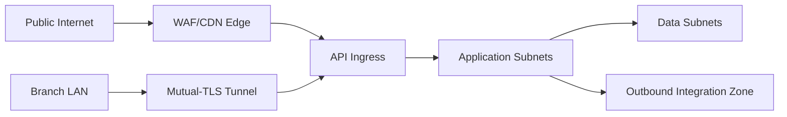

# Network Infrastructure - Restaurant Management System

## Network Zones

| Zone | Purpose | Key Controls |
|------|---------|--------------|
| Public Edge | Guest reservation and status touchpoints | TLS, WAF, rate limits |
| Branch LAN | POS, KDS, printers, and staff tablets | Device enrollment, local network controls, secure tunnels |
| Staff/Admin Access | Management and backoffice operations | MFA/SSO, zero-trust or private access |
| Application Zone | API and worker services | Private subnets, service identity, secrets management |
| Data Zone | Database, reporting store, object storage, queue | No public access, encryption, restricted paths |
| Integration Zone | Payment, accounting, vendor, delivery integrations | Outbound allow-list, credential rotation |

## Traffic Principles

- Guest traffic enters only through the public edge.
- Branch devices should communicate through authenticated, auditable channels.
- Sensitive settlement and export data must not traverse unmanaged branch paths.
- Reporting and operational analytics must preserve branch scoping and role permissions.

## Network Trust and Flow Policies

## Security Controls by Flow

| Flow | Mandatory Network Control |
|------|----------------------------|
| Ordering/Slot | authenticated branch tunnel + per-device identity |
| Kitchen updates | low-latency persistent channel with token rotation |
| Payments/Reversals | dedicated egress allow-list and signed callback ingress |
| Cancellations/Approvals | admin paths restricted behind MFA + private access |
| Peak-load control | management endpoints blocked from public internet |
