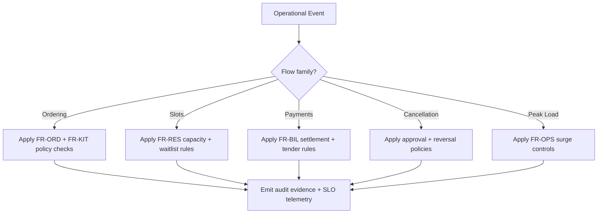

# Requirements Document - Restaurant Management System

## 1. Project Overview

### 1.1 Purpose
Build a production-ready restaurant management platform that unifies guest seating and ordering, waiter service, kitchen execution, ingredient inventory, procurement, cashier settlement, operational accounting, branch management, and shift operations across multiple restaurant branches.

### 1.2 Scope

| In Scope | Out of Scope |
|----------|--------------|
| Multi-branch dine-in and takeaway operations | Full payroll and HR suite |
| Optional delivery-channel integration | Full general-ledger ERP replacement |
| Reservations, waitlisting, table service, and kitchen workflows | Customer loyalty program engine beyond basic hooks |
| Menu, pricing, modifiers, taxes, and discount controls | Custom payment gateway implementation |
| Recipe/BOM-based inventory, procurement, wastage, and stock counts | Manufacturing-grade supply-chain optimization |
| Cashier settlement, tax, reconciliation, and accounting export | Full statutory accounting package |
| Shift scheduling, attendance, and daily branch close | Advanced workforce payroll calculations |

### 1.3 Operating Model
- Multiple branches share a centrally administered platform while maintaining branch-scoped tables, shifts, stock, and cash sessions.
- The platform primarily serves internal restaurant operations, with limited guest-facing features for reservations, waitlists, and order/status touchpoints.
- Orders may originate from dine-in, takeaway, or optionally integrated delivery channels.
- Accounting support focuses on operational settlement, taxes, reconciliation, and export to external accounting systems rather than full ERP accounting.

### 1.4 Primary Actors

| Actor | Goals |
|-------|-------|
| Guest / Customer | Reserve tables, minimize waiting, place or receive food accurately, and settle bills smoothly |
| Host / Reception | Manage tables, reservations, waitlists, and guest seating efficiently |
| Waiter / Captain | Capture accurate orders, coordinate service, and respond to guest updates quickly |
| Chef / Kitchen Staff | Prepare items in the right sequence, manage station load, and surface stock or timing issues |
| Cashier / Accountant | Settle payments, process refunds, reconcile shifts, and prepare accounting exports |
| Inventory / Purchase Manager | Maintain stock accuracy, procure ingredients, and reduce wastage |
| Branch Manager | Monitor branch performance, staffing, inventory risk, and operational exceptions |
| Admin | Configure menus, taxes, roles, policies, and integrations across branches |

## 2. Functional Requirements

### 2.1 Identity, Branch Configuration, and Access Control

| ID | Requirement | Priority |
|----|-------------|----------|
| FR-IAM-001 | System shall support branch-scoped and organization-wide roles with role-based access control | Must Have |
| FR-IAM-002 | System shall support staff accounts for host, waiter, chef, cashier, inventory manager, branch manager, and admin roles | Must Have |
| FR-IAM-003 | System shall maintain branch configuration for tables, service zones, taxes, payment methods, printers, and kitchen stations | Must Have |
| FR-IAM-004 | System shall audit privileged actions including voids, refunds, manual discounts, stock adjustments, and reconciliation overrides | Must Have |

### 2.2 Reservations, Waitlisting, and Seating

| ID | Requirement | Priority |
|----|-------------|----------|
| FR-RES-001 | System shall support guest reservations with branch, party size, seating preference, and reservation time | Must Have |
| FR-RES-002 | Hosts shall manage waitlists and walk-in seating with queue visibility | Must Have |
| FR-RES-003 | System shall support table assignment, merge/split tables, and seating-status updates | Must Have |
| FR-RES-004 | System shall expose limited guest-facing reservation and waitlist status touchpoints | Should Have |

### 2.3 Menu, Pricing, and Modifiers

| ID | Requirement | Priority |
|----|-------------|----------|
| FR-MEN-001 | System shall support branch-aware menus, categories, items, combos, and modifier groups | Must Have |
| FR-MEN-002 | Menu items shall support pricing, taxes, happy-hour rules, and discount eligibility | Must Have |
| FR-MEN-003 | System shall support recipe/BOM mapping between menu items and inventory ingredients | Must Have |
| FR-MEN-004 | System shall support item unavailability and station-specific routing without removing historical sales context | Must Have |

### 2.4 Order Capture and Front-of-House Service

| ID | Requirement | Priority |
|----|-------------|----------|
| FR-ORD-001 | Waiters shall create, update, split, merge, and submit dine-in or takeaway orders | Must Have |
| FR-ORD-002 | System shall support seat-level ordering, course firing, notes, and special requests | Must Have |
| FR-ORD-003 | System shall support order-source distinction for dine-in, takeaway, and optional delivery channels | Must Have |
| FR-ORD-004 | System shall maintain table timelines, guest checks, and service status visibility for staff | Must Have |
| FR-ORD-005 | System shall support voids, item removals, and manager approvals for controlled order changes | Must Have |

### 2.5 Kitchen and Preparation Workflows

| ID | Requirement | Priority |
|----|-------------|----------|
| FR-KIT-001 | Kitchen staff shall receive routed kitchen tickets by station, priority, and fire timing | Must Have |
| FR-KIT-002 | System shall support kitchen ticket states such as queued, in preparation, ready, served, delayed, or voided | Must Have |
| FR-KIT-003 | System shall surface ingredient shortages or station overloads back to front-of-house staff | Must Have |
| FR-KIT-004 | System shall support preparation timing, refire flows, and pass/dispatch coordination | Must Have |

### 2.6 Inventory, Procurement, and Stock Control

| ID | Requirement | Priority |
|----|-------------|----------|
| FR-INV-001 | System shall maintain ingredient masters, units of measure, stock levels, and reorder thresholds | Must Have |
| FR-INV-002 | System shall deduct ingredient stock based on recipe usage and configurable booking points | Must Have |
| FR-INV-003 | System shall support purchase requests, purchase orders, receiving, vendor records, and discrepancy handling | Must Have |
| FR-INV-004 | System shall support stock counts, wastage logging, transfers, and manual adjustment approvals | Must Have |
| FR-INV-005 | System shall alert staff to low-stock, stockout, or negative-stock risk conditions | Must Have |

### 2.7 Billing, Payments, and Operational Accounting

| ID | Requirement | Priority |
|----|-------------|----------|
| FR-BIL-001 | System shall generate bills with taxes, service charges, discounts, and modifiers accurately applied | Must Have |
| FR-BIL-002 | System shall support split bills, partial settlements, voids, refunds, and multiple payment methods | Must Have |
| FR-BIL-003 | Cashiers shall open and close drawer sessions and record settlement totals by payment method | Must Have |
| FR-BIL-004 | System shall support daily close, branch reconciliation, and operational accounting exports | Must Have |
| FR-BIL-005 | System shall provide exportable tax, sales, refund, and settlement summaries for external accounting systems | Must Have |

### 2.8 Shift Scheduling, Attendance, and Branch Operations

| ID | Requirement | Priority |
|----|-------------|----------|
| FR-WFM-001 | Branch managers shall create operational shift schedules for service, kitchen, cashier, and inventory roles | Must Have |
| FR-WFM-002 | System shall record staff attendance, shift start/end, and branch staffing visibility | Must Have |
| FR-WFM-003 | System shall support branch day-open and day-close checklists tied to operational readiness | Should Have |

### 2.9 Reporting, Notifications, and Administration

| ID | Requirement | Priority |
|----|-------------|----------|
| FR-OPS-001 | System shall provide dashboards for sales, table turnover, kitchen delays, stock risk, shift performance, and settlement health | Must Have |
| FR-OPS-002 | System shall notify staff about reservations, delayed tickets, low stock, pending approvals, and day-close issues | Must Have |
| FR-OPS-003 | Administrators shall configure taxes, payment methods, discount rules, menu availability, and branch policies | Must Have |
| FR-OPS-004 | System shall expose audit trails and operational event logs for compliance and troubleshooting | Must Have |

## 3. Non-Functional Requirements

| ID | Requirement | Target |
|----|-------------|--------|
| NFR-P-001 | POS action response time | < 300 ms p95 |
| NFR-P-002 | Order submission to kitchen routing | < 2 seconds |
| NFR-P-003 | Bill generation latency | < 2 seconds |
| NFR-A-001 | Service availability | 99.9% monthly |
| NFR-S-001 | Supported branches | 500+ |
| NFR-S-002 | Concurrent staff devices | 20,000+ |
| NFR-SEC-001 | Encryption | TLS 1.3 in transit, AES-256 at rest |
| NFR-SEC-002 | Audit coverage | 100% privileged actions logged |
| NFR-OPS-001 | Branch offline resilience | Critical workflows support degraded-mode operation |
| NFR-UX-001 | Staff usability | Optimized for fast tablet/POS usage in high-volume service |

## 4. Constraints and Assumptions

- Full payroll and general-ledger accounting are out of scope.
- Delivery workflows may rely on external providers or aggregators rather than a custom fleet system.
- Inventory depletion may be configurable to occur at order submit, kitchen fire, or settlement depending on operational policy.
- Receipt printing, KDS, and payment hardware may require branch-specific integrations.
- The platform must tolerate intermittent branch connectivity without losing authoritative transaction history.

## 5. Success Metrics

- 95% of standard table orders route to the correct kitchen station without manual correction.
- 100% of completed bills remain traceable to orders, taxes, payment methods, and cashier sessions.
- 100% of manual stock adjustments, voids, refunds, and reconciliations are auditable.
- Branch managers can identify sales, delays, stock risk, and staffing gaps from one dashboard.
- Inventory variance between expected and counted stock remains measurable and explainable by ledger events.

## 6. Cross-Cutting Detailed Operational Flows

### 6.1 Ordering Flow (Dine-In and Takeaway)
1. Host/waiter opens table or takeaway context and system attaches active menu, pricing profile, tax profile, and branch policy.
2. Waiter captures seat-level items, modifiers, allergy notes, and course preferences.
3. System performs synchronous validations: item availability, modifier cardinality, discount eligibility, and approval-restricted actions.
4. Draft order is auto-saved with optimistic versioning to prevent concurrent overwrite.
5. On submit, order lines are split into station-bound production tasks and acknowledged back to POS with immutable ticket IDs.
6. Service timeline starts SLA clocks for first-fire, all-items-ready, and table-turn benchmarks.

### 6.2 Kitchen Orchestration Flow
1. Ticket router evaluates station mapping, prep-time estimates, and branch capacity weights.
2. Kitchen display queues tasks by priority bands (VIP/expedite, standard, delayed/recovery).
3. Chef marks states (`queued -> accepted -> in_preparation -> ready_at_pass -> served`).
4. Pass controller enforces course synchronization so mains are not released before configured appetizer dependencies.
5. Delay/stockout flags are published to waiter tablets with suggested alternatives and expected-ready-time recomputation.
6. Refire events require reason tagging and manager visibility for waste and QoS analytics.

### 6.3 Table/Slot Management Flow
1. Reservation engine assigns slots using party size, duration forecasts, and table combinability constraints.
2. Host dashboard continuously reconciles reservations, waitlist, walk-ins, and no-show timers.
3. Seating action binds party to table graph node(s), waiter zone, and service SLA profile.
4. Mid-service split/merge operations rebalance check ownership while preserving audit chain from original reservation or walk-in.
5. Release flow marks table as `cleaning` then `ready`, with optional blocker if unpaid balances or incident notes exist.

### 6.4 Payment and Settlement Flow
1. Bill composer locks order lines, computes taxes/fees/discounts, and exposes split dimensions (equal, by seat, by item).
2. Cashier executes one or more tenders (cash, card, wallet, house-account) with idempotent payment intents.
3. Partial settlement keeps check open while paid components become non-voidable except through supervised refund flow.
4. Final settlement closes check, updates table state, posts ledger entries, and increments cashier session totals.
5. Day-close pipeline validates drawer totals, unresolved refunds, and export readiness before reconciliation sign-off.

### 6.5 Cancellation and Reversal Flow
1. Cancellation request is categorized: reservation cancel, pre-fire order cancel, post-fire void, payment reversal, or no-show closure.
2. Policy engine checks cancellation window, actor permissions, and fraud/abuse heuristics.
3. Approved cancellations emit compensating events (inventory rollback when allowed, kitchen ticket cancel, payment void/refund intent).
4. Guest/staff notifications include reason, financial impact, and next valid action.
5. All reversals remain linked to origin transaction for audit and dispute handling.

### 6.6 Peak-Load Operational Controls
1. Capacity monitor computes real-time load indices from active tables, pending tickets, station queue depth, and payment queue time.
2. When thresholds are crossed, system activates controls: reservation throttling, auto-quoted wait times, menu simplification profiles, and batching hints.
3. Kitchen load-shedding may defer long-prep items or cap concurrent fires per station.
4. POS applies guardrails (manager approval for non-critical modifiers/discounts during surge if policy enabled).
5. Recovery mode automatically rolls back throttles once queue depth and SLA breach probability return below branch-defined limits.

### 6.7 Implementation-Ready Control Points and Acceptance Criteria

#### 6.7.1 Canonical State Models

| Domain | Mandatory States | Terminal States | Notes |
|-------|------------------|-----------------|-------|
| Order Line | `draft`, `submitted`, `queued`, `in_preparation`, `ready`, `served`, `voided` | `served`, `voided` | Forward-only except controlled reversal via compensating events |
| Table | `available`, `reserved`, `occupied`, `cleaning`, `blocked` | `available`, `blocked` | `blocked` requires incident reason and manager clear action |
| Check | `open`, `partially_paid`, `paid`, `refund_pending`, `refunded`, `voided` | `paid`, `refunded`, `voided` | `voided` only pre-settlement unless override granted |
| Payment Intent | `initiated`, `authorized`, `captured`, `failed`, `voided`, `refunded` | `captured`, `failed`, `voided`, `refunded` | Idempotent retries must not create duplicate capture |

#### 6.7.2 Event Contract Minimums
- Every cross-service event shall include: `event_id`, `event_type`, `occurred_at`, `branch_id`, `actor_id`, `entity_id`, `entity_version`, and `correlation_id`.
- Cancellation/reversal events shall include mandatory `reason_code` and `policy_decision_id`.
- Kitchen events shall include `station_id`, `ticket_priority`, and `promised_ready_at`.
- Payment events shall include `tender_type`, `amount`, `currency`, and `provider_reference`.

#### 6.7.3 Operational SLA Gates (per branch)

| Flow | SLO Target | Breach Trigger | Required Automated Response |
|------|------------|----------------|-----------------------------|
| Order submit to station queue | p95 < 2s | 3 consecutive 5-min windows above threshold | Trigger surge tier `watch`, alert manager console |
| First course fire time | p90 < 12 min (configurable) | >20% open tickets exceeding branch SLA | Enable station rebalance recommendations |
| Payment authorization | p95 < 4s | Provider timeout rate > 5% over 10 min | Auto-switch to retry-safe fallback path |
| Reservation quote accuracy | ETA error < +/- 8 min p90 | ETA drift > 10 min for 15 min | Inflate ETA model confidence bounds |

#### 6.7.4 Mandatory Audit Evidence
1. Every cancellation, void, and refund shall be reconstructable from origin event to final financial impact.
2. Peak-load mode transitions shall be auditable with threshold values and operator/system trigger source.
3. Table merge/split history shall preserve original check lineage for dispute and tax traceability.
4. Any manager override shall store before/after values and approval justification text.

### 6.8 Flow-to-Requirement Traceability Matrix

| Flow Segment | Primary Requirement IDs | Supporting NFR IDs | Required Evidence Artifact |
|--------------|--------------------------|--------------------|----------------------------|
| Order draft/submit/route | FR-ORD-001, FR-ORD-002, FR-KIT-001 | NFR-P-001, NFR-P-002 | Submit latency dashboard + ticket routing audit |
| Kitchen execution and pass | FR-KIT-002, FR-KIT-003, FR-KIT-004 | NFR-P-002, NFR-UX-001 | Station SLA report + delay reason log |
| Slot allocation and seating | FR-RES-001, FR-RES-002, FR-RES-003 | NFR-P-001, NFR-S-001 | Slot conflict report + waitlist ETA accuracy |
| Billing and settlement | FR-BIL-001, FR-BIL-002, FR-BIL-003 | NFR-P-003, NFR-SEC-002 | Settlement variance report + payment idempotency log |
| Cancellations and reversals | FR-ORD-005, FR-BIL-002, FR-OPS-004 | NFR-SEC-002 | Approval trail + compensating-event chain |
| Peak-load controls | FR-OPS-001, FR-OPS-002, FR-WFM-003 | NFR-A-001, NFR-OPS-001 | Tier transition history + SLA breach timeline |

### 6.9 Flow Governance Diagram

