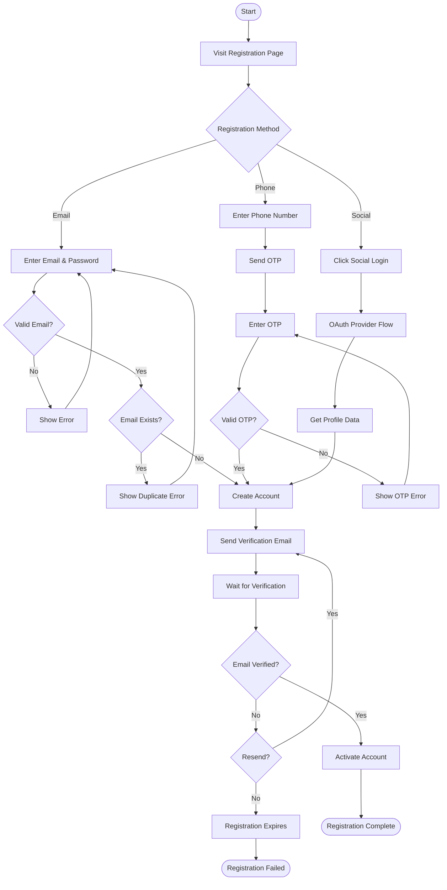
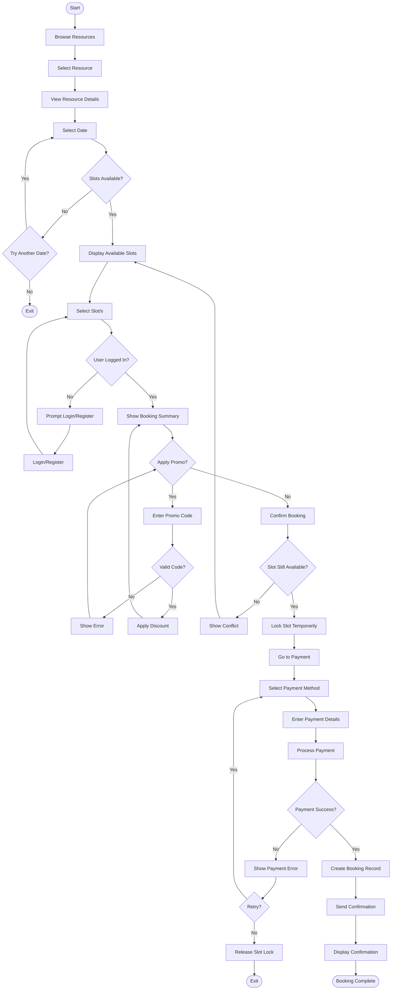
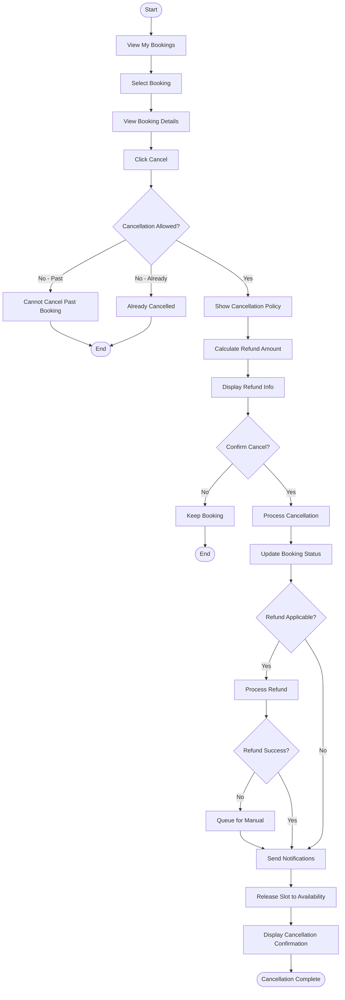
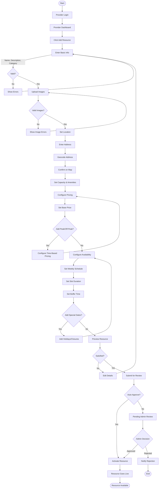
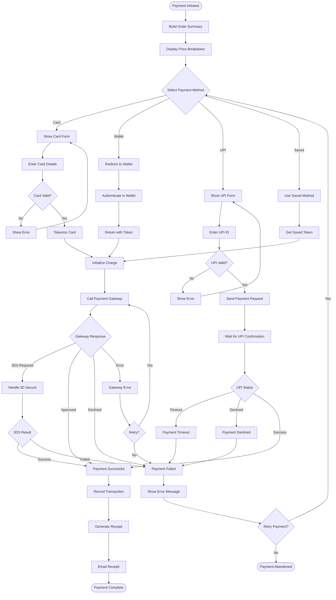
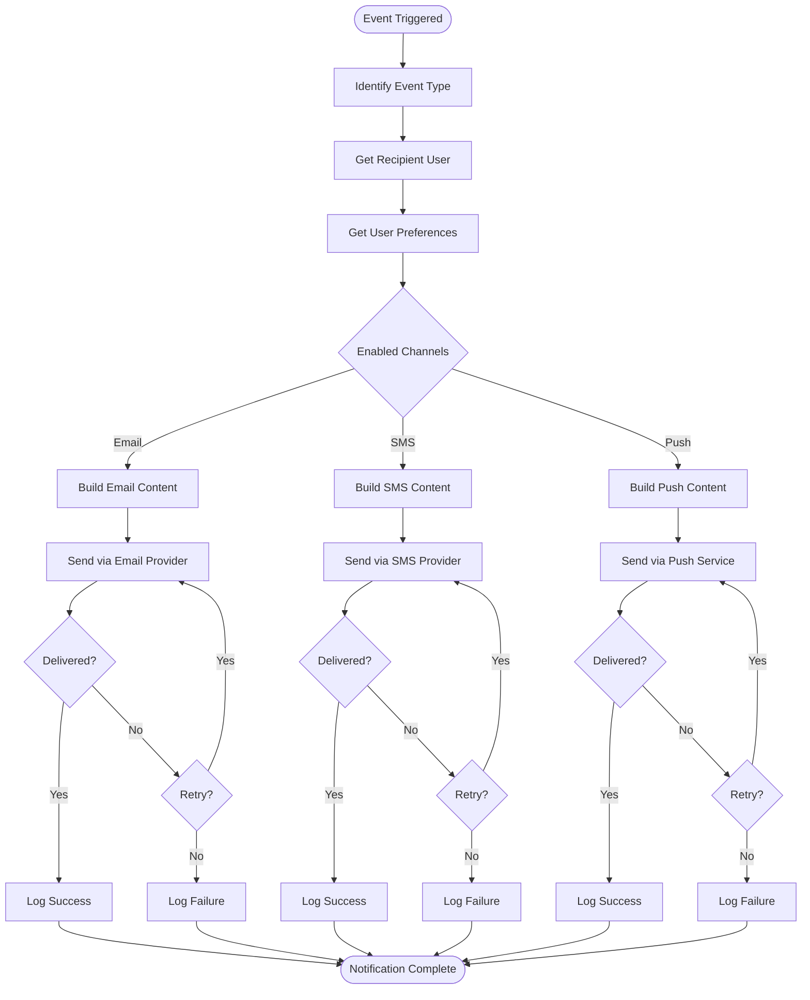

# Activity Diagram / Flowchart - Slot Booking System

> **Platform Independence**: Flowcharts show generic business processes applicable to any booking domain.

---

## 1. User Registration Flow

---

## 2. Complete Booking Flow

---

## 3. Booking Cancellation Flow

---

## 4. Provider Resource Setup Flow

---

## 5. Payment Processing Flow

---

## 6. Notification Dispatch Flow

