# BPMN / Swimlane Diagram - Slot Booking System

> **Platform Independence**: Swimlanes show role-based workflows applicable across booking domains.

---

## 1. Complete Booking Process - Swimlane

```mermaid
flowchart TB
    subgraph User["👤 User Lane"]
        U1([Start]) --> U2[Browse Resources]
        U2 --> U3[Select Resource & Date]
        U3 --> U4[Choose Time Slot]
        U4 --> U5{Logged In?}
        U5 -->|No| U6[Login/Register]
        U6 --> U4
        U5 -->|Yes| U7[Review Booking]
        U7 --> U8[Enter Payment Details]
        U8 --> U9[Confirm Payment]
        U14[View Confirmation] --> U15([End])
    end
    
    subgraph System["🖥️ System Lane"]
        S1[Display Available Resources]
        S2[Show Available Slots]
        S3[Calculate Price]
        S4[Validate & Lock Slot]
        S5[Process Payment]
        S6{Payment OK?}
        S7[Create Booking]
        S8[Generate Confirmation]
        S9[Release Lock]
    end
    
    subgraph PaymentGateway["💳 Payment Gateway Lane"]
        P1[Receive Payment Request]
        P2[Authorize Card]
        P3[Capture Funds]
        P4[Return Result]
    end
    
    subgraph NotificationService["📧 Notification Lane"]
        N1[Send Confirmation Email]
        N2[Send Push Notification]
        N3[Schedule Reminder]
    end
    
    U2 -.-> S1
    U3 -.-> S2
    U7 -.-> S3
    U9 --> S4
    S4 --> S5
    S5 --> P1
    P1 --> P2
    P2 --> P3
    P3 --> P4
    P4 --> S6
    S6 -->|Yes| S7
    S6 -->|No| S9
    S9 -.-> U8
    S7 --> S8
    S8 --> N1
    N1 --> N2
    N2 --> N3
    S8 -.-> U14
```

---

## 2. Booking Cancellation & Refund Process

```mermaid
flowchart TB
    subgraph User["👤 User Lane"]
        U1([Initiate Cancel]) --> U2[Select Booking]
        U2 --> U3[Request Cancellation]
        U9[Receive Confirmation]
        U10[View Refund Status] --> U11([End])
    end
    
    subgraph System["🖥️ System Lane"]
        S1[Validate Cancel Request]
        S2{Within Policy?}
        S3[Calculate Refund]
        S4[Update Booking Status]
        S5[Release Time Slot]
        S6[Initiate Refund]
        S7[Reject Cancellation]
    end
    
    subgraph Finance["💰 Finance Lane"]
        F1[Receive Refund Request]
        F2[Process Refund Transaction]
        F3[Record in Ledger]
        F4[Generate Credit Note]
    end
    
    subgraph Provider["🏢 Provider Lane"]
        P1[Receive Notification]
        P2[View Cancelled Booking]
        P3[Slot Available Again]
    end
    
    subgraph NotificationService["📧 Notification Lane"]
        N1[Notify User of Cancellation]
        N2[Notify Provider]
        N3[Send Refund Confirmation]
    end
    
    U3 --> S1
    S1 --> S2
    S2 -->|No| S7
    S7 -.-> U2
    S2 -->|Yes| S3
    S3 --> S4
    S4 --> S5
    S4 --> S6
    S5 --> P3
    S6 --> F1
    F1 --> F2
    F2 --> F3
    F3 --> F4
    F4 --> N3
    S4 --> N1
    N1 --> N2
    N2 --> P1
    P1 --> P2
    N3 -.-> U9
    U9 --> U10
```

---

## 3. Provider Onboarding Process

```mermaid
flowchart TB
    subgraph Provider["🏢 Provider Lane"]
        P1([Start]) --> P2[Submit Application]
        P2 --> P3[Upload Documents]
        P3 --> P4[Add Bank Details]
        P4 --> P5[Wait for Approval]
        P9[Complete Profile]
        P10[Add First Resource] --> P11([Start Operating])
    end
    
    subgraph System["🖥️ System Lane"]
        S1[Receive Application]
        S2[Validate Documents]
        S3[Store Securely]
        S4[Create Provider Account]
        S5[Send to Admin Queue]
    end
    
    subgraph Admin["👨‍💼 Admin Lane"]
        A1[Review Application]
        A2[Verify Business Info]
        A3{Decision}
        A4[Approve Provider]
        A5[Reject with Reason]
    end
    
    subgraph Compliance["✅ Compliance Lane"]
        C1[Background Check]
        C2[Verify Bank Account]
        C3[Generate Report]
    end
    
    subgraph Notification["📧 Notification Lane"]
        N1[Send Welcome Email]
        N2[Send Rejection Email]
        N3[Send Setup Guide]
    end
    
    P2 --> S1
    S1 --> S2
    P3 --> S3
    S2 --> S4
    S4 --> S5
    S5 --> A1
    A1 --> C1
    C1 --> C2
    C2 --> C3
    C3 --> A2
    A2 --> A3
    A3 -->|Approve| A4
    A3 -->|Reject| A5
    A4 --> N1
    N1 --> N3
    A5 --> N2
    N3 -.-> P9
    P9 --> P10
```

---

## 4. Dispute Resolution Process

```mermaid
flowchart TB
    subgraph User["👤 User Lane"]
        U1([Raise Dispute]) --> U2[Submit Details]
        U2 --> U3[Provide Evidence]
        U7[Receive Resolution]
        U8{Accept?}
        U8 -->|Yes| U9([Close])
        U8 -->|No| U10[Escalate]
    end
    
    subgraph Provider["🏢 Provider Lane"]
        P1[Receive Notification]
        P2[Review Dispute]
        P3[Submit Response]
        P4[Provide Counter-Evidence]
    end
    
    subgraph System["🖥️ System Lane"]
        S1[Create Dispute Ticket]
        S2[Assign to Admin]
        S3[Collect Both Sides]
        S4[Track Resolution Time]
    end
    
    subgraph Admin["👨‍💼 Admin Lane"]
        A1[Review Case]
        A2[Request More Info]
        A3[Analyze Evidence]
        A4{Decision}
        A5[Rule in User Favor]
        A6[Rule in Provider Favor]
        A7[Partial Resolution]
    end
    
    subgraph Finance["💰 Finance Lane"]
        F1[Process Refund]
        F2[Apply Penalty]
        F3[Update Records]
    end
    
    subgraph Escalation["⬆️ Escalation Lane"]
        E1[Senior Review]
        E2[Final Decision]
    end
    
    U2 --> S1
    U3 --> S3
    S1 --> S2
    S2 --> A1
    S1 --> P1
    P1 --> P2
    P2 --> P3
    P3 --> S3
    P4 --> S3
    S3 --> A3
    A1 --> A2
    A2 -.-> U3
    A2 -.-> P4
    A3 --> A4
    A4 -->|User| A5
    A4 -->|Provider| A6
    A4 -->|Split| A7
    A5 --> F1
    A6 --> F3
    A7 --> F1
    A7 --> F3
    F1 --> U7
    F3 --> U7
    U10 --> E1
    E1 --> E2
    E2 --> U7
```

---

## 5. End-to-End Booking Lifecycle

```mermaid
flowchart LR
    subgraph Discovery["🔍 Discovery Phase"]
        D1[Browse] --> D2[Search]
        D2 --> D3[View Details]
        D3 --> D4[Check Availability]
    end
    
    subgraph Booking["📅 Booking Phase"]
        B1[Select Slot] --> B2[Login]
        B2 --> B3[Review]
        B3 --> B4[Payment]
        B4 --> B5[Confirmation]
    end
    
    subgraph PreService["⏳ Pre-Service Phase"]
        PS1[Reminder 24h] --> PS2[Reminder 1h]
        PS2 --> PS3[Check-in Ready]
    end
    
    subgraph Service["✨ Service Phase"]
        SV1[Arrive] --> SV2[Check-in]
        SV2 --> SV3[Use Resource]
        SV3 --> SV4[Complete]
    end
    
    subgraph PostService["📝 Post-Service Phase"]
        PO1[Request Feedback] --> PO2[Rate & Review]
        PO2 --> PO3[Invoice]
    end
    
    subgraph Lifecycle["🔄 Lifecycle"]
        L1[Rebooking Prompt]
        L2[Loyalty Points]
        L3[Recommendations]
    end
    
    D4 --> B1
    B5 --> PS1
    PS3 --> SV1
    SV4 --> PO1
    PO3 --> L1
    L1 --> D1
```

---

## 6. Multi-Resource Booking Coordination

```mermaid
flowchart TB
    subgraph Customer["👤 Customer Lane"]
        C1([Event Planning]) --> C2[Define Requirements]
        C2 --> C3[Search Resources]
        C3 --> C4[Build Package]
        C4 --> C5[Submit Request]
        C10[Receive Confirmation]
        C11[Manage Bookings] --> C12([Event Day])
    end
    
    subgraph System["🖥️ System Lane"]
        S1[Parse Requirements]
        S2[Check All Availabilities]
        S3[Calculate Total]
        S4[Reserve All Temporarily]
        S5{All Available?}
        S6[Process Package Payment]
        S7[Confirm All Bookings]
        S8[Suggest Alternatives]
    end
    
    subgraph ProviderA["🏢 Provider A Lane"]
        PA1[Receive Booking]
        PA2[Confirm Reservation]
        PA3[Prepare Resource]
    end
    
    subgraph ProviderB["🏢 Provider B Lane"]
        PB1[Receive Booking]
        PB2[Confirm Reservation]
        PB3[Prepare Resource]
    end
    
    subgraph Coordinator["📋 Coordinator Lane"]
        CO1[Review Package]
        CO2[Coordinate Timing]
        CO3[Send Master Itinerary]
    end
    
    C3 --> S1
    S1 --> S2
    C5 --> S4
    S4 --> S5
    S5 -->|No| S8
    S8 -.-> C4
    S5 -->|Yes| S6
    S6 --> S7
    S7 --> PA1
    S7 --> PB1
    PA1 --> PA2
    PB1 --> PB2
    PA2 --> CO1
    PB2 --> CO1
    CO1 --> CO2
    CO2 --> CO3
    CO3 -.-> C10
    C10 --> C11
    PA2 --> PA3
    PB2 --> PB3
```

---

## Legend

| Symbol | Meaning |
|--------|---------|
| `([Text])` | Start/End event |
| `[Text]` | Activity/Task |
| `{Text}` | Decision gateway |
| `-->` | Sequence flow |
| `-.->` | Message flow (between lanes) |
| Lane | Role/Participant responsible for activities |
