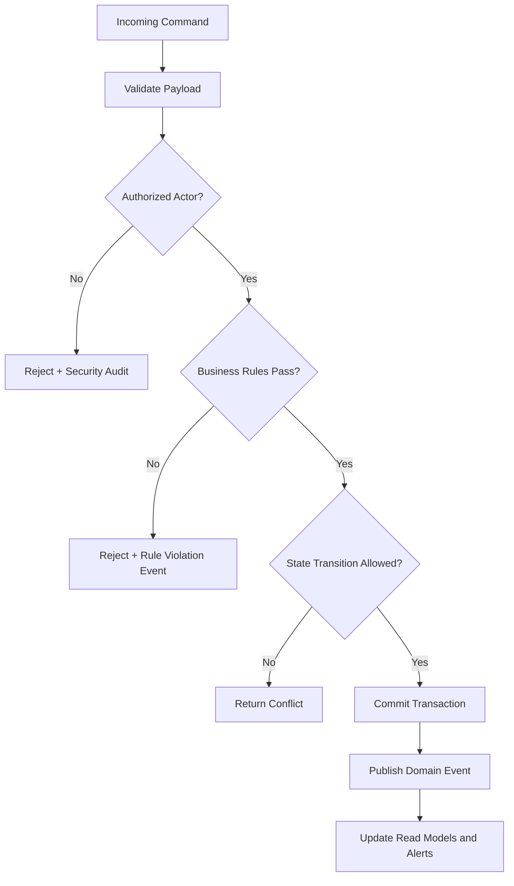

# Business Rules

This document defines enforceable policy rules for **Slot Booking System** so command processing, asynchronous jobs, and operational actions behave consistently under normal and exceptional conditions.

## Context
- Domain focus: slot booking workflows.
- Rule categories: lifecycle transitions, authorization, compliance, and resilience.
- Enforcement points: APIs, workflow/state engines, background processors, and administrative consoles.

## Enforceable Rules
1. Every state-changing command must pass authentication, authorization, and schema validation before processing.
2. Lifecycle transitions must follow the configured state graph; invalid transitions are rejected with explicit reason codes.
3. High-impact operations (financial, security, or regulated data actions) require additional approval evidence.
4. Manual overrides must include approver identity, rationale, and expiration timestamp.
5. Retries and compensations must be idempotent and must not create duplicate business effects.

## Rule Evaluation Pipeline

## Exception and Override Handling
- Overrides are restricted to approved exception classes and require dual logging (business + security audit).
- Override windows automatically expire and trigger follow-up verification tasks.
- Repeated override patterns are reviewed for policy redesign and automation improvements.

---
## Implementation-Ready Business Rules

### Slot allocation rules in this document's context
- Allocation decisions must be based on **resource calendar + operational policy + channel limits** before any payment action is attempted.
- All provisional allocations require an explicit **hold record with expiry**, and expiry must be visible to clients.
- Shared-capacity resources must use atomic decrement semantics; exclusive resources must enforce single-active-booking constraints.

### Conflict resolution in this document's context
- Competing writes must use deterministic conflict handling (optimistic version checks or transactional locks as documented here).
- API and admin paths must converge on one canonical conflict reason taxonomy (`SLOT_TAKEN`, `STALE_VERSION`, `PROVIDER_BLOCKED`, `PAYMENT_STATE_MISMATCH`).
- Every conflict rejection must emit structured audit telemetry including actor, correlation ID, and rule version.

### Payment coupling / decoupling behavior
- **Coupled flow**: booking moves to confirmed only after successful authorization/capture.
- **Decoupled flow**: booking can be confirmed with `PAYMENT_PENDING`, but with a bounded grace window and auto-cancel guardrail.
- Compensation is mandatory for split-brain outcomes (payment succeeded but booking failed, or inverse).

### Cancellation and refund policy detail
- Refund outcomes depend on lead time, policy tier, no-show status, and jurisdiction-specific fee constraints.
- Refund processing must be idempotent and expose lifecycle states (`REQUESTED`, `INITIATED`, `SETTLED`, `FAILED`, `MANUAL_REVIEW`).
- Cancellation side effects must include slot reallocation and downstream notification consistency.

### Observability and incident playbook focus
- Monitor: availability latency, hold expiry lag, conflict rate, payment callback success, refund aging.
- Alerts must map to operator runbooks with first-response steps and data reconciliation queries.
- Post-incident review must record policy gaps and required control changes for this documentation area.

### Analysis deliverables needed for implementation
- Actor-to-policy mapping (who can override, who can cancel, who can force-refund).
- Event semantics (`HoldCreated`, `BookingConfirmed`, `PaymentFailed`, `RefundSettled`) with producer/consumer contracts.
- Failure scenario catalog with expected user-visible outcomes and operator responsibilities.
