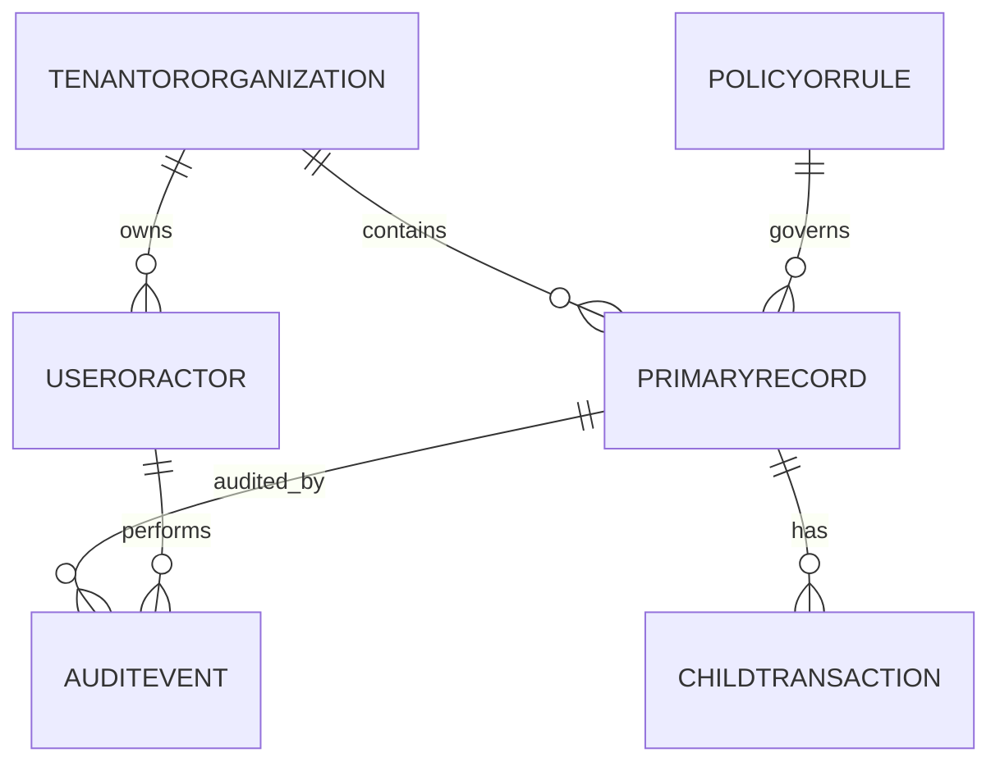

# Data Dictionary

This data dictionary is the canonical reference for **Slot Booking System**. It defines shared terminology, entity semantics, and governance controls required to keep slot booking workflows consistent across teams and services.

## Scope and Goals
- Establish a stable vocabulary for architecture, API, analytics, and operations teams.
- Define minimum required fields for core entities and expected relationship boundaries.
- Document data quality and retention controls needed for production readiness.

## Core Entities
| Entity | Description | Required Attributes |
|---|---|---|
| TenantOrOrganization | Top-level ownership boundary for data segregation | `org_id, name, status, region, created_at` |
| UserOrActor | Human/system principal that performs actions | `actor_id, org_id, role, status, last_active_at` |
| PrimaryRecord | Main lifecycle object handled by the platform | `record_id, org_id, state, owner_id, created_at, updated_at` |
| ChildTransaction | Operational transaction or sub-step linked to primary record | `txn_id, record_id, txn_type, amount_or_value, occurred_at` |
| PolicyOrRule | Versioned policy configuration that influences decisions | `policy_id, scope, version, effective_from, effective_to` |
| AuditEvent | Append-only evidence for state changes and controls | `audit_id, record_id, actor_id, action, reason_code, occurred_at` |

## Canonical Relationship Diagram

## Data Quality Controls
1. All write paths enforce required-field validation and referential integrity for mandatory foreign keys.
2. External imports must include provenance metadata (`source_system`, `source_ref`, `ingested_at`).
3. Status/state fields use controlled vocabularies and reject unknown values.
4. Duplicate detection runs on natural keys where business identity collisions are likely.
5. Sensitive fields carry classification tags to drive masking, encryption, and export behavior.

## Retention and Audit
- Operational records remain online for active workflow windows and support forensic queries.
- Historical records move to archive tiers by policy without breaking traceability.
- Audit events are immutable and linked through correlation ids for incident analysis.

---
## Implementation-Ready Data Dictionary

### Slot allocation rules in this document's context
- Allocation decisions must be based on **resource calendar + operational policy + channel limits** before any payment action is attempted.
- All provisional allocations require an explicit **hold record with expiry**, and expiry must be visible to clients.
- Shared-capacity resources must use atomic decrement semantics; exclusive resources must enforce single-active-booking constraints.

### Conflict resolution in this document's context
- Competing writes must use deterministic conflict handling (optimistic version checks or transactional locks as documented here).
- API and admin paths must converge on one canonical conflict reason taxonomy (`SLOT_TAKEN`, `STALE_VERSION`, `PROVIDER_BLOCKED`, `PAYMENT_STATE_MISMATCH`).
- Every conflict rejection must emit structured audit telemetry including actor, correlation ID, and rule version.

### Payment coupling / decoupling behavior
- **Coupled flow**: booking moves to confirmed only after successful authorization/capture.
- **Decoupled flow**: booking can be confirmed with `PAYMENT_PENDING`, but with a bounded grace window and auto-cancel guardrail.
- Compensation is mandatory for split-brain outcomes (payment succeeded but booking failed, or inverse).

### Cancellation and refund policy detail
- Refund outcomes depend on lead time, policy tier, no-show status, and jurisdiction-specific fee constraints.
- Refund processing must be idempotent and expose lifecycle states (`REQUESTED`, `INITIATED`, `SETTLED`, `FAILED`, `MANUAL_REVIEW`).
- Cancellation side effects must include slot reallocation and downstream notification consistency.

### Observability and incident playbook focus
- Monitor: availability latency, hold expiry lag, conflict rate, payment callback success, refund aging.
- Alerts must map to operator runbooks with first-response steps and data reconciliation queries.
- Post-incident review must record policy gaps and required control changes for this documentation area.

### Analysis deliverables needed for implementation
- Actor-to-policy mapping (who can override, who can cancel, who can force-refund).
- Event semantics (`HoldCreated`, `BookingConfirmed`, `PaymentFailed`, `RefundSettled`) with producer/consumer contracts.
- Failure scenario catalog with expected user-visible outcomes and operator responsibilities.
