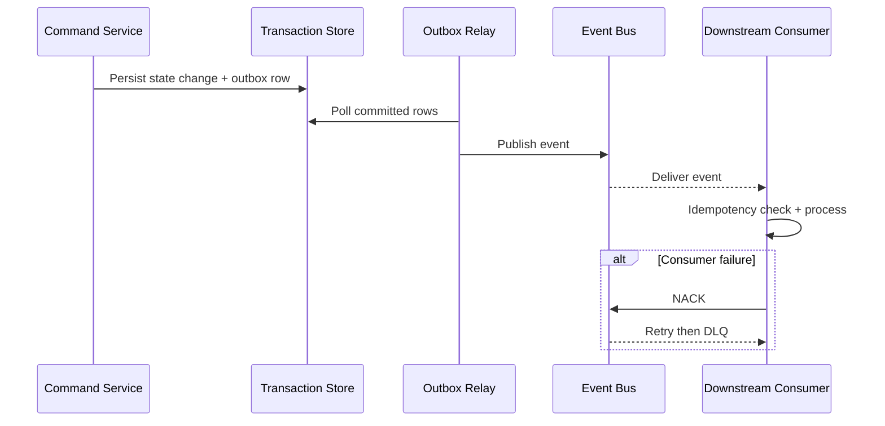

# Event Catalog

This catalog defines stable event contracts for **Slot Booking System** to support event-driven integrations, auditability, and analytics across slot booking workflows.

## Contract Conventions
- Event naming: `<domain>.<aggregate>.<action>.v1`.
- Required metadata: `event_id`, `occurred_at`, `correlation_id`, `producer`, `schema_version`, `tenant_context`.
- Delivery mode: at-least-once with mandatory consumer idempotency.
- Ordering guarantee: per aggregate key; no global ordering assumption.

## Domain Events
| Event Name | Payload Highlights | Typical Consumers |
|---|---|---|
| `domain.record.created.v1` | record_id, actor_id, initial_state, occurred_at | orchestration, analytics |
| `domain.record.state_changed.v1` | record_id, old_state, new_state, reason_code | notifications, reporting |
| `domain.record.validation_failed.v1` | record_id, violated_rules, correlation_id | operations, quality dashboards |
| `domain.record.override_applied.v1` | record_id, override_type, approver_id, expires_at | compliance, audit |
| `domain.record.closed.v1` | record_id, terminal_state, closed_at | billing/settlement, archives |

## Publish and Consumption Sequence

## Operational SLOs
- P95 commit-to-publish latency below 5 seconds for tier-1 events.
- DLQ triage acknowledgement within 15 minutes for production incidents.
- Schema changes remain backward compatible within the same major version.

---
## Implementation-Ready Event Catalog

### Slot allocation rules in this document's context
- Allocation decisions must be based on **resource calendar + operational policy + channel limits** before any payment action is attempted.
- All provisional allocations require an explicit **hold record with expiry**, and expiry must be visible to clients.
- Shared-capacity resources must use atomic decrement semantics; exclusive resources must enforce single-active-booking constraints.

### Conflict resolution in this document's context
- Competing writes must use deterministic conflict handling (optimistic version checks or transactional locks as documented here).
- API and admin paths must converge on one canonical conflict reason taxonomy (`SLOT_TAKEN`, `STALE_VERSION`, `PROVIDER_BLOCKED`, `PAYMENT_STATE_MISMATCH`).
- Every conflict rejection must emit structured audit telemetry including actor, correlation ID, and rule version.

### Payment coupling / decoupling behavior
- **Coupled flow**: booking moves to confirmed only after successful authorization/capture.
- **Decoupled flow**: booking can be confirmed with `PAYMENT_PENDING`, but with a bounded grace window and auto-cancel guardrail.
- Compensation is mandatory for split-brain outcomes (payment succeeded but booking failed, or inverse).

### Cancellation and refund policy detail
- Refund outcomes depend on lead time, policy tier, no-show status, and jurisdiction-specific fee constraints.
- Refund processing must be idempotent and expose lifecycle states (`REQUESTED`, `INITIATED`, `SETTLED`, `FAILED`, `MANUAL_REVIEW`).
- Cancellation side effects must include slot reallocation and downstream notification consistency.

### Observability and incident playbook focus
- Monitor: availability latency, hold expiry lag, conflict rate, payment callback success, refund aging.
- Alerts must map to operator runbooks with first-response steps and data reconciliation queries.
- Post-incident review must record policy gaps and required control changes for this documentation area.

### Analysis deliverables needed for implementation
- Actor-to-policy mapping (who can override, who can cancel, who can force-refund).
- Event semantics (`HoldCreated`, `BookingConfirmed`, `PaymentFailed`, `RefundSettled`) with producer/consumer contracts.
- Failure scenario catalog with expected user-visible outcomes and operator responsibilities.
