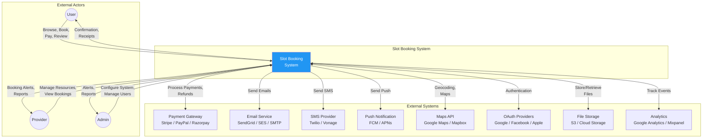
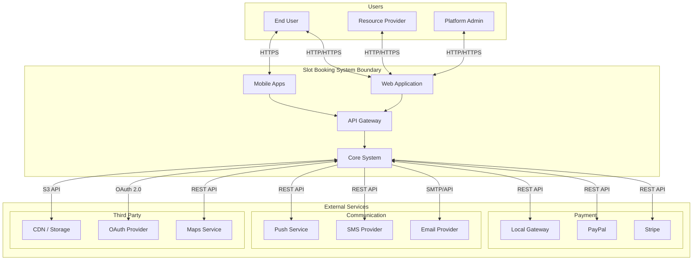
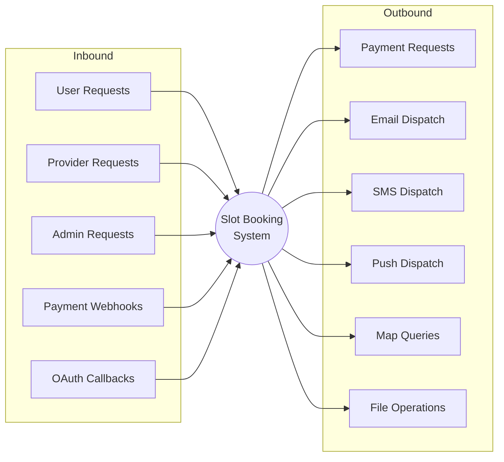

# System Context Diagram - Slot Booking System

> **Platform Independence**: External systems shown are representative; actual integrations depend on deployment.

---

## Overview

The System Context Diagram shows the Slot Booking System (the system under design) and its interactions with external actors and systems.

---

## System Context Diagram

---

## Detailed Context with Data Flows

---

## External System Details

| System | Purpose | Protocol | Data Exchanged |
|--------|---------|----------|----------------|
| **Payment Gateway** | Process payments, refunds | REST API | Payment requests, transaction status, webhooks |
| **Email Service** | Transactional emails | SMTP/REST | Booking confirmations, receipts, notifications |
| **SMS Provider** | SMS notifications, OTP | REST API | Text messages, delivery status |
| **Push Service** | Mobile push notifications | REST API | Push messages, device tokens |
| **Maps API** | Location services | REST API | Geocoding, map tiles, directions |
| **OAuth Providers** | Social authentication | OAuth 2.0 | User identity, profile data |
| **File Storage** | Store images, documents | S3/REST | Resource images, invoices |
| **Analytics** | Usage tracking | JavaScript/REST | User events, page views |

---

## System Boundaries

### What's Inside the System
- User registration and authentication
- Resource and slot management
- Booking lifecycle management
- Payment orchestration
- Notification dispatching
- Reporting and analytics aggregation
- Admin configuration

### What's Outside the System
- Actual payment processing (delegated to gateways)
- Email/SMS delivery (delegated to providers)
- File storage (delegated to cloud storage)
- Map rendering (delegated to map services)
- Identity verification (delegated to OAuth providers)

---

## Integration Points

---

## Trust Boundaries

| Boundary | Inside | Outside | Protection |
|----------|--------|---------|------------|
| **Public Internet** | External Users | System | TLS, WAF, Rate Limiting |
| **API Gateway** | Internal Services | External APIs | API Keys, OAuth |
| **Database Layer** | Application | Data Store | Connection Encryption, RBAC |
| **Payment Zone** | System | Payment Gateway | PCI DSS, Tokenization |
