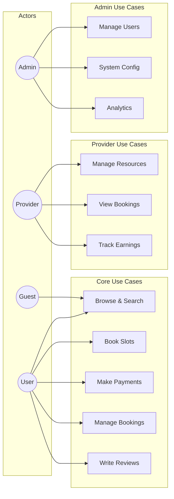
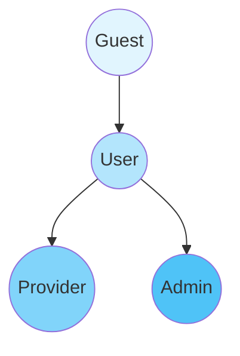
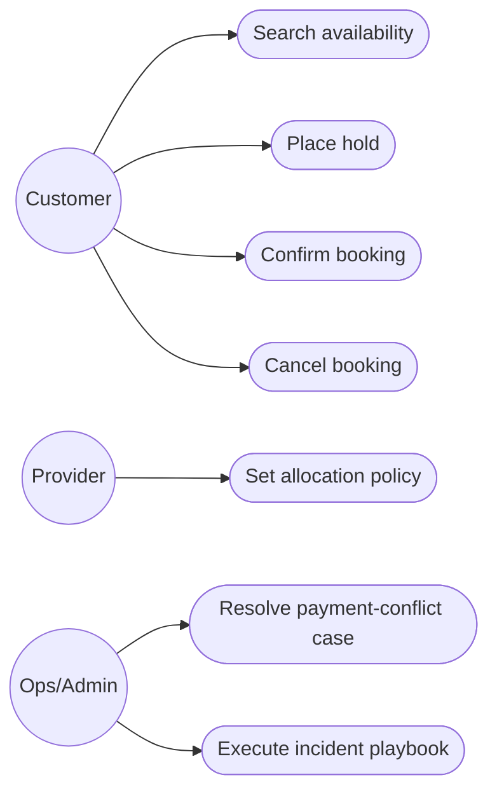

# Use Case Diagram - Slot Booking System

> **Platform Independence**: Actors and use cases are generic. Adapt terminology for your domain.

---

## Overview

This diagram shows what each actor can do within the Slot Booking System.

---

## Use Case Diagram

```mermaid
graph TB
    subgraph Actors
        Guest((Guest))
        User((User))
        Provider((Provider))
        Admin((Admin))
    end
    
    subgraph "Slot Booking System"
        subgraph "Authentication"
            UC1[Register Account]
            UC2[Login]
            UC3[Reset Password]
            UC4[Manage Profile]
        end
        
        subgraph "Resource Discovery"
            UC5[Browse Resources]
            UC6[Search Resources]
            UC7[View Resource Details]
            UC8[View Availability]
            UC9[View Reviews]
        end
        
        subgraph "Booking Management"
            UC10[Book Slot]
            UC11[View My Bookings]
            UC12[Cancel Booking]
            UC13[Reschedule Booking]
            UC14[Setup Recurring Booking]
        end
        
        subgraph "Payment"
            UC15[Make Payment]
            UC16[Apply Promo Code]
            UC17[View Payment History]
            UC18[Request Refund]
        end
        
        subgraph "Notifications"
            UC19[Receive Notifications]
            UC20[Manage Notification Settings]
        end
        
        subgraph "Reviews"
            UC21[Rate Resource]
            UC22[Write Review]
        end
        
        subgraph "Provider Functions"
            UC23[Register as Provider]
            UC24[Add Resource]
            UC25[Update Resource]
            UC26[Manage Availability]
            UC27[View Provider Bookings]
            UC28[View Earnings]
            UC29[Respond to Reviews]
            UC30[Export Reports]
        end
        
        subgraph "Admin Functions"
            UC31[Manage Users]
            UC32[Approve Providers]
            UC33[Configure System]
            UC34[View Analytics]
            UC35[Handle Disputes]
            UC36[Manage Payments]
        end
    end
    
    %% Guest connections
    Guest --> UC1
    Guest --> UC5
    Guest --> UC6
    Guest --> UC7
    Guest --> UC8
    Guest --> UC9
    
    %% User connections (includes Guest capabilities)
    User --> UC2
    User --> UC3
    User --> UC4
    User --> UC5
    User --> UC6
    User --> UC7
    User --> UC8
    User --> UC9
    User --> UC10
    User --> UC11
    User --> UC12
    User --> UC13
    User --> UC14
    User --> UC15
    User --> UC16
    User --> UC17
    User --> UC18
    User --> UC19
    User --> UC20
    User --> UC21
    User --> UC22
    
    %% Provider connections
    Provider --> UC2
    Provider --> UC4
    Provider --> UC23
    Provider --> UC24
    Provider --> UC25
    Provider --> UC26
    Provider --> UC27
    Provider --> UC28
    Provider --> UC29
    Provider --> UC30
    
    %% Admin connections
    Admin --> UC2
    Admin --> UC31
    Admin --> UC32
    Admin --> UC33
    Admin --> UC34
    Admin --> UC35
    Admin --> UC36
```

---

## Alternative View: Simplified Use Case Diagram

```mermaid
flowchart LR
    subgraph Actors
        G((Guest))
        U((User))
        P((Provider))
        A((Admin))
    end
    
    subgraph "Core Use Cases"
        direction TB
        Browse[Browse & Search]
        Book[Book Slots]
        Pay[Make Payments]
        Manage[Manage Bookings]
        Review[Write Reviews]
    end
    
    subgraph "Provider Use Cases"
        direction TB
        AddRes[Manage Resources]
        ViewBook[View Bookings]
        Earn[Track Earnings]
    end
    
    subgraph "Admin Use Cases"
        direction TB
        Users[Manage Users]
        Config[System Config]
        Reports[Analytics]
    end
    
    G --> Browse
    U --> Browse
    U --> Book
    U --> Pay
    U --> Manage
    U --> Review
    
    P --> AddRes
    P --> ViewBook
    P --> Earn
    
    A --> Users
    A --> Config
    A --> Reports
```

---

## Actor Hierarchy

```mermaid
graph TD
    Guest((Guest)) --> User((User))
    User --> Provider((Provider))
    User --> Admin((Admin))
    
    style Guest fill:#e1f5fe
    style User fill:#b3e5fc
    style Provider fill:#81d4fa
    style Admin fill:#4fc3f7
```

| Actor | Description | Inherits From |
|-------|-------------|---------------|
| Guest | Unauthenticated visitor | - |
| User | Registered customer | Guest |
| Provider | Resource owner/manager | User |
| Admin | Platform administrator | User |

---

## Use Case Summary

| Category | Use Cases | Primary Actor |
|----------|-----------|---------------|
| Authentication | Register, Login, Reset Password, Manage Profile | All |
| Discovery | Browse, Search, View Details, View Availability | Guest, User |
| Booking | Book, View, Cancel, Reschedule, Recurring | User |
| Payment | Pay, Promo Code, History, Refund | User |
| Reviews | Rate, Write Review | User |
| Provider | Add/Update Resource, Availability, Bookings, Earnings | Provider |
| Admin | Users, Providers, Config, Analytics, Disputes | Admin |

---
## Implementation-Ready Use Case Diagram

### Slot allocation rules in this document's context
- Allocation decisions must be based on **resource calendar + operational policy + channel limits** before any payment action is attempted.
- All provisional allocations require an explicit **hold record with expiry**, and expiry must be visible to clients.
- Shared-capacity resources must use atomic decrement semantics; exclusive resources must enforce single-active-booking constraints.

### Conflict resolution in this document's context
- Competing writes must use deterministic conflict handling (optimistic version checks or transactional locks as documented here).
- API and admin paths must converge on one canonical conflict reason taxonomy (`SLOT_TAKEN`, `STALE_VERSION`, `PROVIDER_BLOCKED`, `PAYMENT_STATE_MISMATCH`).
- Every conflict rejection must emit structured audit telemetry including actor, correlation ID, and rule version.

### Payment coupling / decoupling behavior
- **Coupled flow**: booking moves to confirmed only after successful authorization/capture.
- **Decoupled flow**: booking can be confirmed with `PAYMENT_PENDING`, but with a bounded grace window and auto-cancel guardrail.
- Compensation is mandatory for split-brain outcomes (payment succeeded but booking failed, or inverse).

### Cancellation and refund policy detail
- Refund outcomes depend on lead time, policy tier, no-show status, and jurisdiction-specific fee constraints.
- Refund processing must be idempotent and expose lifecycle states (`REQUESTED`, `INITIATED`, `SETTLED`, `FAILED`, `MANUAL_REVIEW`).
- Cancellation side effects must include slot reallocation and downstream notification consistency.

### Observability and incident playbook focus
- Monitor: availability latency, hold expiry lag, conflict rate, payment callback success, refund aging.
- Alerts must map to operator runbooks with first-response steps and data reconciliation queries.
- Post-incident review must record policy gaps and required control changes for this documentation area.

### Analysis deliverables needed for implementation
- Actor-to-policy mapping (who can override, who can cancel, who can force-refund).
- Event semantics (`HoldCreated`, `BookingConfirmed`, `PaymentFailed`, `RefundSettled`) with producer/consumer contracts.
- Failure scenario catalog with expected user-visible outcomes and operator responsibilities.

### Mermaid use-case coverage map

```mermaid
flowchart LR
  User((Customer)) --> Search([Search availability])
  User --> Hold([Place hold])
  User --> Confirm([Confirm booking])
  User --> Cancel([Cancel booking])
  Provider((Provider)) --> Policy([Set allocation policy])
  Admin((Ops/Admin)) --> Resolve([Resolve payment-conflict case])
  Admin --> Incident([Execute incident playbook])
```
