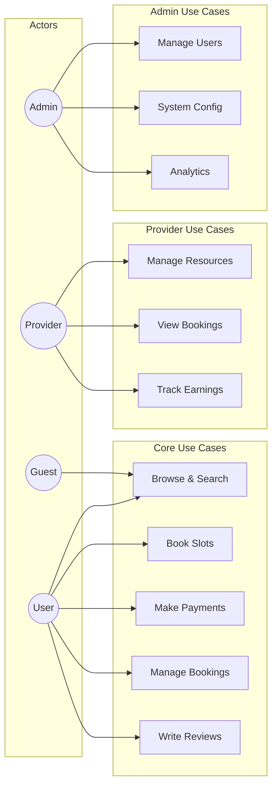
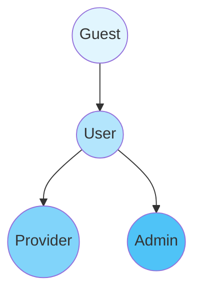

# Use Case Diagram - Slot Booking System

> **Platform Independence**: Actors and use cases are generic. Adapt terminology for your domain.

---

## Overview

This diagram shows what each actor can do within the Slot Booking System.

---

## Use Case Diagram

```mermaid
graph TB
    subgraph Actors
        Guest((Guest))
        User((User))
        Provider((Provider))
        Admin((Admin))
    end
    
    subgraph "Slot Booking System"
        subgraph "Authentication"
            UC1[Register Account]
            UC2[Login]
            UC3[Reset Password]
            UC4[Manage Profile]
        end
        
        subgraph "Resource Discovery"
            UC5[Browse Resources]
            UC6[Search Resources]
            UC7[View Resource Details]
            UC8[View Availability]
            UC9[View Reviews]
        end
        
        subgraph "Booking Management"
            UC10[Book Slot]
            UC11[View My Bookings]
            UC12[Cancel Booking]
            UC13[Reschedule Booking]
            UC14[Setup Recurring Booking]
        end
        
        subgraph "Payment"
            UC15[Make Payment]
            UC16[Apply Promo Code]
            UC17[View Payment History]
            UC18[Request Refund]
        end
        
        subgraph "Notifications"
            UC19[Receive Notifications]
            UC20[Manage Notification Settings]
        end
        
        subgraph "Reviews"
            UC21[Rate Resource]
            UC22[Write Review]
        end
        
        subgraph "Provider Functions"
            UC23[Register as Provider]
            UC24[Add Resource]
            UC25[Update Resource]
            UC26[Manage Availability]
            UC27[View Provider Bookings]
            UC28[View Earnings]
            UC29[Respond to Reviews]
            UC30[Export Reports]
        end
        
        subgraph "Admin Functions"
            UC31[Manage Users]
            UC32[Approve Providers]
            UC33[Configure System]
            UC34[View Analytics]
            UC35[Handle Disputes]
            UC36[Manage Payments]
        end
    end
    
    %% Guest connections
    Guest --> UC1
    Guest --> UC5
    Guest --> UC6
    Guest --> UC7
    Guest --> UC8
    Guest --> UC9
    
    %% User connections (includes Guest capabilities)
    User --> UC2
    User --> UC3
    User --> UC4
    User --> UC5
    User --> UC6
    User --> UC7
    User --> UC8
    User --> UC9
    User --> UC10
    User --> UC11
    User --> UC12
    User --> UC13
    User --> UC14
    User --> UC15
    User --> UC16
    User --> UC17
    User --> UC18
    User --> UC19
    User --> UC20
    User --> UC21
    User --> UC22
    
    %% Provider connections
    Provider --> UC2
    Provider --> UC4
    Provider --> UC23
    Provider --> UC24
    Provider --> UC25
    Provider --> UC26
    Provider --> UC27
    Provider --> UC28
    Provider --> UC29
    Provider --> UC30
    
    %% Admin connections
    Admin --> UC2
    Admin --> UC31
    Admin --> UC32
    Admin --> UC33
    Admin --> UC34
    Admin --> UC35
    Admin --> UC36
```

---

## Alternative View: Simplified Use Case Diagram

---

## Actor Hierarchy

| Actor | Description | Inherits From |
|-------|-------------|---------------|
| Guest | Unauthenticated visitor | - |
| User | Registered customer | Guest |
| Provider | Resource owner/manager | User |
| Admin | Platform administrator | User |

---

## Use Case Summary

| Category | Use Cases | Primary Actor |
|----------|-----------|---------------|
| Authentication | Register, Login, Reset Password, Manage Profile | All |
| Discovery | Browse, Search, View Details, View Availability | Guest, User |
| Booking | Book, View, Cancel, Reschedule, Recurring | User |
| Payment | Pay, Promo Code, History, Refund | User |
| Reviews | Rate, Write Review | User |
| Provider | Add/Update Resource, Availability, Bookings, Earnings | Provider |
| Admin | Users, Providers, Config, Analytics, Disputes | Admin |
