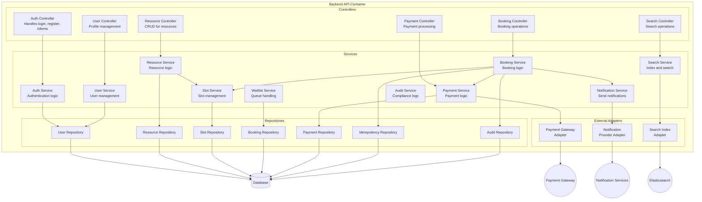
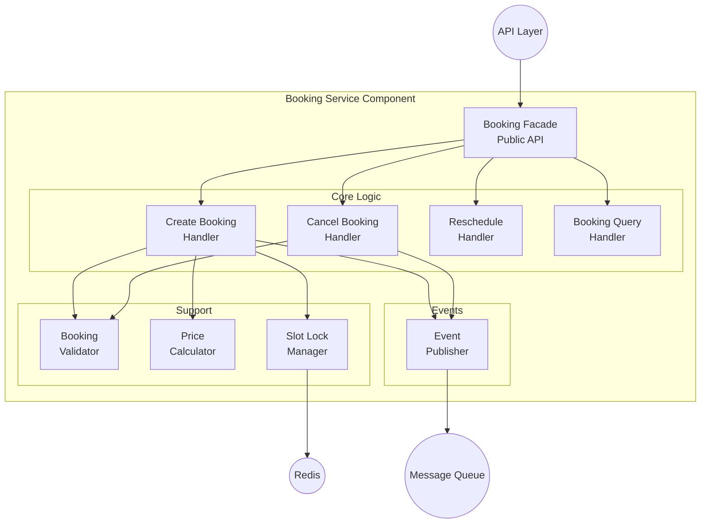
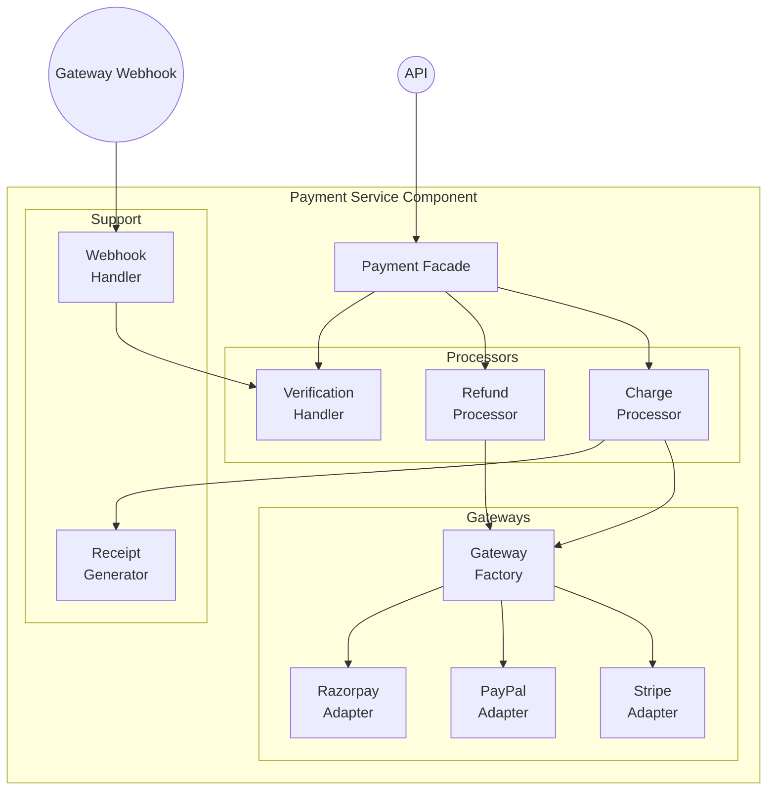
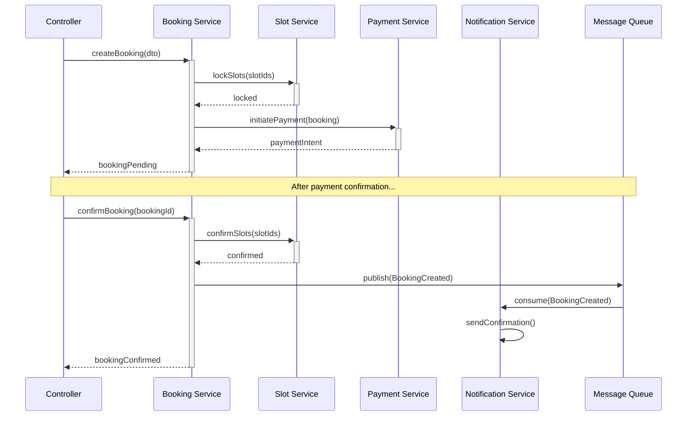

# C4 Component Diagram - Slot Booking System

> **Platform Independence**: C4 Level 3 showing components within containers.

---

## Overview

The C4 Component Diagram (Level 3) shows the internal structure of containers, breaking them down into components.

---

## Backend API Container - Components

---

## Booking Service Component Detail

---

## Payment Service Component Detail

---

## Component Responsibilities

| Component | Responsibility | Interfaces |
|-----------|----------------|------------|
| **Auth Controller** | Handle auth HTTP requests | REST endpoints |
| **Auth Service** | Token generation, validation | IAuthService |
| **User Service** | User CRUD, profile mgmt | IUserService |
| **Resource Service** | Resource CRUD, image handling | IResourceService |
| **Slot Service** | Slot generation, locking | ISlotService |
| **Booking Service** | Booking lifecycle | IBookingService |
| **Payment Service** | Payment orchestration | IPaymentService |
| **Notification Service** | Multi-channel dispatch | INotificationService |
| **Search Service** | Indexing, searching | ISearchService |

---

## Component Interaction Example

---

## Technology Mapping

| Component | Technology Options |
|-----------|-------------------|
| Controllers | Express.js, FastAPI, Spring MVC |
| Services | TypeScript classes, Python classes |
| Repositories | TypeORM, Prisma, SQLAlchemy |
| Event Publisher | RabbitMQ client, Kafka producer |
| Payment Adapters | Stripe SDK, PayPal SDK |
| Notification Adapters | SendGrid SDK, Twilio SDK |
