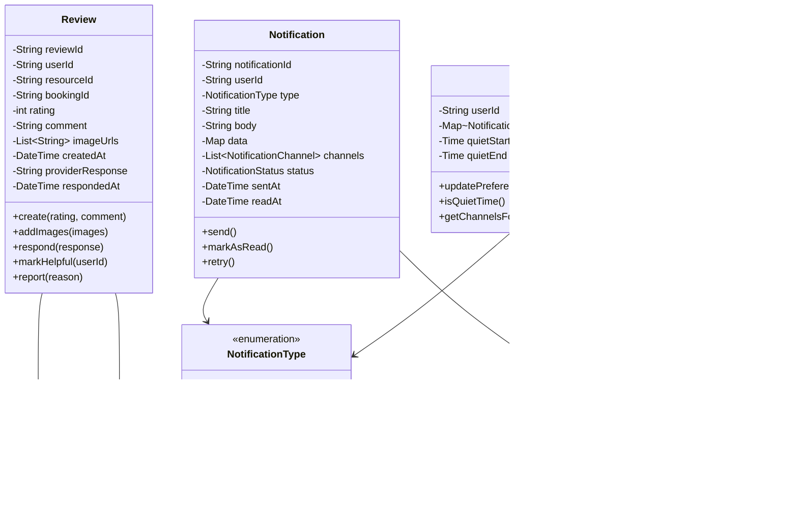

# Class Diagram - Slot Booking System

> **Platform Independence**: Class diagrams use language-agnostic notation adaptable to any OOP language.

---

## Overview

The Class Diagram shows the detailed structure of the system including classes, their attributes, methods, and relationships.

---

## Core Domain Classes

---

## Resource and Slot Classes

---

## Booking and Payment Classes

---

## Review and Notification Classes

---

## Service Classes

---

## Class Relationships Summary

| Relationship | Classes | Type | Cardinality |
|--------------|---------|------|-------------|
| User → Provider | User, Provider | Association | 1 to 0..1 |
| Provider → Resource | Provider, Resource | Composition | 1 to many |
| Resource → Slot | Resource, Slot | Composition | 1 to many |
| Slot → Booking | Slot, Booking | Association | many to 0..1 |
| Booking → Payment | Booking, Payment | Association | 1 to 0..1 |
| User → Review | User, Review | Association | 1 to many |
| Resource → Review | Resource, Review | Association | 1 to many |
