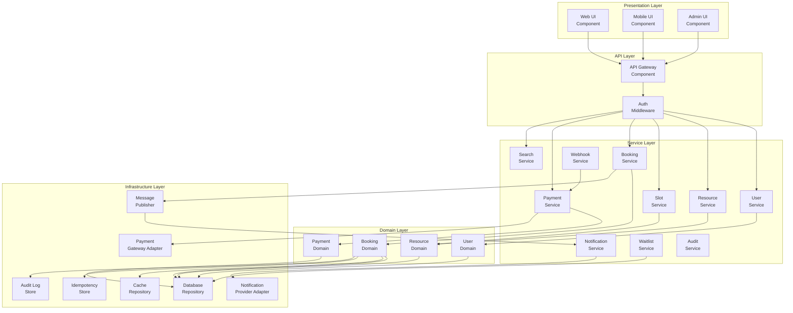
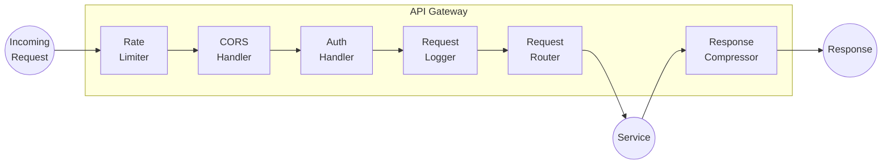
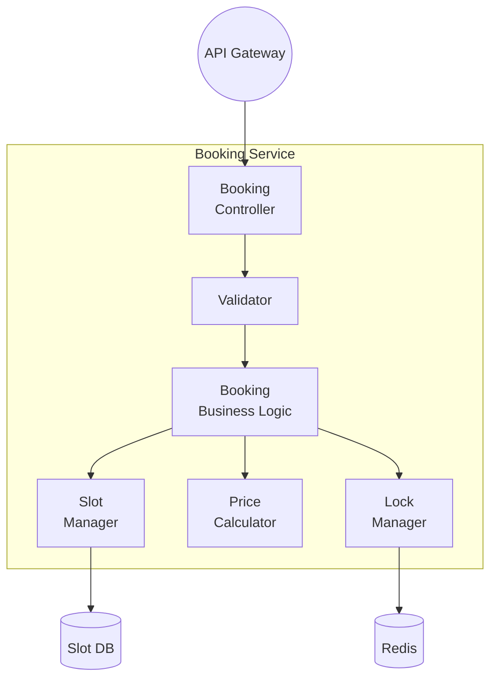
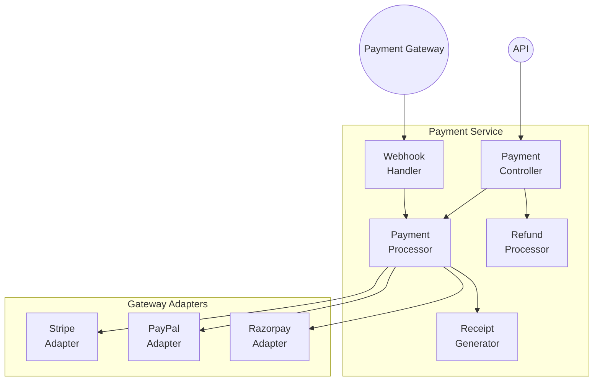
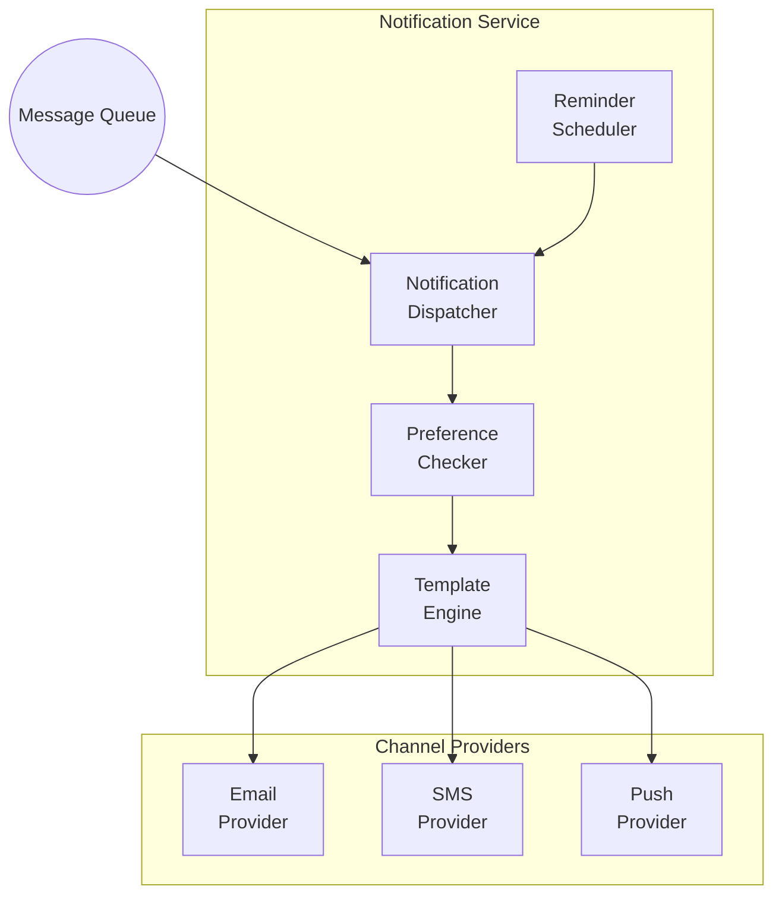

# Component Diagram - Slot Booking System

> **Platform Independence**: Shows software modules independent of technology choices.

---

## Overview

The Component Diagram shows how the system is divided into software components and their dependencies.

---

## High-Level Component View



---

## Detailed Component Breakdown

### API Gateway Component



### Booking Service Components



### Payment Service Components



### Notification Service Components



---

## Component Dependencies Matrix

| Component | Depends On | Depended By |
|-----------|------------|-------------|
| API Gateway | Auth Middleware | All Services |
| User Service | User Repository | Booking, Auth |
| Resource Service | Resource Repository, Slot Manager | Booking, Search |
| Booking Service | Slot, Payment, Notification | API Gateway |
| Payment Service | Gateway Adapters | Booking |
| Notification Service | Provider Adapters | All Services |
| Search Service | Search Index | API Gateway |

---

## Package/Module Structure

```
src/
├── api/
│   ├── controllers/
│   │   ├── auth.controller.ts
│   │   ├── booking.controller.ts
│   │   ├── payment.controller.ts
│   │   ├── resource.controller.ts
│   │   └── user.controller.ts
│   ├── middleware/
│   │   ├── auth.middleware.ts
│   │   ├── validation.middleware.ts
│   │   └── rate-limit.middleware.ts
│   └── routes/
│
├── services/
│   ├── booking.service.ts
│   ├── payment.service.ts
│   ├── notification.service.ts
│   ├── resource.service.ts
│   ├── search.service.ts
│   └── user.service.ts
│
├── domain/
│   ├── entities/
│   ├── value-objects/
│   ├── events/
│   └── services/
│
├── infrastructure/
│   ├── database/
│   │   ├── repositories/
│   │   └── migrations/
│   ├── cache/
│   ├── queue/
│   └── external/
│       ├── payment-gateways/
│       └── notification-providers/
│
└── shared/
    ├── utils/
    ├── constants/
    └── types/
```

---

## Interface Contracts

| Interface | Methods | Implemented By |
|-----------|---------|----------------|
| `IBookingService` | createBooking, cancelBooking, getBooking | BookingService |
| `IPaymentGateway` | charge, refund, verify | StripeAdapter, PayPalAdapter |
| `INotificationProvider` | send, sendBulk | EmailProvider, SMSProvider |
| `IRepository<T>` | find, save, update, delete | All Repositories |
| `ICacheService` | get, set, delete, lock | RedisCacheService |
