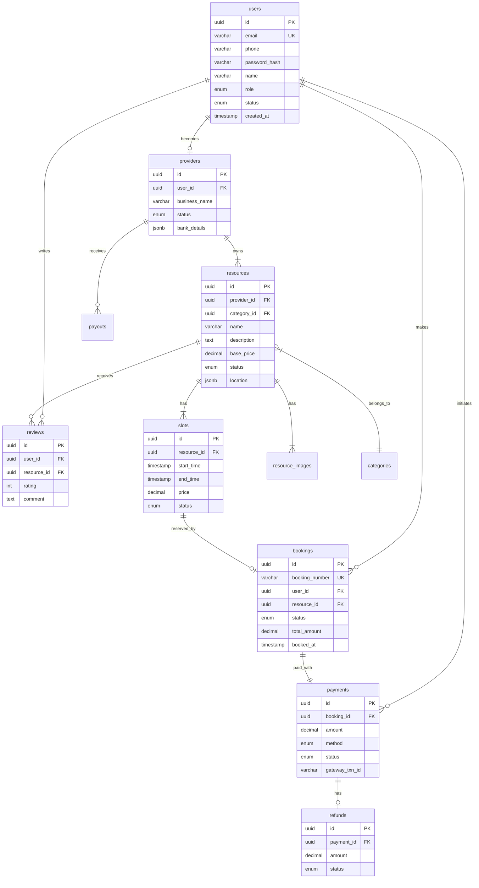

# ERD / Database Schema - Slot Booking System

> **Platform Independence**: Schema uses standard SQL types adaptable to PostgreSQL, MySQL, or other RDBMS.

---

## Entity Relationship Diagram



---

## Core Table Definitions

### `users`
| Column | Type | Constraints |
|--------|------|-------------|
| id | UUID | PRIMARY KEY |
| email | VARCHAR(255) | UNIQUE, NOT NULL |
| phone | VARCHAR(20) | UNIQUE |
| password_hash | VARCHAR(255) | NOT NULL |
| name | VARCHAR(255) | NOT NULL |
| role | ENUM | 'user','provider','admin' |
| status | ENUM | 'pending','active','suspended' |
| created_at | TIMESTAMP | DEFAULT NOW() |

### `providers`
| Column | Type | Constraints |
|--------|------|-------------|
| id | UUID | PRIMARY KEY |
| user_id | UUID | FK → users, UNIQUE |
| business_name | VARCHAR(255) | NOT NULL |
| status | ENUM | 'pending','approved','rejected' |
| bank_details | JSONB | |
| verified_at | TIMESTAMP | |

### `resources`
| Column | Type | Constraints |
|--------|------|-------------|
| id | UUID | PRIMARY KEY |
| provider_id | UUID | FK → providers |
| category_id | UUID | FK → categories |
| name | VARCHAR(255) | NOT NULL |
| description | TEXT | |
| capacity | INT | DEFAULT 1 |
| base_price | DECIMAL(10,2) | NOT NULL |
| status | ENUM | 'draft','active','inactive' |
| location | JSONB | {address, lat, lng} |
| slot_duration_minutes | INT | DEFAULT 60 |

### `slots`
| Column | Type | Constraints |
|--------|------|-------------|
| id | UUID | PRIMARY KEY |
| resource_id | UUID | FK → resources |
| start_time | TIMESTAMP | NOT NULL |
| end_time | TIMESTAMP | NOT NULL |
| price | DECIMAL(10,2) | NOT NULL |
| status | ENUM | 'available','locked','booked','blocked' |
| locked_by | UUID | FK → users |
| locked_until | TIMESTAMP | |

### `bookings`
| Column | Type | Constraints |
|--------|------|-------------|
| id | UUID | PRIMARY KEY |
| booking_number | VARCHAR(20) | UNIQUE |
| user_id | UUID | FK → users |
| resource_id | UUID | FK → resources |
| status | ENUM | 'pending','confirmed','cancelled','completed' |
| total_amount | DECIMAL(10,2) | NOT NULL |
| discount_amount | DECIMAL(10,2) | DEFAULT 0 |
| notes | TEXT | |
| booked_at | TIMESTAMP | |
| cancelled_at | TIMESTAMP | |

### `payments`
| Column | Type | Constraints |
|--------|------|-------------|
| id | UUID | PRIMARY KEY |
| booking_id | UUID | FK → bookings |
| amount | DECIMAL(10,2) | NOT NULL |
| method | ENUM | 'card','wallet','upi' |
| status | ENUM | 'pending','completed','failed','refunded' |
| gateway_txn_id | VARCHAR(255) | |
| paid_at | TIMESTAMP | |

### `refunds`
| Column | Type | Constraints |
|--------|------|-------------|
| id | UUID | PRIMARY KEY |
| payment_id | UUID | FK → payments |
| amount | DECIMAL(10,2) | NOT NULL |
| reason | TEXT | |
| status | ENUM | 'pending','completed','failed' |
| refunded_at | TIMESTAMP | |

---

## Supporting Tables

### `categories`
| Column | Type | Constraints |
|--------|------|-------------|
| id | UUID | PRIMARY KEY |
| name | VARCHAR(100) | NOT NULL |
| slug | VARCHAR(100) | UNIQUE |
| parent_id | UUID | FK → categories |

### `amenities` & `resource_amenities`
```sql
-- Many-to-many relationship
CREATE TABLE resource_amenities (
    resource_id UUID REFERENCES resources(id),
    amenity_id UUID REFERENCES amenities(id),
    PRIMARY KEY (resource_id, amenity_id)
);
```

### `reviews`
| Column | Type | Constraints |
|--------|------|-------------|
| id | UUID | PRIMARY KEY |
| user_id | UUID | FK → users |
| resource_id | UUID | FK → resources |
| booking_id | UUID | FK → bookings |
| rating | INT | 1-5 |
| comment | TEXT | |
| provider_response | TEXT | |

### `promo_codes`
| Column | Type | Constraints |
|--------|------|-------------|
| id | UUID | PRIMARY KEY |
| code | VARCHAR(50) | UNIQUE |
| discount_type | ENUM | 'percentage','fixed' |
| discount_value | DECIMAL | |
| valid_from | TIMESTAMP | |
| valid_to | TIMESTAMP | |
| is_active | BOOLEAN | |

---

## Key Indexes

```sql
-- Performance indexes
CREATE INDEX idx_slots_search ON slots(resource_id, start_time, status);
CREATE INDEX idx_bookings_user ON bookings(user_id, status);
CREATE INDEX idx_resources_provider ON resources(provider_id);
CREATE INDEX idx_payments_booking ON payments(booking_id);
```

---

## Enum Definitions

| Enum | Values |
|------|--------|
| user_role | guest, user, provider, admin |
| user_status | pending, active, suspended, deleted |
| provider_status | pending, approved, rejected, suspended |
| resource_status | draft, pending_review, active, inactive |
| slot_status | available, locked, booked, blocked, completed |
| booking_status | pending, confirmed, cancelled, completed, no_show |
| payment_status | pending, processing, completed, failed, refunded |
| payment_method | card, wallet, upi, bank_transfer |
